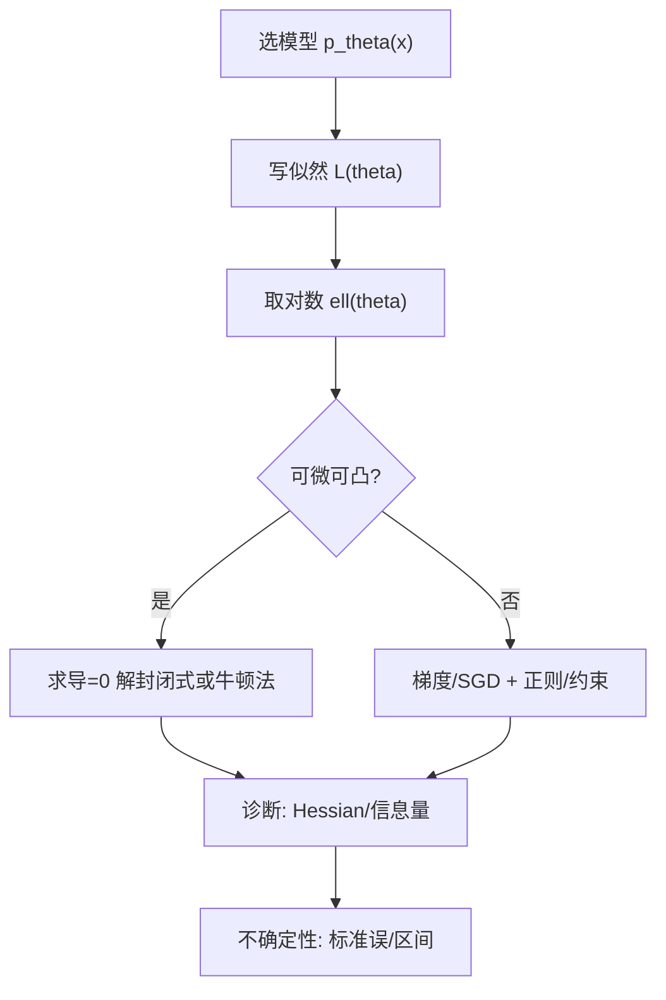
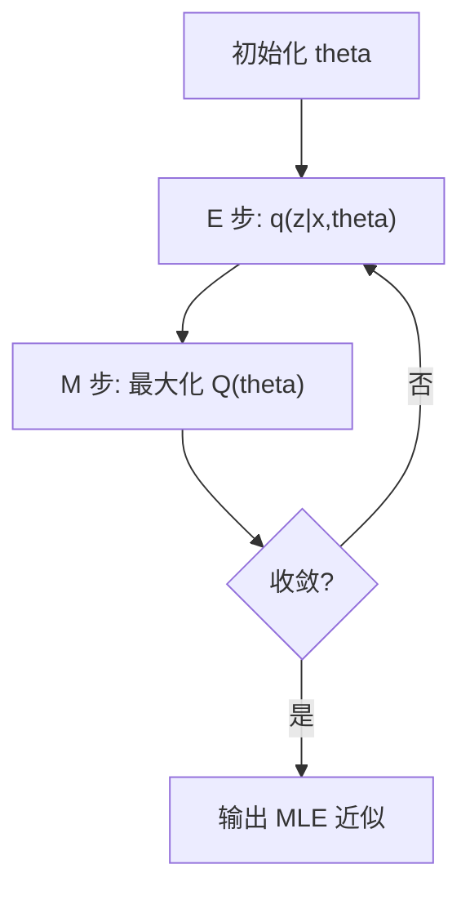

一句话版：**极大似然**就是“把你见到的数据看作一次抽样，找一组参数，让这次抽样‘最不离谱’（概率最大）”。在工程里，它几乎无处不在：**线性回归**、**逻辑回归**、**朴素贝叶斯**、**高斯混合**、**HMM**……训练 = 最大化（对数）似然；评估 = 看似然或其等价的**交叉熵**。

---

## 1. 似然与对数似然：从“概率”到“打分函数”

设数据 $x_1,\dots,x_n$ 独立同分布，模型 $p_\theta(x)$（参数 $\theta$）。

* **似然**：$L(\theta)=\prod_{i=1}^n p_\theta(x_i)$ ——“在参数 $\theta$ 下，恰好看到这些样本的概率”。
* **对数似然**：$\ell(\theta)=\log L(\theta)=\sum_{i=1}^n \log p_\theta(x_i)$ ——把乘法变加法，更稳更好算。
* **MLE 定义**：$\hat\theta_{\text{MLE}}=\arg\max_\theta \ell(\theta)$。

> ML 口语化：训练一个分类器最小化**交叉熵**，其实等价于最大化**对数似然**；回归里最小化 **MSE**，等价于在**高斯噪声**假设下做 MLE。

---

## 2. 三个“打工人”——得分、信息量、二阶近似

* **得分函数（score）**：$s(\theta)=\nabla_\theta \ell(\theta)$。
* **Fisher 信息**（期望二阶曲率）：

  $$
  \mathcal{I}(\theta)=\mathbb{E}_\theta\!\big[-\nabla^2_\theta \ell(\theta)\big]
  =\mathbb{E}_\theta[s(\theta)s(\theta)^\top].
  $$
* **二阶近似**（牛顿法、置信区间基础）：

  $$
  \ell(\theta)\approx \ell(\hat\theta)-\tfrac12(\theta-\hat\theta)^\top \Big(-\nabla^2\ell(\hat\theta)\Big)(\theta-\hat\theta).
  $$

  于是近似
  $\sqrt{n}\,(\hat\theta-\theta^\star)\ \overset{d}{\to}\ \mathcal{N}\big(0,\ \mathcal{I}(\theta^\star)^{-1}\big)$。

---

## 3. 快速手算：常见模型的 MLE

### 3.1 伯努利（点击/不点）

$x_i\in\{0,1\}$，$p_\theta(x)=p^x(1-p)^{1-x}$。
$\ell(p)=\sum x_i\log p + \sum (1-x_i)\log(1-p)$。
求导为零 → $\hat p=\frac{1}{n}\sum x_i$（**频率就是概率**）。

### 3.2 泊松（计数）

$p_\lambda(k)=e^{-\lambda}\lambda^k/k!$。
$\ell(\lambda)=\sum(k_i\log\lambda-\lambda-\log k_i!)$。
$\partial\ell/\partial\lambda=0$ → $\hat\lambda=\bar k$（样本均值）。

### 3.3 指数（等待时间）

$f_\lambda(x)=\lambda e^{-\lambda x}\ 1_{x\ge 0}$。
$\ell(\lambda)=n\log\lambda-\lambda\sum x_i$。
$\hat\lambda=\dfrac{n}{\sum x_i}=\dfrac{1}{\bar x}$。

### 3.4 正态（连续噪声）

$x_i\sim\mathcal{N}(\mu,\sigma^2)$。
$\hat\mu=\bar x$；$\hat\sigma^2=\dfrac{1}{n}\sum (x_i-\bar x)^2$。

> 注意：这里的 $\hat\sigma^2$ 是 **MLE**，分母是 $n$。无偏估计用 $n\!-\!1$。

### 3.5 线性回归 = 高斯 MLE

$y_i=w^\top x_i+\epsilon_i,\ \epsilon_i\sim\mathcal{N}(0,\sigma^2)$。
最大化似然 ⇔ 最小化 $\sum (y_i-w^\top x_i)^2$（**最小二乘**），闭式解 $w=(X^\top X)^{-1}X^\top y$。

### 3.6 逻辑回归 = 伯努利 MLE

$$
p_\theta(y=1\mid x)=\sigma(w^\top x),\quad
\ell(w)=\sum y_i\log\sigma(z_i)+(1-y_i)\log(1-\sigma(z_i))
$$

（$z_i=w^\top x_i$）。无闭式解，用梯度法或牛顿法（IRLS）求。

---

## 4. 指南针：一般问题怎么做 MLE？



**说明**：这是 MLE 的通用流程：建模→对数化→求解→诊断→给不确定性。

---

## 5. 指数族与“配矩”视角（GLM 的心脏）

指数族密度：

$$
p_\eta(x)=h(x)\exp\big(\eta^\top T(x)-A(\eta)\big).
$$

* $\eta$：自然参数；$T(x)$：充分统计量；$A(\eta)$：对数配分函数。
* **梯度**：$\nabla_\eta \ell=\sum T(x_i)-n\,\underbrace{\mathbb{E}_\eta[T(X)]}_{\nabla A(\eta)}$。
* **MLE 条件**：$\frac{1}{n}\sum T(x_i)=\mathbb{E}_{\hat\eta}[T(X)]$ ——**样本充分统计量 = 模型期望**（“配矩”）。
* 结论：很多指数族问题是**凸的**（在 $\eta$ 上），优化稳定；GLM（逻辑回归、泊松回归、Gamma 回归）都来自这里。

---

## 6. 性质（为什么大家都爱 MLE）

* **一致性**：样本数 $\to\infty$，$\hat\theta\to\theta^\star$（在适当正则条件下）。
* **渐近正态**：$\sqrt{n}(\hat\theta-\theta^\star)\Rightarrow \mathcal{N}(0,\mathcal{I}^{-1})$。
* **渐近有效**：达到 Cramér–Rao 下界（方差最小）。
* **不变性**：对一一变换 $g$，$\widehat{g(\theta)}=g(\hat\theta)$。

> 翻译成工程：**够大样本**时，MLE **准且稳**；还能直接给**标准误**和**置信区间**。

---

## 7. 数值优化与稳定性：落地必看

### 7.1 梯度/牛顿/IRLS

* **梯度**：通用，配合动量/Adam。
* **牛顿**：二阶信息快（但成本大）。
* **IRLS**：逻辑/泊松回归的标准做法（每步解加权最小二乘）。

### 7.2 计算招式

* **对数域**：总用 $\ell(\theta)=\sum \log p_\theta(x)$，防止下溢。
* **log-sum-exp**：$\log\sum e^{a_i}=\alpha+\log\sum e^{a_i-\alpha}$，$\alpha=\max a_i$。
* **重参数化**：有约束就换变量，如 $\sigma=\exp\rho$、概率用 softmax。
* **批量/采样**：大数据用 mini-batch 近似 $\ell$、SGD 优化。
* **Hessian 向量积**：用自动微分做二阶方法（共轭梯度内环）。

### 7.3 常见“翻车点”

* **完全分离（逻辑回归）**：存在超平面完美区分时，$\hat w$ 发散；
  解决：L2 正则、Firth 校正、加噪/删异常。
* **非识别/多峰**：混合模型、HMM 可能有对称/标签交换；
  解决：EM + 多初始化；先做 KMeans 启动。
* **边界估计**：概率估到 0 或 1，数值不稳；加 $\epsilon$ 平滑或先验。

---

## 8. 潜变量与 EM：MLE 的亲兄弟

当似然含有“看不见的 $z$”：

$$
L(\theta)=\prod_i \sum_{z_i} p_\theta(x_i,z_i)\quad (\text{或积分})
$$

直接最大化很难。**EM 算法**交替优化下界：

* **E 步**：用旧参数 $\theta^{(t)}$ 计算 $q_i(z)=p_{\theta^{(t)}}(z\mid x_i)$。
* **M 步**：最大化 $Q(\theta)=\sum_i \mathbb{E}_{q_i}\big[\log p_\theta(x_i,z)\big]$。



**例**：高斯混合 GMM 的均值/协方差/混合权重在 M 步有闭式更新。
**提示**：EM 单次迭代单调不降，但会陷**局部极值**，要多次重启。

---

## 9. MLE vs MAP（正则化）的关系（顺便一嘴）

* **MLE**：最大化 $p_\theta(\text{data})$。
* **MAP**：最大化 $p(\theta\mid \text{data}) \propto p_\theta(\text{data})\,p(\theta)$。
* **L2 正则**＝高斯先验；**L1 正则**＝拉普拉斯先验。
  实际训练中常用 “**NLL + 正则**”，本质是从 MLE 走到了 MAP。

---

## 10. 代码速写：三板斧

### 10.1 指数分布的 MLE（闭式）

```python
import numpy as np
x = np.array([0.3, 0.8, 0.1, 1.2, 0.5])
lam_mle = 1.0 / x.mean()
```

### 10.2 逻辑回归的 MLE（梯度下降骨架）

```python
import numpy as np

def sigmoid(z): return 1/(1+np.exp(-z))

def logistic_mle(X, y, lr=0.1, iters=2000, reg=0.0):
    # X:(n,d), y:{0,1}
    w = np.zeros(X.shape[1])
    for _ in range(iters):
        z = X @ w
        p = sigmoid(z)
        # 对数似然加 L2 正则（reg=0 则 MLE；>0 则 MAP）
        grad = X.T @ (y - p) - reg * w
        w += lr * grad / X.shape[0]
    return w
```

### 10.3 GMM 的 EM（只展示责任度 r 的 E 步）

```python
def e_step(X, pis, mus, Sigmas):
    # 返回 r_ik = p(z=k|x_i)
    from numpy.linalg import det, inv
    K = len(pis); n, d = X.shape
    logp = np.zeros((n, K))
    for k in range(K):
        S, m, pi = Sigmas[k], mus[k], pis[k]
        diff = X - m
        # 高斯 log 密度（忽略常数也行，最后会归一化）
        logp[:, k] = -0.5*np.sum(diff @ inv(S) * diff, axis=1) - 0.5*np.log(det(S)) + np.log(pi)
    # log-sum-exp 归一
    a = logp.max(axis=1, keepdims=True)
    r = np.exp(logp - a); r /= r.sum(axis=1, keepdims=True)
    return r
```

---

## 11. 常见误区（避坑清单）

1. **把概率当似然**：似然是参数的函数，概率是事件的函数；$\ell(\theta)$ 与 $P(A)$ 维度不同。
2. **忘了用对数**：直接乘很多概率会下溢，必须转成加法。
3. **随便用 inv**：线性回归/高斯模型里请用 `solve` 或 Cholesky；正规方程数值差。
4. **忽视识别性**：不同参数生成相同分布（如混合“标签交换”）；需要约束/先验。
5. **边界解**：逻辑回归分离、Beta 参数极端；加正则或重参数化。
6. **误把 $n-1$ 当 MLE**：方差的 MLE 分母是 $n$，无偏估计才是 $n-1$。
7. **把多次调参的验证似然当真**：选择偏差会高估泛化；保留独立测试集或做交叉验证。

---

## 12. 练习（含提示）

1. **泊松 MLE**：推导 $\hat\lambda=\bar k$。
2. **正态方差的 MLE 与无偏差异**：证明 $\hat\sigma^2_{MLE}=\frac1n\sum (x_i-\bar x)^2$，并解释为何有偏。
3. **逻辑回归的 IRLS**：写出一次迭代的加权最小二乘形式（权重 $p_i(1-p_i)$、伪响应）。
4. **指数族配矩**：对伯努利，验证“样本均值 = 模型均值”。
5. **GMM EM 的 M 步**：给出 $\pi_k,\ \mu_k,\ \Sigma_k$ 的更新式。
6. **完全分离**：构造一个能被线性完全分开的二分类数据，观察无正则时权重发散；加 L2 后权重收敛。
7. **Fisher 信息**：对指数分布，求 $\mathcal{I}(\lambda)$ 并给出 $\hat\lambda$ 的近似方差。

---

## 13. 小结

* **MLE** 把“让观测最可能”形式化为最大化（对数）似然；
* 在**指数族/GLM**中，它通常是**凸**、好优化、可解释（配矩）；
* **渐近性质**让我们能给估计**误差条**，而**数值诀窍**（对数域、log-sum-exp、重参数化）让它安全落地；
* **潜变量**问题用 **EM**，**过拟合/分离**用 MAP/正则兜底。

> 
