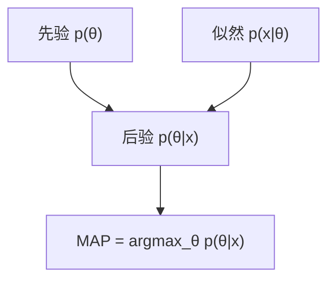

一句话版：**MAP = 先验 × 似然 → 后验的“最高点”**。
换算到工程语言：**最小化负对数似然 + 正则化项**。
L2 正则 ⇔ 高斯先验；L1 正则 ⇔ 拉普拉斯先验；权重衰减（weight decay）就是在做一场“隐形的 MAP”。

---

## 1. 从 MLE 到 MAP：先验登场

* **MLE**（极大似然）：只看数据，让参数 $\theta$ 使得观测数据最可能：

  $$
  \hat\theta_{\text{MLE}}=\arg\max_\theta \ \underbrace{p(x_{1:n}\mid \theta)}_{\text{似然}}.
  $$
* **MAP**（最大后验）：把数据前的“经验/偏好”写成**先验** $p(\theta)$，
  用贝叶斯更新得到后验 $p(\theta\mid x)\propto p(x\mid\theta)p(\theta)$，取**后验众数**：

  $$
  \hat\theta_{\text{MAP}}=\arg\max_\theta \ p(\theta\mid x)=\arg\max_\theta \ \log p(x\mid\theta)+\log p(\theta).
  $$

把负号搬到左边，就是我们熟悉的“**损失 = 数据项 + 正则项**”：

$$
\hat\theta_{\text{MAP}}=\arg\min_\theta \ \underbrace{-\sum_{i=1}^n \log p_\theta(x_i)}_{\text{负对数似然（NLL）}}
\;+\;\underbrace{-\log p(\theta)}_{\text{正则化}}
$$



**说明**：MAP 在“先验 × 似然”的后验分布上找最高点。

---

## 2. 先验-正则化对照表（速记）

| 先验 $p(\theta)$                              | $-\log p(\theta)$（正则）             | MAP 形式              |
| ------------------------------------------- | --------------------------------- | ------------------- |
| $\mathcal{N}(0,\tau^2 I)$                   | $\frac{1}{2\tau^2}\|\theta\|_2^2$ | **L2 / 岭回归 / 权重衰减** |
| 拉普拉斯 $ \propto \exp(-\lambda \|\theta\|_1)$ | $\lambda \|\theta\|_1$            | **L1 / Lasso（促稀疏）** |
| 高斯过程（函数先验）                                  | 平滑度惩罚                             | 核岭、核逻辑回归            |
| Dirichlet $(\alpha)$（分类概率）                  | $-\sum (\alpha_k-1)\log \pi_k$    | 类别概率“平滑”            |
| Gamma/Inverse-Gamma（方差/率）                   | 对数-凸惩罚                            | 稀疏贝叶斯/层级模型          |

> 口决：**先验 = 偏好**，**正则 = 代价**。你希望参数小/稀疏/平滑，就给相应的先验。

---

## 3. 三个从“黑板到键盘”的案例

### 3.1 Beta–Bernoulli（CTR 平滑）

点击率 $p$，先验 $p\sim \mathrm{Beta}(\alpha,\beta)$，数据中成功 $s$、失败 $f$。

* 后验 $p\mid \text{data}\sim \mathrm{Beta}(\alpha+s,\beta+f)$。
* **MAP（众数）**：

  $$
  \hat p_{\text{MAP}}=\frac{\alpha+s-1}{\alpha+\beta+s+f-2}\quad(\alpha,\beta>1).
  $$
* **对比**：MLE $= s/(s+f)$，后验均值 $=(\alpha+s)/(\alpha+\beta+s+f)$。
  小样本时，MAP/均值都比 MLE **稳**。

### 3.2 线性回归 + 高斯先验（Ridge = MAP）

模型 $y=Xw+\varepsilon,\ \varepsilon\sim \mathcal{N}(0,\sigma^2I)$。
先验 $w\sim\mathcal{N}(0,\tau^2 I)$。

* MAP 等价于：

  $$
  \min_w \ \frac{1}{2\sigma^2}\|y-Xw\|_2^2 + \frac{1}{2\tau^2}\|w\|_2^2
  $$

  闭式解 $w_{\text{MAP}}=(X^\top X+\lambda I)^{-1}X^\top y$（$\lambda=\sigma^2/\tau^2$）。

### 3.3 逻辑回归 + L2/L1 先验（分类泛化的日常）

二分类对数似然 $ \ell(w)=\sum y_i\log\sigma(z_i)+(1-y_i)\log(1-\sigma(z_i)),\ z_i=w^\top x_i$。

* **高斯先验** $w\sim\mathcal{N}(0,\tau^2I)$ ⇒ **L2**：$-\log p(w)=\frac{1}{2\tau^2}\|w\|^2$。
* **拉普拉斯先验** ⇒ **L1**：促稀疏（特征选择）。

---

## 4. 决策论视角：MAP 是哪种“最优”？

给定后验 $p(\theta|x)$，在**0-1 损失**（猜错即 1）下，最优决策就是取**后验众数**（MAP）。

* 若损失是平方损失，最优是**后验均值**；
* 若是绝对损失，最优是**后验中位数**。

> 用哪个点估计，其实是在选择“错了要付多大代价”的规则。

---

## 5. 渐近与不确定性：Laplace 近似在 MAP 点

在 MAP $\hat\theta$ 处做二阶泰勒展开：

$$
\log p(\theta\mid x)\approx \log p(\hat\theta\mid x) - \tfrac12 (\theta-\hat\theta)^\top H (\theta-\hat\theta),
$$

$H= -\nabla^2_{\theta}\log p(\theta\mid x)\big|_{\hat\theta}$。
于是 $p(\theta\mid x)$ 近似 $\mathcal{N}\big(\hat\theta, H^{-1}\big)$。

* **用途**：给 MAP **标准误/置信区间**，或作为后验的高斯近似（和二阶优化天然契合）。

---

## 6. 实操指南：如何“写先验”与“稳数值”

### 6.1 选先验的小技巧

* **量纲与尺度**：先把特征做标准化（Z-score），再设 $\tau$（否则正则力度不均）。
* **结构先验**：块稀疏（组 Lasso）、平滑（差分惩罚）、低秩（核范数）。
* **约束型先验**：非负（在对数域建模）、概率单纯形（Dirichlet）、正定（Cholesky 参化）。
* **层级/超先验**：把 $\tau$ 当随机变量，缓解手工调参（但估计更复杂）。

### 6.2 数值与优化

* **对数域**：$\log p(\theta)$ 与 $\log p(x\mid\theta)$ 统一在对数计算。
* **重参数化**：$\sigma=\exp\rho$（保证正），Softmax 约束概率。
* **Hessian-向量积**：利于二阶（共轭梯度/牛顿）和 Laplace。
* **避免病态**：别用正规方程求逆；用 `solve`/Cholesky/SVD。
* **校准正则强度**：$\lambda=\sigma^2/\tau^2$ 给了“数据噪声 vs 先验强度”的物理含义。

---

## 7. MAP ≠ MLE 的那些差别与坑

* **小样本偏差**：MAP 带偏（toward 先验），但**方差更小**，总体可能更优。
* **参数化依赖**：MAP 的众数对**参数化**敏感；改参化要带上雅可比，**别直取众数**。
* **多峰/非识别**：混合模型/HMM 的后验可能多峰，MAP 取到“局部”；要多启动或用 MCMC 检查。
* **不当（improper）先验**：若先验不可积，要确认后验仍可归一；否则 MAP/后验无意义。
* **“双重计数”**：把来自数据的信息又写进“经验先验”，评估会过于乐观（信息泄露）。
* **完全分离**：逻辑回归可导致权重发散；MAP（L2）能兜底。

---

## 8. Empirical Bayes（经验贝叶斯）与“选正则”

两条调 $\lambda$ 的路：

* **验证集/交叉验证**：频率学派日常。
* **经验贝叶斯**：最大化**边缘似然**（证据）
  $\displaystyle \hat\lambda=\arg\max_\lambda \ p(x\mid \lambda)=\int p(x\mid \theta)p(\theta\mid \lambda)\,d\theta$。
  它把“先验强度”也当成要学的量，常见于稀疏贝叶斯学习、GPR。

---

## 9. 代码速写（NumPy/PyTorch 风格）

### 9.1 逻辑回归 + L2（MAP）

```python
import numpy as np

def sigmoid(z): return 1/(1+np.exp(-z))

def logistic_map(X, y, lam=1.0, lr=0.1, steps=2000):
    # lam = σ^2/τ^2 对应 L2 强度
    n, d = X.shape
    w = np.zeros(d)
    for _ in range(steps):
        z = X @ w
        p = sigmoid(z)
        grad = X.T @ (y - p) - lam * w       # ∇(log posterior)
        w += lr * grad / n
    return w
```

### 9.2 Beta–Bernoulli 的 MAP/均值/MLE 对比

```python
def beta_bernoulli_est(s, f, alpha=1., beta=1.):
    mle = s / (s + f) if (s+f)>0 else 0.5
    mean = (alpha + s) / (alpha + beta + s + f)
    if alpha + s > 1 and beta + f > 1:
        mapv = (alpha + s - 1) / (alpha + beta + s + f - 2)
    else:
        mapv = mean  # 众数在边界时，用均值更稳
    return mle, mean, mapv
```

---

## 10. 练习（含提示）

1. **Ridge = MAP**：推导线性回归 + 高斯先验的 MAP 与岭回归等价，给出 $\lambda=\sigma^2/\tau^2$。
2. **Lasso = MAP**：证明拉普拉斯先验 $p(w)\propto \exp(-\lambda \|w\|_1)$ 导致 L1 正则。
3. **Beta–Bernoulli**：当 $\alpha=\beta=1/2$（Jeffreys 先验）时，写出 MAP 与后验均值、MLE 的差异。
4. **Laplace 近似**：对逻辑回归 + L2，在 MAP 处写出 Hessian，并给出参数置信区间近似。
5. **参数化陷阱**：设 $\theta>0$，在 $\theta$ 上取均匀先验与在 $\phi=\log\theta$ 上取均匀先验，说明 MAP 结论为何不同。
6. **经验贝叶斯**：正态-正态模型中，最大化边缘似然求 $\tau^2$ 的闭式/数值方案。
7. **完全分离**：构造线性可分数据，比较无正则与 L2-MAP 的权重与决策边界。

---

## 11. 小结

* **MAP = NLL + 正则**：把“先验偏好”写进训练目标，扭转小样本不稳与过拟合。
* **先验即归纳偏置**：高斯→小而平滑，拉普拉斯→稀疏，核/GP→平滑函数空间。
* **不只是一个点**：在 MAP 附近做 Laplace，可得到**不确定性**；配合 Empirical Bayes，还能**学会正则强度**。
* **实操口诀**：**先标准化 → 选对先验/正则 → 对数域 + 重参数化 → 看 Hessian/方差 → 防泄露/多启动**。
