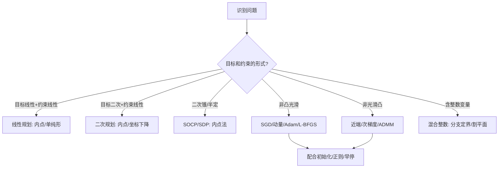

一句话版：优化问题就像“找山谷最低点或山峰最高点”。**凸优化**是“碗口向上”的山谷，**没有局部坑**，到哪都是往下；**非凸优化**是丘陵起伏、洞穴密布。**线性/非线性**则描述目标或约束是“直线/平面”还是“弯的”。识别问题类别，能立刻决定你该用哪把算法扳手。

---

## 1. 优化问题的通用模板

我们研究的通式是：

$$
\begin{aligned}
\min_{x\in\mathbb{R}^n} \quad & f(x) \\
\text{s.t.}\quad & g_i(x) \le 0,\quad i=1,\dots,m\\
& h_j(x) = 0,\quad j=1,\dots,p
\end{aligned}
$$

* **目标函数** $f$：你想最小化的量（损失、成本、能量……）。
* **不等式约束** $g_i\le0$、**等式约束** $h_j=0$。
* **决策变量** $x$：你能调的参数（回归系数、网络权重、调度安排……）。

类比：找最低的“山谷”且**不能越过护栏**（约束）。

---

## 2. 两条正交的“分类轴”

### 2.1 按**形状**：凸 vs 非凸

* **凸优化（Convex）**：

  * $f$ 凸、可行域是**凸集**（连线仍在集合里）；
  * 性质：**局部最优 = 全局最优**；有强大的理论与算法保障（收敛性、误差界）。
* **非凸优化（Nonconvex）**：

  * $f$ 或可行域非凸；
  * 可能有多个局部极小、鞍点；通常只能保证“找到一个还不错的点”。

**凸性的判断**（上手即用）：

* $f(x)=Ax-b$（线性）是**凸**（同时也是凹）；
* 二次型 $x^\top Q x + q^\top x$ 在 $Q\succeq0$ 时**凸**；
* 负对数似然（如逻辑回归）常是凸；
* 神经网络（ReLU/非线性叠加）一般**非凸**。

### 2.2 按**表达式**：线性 vs 非线性

* **线性优化（LP）**：

  * 目标与约束都是线性的。
  * 例：$\min c^\top x$, s.t. $Ax\le b$。
* **非线性优化（NLP）**：

  * 目标或约束中有非线性（平方、乘积、对数、指数等）。
  * 既可能凸（如 L2 正则的二次目标），也可能非凸（如深度网络）。

> 提醒：**线性 ⊂ 凸**，但**凸 ≠ 线性**。许多“弯的但碗口向上”的函数是凸但非线性。

---

## 3. 更细的家族：从 LP 到 SDP，从 QP 到深度学习

| 类别                  | 形式          | 凸性             | 典型算法                | 例子（ML/工程）             |
| ------------------- | ----------- | -------------- | ------------------- | --------------------- |
| **LP** 线性规划         | 线性目标 + 线性约束 | 凸              | 单纯形法 / 内点法          | 资源分配、运输问题             |
| **QP** 二次规划         | 二次目标 + 线性约束 | $Q\succeq0$ 时凸 | 内点/坐标下降             | **Ridge/SVM（硬间隔的对偶）** |
| **QCQP** 二次锥规划      | 二次约束（锥）     | 多数为凸           | 内点法                 | 稀疏逼近、鲁棒估计             |
| **SOCP** 锥规划        | 线性 + 二次锥    | 凸              | 内点法                 | L2 范数约束、鲁棒回归          |
| **SDP** 半定规划        | 矩阵半定约束      | 凸              | 内点法                 | 最大割松弛、谱聚类松弛           |
| **NLP（凸）**          | 一般凸 $f,g_i$ | 凸              | 次梯度/近端/加速法          | Lasso（近端）、逻辑回归        |
| **NLP（非凸）**         | 一般非凸        | 非凸             | SGD/Adam/L-BFGS/信赖域 | **深度学习训练**、矩阵分解       |
| **IP/MIP**（整数/混合整数） | 一部分变量整数     | 非凸（组合）         | 分支定界/割平面            | 选址、路径、调度（NP 难）        |

> 工程习惯：先看能否**建成凸的**（或凸松弛），实在不行再走**非凸启发式**。

---

## 4. 平滑与可导、随机与确定、变量类型

* **平滑性**：

  * **光滑（L-Lipschitz 梯度）**：可用**加速梯度法**（Nesterov）、LBFGS；
  * **非光滑**：如 L1/最大值，用**次梯度、近端梯度（prox）**、ADMM。
* **随机/批量**：

  * 样本太多时用 **SGD/小批量**，对应**随机优化**；
  * 全量可用**确定性**方法（牛顿、拟牛顿）。
* **变量类型**：

  * **连续**最常见；
  * **整数/二元**导致组合爆炸（MIP），需分支定界、启发式或放宽（松弛）。

---

## 5. 常见机器学习问题如何归类？

* **线性回归（Ridge）**：二次目标 + 线性约束（通常无约束）→ **凸 QP**。
* **Lasso**：二次 + L1（非光滑凸）→ **凸 NLP（近端法）**。
* **逻辑回归**：负对数似然（凸）+ L2/L1 → **凸**。
* **SVM**：原问题/对偶是 **凸 QP**。
* **PCA（最大方差）**：等价谱分解；某些稀疏 PCA → **非凸**或 **SDP 松弛**。
* **矩阵分解/词嵌入**：$\min\|X-UV^\top\|^2$ → 对整体**非凸**（交替最小化常用）。
* **神经网络训练**：深度 + 非线性 → **非凸**（SGD/Adam/动量/自适应）。
* **结构化预测（CRF）**：对数似然凸，但**推断**可能是**组合优化**。

---

## 6. 决策树：先分型，后选法

**说明**：根据目标与约束形态，快速落到对应算法族；非凸时优先考虑“可否凸化/松弛”。

---

## 7. 凸与非凸：几何直觉 & 训练启示

### 7.1 凸：没有坏局部，只需勤快

* **Jensen 不等式**给出很多凸函数（如 $-\log$、范数）。
* 只要满足一阶最优（梯度为 0 或包含 0 的次梯度），就是**全局最优**。
* **实践**：标准化/特征工程常把问题“拉直”到凸的世界（如对数变换）。

### 7.2 非凸：坑多，但也有秩序

* 深度网络的景观虽非凸，但高维下**鞍点比坏局部极小更常见**；**动量/噪声**有助越过鞍点。
* **过参数化** + **隐式正则**（优化器、初始化、BN、早停）让许多局部极小都“足够好”。
* **技巧**：良好初始化（预训练/KMeans/谱初始化）、分块/交替最小化、正则化、学习率与调度、早停。

---

## 8. 约束的角色：KKT、对偶与松弛（预告）

* **KKT 条件**：凸问题的必要充分最优条件；非凸时给出必要条件。
* **对偶问题**：下界（最小化）或上界（最大化）；凸问题常有**强对偶**（无间隙）。
* **拉格朗日松弛/罚函数/增广拉格朗日**：把难约束“扔进目标里”，求解更便利（ADMM 就是这样来的）。

> 这些内容在 **2-7 KKT** 与 **第5章后续**深入展开。

---

## 9. 典型误区与避坑

1. **“线性=简单，非线性=非凸”**：错。许多非线性是**凸**（如平方、对数障碍）。
2. **把 L1 当作“非凸”**：L1 是**凸但非光滑**，可用近端法高效求解。
3. **忽视尺度与条件数**：变量量纲差异使优化器“走一步有的方向巨变，有的像蜗牛”，要**归一化/预处理**。
4. **非凸硬求全局最优**：许多任务不需要；先问“业务上够不够用？”。
5. **整数变量硬拼梯度法**：离散不可导，需 MIP/启发式或松弛。
6. **不看可行性**：约束互相冲突，问题无解；先做**可行性检查**或**松弛**。

---

## 10. 小练习（含提示）

1. **归类判断**：
   (a) 逻辑回归 + L1；(b) SVM 对偶；(c) 低秩矩阵分解 $\min\|X-UV^\top\|_F^2$；(d) L2 正则线性回归。
   *提示：看目标和约束的形态与凸性。*

2. **凸性检验**：证明 $f(x)=\|Ax-b\|_2$ 凸；$g(x)=\log\sum_i e^{x_i}$ 凸。

3. **QP 到 LP**：当 Q 是对角矩阵且变量分离，如何把 QP 变换为等价 LP？

4. **松弛思想**：把 $\min \text{rank}(X)$ 放宽为 $\min \|X\|_*$（核范数），解释为何是凸的好替代。

5. **建模题**：给定数据中心调度（机器容量、任务时间窗、优先级），写出 LP 或 MIP 模型骨架。

6. **“凸化”尝试**：将带 L0 的稀疏选择改为 L1；将最大间隔的非线性分类引入核技巧，变为凸的二次规划。

---

## 11. 小结（带走三句话）

1. **先识别：** 凸/非凸？线性/非线性？平滑/非光滑？连续/整数？
2. **再选法：** 凸→有保障（内点、近端、加速）；非凸→用启发式/随机梯度/良好初始化与正则；整数→MIP 或松弛。
3. **工程心法：** 能凸化先凸化；能标准化先标准化；能简化就简化——**问题分类决定 80% 的解法**。
