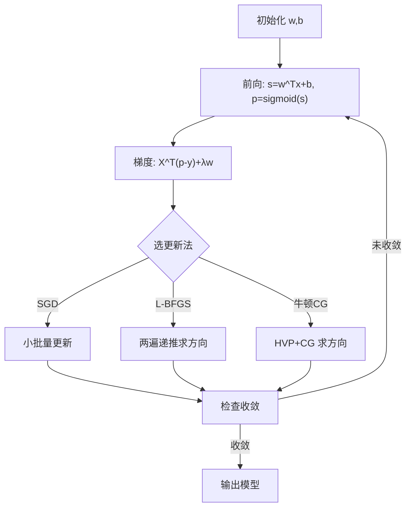
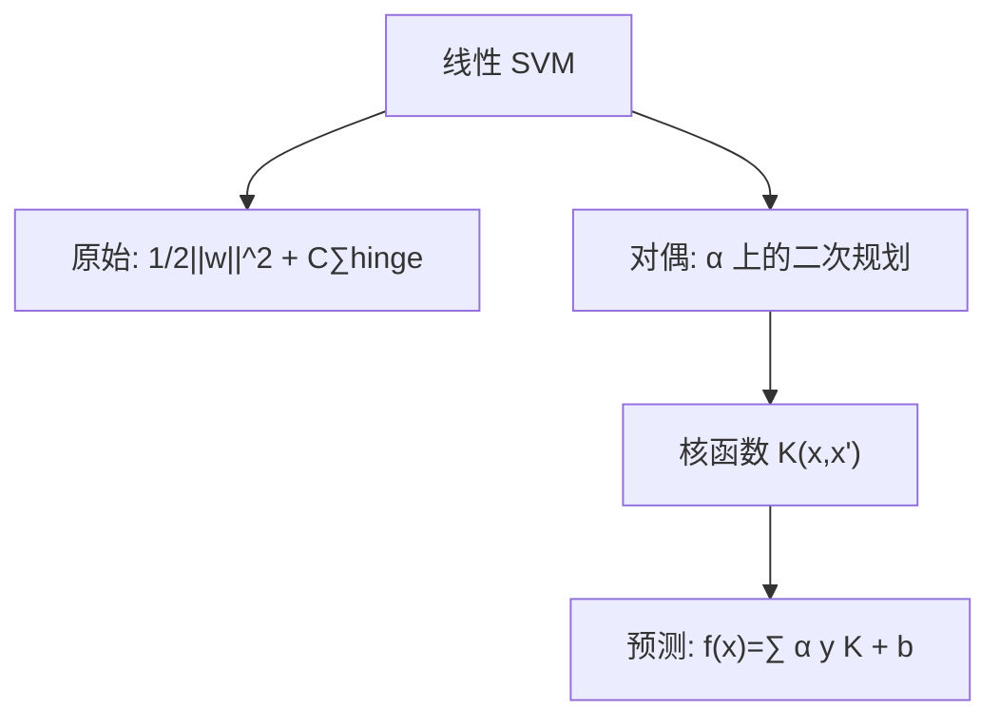

一句话版：**逻辑回归**用**对数似然（交叉熵）**做目标，学到的是**概率模型**；**SVM**用**间隔最大化**做目标，学到的是**几何上最“安全”的超平面**。两者都是**凸优化**问题：适合用 GD/SGD、L-BFGS、牛顿-CG、SMO、Pegasos 等方法高效求解。

---

## 0. 从“风险最小化”看这两个老兵

监督学习常写成

$$
\min_\theta\; \frac1n\sum_{i=1}^n \ell\big(f_\theta(x_i),y_i\big)\;+\;\lambda\,\Omega(\theta),
$$

其中 $\ell$ 是损失，$\Omega$ 是正则（如 $\frac12\|w\|_2^2$）。**逻辑回归**与**线性 SVM**只是不同的 $\ell$ 与 $\Omega$。

* 逻辑回归：$\ell_{\text{log}} = \log\big(1+\exp(-y\,w^\top x)\big)$；
* SVM（软间隔，L2 正则 + hinge）：$\ell_{\text{hinge}} = \max(0,1-y\,w^\top x)$。

二者都**凸**，因此**全局最优**可达；差别在于：**逻辑回归会输出概率**，SVM 直接优化**间隔**（决策边界“更硬核”）。

---

## 1. 逻辑回归（Logistic Regression）

### 1.1 模型与目标

二分类 $y\in\{0,1\}$ 或 $y\in\{-1,+1\}$。设 $s=w^\top x+b$，概率模型

$$
P(y=1\mid x)=\sigma(s)=\frac{1}{1+e^{-s}}.
$$

最大化似然 ⇔ 最小化**负对数似然**（交叉熵）：

$$
\min_{w,b}\; \frac1n\sum_{i=1}^n\Big(-y_i\log\sigma(s_i)-(1-y_i)\log(1-\sigma(s_i))\Big)+\frac{\lambda}{2}\|w\|_2^2.
$$

> 直觉：把正例推进到“高概率区”，负例推进到“低概率区”，**惩罚错分且对不自信的惩罚更重**。

### 1.2 梯度与 Hessian（凸！）

记 $\hat y_i=\sigma(s_i)$，$X\in\mathbb{R}^{n\times d}$。

* 梯度：$\nabla_w = \frac1n X^\top(\hat y - y) + \lambda w,\ \nabla_b = \frac1n\mathbf{1}^\top(\hat y - y)$。
* Hessian：$\nabla^2_w = \frac1n X^\top W X + \lambda I$，其中 $W=\mathrm{diag}(\hat y_i(1-\hat y_i))\succeq 0$。
  因此目标**凸**，且加 $\lambda>0$ 后**强凸**，收敛性与泛化更好。

### 1.3 解法速览

* **批梯度/小批量 SGD**：简单、适合大样本流式训练。
* **L-BFGS**：无需显式 Hessian，**超线性收敛**，小中型数据很好用。
* **牛顿-CG（IRLS）**：用 HVP 解线性系统 $(X^\top W X + \lambda I)p=-g$，步子稳、迭代少。



*图示：逻辑回归训练闭环。*

### 1.4 工程要点

* **特征缩放**（标准化）让优化更快；
* **类别不均衡**：用 **正负样本权重** 或 **加权交叉熵**；
* **概率校准**：需要可用概率时可做 **Platt scaling** 或 **温度缩放**（验证集拟合）；
* **多分类**：softmax 逻辑回归（cross-entropy）同理。

### 1.5 逻辑回归何时很香？

* 需要**概率输出/可解释性**；
* 线性可分或近似线性、特征很稀疏；
* 作为**线性探针**评估表征（NLP/LLM、CV）。

---

## 2. 支持向量机（SVM）

### 2.1 硬/软间隔与几何意义

线性函数 $f(x)=w^\top x+b$。硬间隔（可完全分）：

$$
\min_{w,b}\ \frac12\|w\|^2\quad\text{s.t. } y_i(w^\top x_i+b)\ge 1.
$$

软间隔（允许错分）：

$$
\min_{w,b,\xi}\ \frac12\|w\|^2 + C\sum_i \xi_i\quad
\text{s.t. } y_i(w^\top x_i+b)\ge 1-\xi_i,\ \xi_i\ge 0.
$$

> 直觉：**最大化几何间隔**（$\gamma=1/\|w\|$），“边界最安全”。$C$ 控制“安全 vs 违规”的权衡。

也可写成**正则化 hinge 损失**：

$$
\min_{w,b}\ \frac12\|w\|^2 + C\sum_i \max(0,1-y_i(w^\top x_i+b)).
$$

### 2.2 KKT 与“支持向量”

对偶问题（软间隔 L2）：

$$
\max_{\alpha}\ \sum_i \alpha_i - \frac12\sum_{i,j}\alpha_i\alpha_j y_i y_j K(x_i,x_j)
$$

$$
\text{s.t. } 0\le \alpha_i \le C,\ \sum_i \alpha_i y_i = 0,
$$

预测 $f(x)=\sum_i \alpha_i y_i K(x_i,x)+b$。

* **互补松弛**：$\alpha_i>0$ 的点恰在或违反间隔边界（**支持向量**）；其余 $\alpha_i=0$。
* **核技巧**：把内积 $\langle x_i,x_j\rangle$ 换成核 $K$（RBF、多项式等），得到**非线性 SVM**。



*图示：SVM 的原始–对偶–核三件套。*

### 2.3 解法速览

* **SMO（序列最小优化）**：分块坐标上升，**对偶**上每次解 2 变量 QP，核 SVM 的经典算法。
* **Pegasos（Primal SGD）**：在**原始问题**上做带投影的 SGD，迭代复杂度与 $\frac{1}{\lambda \epsilon}$ 成正比，适合大规模线性 SVM。
* **线性 SVM 的一阶法**：对 hinge 做**次梯度**或**光滑近似**（Huberized hinge），配合动量/L-BFGS。

**Pegasos 核心更新**（学习率 $\eta_t=1/(\lambda t)$）：

* 若 $y_t w_t^\top x_t < 1$：$w_{t+1}=(1-\eta_t\lambda)w_t+\eta_t y_t x_t$；
* 否则 $w_{t+1}=(1-\eta_t\lambda)w_t$；
* 并投影到 $\|w\|\le \frac{1}{\sqrt{\lambda}}$。

### 2.4 工程要点

* **特征缩放**极其重要（对核参数 $\gamma$、C 的敏感性很高）；
* **选择核与超参**：RBF 常用；交叉验证选 $C,\gamma$；
* **概率输出**：原生无概率，可用 **Platt scaling** 做后处理；
* **大规模线性**：优先 Pegasos / 线性 SVM（liblinear）。

---

## 3. 逻辑回归 vs SVM：怎么选？

| 方面   | 逻辑回归          | SVM              |
| ---- | ------------- | ---------------- |
| 目标   | 最大似然（交叉熵）     | 间隔最大化（hinge）     |
| 输出   | 概率可校准         | 分数，概率需后处理        |
| 损失曲线 | 光滑，可二阶        | 非光滑（可光滑化）        |
| 超参   | $\lambda$（正则） | $C$（惩罚）/核参数      |
| 大规模  | L-BFGS/SGD 稳健 | 线性：Pegasos；核：SMO |
| 何时优  | 概率、解释、线性探针    | 边界明确、核非线性、鲁棒边界   |

**经验**：想要**概率与可解释性** → 逻辑回归；边界更“硬”、有**核非线性**需求 → SVM。大模型表征评估常用**线性逻辑回归**作为 probe。

---

## 4. 代码骨架

### 4.1 逻辑回归（L-BFGS，PyTorch 版思路）

```python
import torch
from torch.optim import LBFGS

class Logistic(torch.nn.Module):
    def __init__(self, d):
        super().__init__()
        self.w = torch.nn.Parameter(torch.zeros(d,1))
        self.b = torch.nn.Parameter(torch.zeros(1))

    def forward(self, X):
        return torch.sigmoid(X @ self.w + self.b)

def train_logreg(X, y, lam=1e-4, max_iter=100):
    model = Logistic(X.shape[1])
    opt = LBFGS(model.parameters(), lr=1.0, max_iter=max_iter, line_search_fn='strong_wolfe')
    y = y.view(-1,1).float()
    def closure():
        opt.zero_grad()
        p = model(X)
        ce = torch.nn.functional.binary_cross_entropy(p, y, reduction='mean')
        reg = 0.5 * lam * (model.w**2).sum()
        loss = ce + reg
        loss.backward()
        return loss
    opt.step(closure)
    return model
```

### 4.2 线性 SVM 的 Pegasos（NumPy 版思路）

```python
import numpy as np

def pegasos_linear_svm(X, y, lam=1e-4, T=10_000):
    # X: (n,d), y in {-1,1}
    n, d = X.shape
    w = np.zeros(d)
    for t in range(1, T+1):
        i = np.random.randint(0, n)
        eta = 1.0 / (lam * t)
        if y[i] * (w @ X[i]) < 1:
            w = (1 - eta*lam) * w + eta * y[i] * X[i]
        else:
            w = (1 - eta*lam) * w
        # 投影到 L2 球
        norm = np.linalg.norm(w)
        R = 1.0 / np.sqrt(lam)
        if norm > R:
            w = w * (R / norm)
    return w
```

---

## 5. 常见坑与排错

1. **未做特征缩放** → 优化慢、超参难调。

   * 处理：标准化到零均值、单位方差或归一化到 $[-1,1]$。
2. **类别极度不均衡** → 概率/间隔偏向多数类。

   * 处理：类权重、欠/过采样、阈值调优。
3. **逻辑回归过拟合** → 权重过大、概率过于自信。

   * 处理：增大 $\lambda$、特征选择、早停、校准。
4. **SVM 超参敏感**（尤其核） → 训练/验证差异大。

   * 处理：网格/贝叶斯搜索、对数尺度扫描 $C,\gamma$。
5. **hinge 次梯度实现错误** → 方向不对，无法收敛。

   * 处理：逐样本检查 $y w^\top x < 1$ 的分支与正则项更新。
6. **概率需求却用原生 SVM** → 分数无法直接阐释。

   * 处理：Platt scaling/温度缩放做后处理。

---

## 6. 练习（含提示）

1. **IRLS 推导**：从逻辑回归二次近似出发，推导 $(X^\top W X + \lambda I)\Delta = X^\top (y-\hat y)-\lambda w$。
2. **hinge 的次梯度**：给出 $\partial_w \max(0,1-y w^\top x)$ 并实现线性 SVM 的小批量次梯度下降。
3. **SVM 对偶与支持向量**：在 2D 可分数据上，画出支持向量与间隔边界。
4. **概率校准**：在验证集上实现 Platt scaling，比较校准前后的可靠性图。
5. **核选择实验**：RBF/多项式/线性核在同一数据上的对比，展示 $C,\gamma$ 的影响。
6. **对比学习率策略**：逻辑回归上比较固定 LR、余弦退火、OneCycle 对收敛速度的影响（参见 5-7）。

---

## 7. 小结（带走三句话）

1. **逻辑回归**：交叉熵 + L2 正则，**概率友好、凸、易二阶**。
2. **SVM**：间隔最大化 + hinge，**边界稳、核技巧强大**。
3. 两者都是凸优化的经典代表，配合**合适的优化器与调度**，在现代表征学习、线性探针与小样本任务里依然**能打**。
