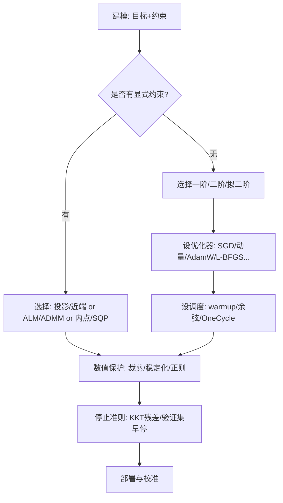
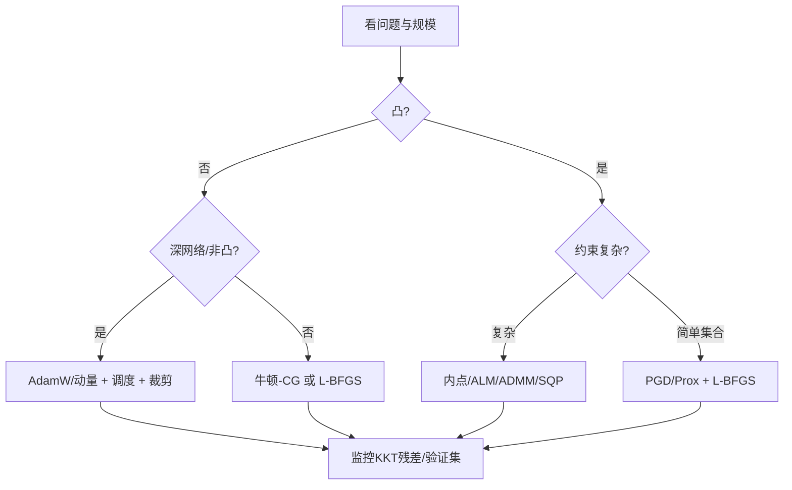

**关键词**：问题建模、梯度家族、二阶与拟二阶、自适应优化、学习率调度、约束优化、KKT、逻辑回归与 SVM。
**一句话带走**：**先把问题写清楚（目标+约束）→ 选对更新方向（梯度/曲率/近端/对偶）→ 用好学习率与数值保护 → 用 KKT/残差做收敛与排错。**

---

## 1. 一页纸总览

* **问题类型（5-1）**

  * 按目标/约束：凸 vs 非凸；线性/二次/非线性；等式/不等式/集合约束。
  * 实战例：权重范数限制、概率单纯形、正定约束。

* **一阶方法（5-2, 5-3）**

  * **GD/SGD**：简单、可扩展；SGD 对大数据很友好。
  * **最速下降**：在当前度量下最陡（等价于做预条件）；
  * **动量/带 Nesterov**：加速、抗噪、抗鞍点。

* **共轭梯度（5-4）**

  * 解 SPD 线性系统或二次目标的高效迭代法；深度里常用作**牛顿-CG**的内层求解器。

* **二阶与拟二阶（5-5）**

  * **牛顿法**：用 Hessian 拟合二次模型，局部二次收敛；
  * **BFGS/L-BFGS**：用历史曲率学习逆 Hessian，内存/计算友好。

* **自适应优化（5-6）**

  * **AdaGrad → RMSProp → Adam/AdamW/AMSGrad**：逐坐标预条件，AdamW 解耦权重衰减为大模型标配。

* **学习率调度（5-7）**

  * **Warmup** 稳前期，**余弦退火**柔性收尾，**OneCycle** 一次升降兼顾探索与收敛。

* **约束非线性优化（5-8）**

  * **投影/近端**、**惩罚/障碍（内点）**、**增广拉格朗日/ADMM**、**顺序二次规划（SQP）**。

* **KKT 条件（5-9）**

  * 可行、对偶可行、互补松弛、驻点；凸 + Slater ⇒ 充要。

* **典型应用（5-10）**

  * **逻辑回归**（交叉熵凸）：L-BFGS、牛顿-CG、AdamW；
  * **SVM**（间隔最大化）：Pegasos（原始）、SMO（对偶）、核技巧。

---

## 2. 训练闭环：从建模到收敛



**说明**：**能投影先投影**；深非凸建议**一阶 + 预条件 + 调度**；凸精确求解可选**内点/拟二阶**。停止既看**训练残差**也看**验证集**。

---

## 3. 优化器对照表（极简可抄）

| 方法         | 梯度需求 | 曲率需求 | 典型步数 | 单步代价 | 优点     | 注意点        |
| ---------- | ---: | ---: | ---: | ---: | ------ | ---------- |
| SGD / 动量   |    ✓ |    ✗ |    多 |    低 | 可扩展、抗噪 | 需调度；鞍点慢    |
| Nesterov   |    ✓ |    ✗ |    少 |    低 | 更快理论界  | 实现要对齐定义    |
| 共轭梯度（解二次）  |    ✓ |  H·v |    中 |    中 | 大维二次很强 | SPD 假设/预条件 |
| 牛顿-CG      |    ✓ |  H·v |    少 |    中 | 二次收敛   | 非凸需修正      |
| BFGS       |    ✓ |    ✗ |    少 |    中 | 超线性    | O(n²) 内存   |
| **L-BFGS** |    ✓ |    ✗ |    少 |    中 | 低内存、稳  | 需强 Wolfe   |
| AdaGrad    |    ✓ |    ✗ |    中 |    低 | 稀疏友好   | 可能“刹死”     |
| RMSProp    |    ✓ |    ✗ |    中 |    低 | 非平稳稳   | β₂ 需调      |
| **AdamW**  |    ✓ |    ✗ |    少 |    低 | 工业默认   | 解耦衰减       |

> 大模型默认起步：**AdamW + Warmup + 余弦**；线性/凸小中规模：**L-BFGS/牛顿-CG** 很香。

---

## 4. 选型流程（中文）



---

## 5. 工程落地清单（Checklist）

* **数据与特征**：标准化/归一化；类别不均衡→加权/重采样。
* **数值稳定**：`logsumexp`、softplus、梯度/参数裁剪、混合精度下的 loss scale。
* **学习率**：范围测试找 `lr_max`；大 batch 用 warmup 与余弦/OneCycle。
* **权重衰减**：AdamW 解耦；**不**对偏置/归一化层做衰减。
* **约束**：能投影就投影（盒、ℓ2、ℓ1、单纯形、PSD）；否则用 ALM/ADMM/内点。
* **停止与排错**：监控 **KKT 残差** / 训练-验证差距；不稳优先查 `lr`、β、裁剪与数据质量。

---

## 6. 微型“公式抽屉”

* **动量（Nesterov 变体）**：
  $v_{t+1}= \mu v_t + g(\theta_t - \mu v_t)$，$\theta_{t+1}=\theta_t - \eta v_{t+1}$
* **AdamW**：
  $m_t=\beta_1 m_{t-1}+(1-\beta_1)g_t$，$v_t=\beta_2 v_{t-1}+(1-\beta_2)g_t^2$；
  $\hat m_t=m_t/(1-\beta_1^t)$，$\hat v_t=v_t/(1-\beta_2^t)$；
  先 $\theta\leftarrow \theta-\eta \lambda \theta$（衰减），再 $\theta\leftarrow \theta-\eta\,\hat m_t/(\sqrt{\hat v_t}+\varepsilon)$。
* **L-BFGS 两遍递推**：后向算 $\alpha_i=\rho_i s_i^\top q$，前向补回 $r$，得方向 $p=-r$。
* **KKT 四件套**：可行 $g\le0,h=0$；对偶可行 $\lambda\ge0$；互补 $\lambda\odot g=0$；驻点 $\nabla_x L=0$。
* **PGD 投影**：盒/球/单纯形/ℓ1 球——线性或近线性时间均可实现。

---

## 7. 习题（含提示与部分参考答案）

> 注：\* 号题目给出**参考答案/要点**；其余给出 **提示**。

### A. 基础与直觉

1. **\***（判断）逻辑回归的负对数似然是凸函数吗？为什么？
   **答**：是。二阶导 $X^\top W X$ 半正定，配 L2 正则变强凸。
2. （选择）下列哪种情况优先考虑 AdamW？
   a) 小数据线性回归；b) 10^8 参数 Transformer；c) QP；d) 低维凸优化。
   **提示**：看维度与非凸性。
3. **\***（推导）写出带 L2 正则的逻辑回归梯度与 Hessian。
   **答**：$\nabla_w=\frac1n X^\top(\hat y-y)+\lambda w$，$\nabla^2_w=\frac1n X^\top W X+\lambda I$。

### B. 学习率与调度

4. （计算）设 warmup 步数 $T_w$、目标 LR $\eta_{\max}$。写出线性 warmup 的分段函数。
   **提示**：前 $T_w$ 线性升，之后恒定/接余弦。
5. **\***（应用）解释为什么 OneCycle 中动量要与 LR 反向变化。
   **答**：LR 高阶段需更多探索（小动量避免惯性过强），LR 低阶段需稳收敛（大动量降抖动）。

### C. 二阶与拟二阶

6. （证明）牛顿方向是二次模型 $m(p)=f+\nabla f^\top p+\frac12 p^\top H p$ 的最优解。
   **提示**：一阶条件 $Hp=-\nabla f$。
7. **\***（判断）BFGS 保持逆矩阵正定的关键是哪个条件？
   **答**：曲率条件 $y^\top s>0$（强 Wolfe 或阻尼 BFGS 保证）。
8. （实现）给出 L-BFGS 的两遍递推伪代码。
   **提示**：后向存 $\alpha$，前向用 $H_0$ 缩放再回加 $s(\alpha-\beta)$。

### D. 约束与 KKT

9. （计算）把点 $z$ 投影到概率单纯形 $\{p\ge0,\sum p=1\}$。
   **提示**：排序阈值法（Duchi）。
10. **\***（手算）求 $\min \tfrac12\|x\|^2$ s.t. $a^\top x=b$ 的 KKT 解。
    **答**：$x^*= \frac{b}{\|a\|^2} a$，$\nu^* = \frac{b}{\|a\|^2}$。
11. （判断）凸问题满足 Slater 条件 ⇒ KKT 是充要条件且强对偶成立。对/错？
    **答**：对。

### E. 应用与编程

12. （实现）用 Pegasos 训练线性 SVM，写出更新与 L2 球投影。
    **提示**：若 $y w^\top x < 1$ 则加梯度步并收缩；否则仅收缩；投影到 $\|w\|\le 1/\sqrt{\lambda}$。
13. **\***（实验）在同一数据上比较固定 LR、Warmup+余弦、OneCycle 的收敛曲线（损失/准确率）。
    **答**：通常 Warmup+余弦和 OneCycle 更快、更稳，后期更低验证损失。
14. （诊断）训练不稳定：loss 剧烈震荡、验证不降。给出三条定位步骤。
    **提示**：先降 `lr` 或加 warmup；看梯度范数/裁剪；检查数据/正则/归一化；打印 KKT/对偶残差（若有约束）。

### F. 进阶（选做）

15. （非凸）在 Rosenbrock 上比较 GD / Nesterov / BFGS / AdamW 的轨迹与迭代次数。
16. （对偶）写出软间隔 SVM 的对偶问题与 KKT，说明哪类样本成为支持向量。
17. （ALM）实现增广拉格朗日求解等式约束最小化，画原始/对偶残差收敛图。

---

## 8. 参考训练循环

```python
# 伪代码：通用训练闭环（含调度与裁剪）
θ = init()
opt = AdamW(θ, lr=lr_max, wd=wd)
sched = WarmupCosine(T_total=steps, warmup_steps=int(0.05*steps),
                     lr_max=lr_max, lr_min=lr_min)
for t in range(steps):
    x, y = next_batch()
    loss = L(f(θ, x), y) + reg(θ)           # 稳定实现: logsumexp/softplus
    g = grad(loss, θ)
    g = clip_by_global_norm(g, 1.0)         # 梯度裁剪
    opt.step(g)                             # AdamW: 先衰减再自适应步
    sched.step()                            # warmup + 余弦退火
    if t % eval_every == 0:
        val()
        # 若有约束，可计算 KKT 残差: ||∇x L||, ||[g(x)]_+||, ||λ∘g||
```

---

## 9. 本章小结

1. **问题优先**：把目标与约束写清楚，想好是否凸、是否能投影、是否可分解。
2. **方法选型**：大模型默认 **AdamW + 调度**；凸小中规模用 **L-BFGS/牛顿-CG**；复杂约束选 **PGD/近端、ALM/ADMM、内点/SQP**。
3. **数值与诊断**：用**学习率调度/裁剪/稳定化**护航；用**KKT 残差与验证曲线**做收敛与排错的“仪表盘”。
