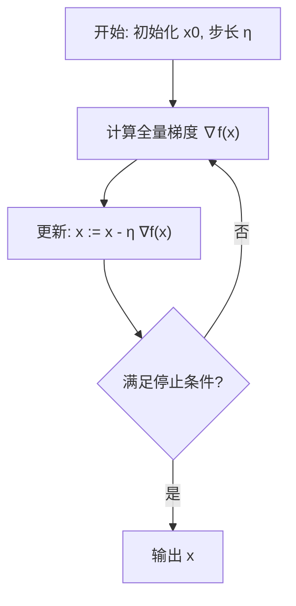
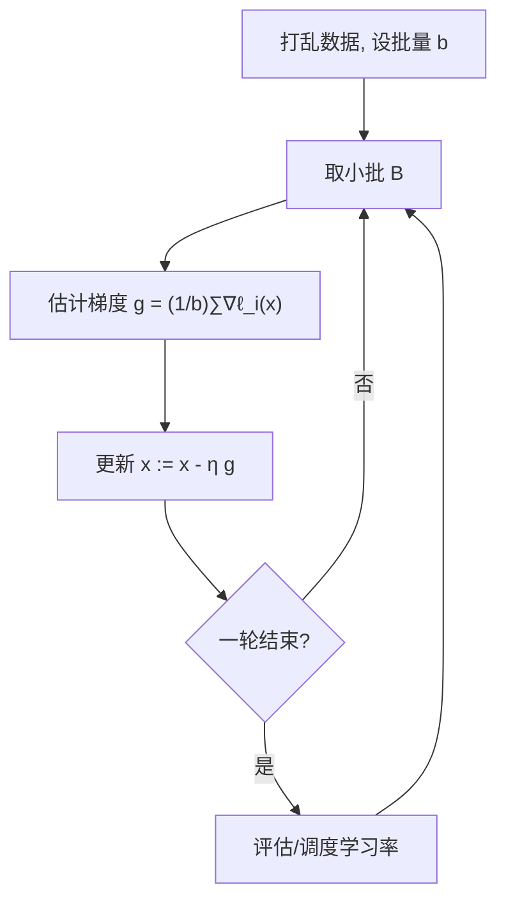
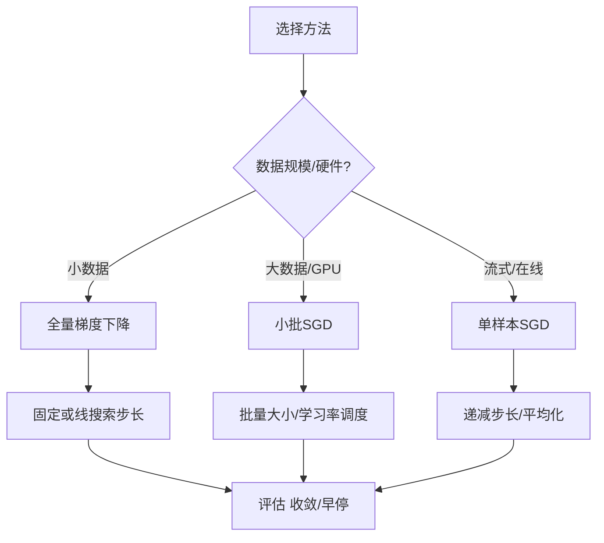

一句话版：**GD** 每次用“全量数据”的梯度往下走，**稳但贵**；**SGD** 用“局部（小批/单样本）”的梯度往下走，**快但抖**。调好学习率/批量/动量，SGD 能在大数据和大模型上迅速逼近好解。

---

## 1. 从“下山”类比开始

把损失函数 $f(x)$ 想成一座雾气缭绕的山：

* **GD**：先把整座山都扫描一遍（全量梯度），再迈一步——**方向准但每步慢**；
* **SGD**：看脚边的坡度就走（小批梯度），**方向有噪声**，但能**连走很多步**，总体更快到达“够低”的位置。

---

## 2. 数学设定与基本假设

目标是最小化

$$
f(x) = \frac{1}{n}\sum_{i=1}^n \ell(x; z_i),
$$

其中 $\ell$ 是样本 $z_i$（如 $(x_i,y_i)$）上的损失。常见假设：

* **L-光滑（Lipschitz 梯度）**：$\|\nabla f(x)-\nabla f(y)\|\le L\|x-y\|$；
* **强凸（可选）**：存在 $\mu>0$，使 $f(y)\ge f(x)+\nabla f(x)^\top(y-x)+\frac{\mu}{2}\|y-x\|^2$。

---

## 3. 梯度下降（GD）：公式、流程与收敛

**迭代**：

$$
x_{k+1} = x_k - \eta \,\nabla f(x_k),
$$

$\eta>0$ 为学习率（步长）。



**说明**：每次用全数据算一次梯度，保证单调下降（步长足够小）。

**典型收敛结论**

* **L-光滑 + 选择 $\eta \le 1/L$**：$f(x_k)-f(x^\*) \le O(1/k)$（凸）。
* **$\mu$-强凸 + $\eta \le 1/L$**：**线性收敛**，$f(x_k)-f(x^\*)\le (1-\mu/L)^k \cdot (f(x_0)-f(x^\*))$。
* **非凸**：若 $\eta<1/L$，则 $f(x_k)$ 单调下降且 $\min_{t<k}\|\nabla f(x_t)\|^2 \le O\!\left(\frac{1}{k}\right)$。

**小例子：二次型**
$f(x)=\tfrac12 x^\top Q x - b^\top x$（$Q\succeq 0$），$\nabla f=Qx-b$。若 $\eta\in(0,2/L)$，GD 线性收敛，速度由条件数 $\kappa=L/\mu$ 决定（$\kappa$ 越大越慢）。

---

## 4. 随机梯度下降（SGD）：快而带噪声

**无偏梯度估计**
取小批 $B$（|B|=b），

$$
g_k = \frac{1}{b}\sum_{i\in B} \nabla \ell(x_k; z_i), \quad \mathbb{E}[g_k]=\nabla f(x_k).
$$

**迭代**：

$$
x_{k+1} = x_k - \eta_k \, g_k.
$$



**方差与批量**

* 方差 $\mathrm{Var}(g_k) \propto \sigma^2/b$。批量更大 → 噪声更小，但每步更贵。
* 常见折中：图像/LLM 里用 **mini-batch**（32–8192 不等），配合并行硬件。

**收敛速率（典型）**

* **凸**：用递减步长 $\eta_k=O(1/\sqrt{k})$，得到 $O(1/\sqrt{k})$ 的函数值误差；
* **强凸**：$\eta_k=O(1/k)$ 时，函数值误差 $O(1/k)$。
* **常数步长**：到达“噪声球”附近后会抖动不再精细下降（需减小 $\eta$ 或用动量/平均）。

**Polyak–Ruppert 平均**：对迭代做后缀平均 $\bar x_T=\frac{1}{T}\sum_{k=1}^T x_k$，常使误差更稳。

---

## 5. 学习率：如何不“迈大步摔跤”，也不“挪不开腿”？

* **固定步长**：简单，但易卡在噪声球；适合凸问题/小数据。
* **衰减步长**：$\eta_k = \eta_0 / (1+\gamma k)$、Step/Exponential/余弦退火；深度学习常用**余弦退火+热身**（暖启动在 5-7 展开）。
* **回溯线搜索（Armijo）**：GD 的常用手段；SGD 中较少用（需估计随机目标）。
* **自适应方法**：Adam/RMSProp 属 5-6 节内容，这里记住：它们**不是**GD/SGD，但也是“下山家族”。

---

## 6. Mini-batch、全量、单样本：成本对比

| 方法                | 每步计算    | 每步方差          | 适用场景            |
| ----------------- | ------- | ------------- | --------------- |
| **GD（全量）**        | $O(nd)$ | 0             | 小数据、凸优化、需要稳定下降  |
| **SGD（b=1）**      | $O(d)$  | 高             | 大数据、在线学习        |
| **Mini-batch（b）** | $O(bd)$ | $\propto 1/b$ | GPU 并行、折中速度与稳定性 |

> 经验：在 GPU/TPU 上，**把批量调到能充分吃满算力**，再用合适 $\eta$ 与调度，常是更优折中。

---

## 7. 工程落地：从逻辑回归到 LLM

### 7.1 逻辑回归（凸）的 GD/SGD 更新

* 损失：$\ell(w; x,y) = \log(1+\exp(-y\,w^\top x))$。
* 梯度：$\nabla_w \ell = -\frac{y x}{1+\exp(y\,w^\top x)}$。
* **GD**：用全量样本的平均梯度更新；
* **SGD**：用小批（或单样本）梯度更新，外加 L2 正则：在更新时加 $+\lambda w$。

### 7.2 大模型训练（非凸）的基本套路

* **并行 mini-batch SGD**（同步/异步），配合 **动量**、**自适应**（AdamW）、**学习率热身与退火**、**梯度裁剪**、**混合精度**。
* **梯度噪声**反而有益：能帮助走出鞍点区；但需控制（批量/学习率）避免发散。

---

## 8. 数值与实现细节（避免“纸上 GD/SGD，工程大翻车”）

1. **特征缩放**：标准化/白化，降低条件数，减小“之字形”路径。
2. **梯度检查**：用有限差分验证一阶梯度是否正确（小模型上做一次）。
3. **Early stopping**：监控验证集，停止在过拟合前。
4. **梯度裁剪**：特别是 RNN/Transformer，避免梯度爆炸（如 $\|\nabla\|_2$ 限到阈值）。
5. **数值稳定**：交叉熵用 `logsumexp`，Sigmoid/Softmax 的稳定实现。
6. **随机性控制**：设随机种子；分布式下确保可复现（注意数据切分/混洗）。

---

## 9. 直观几何：为什么 GD 会“之”字形？

对于等高线“很扁”的碗（条件数大），梯度几乎总是沿最陡轴往返——像在峡谷两壁间来回反弹。
**对策**：

* 更小学习率（慢）；
* **预处理/标准化**、**牛顿/拟牛顿**（5-5 节）；
* **动量**（5-3 节）：在主方向积累速度，减少之字形。

---

## 10. 三种常见训练循环



**说明**：根据数据规模选择 GD/mini-batch/SGD，再配置学习率策略与早停。

---

## 11. 迷你代码（可直接跑，体验 GD vs SGD）

**二分类逻辑回归：GD 与 mini-batch SGD（NumPy 版）**

```python
import numpy as np
rng = np.random.default_rng(0)

# 生成线性可分但带噪数据
n, d = 2000, 20
X = rng.normal(size=(n, d))
w_true = rng.normal(size=d)
y = (X @ w_true + 0.5*rng.normal(size=n) > 0).astype(int)*2 - 1  # {-1, +1}

def sigmoid(z): return 1.0 / (1.0 + np.exp(-z))

def loss_grad(w, X, y, l2=1e-3):
    z = y * (X @ w)
    p = 1.0 / (1.0 + np.exp(z))  # = sigmoid(-z)
    grad = -(X.T @ (y * p)) / len(y) + l2 * w
    return grad

# GD
w = np.zeros(d)
eta = 0.5
for _ in range(200):
    g = loss_grad(w, X, y, l2=1e-3)
    w -= eta * g

# mini-batch SGD
w_sgd = np.zeros(d)
eta0, batch = 0.1, 128
for epoch in range(10):
    idx = rng.permutation(n)
    for i in range(0, n, batch):
        j = idx[i:i+batch]
        g = loss_grad(w_sgd, X[j], y[j], l2=1e-3)
        w_sgd -= eta0 * g  # 可加入衰减/动量
```

> 观察：GD 每步贵但稳定；SGD 每步便宜，几轮 epoch 后分类效果已接近 GD。

---

## 12. 常见坑与对策

1. **学习率太大** → 震荡/发散；**太小** → 训练蜗牛速。

   * 对策：热身 + 退火；绘制训练/验证曲线，调到“快且稳”的拐点。
2. **批量太小** → 噪声大、收敛慢；**太大** → 泛化风险/显存爆炸。

   * 对策：配合 **线性缩放学习率**（批量 × 学习率近似线性），再微调。
3. **特征尺度悬殊** → 之字形严重。

   * 对策：标准化、归一化、BN/LayerNorm（对深网）。
4. **目标不稳定（数值溢出）**：Sigmoid/Softmax 区域。

   * 对策：用稳定实现（`logsumexp`）；梯度裁剪。
5. **只看训练误差**：过拟合不自知。

   * 对策：固定验证集/交叉验证；早停；记录训练日志（loss/acc/学习率）。

---

## 13. 练习（含提示）

1. **步长选择**：在 L-光滑的二次函数上，试 $\eta=1/L, 1/(2L), 2/L$，比较收敛/发散情况。
2. **批量-方差曲线**：固定总算力预算，扫批量 $b\in\{1,8,32,256\}$，画损失下降 vs 时间的曲线。
3. **SGD 平均化**：实现 Polyak–Ruppert 平均，比较平均前后验证误差。
4. **条件数影响**：构造不同条件数的 $Q$，观察 GD 的“之字形”与收敛速率差异；加入特征缩放改善。
5. **线搜索**：在凸问题上实现 Armijo 回溯，和固定步长对比迭代次数。
6. **非凸玩具**：在双峰函数上跑 SGD，观察噪声帮助逃逸局部极小的现象。

---

## 14. 小结

* **GD**：方向准、每步贵；在凸/中小数据任务上可靠。
* **SGD**：方向带噪、每步便宜；在大数据/大模型里凭学习率调度与并行胜出。
* **三板斧**：**合适的学习率（含调度）**、**合理的批量与正则**、**良好的数值与工程习惯**（缩放、裁剪、早停）。
