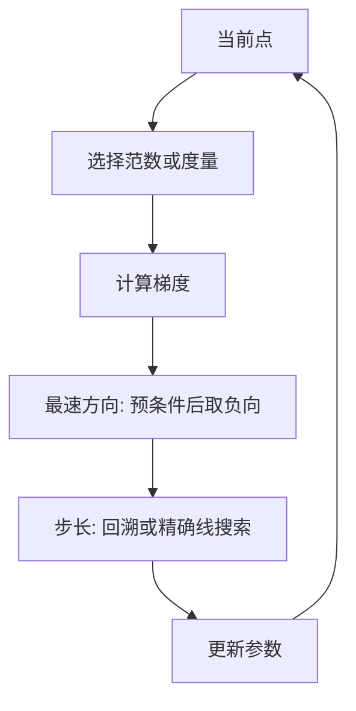
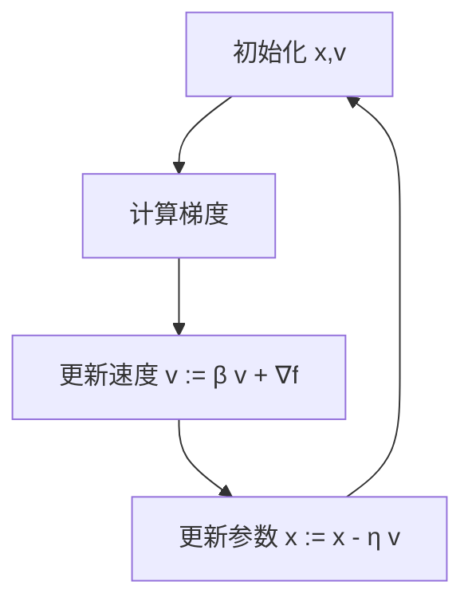
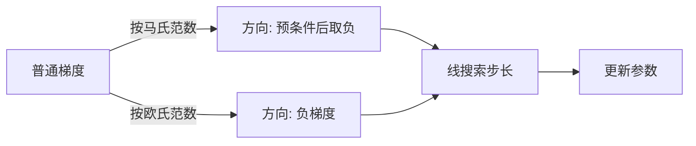
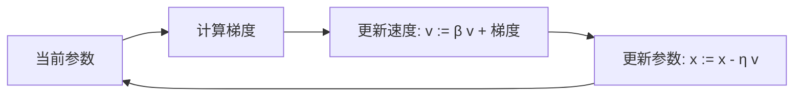

一句话版：**最速下降法**是在“给定度量（范数）下**下降最快**的方向”，本质是“**带预条件的梯度下降**”；**动量法**像“带惯性的球往谷底滚”，用**历史方向的累积**抑制之字形、加速下山。

---

## 1. 从“下山”直觉到两把扳手

* 只有梯度（坡度）不够：峡谷又长又窄时，**普通 GD** 会在两壁间**来回横跳**。
* 两个补救思路：

  1. **换度量**：在你关心的“单位步长”定义下，挑**最陡**的方向（**最速下降**）→ 相当于给梯度**加预条件**。
  2. **加惯性**：别每次都急刹，允许一点“冲劲”（**动量**）→ 把上一步的方向**平均**进来，抗噪又提速。

---

## 2. 最速下降法（Steepest Descent）：把“最陡”说清楚

### 2.1 定义：在给定范数下的“最陡方向”

在点 $x$，用一阶近似 $f(x+d)\approx f(x)+\nabla f(x)^\top d$。
**最速下降方向**定义为

$$
d^\star \;=\; \arg\min_{\|d\|=1}\ \nabla f(x)^\top d,
$$

其中 $\|\cdot\|$ 是你选定的范数（可不是必须的欧氏范数）。

* 若 $\|d\|=\|d\|_2$（欧氏范数）→ $d^\star=-\frac{\nabla f}{\|\nabla f\|_2}$，方向就是**负梯度**（**GD** 就是它的实例）。
* 若 $\|d\|=\|d\|_M=\sqrt{d^\top M d}$（**马氏范数**，$M\succ0$）：

  $$
  d^\star \;\parallel\; -M^{-1}\nabla f(x),
  $$

  即**先乘 $M^{-1}$** 再向下走——这就是**预条件梯度**。

> 直觉：你规定“走一步”的尺度（范数），**最速**就会相应改变。选得好，就像把坑“拉圆”，好走多了。

### 2.2 线搜索与步长

方向确定后，用步长 $\alpha$ 更新：$x^+ = x + \alpha d^\star$。
常见做法：**回溯线搜索**（Armijo 条件）或**精确线搜索**（二次目标时有闭式）。

**二次型特例**：$f(x)=\tfrac12 x^\top Q x - b^\top x$（$Q\succeq0$），令 $g=\nabla f=Qx-b$。

* **欧氏最速下降**（即普通 GD）的最优步长：

  $$
  \alpha^*=\frac{g^\top g}{g^\top Q g}.
  $$
* **$Q$-范数最速下降**给出方向 $-Q^{-1}g$，这就是一次**牛顿步**的方向（差在是否做二阶步长）。

### 2.3 与自然梯度 / 预条件的关系

* 若选 $M$ 为**曲率近似**（如 Fisher 信息或 Hessian 的近似），就得到**自然梯度/二阶预条件**。
* 实务里 $M^{-1}$ 用**对角、块对角、L-BFGS 近似**等实现，既提速又省算力。



**说明**：最速下降的循环 = 选度量 → 算梯度 → 预条件方向 → 线搜索 → 更新。

---

## 3. 动量法（Momentum）：让“惯性”帮你少拐弯

### 3.1 Heavy-Ball（Polyak 动量）

**速度变量** $v$ 累积历史梯度：

$$
\begin{aligned}
v_{k+1} &= \beta\, v_k + \nabla f(x_k),\\
x_{k+1} &= x_k - \eta\, v_{k+1},
\end{aligned}
$$

等价写法（更直观）：

$$
x_{k+1} = x_k - \eta\,\nabla f(x_k) + \beta\,(x_k - x_{k-1}).
$$

* $\eta$：基础步长（学习率），$\beta\in[0,1)$：**惯性系数**（常取 0.8–0.99）。
* 物理类比：球在黏性地面上滚，$\beta$ 越大，**阻尼越小**，更容易**跨过浅沟**、**减小之字形**。

**二次问题的参数经验**（已知 $\mu$ 与 $L$）
对 $\mu$-强凸、$L$-光滑二次函数，常用

$$
\eta=\frac{4}{(\sqrt{L}+\sqrt{\mu})^2},\qquad
\beta=\left(\frac{\sqrt{L}-\sqrt{\mu}}{\sqrt{L}+\sqrt{\mu}}\right)^{\!2},
$$

可获得较优的收敛速度（仅作**调参参考**，真实任务未知 $L,\mu$ 时按经验网格寻优）。

### 3.2 Nesterov 动量（NAG，前瞻梯度）

与 Heavy-Ball 近似，但把梯度在**前瞻点**计算：

$$
\begin{aligned}
y_k &= x_k + \beta\,(x_k - x_{k-1}),\\
x_{k+1} &= y_k - \eta\,\nabla f(y_k).
\end{aligned}
$$

在**凸光滑**问题上有更佳的理论上界（$O(1/k^2)$）。深度学习里两者都常见。



**说明**：动量循环 = 梯度 → 速度 → 参数；Nesterov 只是在**更新前**先做一步“前瞻”。

---

## 4. 谁更能救“之字形”？——最速 vs 动量

* **最速下降（预条件）**：从**几何**上把细长峡谷“**拉圆**”，让梯度方向更对路；
* **动量**：从**时间**上把多步方向**平均平滑**，压抑左右摇摆。
* 实务里**可叠加**：先做简单预条件（如对角缩放、标准化），再上动量（或自适应方法）。

---

## 5. 与机器学习的连接（从凸到大模型）

* **凸模型（逻辑回归、Lasso）**：

  * 预条件（特征标准化、近端分解） + 动量（或 Nesterov）→ 训练更稳更快。
* **非凸深度网络**：

  * \*\*SGD + 动量（0.9）\*\*是经典配置（尤其在 CNN）；
  * LLM 等更常用 **AdamW**（下节自适应优化），但**动量思想仍是核心**（一阶动量）。

---

## 6. 实战参数与调度小抄

* **动量 $\beta$**：0.9 是通用起点；出现**过冲震荡**→ 降 $\beta$ 或降 $\eta$。
* **学习率 $\eta$**：配合**热身 + 退火**（Step / 余弦）；大批量用**线性缩放**再微调。
* **预条件**：

  * 最简：**特征标准化**、对角缩放（把梯度按尺度“拉齐”）；
  * 进阶：**L-BFGS**（小内存二阶信息）、**分块对角**（卷积通道/层级别）。
* **线搜索**：最速下降配 Armijo 回溯常有效；深度网络通常不用线搜索，靠训练曲线调 $\eta$/$\beta$。

---

## 7. 常见坑与排错

1. **震荡不收敛**：$\eta$ 大或 $\beta$ 大。→ 同时稍降二者；或只降 $\eta$。
2. **进展很慢（之字形严重）**：未做缩放/归一化。→ 标准化输入、对角预条件、分层学习率。
3. **极坐标“打圈”**：Heavy-Ball 在强非凸区可出现周期轨道。→ 减 $\beta$、引入衰减或换 Nesterov。
4. **线搜索代价太大**：每步评估多次 $f$。→ 只在初期用，后期固定步长/调度。
5. **梯度爆炸**：RNN/Transformer。→ **梯度裁剪** + 合理初始化 + 归一化层。

---

## 8. 迷你代码（NumPy）

**最速下降（带回溯） vs 动量（Heavy-Ball）**，以二次型为例：

```python
import numpy as np

def backtracking(f, grad, x, d, alpha0=1.0, c=1e-4, tau=0.5):
    alpha = alpha0
    fx = f(x); g = grad(x)
    while f(x + alpha*d) > fx + c*alpha*np.dot(g, d):
        alpha *= tau
    return alpha

def steepest_descent(f, grad, x0, M=None, iters=200):
    x = x0.copy()
    n = len(x)
    if M is None:
        Minv = lambda v: v
    else:
        # 只示意：假设给出对称正定 M 的解算器
        Minv = lambda v: np.linalg.solve(M, v)
    for _ in range(iters):
        g = grad(x)
        d = - Minv(g)
        a = backtracking(f, grad, x, d)
        x = x + a*d
    return x

def momentum_hb(f, grad, x0, eta=1e-2, beta=0.9, iters=200):
    x = x0.copy()
    v = np.zeros_like(x)
    for _ in range(iters):
        g = grad(x)
        v = beta*v + g
        x = x - eta*v
    return x
```

> 观察：条件数大的二次型上，**最速下降（带预条件）**和**动量**相较普通 GD 收敛显著加快。

---

## 9. 两种方法的“工作机理”



**说明**：左支是“换度量”（最速下降）；右支是“原始欧氏”（普通 GD）。



**说明**：动量把“速度”当作**历史梯度的指数加权平均**，让更新更平滑。

---

## 10. 练习（含提示）

1. **推导最速方向**：在 $\|d\|_M\le 1$ 下最小化 $\nabla f^\top d$，用拉格朗日法证明 $d^\star \parallel -M^{-1}\nabla f$。
2. **二次型线搜索**：对 $f(x)=\tfrac12 x^\top Qx-b^\top x$，推导欧氏最速下降的 $\alpha^*$。
3. **预条件的收益**：随机生成条件数不同的 $Q$，比较无预条件 vs 对角预条件收敛步数。
4. **$\eta,\beta$ 调参**：在同一任务上网格搜索 $\eta\in\{1e\!-\!3, 3e\!-\!3, 1e\!-\!2\}$、$\beta\in\{0.8,0.9,0.95\}$，画收敛曲线。
5. **Nesterov 对比**：实现 NAG，比较 Heavy-Ball 在凸与非凸玩具问题上的表现差异。
6. **叠加策略**：在逻辑回归上做“标准化 + 动量”，与“无标准化 + 动量”对比收敛速度。

---

## 11. 小结（带走三句话）

1. **最速下降 = 预条件 + 线搜索**：换个“步长尺子”，方向就对了。
2. **动量 = 方向平滑 + 抗噪**：把历史信息装进“速度”，少拐弯、快下山。
3. **实战**：**先做缩放/预条件，再上动量**（或自适应），配合合适的**学习率调度**与**梯度裁剪**，稳且快。
