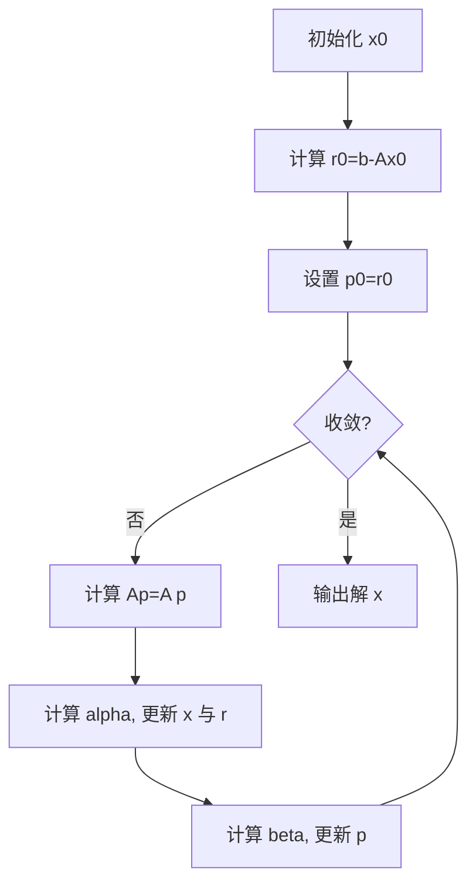
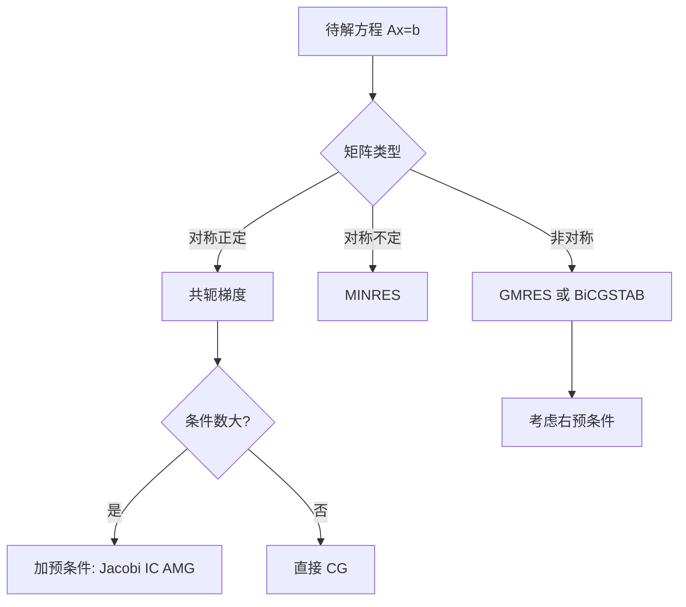

一句话版：当你要解一个**对称正定（SPD）**的线性方程 $Ax=b$（或等价最小化二次函数）而矩阵又**很大很稀疏**时，**共轭梯度法**能做到“**只用矩阵–向量乘**、占用内存小、收敛快\*\*”，并且第 $k$ 次迭代给出在 **Krylov 子空间**里的“最优”解。

---

## 1. 任务与直觉：顺着“最圆的路”下山

* **问题**：解 $Ax=b$，其中 $A\in\mathbb{R}^{n\times n}$ **对称且正定**（Symmetric Positive Definite, SPD）。
* **等价优化**：

  $$
  \min_{x} \; \phi(x)=\tfrac12 x^\top A x - b^\top x.
  $$

  这是一个“**碗口向上**”的二次凸函数。

**类比**：普通梯度下降像在“狭长的峡谷”里之字形走；**共轭梯度**会为你挑选一组“**互不干扰**”的下山方向（在 $A$-度量下彼此正交），这样**每条方向只走一次就不回头**，因此比最速下降快得多。

---

## 2. 核心思想：A-共轭方向与 Krylov 子空间

* **A-共轭（A-正交）**：两方向 $p_i,p_j$ 若 $p_i^\top A p_j=0$（$i\neq j$），称它们 **A-共轭**。

  > 与欧氏正交不同，这里用的是 $A$ 诱导的内积 $\langle u,v\rangle_A=u^\top A v$。

* **Krylov 子空间**：以初始残差 $r_0=b-Ax_0$ 为种子，

  $$
  \mathcal{K}_k(A,r_0)=\text{span}\{r_0,Ar_0,A^2r_0,\ldots,A^{k-1}r_0\}.
  $$

  CG 的第 $k$ 次迭代给出的 $x_k$ 是在 $\mathcal{K}_k$ 中使 $\phi(x)$ **最小**的点。

* **一次一维最优**：每一步都在当前搜索方向 $p_k$ 上做**精确线搜索**，因此更新幅度 $\alpha_k$ 有闭式。

---

## 3. 公式与算法：三行更新，快到飞起

设 $r_k=b-Ax_k$ 为残差，$p_k$ 为搜索方向，初始 $x_0$ 任取，$r_0=b-Ax_0$，$p_0=r_0$。则

$$
\alpha_k=\frac{r_k^\top r_k}{p_k^\top A p_k},\quad
x_{k+1}=x_k+\alpha_k p_k,\quad
r_{k+1}=r_k-\alpha_k A p_k,
$$

$$
\beta_{k+1}=\frac{r_{k+1}^\top r_{k+1}}{r_k^\top r_k},\quad
p_{k+1}=r_{k+1}+\beta_{k+1} p_k.
$$

* **每步只需**：一次 $A p_k$ 的矩阵–向量乘，外加几个向量内积与 SAXPY（线性组合）。
* **存储量**：$O(n)$ 级别，只需 3–4 个向量。



**说明**：每次循环只做一次稀疏矩阵–向量乘（SpMV），因此适合大规模稀疏问题与“矩阵–自由（只提供 A·v 算子）”场景。

---

## 4. 为什么快：误差界与“κ 的平方根”

令误差 $e_k=x_k-x^\*$，在 $A$-范数下有经典界

$$
\|e_k\|_A \le 
2\Big(\frac{\sqrt{\kappa}-1}{\sqrt{\kappa}+1}\Big)^k \|e_0\|_A,\quad
\kappa=\frac{\lambda_{\max}(A)}{\lambda_{\min}(A)}.
$$

* **对比最速下降**：最速下降的收敛比率是 $\frac{\kappa-1}{\kappa+1}$（更慢），而 CG 是它的“**平方根改良**”。
* **理论上 $n$ 步精确到达**：无限精度下，$n$ 维 SPD 系统，CG 最多 $n$ 步得到精确解。
* **实践中**：有限精度 + 条件数大 → 需要更多步，**预条件**能显著提速（见 §6）。

---

## 5. 与最速下降的关系（顺便复习 5-3）

* **最速下降**：每次沿负梯度方向做一维最优，但下一步可能“走回老路”。
* **共轭梯度**：构造一组 **A-共轭** 的方向，保证**每条方向只用一次**，因此“不会拉扯前功尽弃”。

---

## 6. 预条件共轭梯度（PCG）：把峡谷“拉圆”

当 $A$ 条件数很大，收敛变慢。找一个 SPD 的**预条件器** $M\approx A$（或者近似 $A^{-1}$），改造系统为

$$
M^{-1}Ax=M^{-1}b.
$$

实践算法写成：把残差 $r_k$ 经过“预条件求解” $M z_k=r_k$，再用 $z_k$ 替换各处的 $r_k$。

* **PCG 更新**（只写关键差异）：

  $$
  \alpha_k=\frac{r_k^\top z_k}{p_k^\top A p_k},\quad
  \beta_{k+1}=\frac{r_{k+1}^\top z_{k+1}}{r_k^\top z_k},\quad
  p_{k+1}=z_{k+1}+\beta_{k+1}p_k.
  $$
* **预条件器选择**（从轻到重）

  * **Jacobi/对角缩放**：$M=\text{diag}(A)$，零成本起步。
  * **不完全 Cholesky (IC)**：稀疏近似 $A\approx LL^\top$，求解 $Mz=r$ 只需三角回代。
  * **块对角/多级（AMG）**：更强但实现复杂，图拉普拉斯与 PDE 常用。

> 直觉：预条件把“细长的谷底”拉“圆”，让 $\kappa$ 变小，从而**指数级**加速收敛。

---

## 7. 与机器学习/大模型的连接

* **最小二乘 / 线性回归**：解 $\min\|Xw-y\|_2^2$ 的**正规方程** $(X^\top X)w=X^\top y$ 是 SPD。

  * 不建议显式形成 $X^\top X$（会使条件数平方），而是用**矩阵–自由**方式：

    * 给定向量 $v$，实现 $A v=(X^\top X) v = X^\top(X v)$。
    * 这就是**CGNR/CGNE** 或直接用 **LSQR/LSMR**（数值更稳）。
* **核方法 / 高斯过程**：核矩阵 $K+\lambda I$ 是 SPD，PCG 是**核回归、GP 拟合**的重要求解器（配合 MVM 加速、近似核）。
* **图学习 / 图拉普拉斯**：解 $Lx=b$（$L$ SPD），CG + 预条件（如 AMG）是标准配置。
* **二阶方法的内循环**：在逻辑回归/深度学习的牛顿/拟牛顿中，需要解 $H \Delta=-g$（$H$ 近似 SPD），可用**PCG** 作为内层线性求解器。
* **大模型训练**：在**分布式二阶近似**（K-FAC、Shampoo 等）里，也常见到“**预条件 + 共轭**”的影子。

---

## 8. 实现要点与数值细节

1. **矩阵–自由**：只实现 `Av(v)`，不要显式存 $A$。稀疏或算子形式都可。
2. **停止准则**：$\|r_k\|_2/\|b\|_2 \le \text{tol}$ 或 $\|r_k\|_M \le \text{tol}$。
3. **重启与正交丢失**：有限精度下 A-共轭会逐渐被破坏；可**周期重启**（重新置 $p=r$），或保存/再正交化（成本较高）。
4. **非 SPD 的情况**：

   * 非对称：用 **GMRES/BiCGSTAB**；
   * 对称但不定：用 **MINRES** 或 **SYMMLQ**。
5. **溢出与稳健**：向量内积和标量更新要用双精度；必要时做**残差替换**（间或重新计算 $r_k=b-Ax_k$）。

---

## 9. 迷你代码（矩阵–自由 + 预条件，NumPy 伪码）

```python
import numpy as np

def pcg(Av, b, Msolve=None, x0=None, tol=1e-8, maxit=None):
    """
    Av:    函数，返回 A @ v
    Msolve:函数，解 M z = r 的近似（预条件器），默认为恒等
    """
    n = len(b)
    if x0 is None: x = np.zeros(n)
    else: x = x0.copy()
    if Msolve is None: Msolve = lambda r: r
    if maxit is None: maxit = 2*n

    r = b - Av(x)
    z = Msolve(r)
    p = z.copy()
    rz_old = np.dot(r, z)
    bnorm = np.linalg.norm(b)
    if bnorm == 0: bnorm = 1.0

    for k in range(maxit):
        Ap = Av(p)
        alpha = rz_old / np.dot(p, Ap)
        x += alpha * p
        r -= alpha * Ap

        if np.linalg.norm(r) / bnorm < tol:
            break

        z = Msolve(r)
        rz_new = np.dot(r, z)
        beta = rz_new / rz_old
        p = z + beta * p
        rz_old = rz_new
    return x, k
```

* **Jacobi 预条件**：`Msolve = lambda r: r / diagA`（元素除法）。
* **矩阵–自由**示例（正规方程）：

  ```python
  Av = lambda v: X.T @ (X @ v) + lam * v
  b  = X.T @ y
  ```

  避免显式形成 $X^\top X$。

---

## 10. 小示例（思路版）

* 数据 $X\in\mathbb{R}^{10^6\times 100}$ 稀疏，求岭回归：

  * 设 `Av(v)=X.T @ (X @ v) + lam * v`，`b=X.T @ y`。
  * `Msolve` 用 `diag(X.T@X)+lam` 的对角近似（可用一次遍历估出对角）。
  * `tol=1e-6`，几十到上百步内即可得到可用精度的解。

---

## 11. 选择线性求解器的“路线图”



**说明**：先辨别矩阵类型，再选 Krylov 方法；条件数大就上预条件。

---

## 12. 常见坑与排错

1. **用在非 SPD 上** → 可能发散或震荡。

   * 排错：先检查对称性与正定性；若不满足，改用 GMRES/MINRES。
2. **形成 $X^\top X$** → 条件数平方放大、数值不稳。

   * 排错：用矩阵–自由 $v\mapsto X^\top(Xv)$ 或直接 LSQR。
3. **A-共轭丢失** → 收敛变慢。

   * 排错：周期性重算残差、降低容差、改进预条件。
4. **预条件过强/过弱**：

   * 过强：构造和求解 $Mz=r$ 太贵；过弱：加速有限。
   * 折中：先用对角/块对角，必要时 IC/AMG。
5. **停止准则过松/过严**：

   * 过松：解不够准；过严：迭代时间长。
   * 建议：相对残差 $ \|r\|_2/\|b\|_2$ + 任务容忍度。

---

## 13. 练习（含提示）

1. **从最优性推导 $\alpha_k,\beta_k$**：

   * 用一维最优 $\min_\alpha \phi(x_k+\alpha p_k)$ 导出 $\alpha_k$；
   * 用 A-共轭与残差正交性导出 $\beta_{k+1}$ 的闭式。
2. **误差界**：证明二次型上 $\|e_k\|_A$ 的收敛率与 $\sqrt{\kappa}$ 有关。
3. **PCG 收敛改善**：随机生成条件数为 $10^4$ 的 SPD 矩阵，对比无预条件 vs Jacobi vs IC。
4. **矩阵–自由**：在稀疏 $X$ 的岭回归上，用 `Av(v)=X.T@(X@v)+lam*v` 实现 PCG，画迭代次数–容差曲线。
5. **非 SPD 场景**：在对称不定矩阵上尝试 CG 与 MINRES，对比收敛行为。
6. **残差替换**：实现“每 10 次迭代重算一次 $r=b-Ax$”的变体，观察稳定性变化。

---

## 14. 小结

* **共轭梯度** 专治 **SPD + 大规模稀疏** 的线性系统：**矩阵–自由**、每步只要一次 SpMV、内存友好。
* **收敛速度由条件数主导**，PCG 能显著加速；与最速下降相比，CG 的收敛因子相当于取了**平方根**。
* 在 ML/GP/图学习/二阶优化的内循环中，CG/PCG 是可靠“工作马”。
* 工程要点：**矩阵–自由实现、恰当预条件、稳健停止准则、周期重启**。
  记住这句：**“能 CG 就别 LU，能 PCG 就别裸跑。”**
