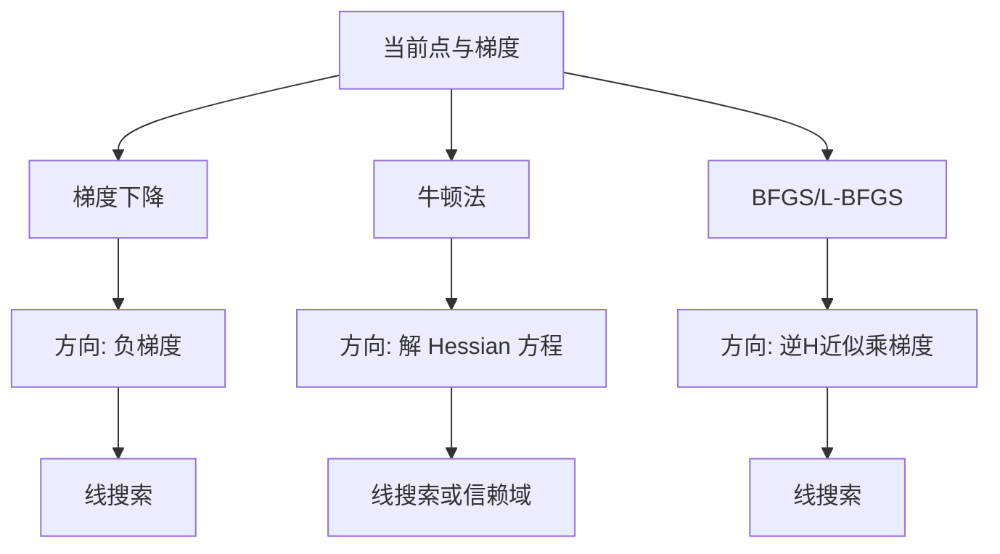
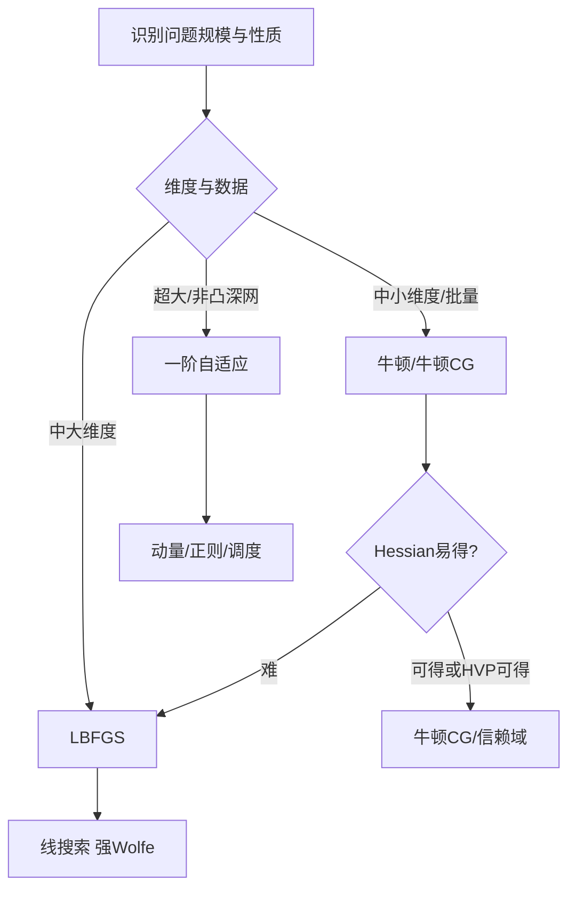

一句话版：**牛顿法**用二阶曲率（Hessian）给出“最会拐弯”的下降方向，**局部二次收敛、步子少**；**拟牛顿法**用数据驱动的**低成本曲率近似**（BFGS/L-BFGS），**不需要显式 Hessian**，却常有**超线性收敛**。
类比：在山谷里下山——**梯度法**像没有方向盘的车，**牛顿法**像有高精度方向盘的车，**拟牛顿**像学会了如何“凭历史轨迹修方向盘”。

---

## 1. 从二次近似出发：为什么二阶会快？

在点 $x_k$ 处对目标函数 $f$ 做二次泰勒近似：

$$
m_k(p) \;=\; f(x_k) + \nabla f(x_k)^\top p + \tfrac12 p^\top H_k p,
\quad H_k \approx \nabla^2 f(x_k).
$$

令模型最小化的一阶条件得到**牛顿方向** $p_k$：

$$
H_k\,p_k = -\nabla f(x_k).
$$

再做一次线搜索（或信赖域）更新：

$$
x_{k+1} = x_k + \alpha_k\,p_k.
$$

* 若 $H_k$ 用**真 Hessian**且在解附近 $H(x^\*)\succ 0$，**二次收敛**：误差平方级缩小。
* 直觉：把弯曲“看懂”之后，**一拐就到**，不再“之”字形。

---

## 2. 线搜索 vs 信赖域：两种操控方式

* **线搜索**：选方向 $p_k$ 后，找满足**Armijo-Wolfe**条件的步长 $\alpha_k$，既降函数值，又不过冲。
* **信赖域**：限制 $\|p\|\le \Delta$，在“小球”里最小化 $m_k(p)$。若模型可信，**扩大** $\Delta$；否则**收缩**。

实践建议：凸问题常用**线搜索**；非凸和数值敏感时，**信赖域**更稳（如 LM/牛顿-CG）。

---

## 3. 标准牛顿法的代价与“折中方案”

* **代价**：构造 Hessian $O(n^2)$，解线性方程 $O(n^3)$。当 $n$ 很大（深度网络），**不可行**。
* **替代**：

  * 只做 **Hessian-vector（HVP）**：用 Pearlmutter 技巧在 $O(n)$ 成本算 $Hv$；内层用 **CG** 解 $Hp=-g$（牛顿-CG）。
  * **拟牛顿**：学习到一个好的**逆 Hessian 近似**来乘梯度，避免求解线性系统。

---

## 4. 拟牛顿思想：用“位移-梯度差”学习曲率

记

$$
s_k = x_{k+1}-x_k,\qquad y_k = \nabla f(x_{k+1}) - \nabla f(x_k).
$$

我们希望更新一个**对称正定**矩阵（或其逆）使之满足**割线方程**：

$$
B_{k+1}s_k = y_k \quad (\text{或}\; H_{k+1}y_k = s_k),
$$

并“尽量靠近上一步”。

### 4.1 BFGS（更新 Hessian 近似的逆）

最常用的是 **BFGS 的逆式更新**（直接维护 $H_k\approx (\nabla^2 f)^{-1}$）：

$$
\rho_k = \frac{1}{y_k^\top s_k},\quad
H_{k+1} = \big(I - \rho_k s_k y_k^\top\big)\, H_k \,\big(I - \rho_k y_k s_k^\top\big) \;+\; \rho_k\, s_k s_k^\top.
$$

* **正定性**：若 **曲率条件** $y_k^\top s_k>0$（强 Wolfe 线搜索通常保证），则 $H_{k+1}\succ0$。
* **方向**：$p_k = - H_k \nabla f(x_k)$。
* **收敛**：在适当条件下可达**超线性**（比一阶快、比牛顿略慢）。

### 4.2 L-BFGS（有限记忆）

当 $n$ 大时，存 $H_k$ 需要 $O(n^2)$ 内存。**L-BFGS**仅保存最近 $m$ 对 $(s_i,y_i)$（如 $m=10\sim 50$），通过**两遍递推**计算方向：

* **后向遍历**：计算系数 $\alpha_i = \rho_i s_i^\top q, \; q\leftarrow q-\alpha_i y_i$。
* **初始缩放**：$H_0^{(k)} = \frac{s_{k-1}^\top y_{k-1}}{y_{k-1}^\top y_{k-1}} I$。
* **前向遍历**：$r \leftarrow H_0^{(k)} q; \; \beta_i = \rho_i y_i^\top r; \; r\leftarrow r + s_i(\alpha_i-\beta_i)$。
* **方向**：$p_k = -r$。
  内存 $O(mn)$、时间 $O(mn)$，适合大维度。

---

## 5. 三种方法一览：方向如何“会拐弯”？



**说明**：三者都做线搜索（或信赖域），差别在于**方向**如何构造：是否利用**曲率**。

---

## 6. 数学性质（简要而够用）

* **牛顿法**：

  * 若 $f$ 二次可微、解点邻域 $H(x^\*)\succ \mu I$、Hessian 李普希茨连续，则**局部二次收敛**。
  * 非凸时 $H$ 可不定 → 需**修正**（如加 $\lambda I$ 或信赖域）。
* **BFGS / L-BFGS**：

  * 满足强 Wolfe + $y_k^\top s_k>0$ → $H_k\succ0$ 且方向下降；
  * 对光滑强凸问题常见**超线性收敛**；
  * L-BFGS 记忆有限，收敛率略受 $m$ 影响，但对大规模问题更实用。

---

## 7. 逻辑回归上的示例（凸问题的得心应手）

逻辑回归的负对数似然

$$
f(w)=\frac{1}{n}\sum_{i=1}^n \log\big(1+\exp(-y_i w^\top x_i)\big) + \frac{\lambda}{2}\|w\|^2
$$

是**光滑强凸**。

* **牛顿法**：Hessian 是带权特征协方差矩阵 $X^\top W X + \lambda I$，可做**牛顿-CG**（只需 HVP）。
* **BFGS / L-BFGS**：无需 Hessian/HVP，通常**迭代次数更少**、收敛更稳，工业界常用作“批量学习器”的基线优化器。

---

## 8. 深度学习与大模型：为何不直接用牛顿？

* 维度太大（百万-十亿参数），**构造/分解 Hessian 不现实**。
* 损失**非凸**，Hessian **不定**；需要大量数值保护。
* 取而代之：

  * **一阶自适应**（AdamW、RMSProp）——5-6 节详述；
  * **近似二阶预条件**（K-FAC、Shampoo、AdaHessian）——以块结构或 Fisher 近似学习曲率；
  * **牛顿-CG + HVP** 在某些大模型微调/二阶方法研究中仍有用武之地。

---

## 9. 代码骨架（可直接改造使用）

### 9.1 线搜索（Armijo-Wolfe 简化版）

```python
def line_search(f, g, x, p, c1=1e-4, c2=0.9, alpha0=1.0):
    # f: 值函数, g: 梯度函数
    alpha, phi0, dphi0 = alpha0, f(x), g(x) @ p
    while True:
        x_new = x + alpha * p
        if f(x_new) > phi0 + c1 * alpha * dphi0:  # Armijo
            alpha *= 0.5
        elif g(x_new) @ p < c2 * dphi0:           # Wolfe 曲率
            alpha *= 1.1
        else:
            return alpha
```

### 9.2 BFGS（逆式，保持 $H\succ0$）

```python
import numpy as np

def bfgs(f, grad, x0, maxit=200, tol=1e-6):
    x = x0.copy()
    n = len(x)
    H = np.eye(n)
    g = grad(x)
    for _ in range(maxit):
        if np.linalg.norm(g) < tol: break
        p = - H @ g
        alpha = line_search(f, grad, x, p)
        s = alpha * p
        x_new = x + s
        g_new = grad(x_new)
        y = g_new - g

        ys = y @ s
        if ys <= 1e-10:     # 保护：若曲率不正，做阻尼或重置
            H = np.eye(n); x, g = x_new, g_new; continue

        rho = 1.0 / ys
        I = np.eye(n)
        V = I - rho * np.outer(s, y)
        H = V @ H @ V.T + rho * np.outer(s, s)

        x, g = x_new, g_new
    return x
```

### 9.3 L-BFGS（两遍递推，有限记忆）

```python
from collections import deque

def lbfgs(f, grad, x0, m=20, maxit=200, tol=1e-6):
    x = x0.copy()
    S, Y, RHO = deque(maxlen=m), deque(maxlen=m), deque(maxlen=m)
    g = grad(x)
    for _ in range(maxit):
        if np.linalg.norm(g) < tol: break

        # 后向
        q = g.copy()
        alpha = []
        for s, y, rho in reversed(list(zip(S, Y, RHO))):
            a = rho * (s @ q); alpha.append(a); q -= a * y
        # 初始缩放
        if len(S) > 0:
            sy = S[-1] @ Y[-1]; yy = Y[-1] @ Y[-1]
            gamma = sy / yy
        else:
            gamma = 1.0
        r = gamma * q
        # 前向
        for (s, y, rho), a in zip(list(zip(S, Y, RHO)), reversed(alpha)):
            b = rho * (y @ r); r += s * (a - b)

        p = -r
        alpha_ls = line_search(f, grad, x, p)
        s = alpha_ls * p
        x_new = x + s
        g_new = grad(x_new)
        y = g_new - g
        ys = y @ s
        if ys > 1e-10:
            rho = 1.0 / ys
            S.append(s); Y.append(y); RHO.append(rho)
        else:
            S.clear(); Y.clear(); RHO.clear()  # 曲率差，重置记忆
        x, g = x_new, g_new
    return x
```

> 工程提示：实际项目中把 `line_search` 换成库实现（如强 Wolfe）、加入 **早停** 和 **最大步长** 会更稳。

---

## 10. 何时用谁？一张“拍板”图



**说明**：**能用二阶就用二阶**；HVP 易得时用**牛顿-CG**；否则就用**L-BFGS**；深网以**一阶**为主。

---

## 11. 常见坑与排错

1. **牛顿方向不是下降方向**：Hessian 不定。

   * 对策：**修正 Hessian**（加 $\lambda I$ 或做**信赖域**），或只在 CG 中允许负曲率并截断。
2. **BFGS 失去正定性**：$y^\top s \le 0$。

   * 对策：用**强 Wolfe**线搜索；或**阻尼 BFGS**（Powell damping）；或重置 $H=I$。
3. **L-BFGS 不稳定**：历史对不代表当前曲率。

   * 对策：缩小记忆 $m$、清空历史、重置缩放、加强正则。
4. **线搜索过慢**：函数评估贵。

   * 对策：**拟牛顿 + 简化线搜索**（如 Armijo-backtracking），设置最小步长与最大回溯次数。
5. **数值溢出**（logistic/softmax）

   * 对策：稳定实现（`logsumexp`）、特征缩放/标准化。

---

## 12. 练习（含提示）

1. **推导牛顿方向**：从二次模型一阶条件出发，得到 $H p=-g$。
2. **BFGS 逆式**：在最小 Frobenius 范数变化、满足割线与对称约束下，推得逆式更新公式。
3. **超线性收敛**：阅读并复现“强 Wolfe + 曲率条件”下 BFGS 的超线性收敛证明要点。
4. **牛顿-CG**：实现仅依赖 HVP 的 CG 内循环，比较与 L-BFGS 在逻辑回归上的迭代次数与时间。
5. **阻尼 BFGS**：实现 Powell 阻尼，比较 $y^\top s \le 0$ 情况下的稳定性。
6. **非凸玩具**：在 Rosenbrock 函数上比较 GD, NAG, BFGS, L-BFGS 的收敛轨迹（画等高线）。

---

## 13. 小结

* **牛顿法**：曲率感知、局部二次收敛，但要“付二阶账”。
* **BFGS/L-BFGS**：**用历史学曲率**，既保持下降与正定，又避免显式 Hessian，工程上性价比极高。
* **实战口诀**：**能二阶就二阶；难二阶用 L-BFGS；深非凸靠一阶，但别忘了预条件与良好线搜索。**
