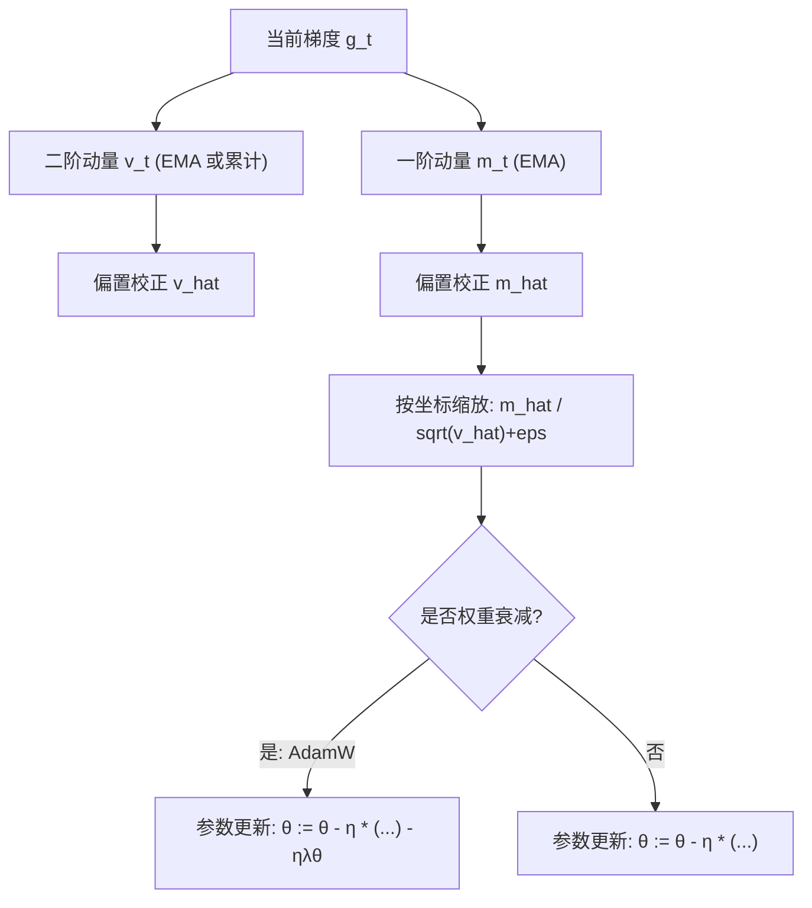
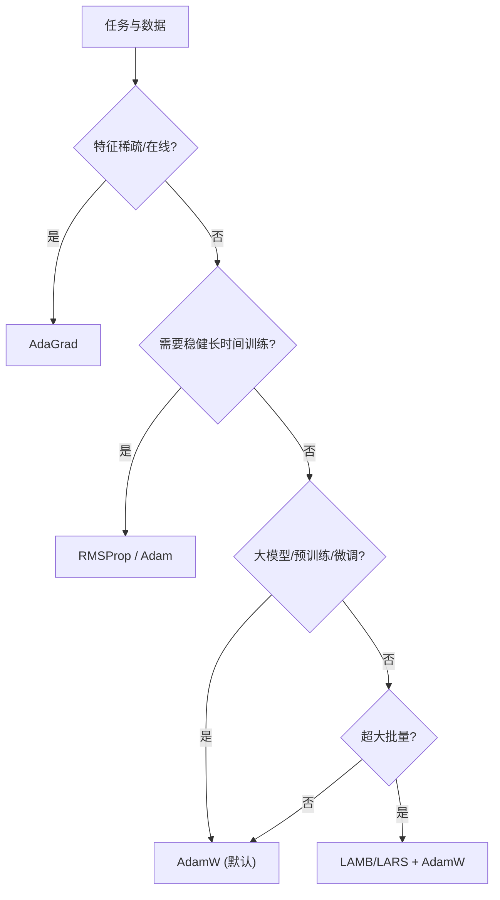

一句话版：**自适应优化器**会为每个参数**自动调步长**。
* **AdaGrad**：把历史梯度平方**累加**，走过头的方向自动**刹车**，对稀疏特征很友好。
* **RMSProp**：把平方梯度做**指数滑动平均**，避免 AdaGrad 早早“刹死”。
* **Adam**：在 RMSProp 基础上再加**一阶动量**（历史梯度平均）与**偏置校正**，成为深度学习的默认“通杀选手”。
* **AdamW**：把**权重衰减与 Adam 解耦**，是大模型训练的事实标准。

---

## 1. 直觉：为什么“每个参数一个步长”有用？

把训练看成在“山谷”里找低点：

* 有的方向**坡很陡**（梯度大），不宜迈太大步；
* 有的方向**坡很缓**（梯度小），可以大胆点。
  自适应优化器会按**局部地形**自动缩放更新量，这样 **比统一学习率更稳**。同时，对**稀疏特征**（NLP 词向量、推荐系统 embedding），某些参数**很少被更新**，自适应方法能给它们更**合适**的步长。

---

## 2. 统一记号与“预条件化”视角

我们最小化 $f(\theta)=\frac1n\sum_{i=1}^n \ell(\theta;z_i)$，令 $g_t=\nabla f(\theta_t)$。
自适应方法基本都是

$$
\theta_{t+1}=\theta_t-\eta_t\,\underbrace{P_t}_{\text{预条件矩阵}}\; g_t,
$$

其中 $P_t$ 通常为**对角矩阵**（逐参数缩放），等价于一种**近似二阶预条件**：陡峭方向缩小步长，平缓方向放大步长。

---

## 3. AdaGrad：历史平方梯度的“累进刹车”

**核心**：累计平方梯度的和 $G_t=\sum_{k=1}^t g_k\odot g_k$，按坐标缩放：

$$
\theta_{t+1}=\theta_t-\eta\,\frac{g_t}{\sqrt{G_t}+\varepsilon}.
$$

* **优点**：对**稀疏特征**很友好（少见梯度 → $G_t$ 小 → 步长相对大）；**无需复杂调参**。
* **缺点**：$G_t$ 单调增大，长期训练会**过早“刹死”**，学习率趋近于 0。
* **常用超参**：$\eta\in[10^{-2},10^{-1}]$，$\varepsilon\in[10^{-10},10^{-8}]$。

---

## 4. RMSProp：让“刹车”有记忆窗

为解决 AdaGrad 的“永久累加”，RMSProp 使用**指数滑动平均**（EMA）：

$$
v_t=\beta_2 v_{t-1}+(1-\beta_2)\,g_t\odot g_t,\qquad
\theta_{t+1}=\theta_t-\eta\,\frac{g_t}{\sqrt{v_t}+\varepsilon}.
$$

* **优点**：不会无限制累加，能长期训练；对非平稳目标（深网）更稳。
* **常用超参**：$\beta_2\in[0.9,0.99]$（经典是 0.9），$\varepsilon\in[10^{-10},10^{-8}]$。

---

## 5. Adam：动量 + RMSProp + 偏置校正

Adam 同时对 **一阶矩**（梯度的 EMA）和 **二阶矩**（平方梯度的 EMA）做自适应，并加入**偏置校正**（因初期 EMA 偏向 0）：

$$
\begin{aligned}
m_t&=\beta_1 m_{t-1}+(1-\beta_1)g_t,\\
v_t&=\beta_2 v_{t-1}+(1-\beta_2)g_t\odot g_t,\\
\hat m_t&=\frac{m_t}{1-\beta_1^t},\quad
\hat v_t=\frac{v_t}{1-\beta_2^t},\\
\theta_{t+1}&=\theta_t-\eta\,\frac{\hat m_t}{\sqrt{\hat v_t}+\varepsilon}.
\end{aligned}
$$

* **默认超参（常用）**：$\beta_1=0.9$、$\beta_2=0.999$、$\varepsilon=10^{-8}$。
* **直觉**：$\hat m_t$ 起到**动量**作用（方向更平滑），$\hat v_t$ 起到**按坐标缩放**作用（自适应步长）。

### AdamW：与 L2 正则“解耦”的 Adam

把**权重衰减（weight decay）**从损失的 L2 正则**解耦**，直接对权重做衰减（不通过梯度）：

$$
\theta_{t+1} \leftarrow \theta_{t+1}-\eta\,\lambda\,\theta_t.
$$

> 实践中“Adam + L2”与“AdamW”效果不同：**AdamW**更稳定，几乎是 LLM/ViT 等大模型的标配（典型 $\lambda=0.01$）。

### AMSGrad（保证单调二阶界）

把 $\hat v_t$ 改为历史最大：$\tilde v_t=\max(\tilde v_{t-1}, v_t)$，再用 $\tilde v_t$ 更新，提高理论收敛保障（实际影响依任务而定）。

---

## 6. 一图看清“自适应家族”的工作流



**说明**：Adam = 动量 + RMSProp + 偏置校正；AdamW 把衰减从梯度里“拿出来”单独做。

---

## 7. 和二阶/预条件的关系（工程直觉）

把更新写成 $\Delta\theta=-\eta\,D_t^{-1} g_t$，其中 $D_t=\mathrm{diag}(\sqrt{v_t}+\varepsilon)$。
这看起来像用**对角 Hessian/Fisher 的近似**做预条件（把陡峭方向缩小步长）。
因此：

* **标准化/归一化**输入 → 降低各坐标尺度差，**帮助**自适应器更稳。
* 对**极度不均衡**的梯度分量（如不同层/不同模块），可考虑**分层学习率**或**分组权重衰减**。

---

## 8. 超参数与常见配方（可抄就抄）

* **Adam/AdamW（CV/NLP 常用）**

  * $\beta_1=0.9$，$\beta_2=0.999$，$\varepsilon=10^{-8}$（大模型有时用 $10^{-5}$）；
  * **学习率**：基础 $3\!\times\!10^{-4}$（微调可更小），配 **Warmup + 余弦退火**；
  * **权重衰减**：0.01；**别**对偏置/归一化层做衰减。
* **RMSProp（RNN、Reinforce 里也见）**

  * $\beta_2=0.9$，$\eta\in[10^{-4},10^{-3}]$，配梯度裁剪。
* **AdaGrad（稀疏、在线）**

  * $\eta\in[10^{-2},10^{-1}]$，注意训练后期可能变慢。

**批量与学习率**：大批量时可尝试**线性缩放学习率**（lr ∝ batch），再微调与加 warmup。

---

## 9. 代码骨架（AdamW，NumPy 形式）

```python
import numpy as np

class AdamW:
    def __init__(self, params, lr=3e-4, betas=(0.9, 0.999), eps=1e-8, weight_decay=0.01):
        self.params = params  # list of dict: {"w": np.array, "g": np.array}
        self.lr = lr
        self.b1, self.b2 = betas
        self.eps = eps
        self.wd = weight_decay
        self.t = 0
        self.m = [np.zeros_like(p["w"]) for p in params]
        self.v = [np.zeros_like(p["w"]) for p in params]

    def step(self):
        self.t += 1
        b1t = 1 - self.b1**self.t
        b2t = 1 - self.b2**self.t
        for i, p in enumerate(self.params):
            g = p["g"]
            # 一阶/二阶动量
            self.m[i] = self.b1*self.m[i] + (1-self.b1)*g
            self.v[i] = self.b2*self.v[i] + (1-self.b2)*(g*g)
            # 偏置校正
            mhat = self.m[i] / b1t
            vhat = self.v[i] / b2t
            # 解耦权重衰减
            p["w"] -= self.lr * self.wd * p["w"]
            # 参数更新
            p["w"] -= self.lr * mhat / (np.sqrt(vhat) + self.eps)
```

> 实战注意：把**梯度裁剪**放在 step 前（特别是 RNN/Transformer），并为**BN/LayerNorm/bias**禁用权重衰减。

---

## 10. 何时用谁？（决策小图）



**说明**：大多数深度学习任务，**AdamW**是默认起点；稀疏、在线则可试 **AdaGrad**；强化学习/RNN 里 **RMSProp/Adam**都常见。

---

## 11. 常见坑 & 排错

1. **把 L2 正则当成 Adam 的 weight decay**

   * 结论：**AdamW ≠ Adam + L2**。请用**解耦衰减**（单独对 $\theta$ 做衰减），不要把 $\lambda\theta$ 加进梯度再自适应缩放。
2. **$\varepsilon$ 太大或太小**

   * 太大：像把 $v$ 忽略，退化为动量法；太小：数值不稳。常用 $10^{-8}$（有时 $10^{-5}$ 更稳）。
3. **$\beta_2$ 太高导致收敛慢**

   * 二阶动量记忆太长，新信息融入慢；尝试 0.98–0.995（LLM 微调常用 $\beta_2=0.95\sim0.99$）。
4. **全量权重衰减**

   * 请对 **LayerNorm/BatchNorm 的缩放与偏置**禁用衰减，对 embedding/bias 也常禁用。
5. **大批量直接堆 lr**

   * 要配**线性缩放 + warmup + 退火**；否则易发散。
6. **梯度爆炸/稀疏更新极端**

   * 加**梯度裁剪**、检查数据预处理与损失实现（`logsumexp` 稳定化）。

---

## 12. 小练习（含提示）

1. **手推偏置校正**：证明 $m_t$ 的期望偏向 0，写出 $\hat m_t=m_t/(1-\beta_1^t)$ 的来由。
2. **稀疏场景对比**：在合成的词袋数据上对比 SGD、AdaGrad、AdamW 的收敛与最终指标。
3. **$\beta_2$ 的影响**：固定其它超参，扫描 $\beta_2\in\{0.9,0.95,0.99,0.999\}$，画训练/验证曲线并解释差异。
4. **Adam vs AdamW**：实现两者在相同任务上的对比，展示权重范数与验证损失的差别。
5. **AMSGrad 开关**：在不稳定数据上试 AMSGrad，观察是否缓解震荡。
6. **分层学习率**：给 transformer 的不同层设不同 lr（靠近输出层更大），比较收敛速度。

---

## 13. 小结（带走三句话）

1. **AdaGrad/RMSProp/Adam** 都是在做“**逐坐标预条件**”，让步长匹配地形。
2. **AdamW** 把权重衰减从自适应里**解耦**，是大模型训练的**事实标准**。
3. 成功落地的三件事：**合理超参（β、ε、wd）**、**学习率策略（warmup+退火）**、**数值与工程细节（裁剪/禁衰减/稳定实现）**。
