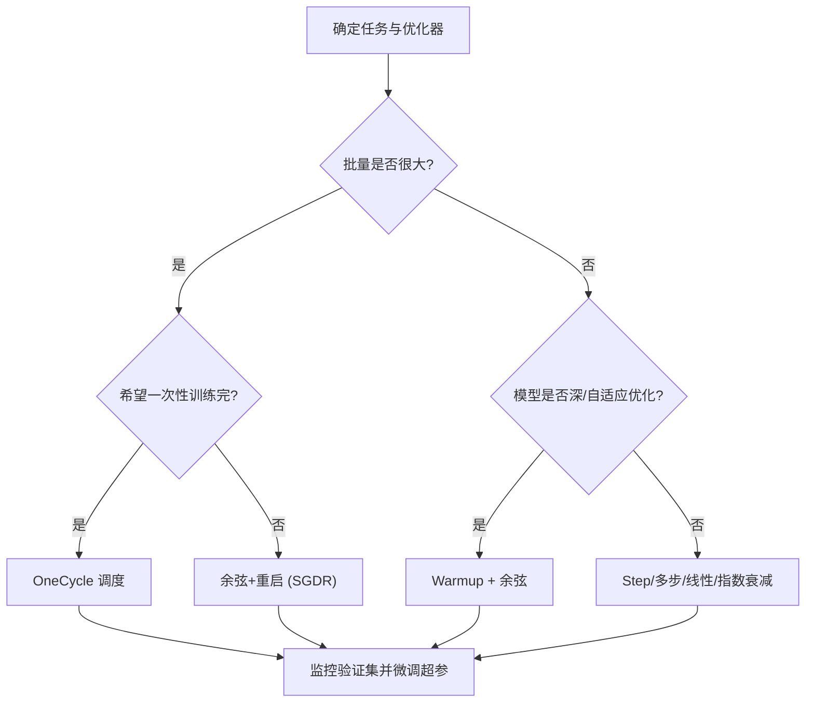

一句话版：学习率（LR）是油门，**调度**是“踩油门的节奏”。前期 **warmup** 防打滑，中后期 **余弦退火**让你平顺地收尾；若想“快上坡、稳下坡”，**OneCycle** 用一次升降的曲线把速度与稳定兼顾。

---

## 1. 为什么要做学习率调度？

把训练看做开车下山：

* **固定 LR**：一路同速，容易一会儿太快（震荡），一会儿太慢（磨蹭）。
* **调度 LR**：前期大胆找方向（较大 LR），后期精修（较小 LR）。
  好处：

1. **更快收敛**：用大 LR 跨过“平坦区/鞍点”；
2. **更稳**：后期小 LR 精调，避免错过谷底；
3. **更好泛化**：合适的调度配合 SGD 噪声，经常带来更好的验证集表现。

---

## 2. “通用菜单”与选择套路

常见策略：

* **常数**（baseline）；
* **Step/多步衰减**：到某轮把 LR 乘以 γ；
* **指数/线性衰减**；
* **Warmup**：先从很小的 LR 线性/指数升到目标 LR；
* **余弦退火**（Cosine Annealing / SGDR）与**带重启的余弦**；
* **OneCycle**：单周期“升–降”并**反向调动量**。

**经验选型**（粗略）：

* **Transformer / ViT / LLM 微调**：Warmup + 余弦退火（或余弦+重启）；
* **CV 大批量训练**：OneCycle（SGD 或 AdamW 都可）；
* **小数据/凸问题**：Step/多步；
* **在线/流式**：指数/线性衰减更易管控。

---

## 3. Warmup：先热车，再提速

**思想**：一上来模型的梯度与统计量还不稳定（尤其有 BN/LayerNorm、自适应优化的二阶动量），用**很小** LR 开始，**逐步升到**目标 LR。

### 3.1 线性 warmup（最常见）

设总 warmup 步数 $T_w$，目标 LR 为 $\eta_{\max}$：

$$
\eta_t = \eta_{\max}\cdot \frac{t}{T_w},\quad t=1,\dots,T_w.
$$

### 3.2 指数 warmup（更平滑）

$$
\eta_t=\eta_{\max}\cdot\left(\frac{\eta_{\min}}{\eta_{\max}}\right)^{1-\frac{t}{T_w}}
\quad(\eta_{\min}\ll\eta_{\max})
$$

**小贴士**

* Warmup **步数**常占**总步数**的 1%–10% 或若干千步（取决于 batch/任务）；
* **大批量**、**Adam/AdamW**、**深网络**更偏爱 warmup；
* Warmup 结束后，**接余弦/线性/多步**均可。

---

## 4. 余弦退火（Cosine Annealing）：优雅收尾

无重启版本（总训练步数 $T$）：

$$
\eta_t=\eta_{\min}+\tfrac12(\eta_{\max}-\eta_{\min})\Big(1+\cos(\pi \tfrac{t}{T})\Big),
\quad 0\le t\le T.
$$

* 早期下降慢、后期下降快，**平滑**且易用；
* 常与 **Warmup** 组合：Warmup 到 $\eta_{\max}$，再走余弦到 $\eta_{\min}$。

**带重启（SGDR）**
把训练分成多个周期 $T_0,T_1,\dots$，到期**重启** LR 到较高值、再余弦降回；有助于跳出次优解。周期可**递增**（如每次 ×2）。

---

## 5. OneCycle：升–降“一次到位”，动量反向走

**核心**（Smith 思想）：在一个训练周期内，**先把 LR 从低升到高**（探索），**再从高降到更低**（收敛）；同时**动量反向调**：LR 高时动量小（更活跃），LR 低时动量大（更稳）。

### 5.1 分段公式（线性版本，易实现）

设总步 $T$、上升比例 $p\in(0,1)$，最小/最大学习率 $\eta_{\min},\eta_{\max}$：

$$
\eta_t=
\begin{cases}
\eta_{\min} + (\eta_{\max}-\eta_{\min})\dfrac{t}{pT}, & 0\le t<pT\\[6pt]
\eta_{\max} - (\eta_{\max}-\eta_{\text{final}})\dfrac{t-pT}{(1-p)T}, & pT\le t\le T
\end{cases}
$$

* 常取 $p\approx 0.3\sim0.4$，$\eta_{\text{final}}$ 可比 $\eta_{\min}$ 更小（例如 $\eta_{\max}/25\sim\eta_{\max}/100$）。
* **动量** $m_t$ 反向：上升段从 $m_{\max}\to m_{\min}$，下降段从 $m_{\min}\to m_{\max}$。

### 5.2 优点 & 适用

* **快速**：通常在相同步数内更快提升指标；
* **鲁棒**：对初始 LR 较不敏感；
* **常用于**：图像/语音/表格任务的大批量训练，AdamW/SGD 均可。

---

## 6. 三者“时间轴”示意（中文）

```mermaid
gantt
dateFormat  X
title 常见调度的时间轴（相对步数）
section Warmup + 余弦
Warmup(升) :a1, 0, 10
余弦(降)   :after a1, 90
section OneCycle
LR升       :b1, 0, 40
LR降       :after b1, 60
动量降     :m1, 0, 40
动量升     :after m1, 60
```



**说明**：上图横轴是相对训练步数（0–100）。Warmup 只在初期出现；OneCycle 的 LR 与动量**反向**变化。

---

## 7. 代码骨架（PyTorch 风格，易复制）

> 下面展示“**Warmup+余弦**”和“**OneCycle**”两种最常用实现思路。真实项目可直接用 `torch.optim.lr_scheduler` 里的官方实现（`CosineAnnealingLR`/`OneCycleLR` 等），或自定义 Lambda。

### 7.1 Warmup + 余弦（单组 LR）

```python
import math

class WarmupCosine:
    def __init__(self, optimizer, T_total, warmup_steps=0, lr_max=3e-4, lr_min=0.0):
        self.opt = optimizer
        self.T_total = T_total
        self.warm = warmup_steps
        self.lr_max = lr_max
        self.lr_min = lr_min
        self.t = 0

    def step(self):
        self.t += 1
        if self.t <= self.warm and self.warm > 0:
            lr = self.lr_max * self.t / self.warm
        else:
            t = min(self.t - self.warm, self.T_total - self.warm)
            T = max(1, self.T_total - self.warm)
            lr = self.lr_min + 0.5*(self.lr_max - self.lr_min)*(1 + math.cos(math.pi * t / T))
        for pg in self.opt.param_groups:
            pg["lr"] = lr
```

### 7.2 OneCycle（线性升降 + 反向动量）

```python
class OneCycleSimple:
    def __init__(self, optimizer, T_total, lr_min, lr_max, pct_up=0.4,
                 mom_max=0.95, mom_min=0.85):
        self.opt = optimizer
        self.T_total = T_total
        self.up = int(T_total * pct_up)
        self.lr_min, self.lr_max = lr_min, lr_max
        self.mom_max, self.mom_min = mom_max, mom_min
        self.t = 0

    def step(self):
        self.t += 1
        if self.t <= self.up:
            # LR up, Momentum down
            lr = self.lr_min + (self.lr_max - self.lr_min) * (self.t / self.up)
            mom = self.mom_max - (self.mom_max - self.mom_min) * (self.t / self.up)
        else:
            # LR down, Momentum up
            t2 = self.t - self.up
            T2 = max(1, self.T_total - self.up)
            lr = self.lr_max - (self.lr_max - self.lr_min/25.0) * (t2 / T2)
            mom = self.mom_min + (self.mom_max - self.mom_min) * (t2 / T2)
        for pg in self.opt.param_groups:
            pg["lr"] = lr
            if "momentum" in pg:                 # SGD
                pg["momentum"] = mom
            if "betas" in pg:                    # Adam/AdamW
                b1, b2 = pg["betas"]
                pg["betas"] = (1 - (1-mom), b2)  # 仅示意：等价调 b1≈动量
```

> 提示：对 Adam/AdamW，OneCycle 通常调 \*\*β1（动量）\*\*而非 β2（长记忆二阶）；实际调参可更细分层。

---

## 8. 选择流程（中文流程图）



**说明**：大批量 → OneCycle 很香；深网络+AdamW → Warmup+余弦是默认安全选择。

---

## 9. 工程心得与参数建议

* **Warmup 长度**：太短没稳定作用，太长会拖慢；先用 **1%–5%** 总步数起步，观察曲线再微调。
* **余弦最低 LR**：不是必须 0。设定一个 **lr\_min = (0.01–0.1)·lr\_max** 往往更稳。
* **OneCycle 的 lr\_max**：可以比常规更激进（如常规的 2–5 倍），配合 **梯度裁剪**。
* **动量的反向调**：OneCycle 里 **LR 高 → 动量低**（更探索），**LR 低 → 动量高**（更收敛）。
* **分层/分组调度**：Transformer/多分支网络可对不同层/参数组使用不同初始 LR 或衰减（靠近输出层更大）。
* **与权重衰减**：AdamW 中**解耦衰减**与 LR 调度独立存在；通常 **wd 固定**，不要跟着 LR 同步变化。
* **监控指标**：训练/验证 loss、学习率、动量/β1、梯度范数；曲线异常（锯齿/发散）优先检查 **warmup 与 lr\_max**。

---

## 10. 常见坑与排错

1. **warmup 后忘记切换到退火** → LR 卡在高位，loss 在高原区抖动。

   * 解决：检查调度器 `step()` 调用时机（per-step vs per-epoch）。
2. **OneCycle 的 lr\_max 过大** → 早期直接发散。

   * 解决：减小 lr\_max 或增加 **梯度裁剪**（如 1.0）。
3. **余弦最低 LR 取 0 导致训练“停摆”**（尤其 AdamW）

   * 解决：给 $\eta_{\min}$ 一点余量（如 $1e{-6}\sim1e{-5}$ 或相对值）。
4. **多优化器/多 param group**：只更新了一个组的 LR。

   * 解决：循环 param\_groups，并核对打印。
5. **per-epoch 调度用于超长 epoch 的任务** → 粒度太粗。

   * 解决：改为 **per-step** 调度，使曲线更平滑、控制更精细。

---

## 11. 小练习（含提示）

1. **推导余弦调度**：从“圆周投影”的角度推导 $\eta_t$ 公式，并解释为什么前后平滑。
2. **玩具对比**：在同一 CNN 上对比固定 LR、Step、Warmup+Cosine、OneCycle 的训练/验证曲线。
3. **寻找 lr\_max**：用“学习率范围测试”（LR range test），地图式地找合适 `lr_min, lr_max`。
4. **OneCycle 的动量**：实现反向动量日程，比较固定动量 vs 反向动量的差异。
5. **分层 LR**：对 Transformer 做 layer-wise lr decay（靠输入侧层更小），与统一 LR 对比。
6. **Cosine 重启**：实现 SGDR 的周期递增重启，观察跳出次优的现象。

---

## 12. 小结（带走三句话）

1. **Warmup** 保前期稳定；**余弦退火** 平滑收尾；**OneCycle** 一次升降兼顾探索与收敛。
2. 默认靠谱的配方：**Warmup + 余弦（AdamW）**；大批量或想提速：**OneCycle**。
3. 任何调度都别离开**良好的监控与裁剪**：看曲线，勤复盘，**让 LR 曲线服务于你的损失曲线**。
