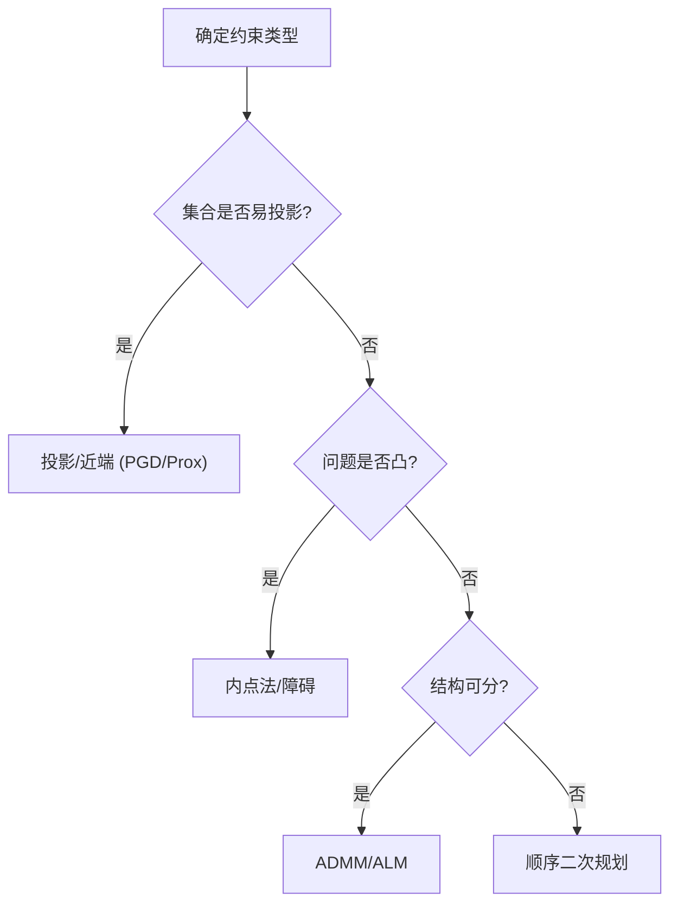
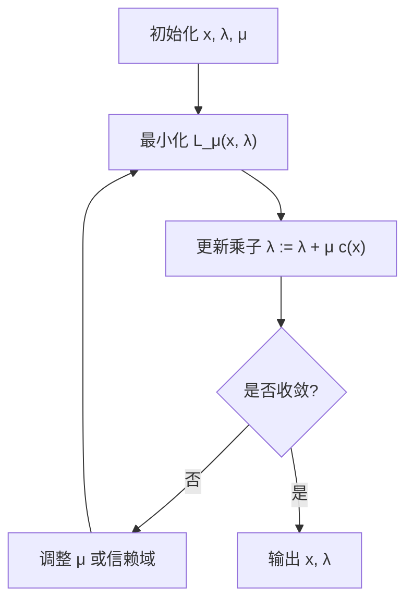

一句话版：当“只能在规定范围内动”的时候（参数要落在某个集合里、概率要和为 1、范数不能超标……），就成了**约束优化**。工具箱里有四大派：**投影/近端**、**惩罚/障碍**、**增广拉格朗日/ADMM**、**顺序二次规划（SQP）**。选对方法，你就能又稳又快地在“围栏里”找到好解。

---

## 1. 开场类比：带围栏的公园找低点

无约束优化像在山坡上找最低点；有约束优化像**围起了栅栏**的公园：你必须**在栅栏内**下山。

* 等式约束 $h_i(x)=0$：像“不能越线”。
* 不等式约束 $g_j(x)\le 0$：像“不能进入禁区”。
* 集合约束 $x\in\mathcal{C}$：像“只能在草坪上走”。

---

## 2. 标准形式与可行域

我们最小化

$$
\min_{x\in\mathbb{R}^d} f(x)\quad 
\text{s.t. } \; g_j(x)\le 0~~(j=1..m),\quad h_i(x)=0~~(i=1..p).
$$

* **可行域** $\mathcal{F}=\{x\mid g(x)\le0,\,h(x)=0\}$。
* 机器学习里常见约束：

  * **概率单纯形**：注意力/类别概率 $p\ge0,~\mathbf{1}^\top p=1$。
  * **范数球**：$\|w\|_2\le R$（防止过大权重）、$\|w\|_1\le \tau$（稀疏）。
  * **盒约束**：量化/裁剪 $\ell\le x\le u$。
  * **结构约束**：低秩、正定（协方差/核矩阵）、正交（某些 LoRA/字典学习）。

---

## 3. KKT 条件（回顾版）

拉格朗日函数

$$
\mathcal{L}(x,\lambda,\nu)=f(x)+\sum_{j=1}^m \lambda_j g_j(x)+\sum_{i=1}^p \nu_i h_i(x).
$$

**KKT 条件**（局部极小的必要条件，凸问题里也充分）：

* 可行性：$g_j(x^\*)\le 0,\; h_i(x^\*)=0$
* 驻点：$\nabla_x \mathcal{L}(x^\*,\lambda^\*,\nu^\*)=0$
* 互补松弛：$\lambda_j^\* g_j(x^\*)=0,\; \lambda_j^\*\ge 0$

这四条像“路标”：告诉我们最优点要同时满足的**几何与力平衡**关系。

---

## 4. 四大套路：怎么在围栏里下山？

### 4.1 投影/近端（Projected/Proximal）

* **投影梯度（PGD）**：

  $$
  x_{k+1}=\Pi_{\mathcal{C}}\big(x_k-\eta\nabla f(x_k)\big),
  $$

  把一步的无约束更新**投影回可行域**。
  适合 **简单集合**（盒、ℓ2 球、单纯形、PSD 圆锥的近端等）。

* **近端梯度（Prox）**：
  把“难的那部分”放进近端算子：

  $$
  x_{k+1}=\operatorname{prox}_{\eta \phi}(x_k-\eta\nabla f(x_k)),\;
  \operatorname{prox}_{\eta \phi}(z)=\arg\min_x\Big\{\phi(x)+\frac{1}{2\eta}\|x-z\|^2\Big\}.
  $$

  把约束写成指标函数 $\phi=\iota_{\mathcal{C}}$ 就回到投影；把 L1 写成 $\|x\|_1$ 就是**软阈值**。

### 4.2 惩罚与障碍（Penalty/Barrier）

* **二次惩罚**：违规就罚

  $$
  \min_x f(x)+\mu\sum_j [g_j(x)]_+^2+\mu\sum_i h_i(x)^2.
  $$

  $\mu\uparrow$ 可逼近约束，但数值可能变“硬”。

* **内点法（障碍函数）**：在可行域**内部**走，靠近边界会被“热得烫回去”

  $$
  \min_{g(x)<0} f(x)-\tfrac{1}{t}\sum_j \log(-g_j(x)).
  $$

  随 $t\uparrow$（障碍变弱），解逼近最优。适合**凸问题**的大规模精确求解（经典 LP/QP/SOCP/SDP 的主力）。

### 4.3 增广拉格朗日与 ADMM

* **增广拉格朗日（ALM）**：在拉格朗日上加二次罚，既约束又稳：

  $$
  \mathcal{L}_\mu(x,\lambda)=f(x)+\lambda^\top c(x)+\tfrac{\mu}{2}\|c(x)\|^2.
  $$

  交替最小化 $x$ 并更新乘子 $\lambda$。等式/线性约束时很强。

* **ADMM**：把难题**拆成两块**，交替优化并通过乘子协调：

  $$
  \min_{x,z} f(x)+g(z)\;\text{s.t. } Ax+Bz=c.
  $$

  每步只解**各自容易的子问题**（如一个是二次、一个是软阈值）。在**稀疏学习（Lasso）**、**图模型**、**分布式训练**很常见。

### 4.4 顺序二次规划（SQP）

每步解一个\*\*二次规划（QP）\*\*近似原问题（把约束线性化、目标二次化），再做信赖域/线搜索。
优点：**二阶信息** + **显式处理约束**，在非线性约束下很强。代价：每步解 QP（可用内点法/活性集）。

---

## 5. 方法选择



**说明**：能投影就先投影；凸问题追求高精度用内点；可分解就用 ADMM/ALM；复杂非线性就上 SQP。

---

## 6. 常见投影/近端操作（机器学习高频）

### 6.1 盒约束 $[\ell,u]$

$\Pi_{[\ell,u]}(z)=\min(\max(z,\ell),u)$（逐坐标裁剪）。
**用处**：梯度裁剪、量化范围限制、门控参数。

### 6.2 ℓ2 球 $\|x\|_2\le R$

若 $\|z\|_2\le R$ 保持；否则投影为 $R z/\|z\|_2$。
**用处**：权重最大范数、对抗训练约束。

### 6.3 概率单纯形 $\Delta=\{p\ge0,~\mathbf{1}^\top p=1\}$

排序阈值法（Duchi 等）：

1. 排序 $z$ 得 $u$，找最大的 $\rho$ 使 $u_\rho - \frac{1}{\rho}(\sum_{j\le \rho}u_j -1)>0$；
2. $\theta = \frac{1}{\rho}(\sum_{j\le \rho}u_j-1)$；
3. $p_i=\max(z_i-\theta,0)$。
   **用处**：softmax 后概率校正、注意力/分配问题。

### 6.4 ℓ1 球 $\|x\|_1\le \tau$

若 $\|z\|_1\le\tau$ 保持；否则对 $|z|$ 做阈值 $\theta$（满足 $\sum_i \max(|z_i|-\theta,0)=\tau$），返回 $\operatorname{sign}(z)\odot\max(|z|-\theta,0)$。
**用处**：稀疏约束、特征选择。

> 这四个投影都能**线性时间**实现，非常适合**PGD/近端梯度**循环。

---

## 7. 两个实战小案例

### 7.1 例 A：带范数约束的逻辑回归（PGD）

$$
\min_w \frac{1}{n}\sum_{i=1}^n \log\big(1+\exp(-y_i w^\top x_i)\big)\quad\text{s.t. } \|w\|_2\le R.
$$

* 步骤：普通梯度步 → 投影到 ℓ2 球。
* 含义：和 L2 正则相似，但**硬约束**更可控，尤其对**公平性/鲁棒性**的指标。

### 7.2 例 B：Lasso 的 ADMM 拆分

$$
\min_x \tfrac12\|Ax-b\|_2^2+\lambda\|x\|_1
\quad \Leftrightarrow\quad 
\min_{x,z} \tfrac12\|Ax-b\|_2^2+\lambda\|z\|_1\;\text{s.t. }x=z.
$$

* **x 步**：解 $(A^\top A+\rho I)x=A^\top b+\rho(z-u)$（可预分解/CG）。
* **z 步**：软阈值 $z=\operatorname{shrink}(x+u,\lambda/\rho)$。
* **u 步**：乘子更新 $u\leftarrow u+x-z$。
  优势：把**二次**与 **L1** 解耦，易并行/分布式。

---

## 8. 增广拉格朗日（ALM）流程图



**说明**：在“罚”与“对偶”两头用力，既不跑出可行域，又能稳定收敛。

---

## 9. 与深度学习/大模型的连接

* **概率/归一化约束**：注意力分配、温度标定、后处理校正 → 用**单纯形投影**或在损失后**再投影**。
* **范数/鲁棒**：$\|w\|_2$ 或对抗半径 $\|\delta\|_p\le \epsilon$ → **PGD** 是对抗攻击/鲁棒训练的核心循环。
* **低秩/正交**：LoRA/瓶颈层可加近端或**极化/QR**投影维持结构；
* **正定矩阵**：协方差/核矩阵约束 $\Sigma\succ0$ 可做 $\Sigma\leftarrow \Pi_{\mathbb{S}_{++}}(\Sigma)$（如特征分解截断）。
* **分布式/大规模**：**ADMM/ALM** 将大问题切小块，适配**数据并行/模型并行**。
* **强化学习的约束 MDP**：期望代价 $\le$ 阈值可用**拉格朗日乘子**在线更新（Actor-Critic + 对偶上升）。

---

## 10. 代码微件（可直接嵌到训练循环）

**(1) 概率单纯形投影（NumPy）**

```python
import numpy as np

def proj_simplex(z):
    # 投影到 {p>=0, sum p = 1}
    u = np.sort(z)[::-1]
    cssv = np.cumsum(u)
    rho = np.where(u > (cssv - 1) / (np.arange(len(u)) + 1))[0][-1]
    theta = (cssv[rho] - 1) / (rho + 1.0)
    return np.maximum(z - theta, 0.0)
```

**(2) ℓ1 球投影（Duchi 阈值法）**

```python
def proj_l1_ball(z, tau=1.0):
    if np.linalg.norm(z, 1) <= tau: 
        return z.copy()
    u = np.abs(z)
    s = np.sort(u)[::-1]
    cssv = np.cumsum(s)
    rho = np.where(s > (cssv - tau) / (np.arange(len(s)) + 1))[0][-1]
    theta = (cssv[rho] - tau) / (rho + 1.0)
    return np.sign(z) * np.maximum(u - theta, 0.0)
```

**(3) 投影梯度（范数约束）**

```python
def pgd_step(x, grad, lr=1e-2, R=1.0):
    z = x - lr * grad
    nrm = np.linalg.norm(z)
    return z if nrm <= R else (R / nrm) * z
```

---

## 11. 常见坑与排错

1. **投影太贵**：复杂集合（如一般 PSD、低秩）投影昂贵。

   * 对策：选**近端可解**的重参数化（例如 Cholesky 保证 PSD），或换 **ALM/ADMM**。
2. **惩罚参数难调**：$\mu$ 太小约束不严，太大数值不稳。

   * 对策：使用 **增广拉格朗日**（同时调 $\lambda,\mu$），分阶段增大 $\mu$。
3. **内点法需要可行初值**：不等式必须严格可行。

   * 对策：做 **Phase I** 找初始可行点，或使用**滤波/信赖域**策略。
4. **ADMM 子问题不精确**：每步解不好会慢/不收敛。

   * 对策：控制内层精度、用预分解、合理选 $\rho$（自适应 $\rho$ 常有效）。
5. **非凸约束**：正交/低秩等会有局部解。

   * 对策：良好初始化、随机重启、配合**二阶信息**或**几何优化**（在流形上做梯度）。

---

## 12. 练习（含提示）

1. **KKT 推导**：对 $\min_x \tfrac12\|x\|^2$ s.t. $a^\top x=b$ 推导 KKT，并给出闭式解。
2. **PGD 与 L2 正则**：比较“$\|w\|_2\le R$”与“$\lambda\|w\|_2^2$”在逻辑回归上的差异（边界是否被触达）。
3. **单纯形投影**：证明上面的投影算法确实满足 $\sum p_i=1,p\ge0$。
4. **ADMM-Lasso**：实现并在不同 $\rho$ 下比较收敛；画原始/对偶残差曲线。
5. **障碍法轨迹**：在二维不等式约束的玩具问题上，画出不同 $t$ 的最优点如何靠近边界。
6. **SQP 小例**：求 $\min_{x,y} (x-1)^2+(y-2)^2$ s.t. $x^2+y^2\ge 1$ 的一步 SQP 近似（写出 QP）。

---

## 13. 小结（带走三句话）

1. **约束优化的灵魂是可行域**：要么**投影回去**，要么**把边界变成力**（惩罚/障碍/对偶）。
2. **四大派**各有所长：PGD/Prox（快，投影简单时优先）、内点（凸高精度）、ALM/ADMM（可分可并行）、SQP（复杂非线性强手）。
3. 在机器学习/大模型里，把常见结构（概率、范数、正定、低秩）变成**可高效投影/近端**，你就能把“围栏里的最优”优雅地拿下。
