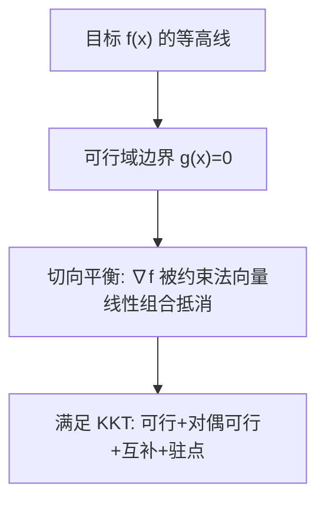
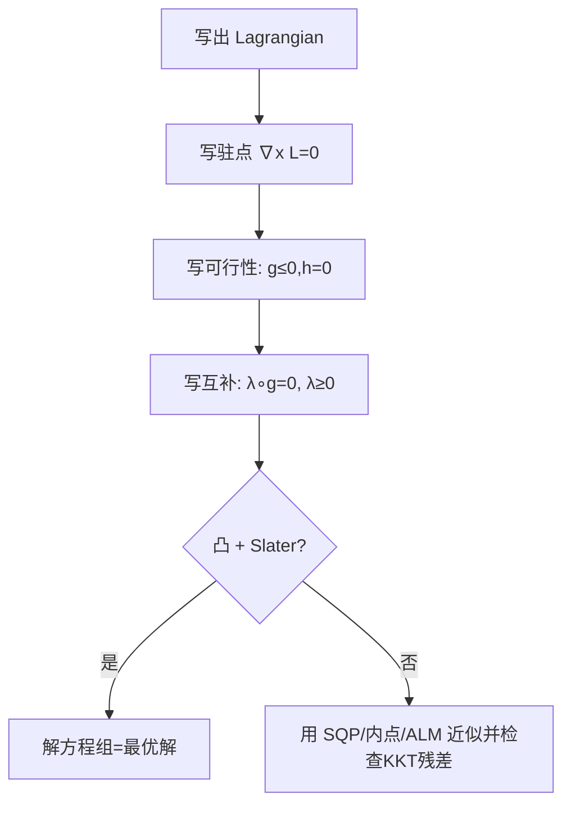

一句话版：在**约束优化**里，KKT（Karush–Kuhn–Tucker）条件是“最佳停车位”的**四条路标**：
**可行性**（不违规）、**对偶可行**（罚款不为负）、**互补松弛**（罚款只对违规贴）、**驻点**（受力平衡）。
凸问题里，满足 KKT 就**既必要又充分**；非凸问题里，它是**必要条件**与**检错工具**。

---

## 1. 从生活类比切入：红绿灯 + 罚单

想像你在一个有围栏（约束）的公园里找最低处（最优解）：

* **不等式约束** $g_j(x)\le 0$ 像“红灯不能闯”。
* **等式约束** $h_i(x)=0$ 像“必须走人行道”。
* **拉格朗日乘子** $\lambda_j,\nu_i$ 像交警手里**罚单的力度**：如果你正好贴着红线（约束紧的），罚单可能生效；不碰红线的地方（约束松的），罚单金额为 0。
* **KKT** 就是在说：“你站的这个点，既没违规（可行），又所有可能的‘罚单’与‘受力’都**平衡**。”

---

## 2. 经典形式与四条路标

考虑一般问题

$$
\min_{x\in\mathbb{R}^d}\ f(x)\quad
\text{s.t.}\ \ g_j(x)\le 0 \ (j=1..m),\ \ h_i(x)=0 \ (i=1..p).
$$

**拉格朗日函数**：

$$
\mathcal{L}(x,\lambda,\nu)=f(x)+\sum_{j=1}^m \lambda_j g_j(x)+\sum_{i=1}^p \nu_i h_i(x).
$$

**KKT 条件**（在一定正则性下，最优点 $x^*$ 必须满足）：

1. **原始可行性（Primal feasibility）**

   $$
   g_j(x^*)\le 0,\quad h_i(x^*)=0.
   $$

2. **对偶可行性（Dual feasibility）**

   $$
   \lambda_j^*\ge 0.
   $$

3. **互补松弛（Complementary slackness）**

   $$
   \lambda_j^*\cdot g_j(x^*)=0\quad(\forall j).
   $$

   > 要么**贴红线**（$g_j(x^*)=0$）→ 罚单可能非零；
   > 要么**离红线远**（$g_j(x^*)<0$）→ 罚单必须为 0。

4. **驻点/站立条件（Stationarity）**

   $$
   \nabla_x \mathcal{L}(x^*,\lambda^*,\nu^*)=0.
   $$

   > 力的合成 = 0：梯度 + 约束的“推力”刚好平衡。

**重要结论（凸性）**：若 $f,g_j$ 都是凸，$h_i$ 是仿射，且满足**Slater 条件**（存在严格可行点），则**KKT 条件充要**：满足 KKT ⇔ 全局最优。

---

## 3. KKT 的几何直觉（二维小图）

**说明**：最优点处，目标梯度 $\nabla f$ 落在**活动约束**法向量张成的空间里，被它们的非负组合抵消。

---

## 4. 例子一：最短距离投影（可手算）

> **问题**：把原点投影到三角形 $\{x\ge 0,y\ge 0, x+y\ge 1\}$ 上，即

$$
\min_{x,y}\ \tfrac12(x^2+y^2)\quad
\text{s.t.}\ \ -x\le 0,\ -y\le 0,\ 1-x-y\le 0.
$$

**拉格朗日函数**

$$
\mathcal{L}=\tfrac12(x^2+y^2)+\lambda_1(1-x-y)+\lambda_2(-x)+\lambda_3(-y).
$$

**驻点**

$$
\begin{aligned}
\partial_x: &\ x-\lambda_1-\lambda_2=0 \\
\partial_y: &\ y-\lambda_1-\lambda_3=0
\end{aligned}
$$

**互补松弛**

$$
\lambda_1(1-x-y)=0,\quad \lambda_2 x=0,\quad \lambda_3 y=0,\quad \lambda_j\ge 0.
$$

由于解直觉上在边界 $x+y=1$ 且 $x,y>0$，得到 $\lambda_2=\lambda_3=0$。
代回驻点：$x=\lambda_1,\ y=\lambda_1$，再用 $x+y=1$ 得 $x^*=y^*=\tfrac12,\ \lambda_1^*=\tfrac12$。
**验证**：可行、对偶可行、互补、驻点都成立 → **全局最优**。

> 这就是“把原点投影到线段 $x+y=1$ 且第一象限上”的结果：$(\tfrac12,\tfrac12)$。

---

## 5. 例子二：硬间隔 SVM（KKT 看“支持向量”）

硬间隔 SVM：

$$
\min_{w,b}\ \tfrac12\|w\|^2
\quad \text{s.t.}\ y_i(w^\top x_i+b)\ge 1,\ i=1..n.
$$

写成 $g_i(w,b)=1-y_i(w^\top x_i+b)\le 0$。

拉格朗日函数

$$
\mathcal{L}(w,b,\alpha)=\tfrac12\|w\|^2+\sum_i \alpha_i(1-y_i(w^\top x_i+b)),\quad \alpha_i\ge0.
$$

**驻点**

$$
\partial_w:\ w-\sum_i \alpha_i y_i x_i=0\ \Rightarrow\ w=\sum_i \alpha_i y_i x_i;
\quad
\partial_b:\ \sum_i \alpha_i y_i=0.
$$

**互补松弛**

$$
\alpha_i\big(1-y_i(w^\top x_i+b)\big)=0.
$$

结论：$\alpha_i>0$ 的样本**恰好在边界** $y_i(w^\top x_i+b)=1$，它们被称为**支持向量**；其他点 $\alpha_i=0$。
**KKT 直接揭示了支持向量的稀疏性**与判别面的几何结构。

（软间隔情形还会出现上界 $0\le \alpha_i\le C$，互补松弛分裂成三种状态，进一步区分“边界误差样本”。）

---

## 6. 约束资格条件（CQs）：KKT 何时“可用”？

KKT 成为**必要条件**通常需要一些正则性假设，常见有：

* **LICQ（线性无关约束资格）**：在候选点处，所有**活跃不等式**的梯度与所有等式的梯度**线性无关**。
* **MFCQ（Mangasarian–Fromovitz）**：存在一个方向能让所有活跃不等式的线性化**严格减少**，等式线性化为 0。
* **Slater 条件**（凸问题）：存在点使全部不等式**严格**满足、等式满足（或无等式）。这还常带来**强对偶性**（原对偶无缝）。

> 工程记忆法：**凸 + Slater ⇒ KKT 充要**；非凸问题里，LICQ/MFCQ 让 KKT 至少成为**必要检查项**。

---

## 7. KKT 与对偶：强对偶何时成立？

**拉格朗日对偶函数**：

$$
g(\lambda,\nu)=\inf_x \mathcal{L}(x,\lambda,\nu),\quad \lambda\ge0.
$$

**对偶问题**：$\max_{\lambda\ge0,\nu} g(\lambda,\nu)$。

* **弱对偶**：对任意 $\lambda\ge0,\nu$，$g(\lambda,\nu)\le f^*$。
* **强对偶**：若凸且满足 Slater，存在 $(x^*,\lambda^*,\nu^*)$ 使 $g(\lambda^*,\nu^*)=f(x^*)$。此时 KKT 条件与原/对偶最优性**等价**。
* **意义**：有时直接解对偶更容易（如 SVM），KKT 提供原对偶之间的**桥**与**停止准则**。

---

## 8. 怎么“用”KKT：算法与检查清单

### 8.1 解题套路（活性集 / SQP / 内点）

**说明**：若问题简单/凸，可直接**解 KKT 方程组**；复杂/非凸，用数值法（内点、SQP、ALM），以 KKT **残差**作为收敛标准。

### 8.2 KKT 残差（数值停止准则）

给出当前 $(x,\lambda,\nu)$，定义四类残差：

* 原始可行残差 $r_p=\big[\max(g(x),0),\ h(x)\big]$。
* 对偶可行（通常检查 $\lambda\ge 0$，数值上 $\min(\lambda)\ge -\epsilon$）。
* 互补残差 $r_c=\lambda\odot g(x)$（看是否接近 0）。
* 驻点残差 $r_d=\nabla_x L(x,\lambda,\nu)$。
  当 $\|r_p\|,\|r_c\|,\|r_d\|$ 都小于阈值，就认为达到**近似 KKT**。

---

## 9. 与机器学习/大模型的连接

* **正则与约束一体化**：L1 正则 ↔ 近端/拉格朗日；范数球 ↔ PGD/对抗训练；正定/正交 ↔ 流形/投影约束。
* **SVM/最大熵/CRF**：对偶解 + KKT 刻画稀疏性与支持条件。
* **核方法/高斯过程**：带 PSD 约束，KKT 可作为**内点/信赖域**停止标准。
* **强化学习的约束优化**（安全 RL）：“期望代价≤阈值”可用拉格朗日乘子在线更新，KKT 指导策略与乘子收敛。
* **大模型训练的“对偶视角”**：权重衰减与范数约束相通；分布式 ADMM/ALM 用 KKT 残差作为**全局一致性**信号。

---

## 10. 常见坑与排错

1. **忘了“约束资格”**：非凸且约束不正则 → 满足 KKT 也未必是最优（可能是鞍点）。

   * 做法：检查 LICQ/MFCQ，或在多个初值下重启、配合二阶检查。
2. **互补松弛方向错**：把 $g\ge 0$ 写成 $g\le 0$ 却没同时改掉互补项符号。

   * 做法：统一把不等式写成 $g\le 0$。
3. **等式当不等式用**：数值上把等式松成 $|h|\le \epsilon$ 但没配乘子，驻点残差无法消掉。

   * 做法：对等式必须引入 $\nu$ 并检查 $\nabla_x L$。
4. **边界震荡**：活动集频繁切换，$\lambda$ 数值不稳。

   * 做法：用**阻尼/滤波**、信赖域或增广拉格朗日缓和。
5. **对偶不可行**：$\lambda<0$ 出现。

   * 做法：投影到非负正交，或用内点保持 $\lambda>0$。

---

## 11. 速查表（Cheat Sheet）

* **四件套**：
  $\quad$Primal：$g(x)\le0,\ h(x)=0$；
  $\quad$Dual：$\lambda\ge0$；
  $\quad$Comp：$\lambda\odot g(x)=0$；
  $\quad$Stat：$\nabla_x f+\sum \lambda_j \nabla g_j+\sum \nu_i \nabla h_i=0$。
* **凸 + Slater** ⇒ KKT 充要、强对偶成立。
* **活动约束**：$g_j(x)=0$ 且 $\lambda_j>0$。非活动：$\lambda_j=0$。
* **对偶解释**：$\lambda$ 是**边界紧的时候**目标对约束的**影子价格/敏感度**。

---

## 12. 练习（含提示）

1. **等式+不等式的简单题**
   $\min_{x}\ \tfrac12\|x\|^2$ s.t. $a^\top x=b,\ c^\top x\le d$。
   写出 KKT，并区分 $c^\top x<d$ 与 $=d$ 两种情形的 $\lambda$ 值。
2. **Lasso 的 KKT**
   $\min_x \tfrac12\|Ax-b\|_2^2+\lambda\|x\|_1$。
   把 L1 写成对偶范数约束，推导软阈值条件：$|A^\top (Ax-b)|\le \lambda$ 与活跃支撑。
3. **SVM 软间隔**
   展示 $0\le \alpha_i\le C$ 的互补松弛如何把样本分成三类（间隔内/在边界/在外）。
4. **检查 Slater**
   给出任一凸不等式链，找一个严格可行点并说明为何强对偶成立。
5. **数值残差**
   实现 KKT 残差监控：$\|r_p\|_\infty,\ \|r_d\|_2,\ \|r_c\|_1$，并作为内点法/ALM 的停止准则。

---

## 13. 小结（带走三句话）

1. **KKT = 可行 + 对偶可行 + 互补 + 驻点**，是约束最优的“力学平衡”。
2. **凸 + Slater ⇒ 充要**，能把“满足 KKT”直接当“最优解”。
3. 在工程里，KKT 既是**算法设计的骨架**（内点、SQP、ALM），也是**收敛判据与排错清单**。
