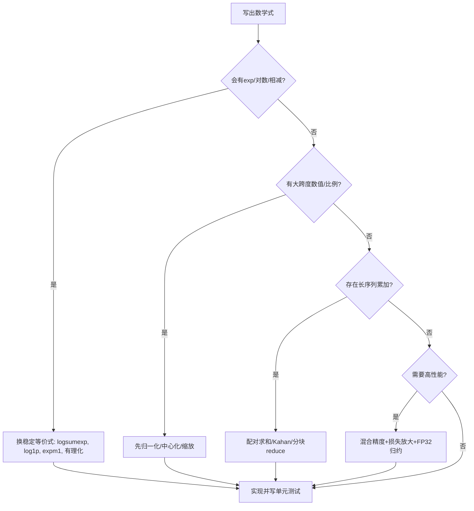

一句话版：计算机里的实数是**近似**的。误差来自“**只能装下有限位**”和“**运算会四舍五入**”。写数值代码时，别和误差硬刚：**换公式、调尺度、选稳定算法**，你的模型会更快更稳。

---

## 1. 浮点数是什么：一个“科学计数法”的盒子

现实里的 $0.1$ 在计算机里并不一定能装得下。IEEE-754 标准把一个数表示成：

$$
\text{value} = (-1)^{\text{sign}}\times (1.\text{fraction})_2 \times 2^{\text{exponent bias-corrected}}
$$

* **sign（符号位）**：1 位
* **exponent（阶码）**：控制“大/小”的 2 的幂
* **fraction（尾数/有效数）**：控制“精细度”

常见格式（近似）：

| 格式       | 位宽 | 尾数位 | 阶码位 |                    机器精度 $\epsilon$\* | 适用          |
| -------- | -: | --: | --: | -----------------------------------: | ----------- |
| float64  | 64 |  52 |  11 | $2^{-52}\approx 2.22\times 10^{-16}$ | 训练外推/高精度计算  |
| float32  | 32 |  23 |   8 |  $2^{-23}\approx 1.19\times 10^{-7}$ | 经典 DL 训练/推理 |
| float16  | 16 |  10 |   5 |  $2^{-10}\approx 9.77\times 10^{-4}$ | 混合精度（配损失放大） |
| bfloat16 | 16 |   7 |   8 |          $\approx 7.8\times 10^{-3}$ | 大范围、低精度梯度   |

\* 机器精度（machine epsilon）：满足 $1+\epsilon>1$ 的最小浮点数增量，常用来估算**相对舍入误差**的量级。

**重要事实**

* 浮点加法**不满足结合律**：$(a+b)+c$ 可能不等于 $a+(b+c)$。
* 有 **$+\infty, -\infty, \text{NaN}$**；还有\*\*次正规数（subnormal）\*\*用来“托底”过小的数。
* “单位最后位” **ULP（unit in the last place）**：某值附近能区分的最小间距。数越大，ULP 越大（同一相对精度）。

---

## 2. 常见数值“坑”：看起来对，算起来崩

### 2.1 灾难性消去（catastrophic cancellation）

两个**很接近**的大数相减，**有效数字被消掉**。
例：$\sqrt{x^2+1}-1$ 当 $x$ 很小，真值 $\approx \frac{x^2}{2}$，但直接算会先得到两个接近 1 的数再相减，精度丢光。

**稳定改写**（有理化）：

$$
\sqrt{x^2+1}-1 = \frac{x^2}{\sqrt{x^2+1}+1}
$$

右式避免了“1−1”。

**更多稳定对等式**

* $\log(1+x)$ 用 `log1p(x)`
* $\exp(x)-1$ 用 `expm1(x)`
* $\log(\sum_i e^{z_i})$ 用 **log-sum-exp 技巧**（见 §4.2）
* 二次方程根：优先用

  $$
  x_1=\frac{-b-\operatorname{sign}(b)\sqrt{b^2-4ac}}{2a},\quad
  x_2=\frac{c}{a x_1}
  $$

  避免 $b\pm\sqrt{b^2-4ac}$ 的消去

### 2.2 上溢/下溢（overflow/underflow）

* `exp(1000)` 在 float32 直接上溢到 `+inf`；`exp(-1000)` 下溢到 0。
* 交叉熵里 `log(0)` → `-inf`，传染出 NaN。

**应对**：**换尺度**（rescale）、**换公式**（log 域）、**裁剪**（clip）。

### 2.3 累加误差（求和顺序）

把一堆数相加，小数 + 大数的顺序不同，误差不同。
**改进**：**Kahan 求和**、**分治配对求和（pairwise）**（并行友好），都能显著降低累加误差。

### 2.4 方差的“朴素公式”不稳定

$\mathbb{V}[X]=\mathbb{E}[X^2]-\mathbb{E}[X]^2$ 在数据大且接近时会消去。
**用 Welford 单遍算法**（见 §4.3）。

### 2.5 正规方程求最小二乘不稳

解 $\min\|Ax-b\|_2$ 用 $(A^\top A)x=A^\top b$ 条件数平方放大，易炸。
**更稳**：用 **QR 分解** 或 **SVD**（见线性代数章）。

---

## 3. 问题的“体质” vs 算法的“手法”

* **条件数**（conditioning）：问题本身对输入扰动的敏感度。

  * 线性方程 $Ax=b$ 的条件数 $\kappa(A)=\|A\|\|A^{-1}\|$，$\kappa$ 大 → 小错放大成大错。
* **稳定性**（stability）：算法是否会额外放大误差。

  * 求和：顺序差 → 不稳定；Kahan/配对 → 更稳定。

> 选择题：**问题不好（$\kappa$ 大）** → 想办法**重标定/正则化**；**算法不稳** → **换算法**或换公式。

---

## 4. 深度学习里的常用稳定招式

### 4.1 Softmax 与交叉熵（必修）

**不稳定**：

$$
\text{softmax}_i(z)=\frac{e^{z_i}}{\sum_j e^{z_j}},\quad
\text{CE}=-\log \text{softmax}_{y}(z)
$$

如果 $z$ 很大/很小就会溢/下溢。

**稳定实现**（中心化）：

$$
m=\max_j z_j,\quad
\log\sum_j e^{z_j} = m + \log \sum_j e^{z_j-m}
$$

$$
\text{softmax}_i(z)=\frac{e^{z_i-m}}{\sum_j e^{z_j-m}}
$$

交叉熵直接写成\*\*`logsumexp - z_y`\*\*，避免显式 softmax。

### 4.2 log-sum-exp 模板（可复用）

$$
\operatorname{LSE}(z)=\log\sum_i e^{z_i}
= m + \log\sum_i e^{z_i-m},\ m=\max_i z_i
$$

框架里通常有 `logsumexp` API，自己实现时务必减去 $m$。

### 4.3 Welford 在线方差（单遍稳）

```python
def welford(xs):
    n, mean, M2 = 0, 0.0, 0.0
    for x in xs:
        n += 1
        d  = x - mean
        mean += d / n
        M2 += d * (x - mean)  # 注意是更新后的 mean
    var = M2 / (n-1) if n > 1 else 0.0
    return mean, var
```

### 4.4 Kahan 求和（抑制丢位）

```python
def kahan_sum(xs):
    s, c = 0.0, 0.0
    for x in xs:
        y = x - c
        t = s + y
        c = (t - s) - y
        s = t
    return s
```

### 4.5 Sigmoid/BCE 的稳定写法

* `sigmoid(x)`：大正溢出/大负下溢，建议用**分段**或框架自带稳定实现。
* 二分类交叉熵用 **`BCEWithLogits`**：把 sigmoid 和 log 合到一个稳定公式里。

### 4.6 归一化与正则化

* **输入/特征标准化**、**权重归一化**、**BatchNorm/LayerNorm** 都在**缩放**数值范围，改善条件数。
* **加 $\epsilon$**：如 BatchNorm 方差分母加 $1e{-5}$，避免除 0 与放大噪声。

### 4.7 梯度爆炸/消失与裁剪

* RNN/深网络易爆/消。**梯度裁剪**（按全局范数）与**激活/权重初始化**（如 Kaiming/Xavier）一起用。
* **混合精度**（float16/bfloat16）训练时，**损失放大（loss scaling）** 防止梯度下溢。

---

## 5. 混合精度与 bfloat16：速度与稳定的平衡

* **float16**：精度低、动态范围小 → 需要 **loss scaling**（动态/静态）防下溢；权重/优化器状态常保 **FP32 主副本**。
* **bfloat16**：更大的阶码（和 FP32 一样宽的 exponent），范围大但有效位少；**常更稳**（更不易溢/下溢），对大模型很友好。
* **自动混合精度（AMP/autocast）**：把“不敏感”的算子放低精度（matmul/conv），**归约/归一化/损失**保持高精度。

**实践清单**

* 启用 AMP + **GradScaler**（动态损失放大）
* 保持 **优化器状态/权重更新** 在 FP32
* 对 **归约/softmax/logsumexp** 固定用 FP32

---

## 6. 一个“稳定实现”的思路流程



**说明**：先找“危险操作”（exp、log、相减、长累加），再按套路替换或重标定。

---

## 7. 典型代码片段（可直接替换）

### 7.1 稳定 softmax + 交叉熵

```python
import torch

def softmax_stable(logits, dim=-1):
    m = logits.max(dim=dim, keepdim=True).values
    z = torch.exp(logits - m)
    return z / z.sum(dim=dim, keepdim=True)

def cross_entropy_from_logits(logits, target):
    # target: LongTensor 类别标签
    m = logits.max(dim=-1, keepdim=True).values
    logsumexp = m + torch.log(torch.exp(logits - m).sum(dim=-1, keepdim=True))
    nll = logsumexp.squeeze(-1) - logits.gather(-1, target.unsqueeze(-1)).squeeze(-1)
    return nll.mean()
```

### 7.2 安全的 `softplus`（$\log(1+e^x)$）

```python
def softplus(x):
    # 避免大正溢出/大负下溢
    return torch.where(x > 0, x + torch.log1p(torch.exp(-x)),
                            torch.log1p(torch.exp(x)))
```

---

## 8. 误差如何“长大”：一个小推导

设单步舍入的相对误差 $\delta\approx \mathcal{O}(\epsilon)$，进行 $n$ 次等价规模的运算，最坏情况下误差像 $\mathcal{O}(n\epsilon)$ 累积。

* **分治/配对求和** 把深度从 $n$ 变成 $\log n$（树状归约），误差像 $\mathcal{O}(\log n\cdot \epsilon)$。
* **预条件/正规化** 降低条件数 $\kappa$，把“问题体质”改善一个量级。

> 结论：**算法结构**（树状归约）、**数据尺度**（归一化）、**数值格式**（FP32 归约）三管齐下，误差就“长不大”。

---

## 9. 工程实践清单（Checklist）

* [ ] 用 `logsumexp`、`log1p`、`expm1`、稳定 `softplus/BCEWithLogits`
* [ ] 对 logits 做**中心化**再 softmax / CE
* [ ] **梯度裁剪** + 合理初始化（Kaiming/Xavier）
* [ ] **AMP + GradScaler**；关键归约保持 FP32
* [ ] 长序列求和用 **配对求和/Kahan**，或分块 reduce
* [ ] 做**数值单元测试**：边界输入（极大/极小/全 0/全同）
* [ ] 发现 NaN/Inf：立刻 `detect_anomaly`/逐层二分排查
* [ ] 线性最小二乘避免 $A^\top A$；优先 **QR/SVD**
* [ ] BatchNorm/LayerNorm 分母加 $\epsilon$；别把 $\epsilon$ 调太大

---

## 10. 练习（含提示）

1. **消去改写**：把 $\sqrt{1+x}-1$ 改写成无消去的等价式并解释为什么稳定。（提示：乘以共轭）
2. **稳定交叉熵**：推导从 logits 直接计算交叉熵的 `logsumexp - z_y` 公式。
3. **Welford**：用随机流数据实现 Welford，和两遍法比较精度。
4. **配对求和**：对 100 万个 $\mathcal{U}(-1,1)$ 的数，用顺序、配对、Kahan 比较误差（相对真值可用高精度库估算）。
5. **正规方程 vs QR**：在条件数较大的矩阵上，比较两法解的残差。
6. **AMP 实验**：在小模型上对比 FP32、FP16+静态放大、bfloat16（若硬件支持）的稳定性与速度。

---

## 11. 小结（带走三句话）

1. **浮点是近似**：有范围、有粒度、有舍入，别期待“数学等式=计算等式”。
2. **稳定靠三板斧**：**换公式**（logsumexp、log1p、Kahan/Welford）、**调尺度**（中心化/归一化/预条件）、**选算法**（QR/SVD、配对求和）。
3. **工程化护栏**：AMP + 损失放大、FP32 归约、梯度裁剪、边界单测，能让训练更快更稳。
