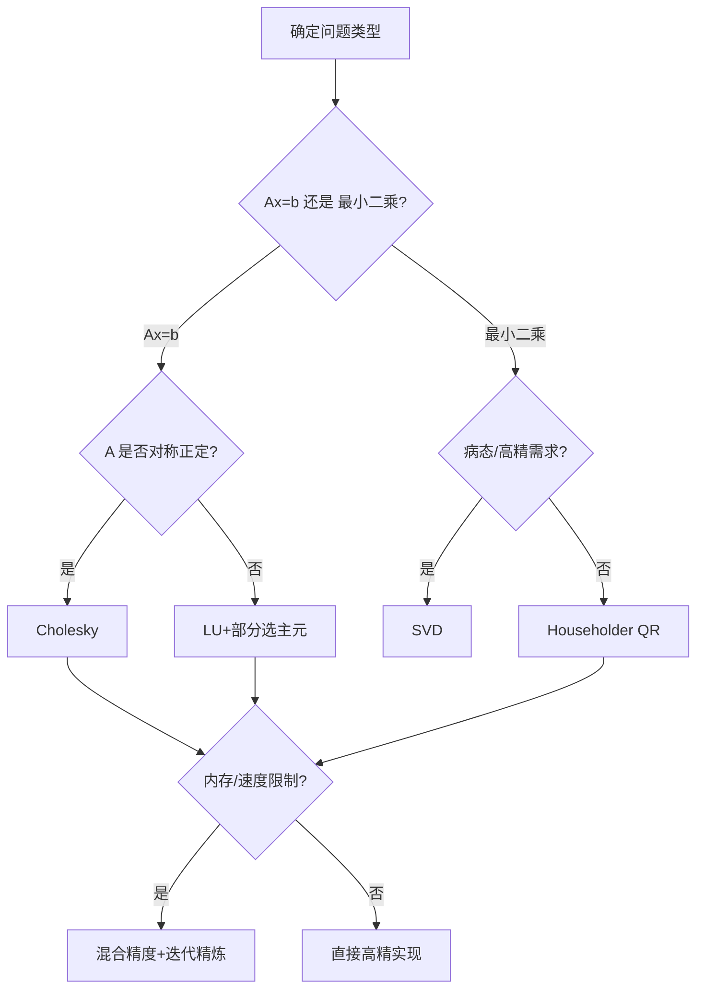

一句话版：矩阵世界的数值误差来自两头——**问题本身的“体质”（条件数）** 和 **算法/实现的“手法”（舍入与稳定性）**。工程上要做的，是**挑好问题表述**（比如用 QR/SVD 代替 $A^\top A$）、**用稳定算法**（正交变换、配对求和、迭代精炼）、**搭配合适精度**（混合精度中保留关键归约为 FP32）。

---

## 1. 误差模型：从标量到矩阵

### 1.1 浮点舍入模型

记机器精度（单位舍入）为 $u$（float32 约 $10^{-7}$）。一条浮点运算可近似为

$$
\operatorname{fl}(a \circ b) = (a \circ b)(1+\delta),\quad |\delta|\le u,\quad \circ\in\{+,-,\times,\div\}.
$$

将很多次运算“串起来”，误差会像 $\gamma_n$ 一样积累：

$$
\gamma_n := \frac{nu}{1-nu}\approx nu \quad(\text{当 } nu\ll 1).
$$

### 1.2 前向/后向误差与条件数

* **后向误差**：算法等价于在**输入**上加了一个小扰动再做精确计算。
* **前向误差**：得到的**解**和真解有多远。
* **条件数**刻画问题对输入扰动的敏感度：
  对线性方程 $Ax=b$，二范数条件数 $\kappa_2(A)=\|A\|_2\|A^{-1}\|_2=\sigma_{\max}/\sigma_{\min}$。

重要不等式（核心记忆）：

$$
\frac{\|x-\hat x\|}{\|x\|}\;\lesssim\; \kappa(A)\times \underbrace{\text{(相对后向误差)}}_{\text{看算法稳定性}}.
$$

> 读法：**问题体质 $\kappa$** × **算法“干净程度”** 决定最终误差。

---

## 2. 基本矩阵运算的误差界

### 2.1 点积与矩阵–向量乘

* 点积 $\hat s=\operatorname{fl}(x^\top y)$：
  $\;|\hat s - x^\top y|\le \gamma_n \sum_i |x_i y_i|$。
  **顺序影响大**：小数加到大数可能被吞。→ 用**配对求和**或 **Kahan** 可显著降低误差。

* 矩阵–向量 $\hat z=\operatorname{fl}(Ax)$：每个输出元素是一个点积：
  $\;\|\hat z - Ax\| \le \gamma_n \, \|\,|A|\, |x|\,\|$。

### 2.2 矩阵乘 $C=AB$

经典界（逐元素或范数）：

$$
\|\hat C - AB\| \;\le\; \gamma_k \, \|\,|A|\,\|\,\|\,|B|\,\| \quad (k=\text{内积长度}).
$$

工程含义：**分块/重排并不改变数学值，却改变累加路径** → 影响 $\gamma_k$。高性能库（BLAS/GEMM）通过**分块+FMA**降低误差与提升性能；混合精度时，**低精乘 × 高精累加**能稳很多。

---

## 3. 解线性方程与最小二乘的稳定性

### 3.1 正规方程的“放大器”

最小二乘 $\min_x \|Ax-b\|_2$。若用**正规方程** $(A^\top A)x=A^\top b$，条件数平方：

$$
\kappa(A^\top A)=\kappa(A)^2.
$$

这会把病态问题变得**更病态**（噪声和舍入都被放大），**不推荐**。

### 3.2 QR 分解（优选）

用正交 $Q$（不改变 2 范数）和上三角 $R$：
$A=QR,\; \Rightarrow\; Rx=Q^\top b$。
基于 **Householder 反射** 的 QR **后向稳定**：产生的 $\hat R,\hat Q$ 相当于计算了 $A+E$ 的 QR，且 $\|E\|\lesssim \gamma_n\|A\|$。

### 3.3 SVD（最稳，最贵）

$A=U\Sigma V^\top$，最小二乘解 $x=V\Sigma^+U^\top b$。SVD 直接拿到奇异值/秩信息，对病态问题**稳如老狗**，但成本最高。

### 3.4 LU 分解与主元选取

一般线性方程 $Ax=b$：

* **带部分选主元的 LU（GEPP）** 是工业常用。稳定性受**增长因子**影响，多数实际问题很好。
* **Cholesky**：当 $A\succ 0$（对称正定），Cholesky 是**后向稳定**且**速度快一倍**，优先用。

> 口诀：**SPD → Cholesky**；**最小二乘 → QR/SVD**；**一般方程 → LU（带主元）**；**别轻易用 $A^\top A$**。

---

## 4. 正交化的数值差异

* **经典 Gram–Schmidt（CGS）**：易受消去影响，正交性差。
* **改进版 MGS**：更稳一些，但仍可能退化（需要再正交）。
* **Householder QR**：最稳、代价略高，是推荐的**默认选择**。
* **MGS + 再正交**：在迭代 Krylov 子空间方法中常见的折中。

---

## 5. 特征值/奇异值的敏感性

### 5.1 对称（或正规）矩阵：稳

* **Weyl 定理**：对称 $A$ 加扰动 $E$，特征值偏差 $|\hat\lambda_i-\lambda_i|\le \|E\|_2$。
* **Davis–Kahan**：特征子空间与扰动大小/谱间隙成反比，谱间隙越大越稳。
* **奇异值**也满足 Weyl：$|\hat\sigma_i-\sigma_i|\le \|E\|_2$。

### 5.2 非正规（非正交可对角化）矩阵：可能很脆

非正常矩阵的特征向量不正交，小扰动会造成**巨大前向误差**（伪谱大）。工程上尽量**转为对称问题**（如用 $A^\top A$ 得到奇异值/右奇异向量，或考虑正规化/预条件），避免直接做一般非对称的特征分解除非必要。

---

## 6. 混合精度与迭代精炼（Iterative Refinement）

思路：**低精粗解 + 高精残差校正**。
步骤（解 $Ax=b$）：

1. 在低精（如 fp16/bf16）用 LU/Cholesky 得到初解 $\hat x$。
2. 用高精（fp32/fp64）计算残差 $r=b-A\hat x$。
3. 解校正方程 $A\Delta x=r$（仍可低精解，但残差高精计算），$\hat x\leftarrow \hat x+\Delta x$。
4. 重复至收敛。

收敛条件（直觉）：低精舍入 $u_{\text{low}}$ 与 $\kappa(A)$ 满足 $\kappa(A)\, u_{\text{low}} \ll 1$。
在大模型/科学计算中，这一招能把**低精算力**转化为**高精结果**（前提是问题不太病态）。

---

## 7. 选择指南（中文流程）



**说明**：根据矩阵结构优先选择**稳定分解**；资源紧张时上**混合精度 + 精炼**。

---

## 8. 与机器学习的连接

* **线性回归/岭回归**：不要手写 $x=(A^\top A)^{-1}A^\top b$；用 `lstsq`（QR/SVD）或正规化的 Cholesky（对 $A^\top A+\lambda I$）。
* **PCA/SVD**：用 SVD/随机 SVD，避免对协方差矩阵长链累加带来的误差；做**中心化**并可能**标准化**。
* **归一化/标准化**改善 $\kappa(A)$**，提升求解质量**；
* **混合精度训练**：矩阵乘可低精（bf16/fp16），**归约/归一化/损失**保 FP32；出现 NaN/Inf 先看**缩放/中心化**与**损失放大**。
* **图/核方法**：核矩阵常病态，优先 **加核对角 $\lambda I$** + **Cholesky**，或直接 **SVD**。

---

## 9. 代码骨架（安全替换件）

### 9.1 稳定最小二乘（PyTorch 思路）

```python
import torch

def stable_lstsq(A, b, ridge=0.0):
    # A: (n,d), b: (n,) 或 (n,k)
    A = A - A.mean(0, keepdim=True)  # 中心化有助于条件数
    if ridge > 0:
        # 解 (A^T A + λI)x = A^T b，用 Cholesky，更稳
        AtA = A.T @ A
        d = AtA.shape[0]
        AtA = AtA + ridge * torch.eye(d, device=A.device, dtype=A.dtype)
        L = torch.linalg.cholesky(AtA)
        rhs = A.T @ b
        y = torch.cholesky_solve(rhs, L)  # 解 (AtA)x=rhs
        return y
    else:
        # 直接最小二乘（QR/SVD 由框架选择）
        # torch>=2.0: linalg.lstsq 使用稳健分解
        return torch.linalg.lstsq(A, b).solution
```

### 9.2 混合精度矩阵乘 + FP32 归约（Numpy/伪）

```python
import numpy as np

def matmul_mixed(A16, B16):
    # A16,B16 为 float16/bfloat16，归约在 float32
    A32 = A16.astype(np.float32)
    B32 = B16.astype(np.float32)
    return (A32 @ B32).astype(A16.dtype)  # 或保留 FP32 输出做后续稳定运算
```

---

## 10. 工程清单（Checklist）

* [ ] **别**显式算逆，优先解线性系统/分解（`solve`/`lstsq`）。
* [ ] **别**用 $A^\top A$ 正规方程做最小二乘，优先 **QR/SVD**。
* [ ] SPD 问题优先 **Cholesky**；一般方程用 **LU+主元**。
* [ ] 长链求和/点积用 **配对求和/Kahan**；矩阵乘尽量走 **高质量 BLAS**。
* [ ] 做 **中心化/标准化/缩放** 降低条件数。
* [ ] 混合精度下：**低精乘 + 高精累加**，关键归约/正交/分解保 FP32。
* [ ] 观察 **条件数**（SVD/`matrix_rank`/最小奇异值）并在病态时加 **正则**。
* [ ] 用 **迭代精炼** 把低精的速度“换”成高精的解。
* [ ] 写**边界单测**：全零/共线列/极小奇异值/尺度差 10^k。

---

## 11. 练习（含提示）

1. **为何正规方程会“变差”**：证明 $\kappa_2(A^\top A)=\kappa_2(A)^2$。
2. **Householder 稳定性**：简述为何正交变换能保持 2 范数，从而提升后向稳定。
3. **点积实验**：对 $n=10^6$ 个随机数，比较顺序求和/配对求和/Kahan 的误差（用高精作为真值）。
4. **最小二乘对比**：在高条件数数据上比较正规方程、MGS、Householder QR、SVD 的解残差。
5. **迭代精炼**：在 bf16（或模拟低精）上做 LU 求解，再用 fp32 残差修正，观察收敛条件与速度。
6. **PCA 稳定性**：模拟中心化与未中心化对协方差矩阵的影响，并比较 SVD 得到的主成分稳定性。

---

## 12. 小结

1. **误差两因素**：问题的 **$\kappa$**（体质） × 算法的 **后向稳定性**（手法）。
2. **选择稳分解**：最小二乘 **QR/SVD**；SPD **Cholesky**；一般方程 **LU+主元**；避免 $A^\top A$。
3. **混合精度也能稳**：**低精乘 + 高精累加 + 迭代精炼**，再配合**缩放/中心化/正则**，就能“又快又准”。
