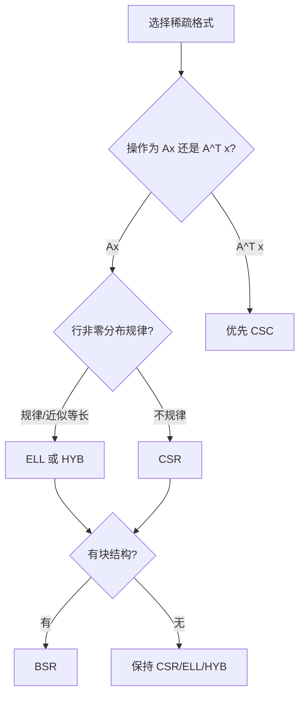
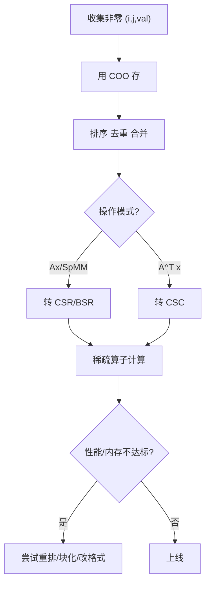

一句话版：**稀疏矩阵**就是“绝大多数是 0 的矩阵”。别傻乎乎按 dense 存起来、按 dense 算——用**压缩存储**（CSR/CSC/COO/BSR/ELL…）和**稀疏算子**（SpMV、SpMM、稀疏 Cholesky/CG），既省内存又提速。在大模型里，**注意力稀疏**、**剪枝稀疏**、**图结构稀疏**都能受益。

---

## 1. 稀疏的直觉：十万人群中认识你的人

把 $n\times n$ 的矩阵想成“人与人是否相识”的表。现实里，每个人只认识**很少**的人：这就是**稀疏**。

* **密度**：$\text{density}=\frac{\text{nnz}}{n^2}$，**稀疏度**：$1-\text{density}$。
* 当 $\text{nnz}\ll n^2$ 时，用稀疏存储能把**存储**从 $\mathcal{O}(n^2)$ 降到 $\mathcal{O}(\text{nnz})$，把**计算**从 $\mathcal{O}(n^2)$ 降到 $\mathcal{O}(\text{nnz})$。

---

## 2. 三个最常用存储格式（COO / CSR / CSC）

### 2.1 COO（Coordinate，坐标表）

* 结构：三数组 `(row[i], col[i], data[i])`，长度均为 `nnz`。
* 优点：**构建方便**（追加一条非零就是 push\_back）。
* 缺点：乘法时**访问分散**、需要排序/归并；空间：`nnz * (val + 2*index)`。

### 2.2 CSR（Compressed Sparse Row，按行压缩）

* 结构：

  * `data[nnz]`：非零按**行优先**存；
  * `indices[nnz]`：对应列下标；
  * `indptr[n_row+1]`：行起止位置（最后一个等于 `nnz`）。
* 优点：**行访问顺序友好**，SpMV $y=Ax$ 极速；空间：`nnz*(val+col_idx) + (n_row+1)*ptr`。
* 缺点：按列操作较慢（适合 $A x$，不适合 $A^\top x$）。

### 2.3 CSC（Compressed Sparse Column，按列压缩）

* 与 CSR 对偶，适合做 $A^\top x$ 或解线性系统里的列操作。

#### 2.4 一个 CSR 小例子（手算）

$A=\begin{bmatrix}
0 & 5 & 0 & 0\\
3 & 0 & 0 & 7\\
0 & 0 & 0 & 0\\
0 & 2 & 1 & 0
\end{bmatrix}$

* `data = [5, 3, 7, 2, 1]`
* `indices = [1, 0, 3, 1, 2]`      （同顺序的列号）
* `indptr = [0, 1, 3, 3, 5]`        （第 0 行从 0 到 1；第 1 行从 1 到 3；…）

**SpMV 伪码**（CSR）：

```text
for i in 0..n_row-1:
    y[i] = 0
    for k in indptr[i]..indptr[i+1]-1:
        j = indices[k]
        y[i] += data[k] * x[j]
```

复杂度 $\mathcal{O}(\text{nnz})$。

---

## 3. 结构化格式：为“规律稀疏”而生

### 3.1 BSR（Block CSR）

* 把矩阵切成 `b×b` 小块：只存**非零块**（每块 dense）。
* 优点：**更好向量化/缓存命中**；适合**块状稀疏**（如 CNN、N\:M 剪枝聚成块）。
* 成本：块内 dense 计算可能浪费一些，但总体更快。

### 3.2 ELL / ELLPACK

* 每行非零**补到相同行宽**，存两张 `n_row × k_max` 的表（值、列）。
* GPU 友好（访存规则整齐）；但**行非零数差异大时会浪费**。

### 3.3 DIA（对角存储）

* 适合**对角带状**矩阵（如 PDE 离散）；空间 $\mathcal{O}(\text{带宽} \times n)$，极省。

### 3.4 HYB（ELL + COO）

* 多数非零用 ELL 存，多出的尾巴用 COO；是 GPU 稀疏库常用的折中。

---

## 4. 何时用哪种格式？



**说明**：乘向量 $Ax$ → CSR；乘转置 $A^\top x$ → CSC；GPU 先想 ELL/HYB；块状就上 BSR。

---

## 5. 内存账本：到底省了多少？

设索引用 `int32`（4B），值用 `float32`（4B）。

* **Dense**：$n\times m \times 4$ 字节。
* **COO**：$\text{nnz}\times(4+4+4)=12\,\text{nnz}$。
* **CSR**：$\text{nnz}\times(4+4) + (n+1)\times 4 = 8\,\text{nnz} + 4(n+1)$。

例：$n=m=10^5$，密度 $10^{-4}$ → $\text{nnz}=10^6$。

* Dense：$10^{10}\times 4 \approx 40$ GB
* COO：$12 \times 10^6 \approx 12$ MB
* CSR：$8 \times 10^6 + 4\times(10^5+1) \approx 8.4$ MB
  **从 40GB 降到个位数 MB**，这就是稀疏的威力。

---

## 6. 计算复杂度与并行

* **SpMV（稀疏×向量）**：$\mathcal{O}(\text{nnz})$。瓶颈常是**内存带宽**，而不是 FLOPs。
* **SpMM（稀疏×稠密）**：$A_{n\times n} \times B_{n\times k}$，复杂度 $\mathcal{O}(\text{nnz}\cdot k)$。用 BSR/分块可提升缓存命中、访存合并。
* **排序与重排**：按行（或块）**排序索引**能显著提升 GPU 合并访存；行重排（如 Cuthill–McKee）可改善带宽、降低迭代法的迭代数。
* **位宽选择**：规模 < $2^{31}$ 用 `int32` 索引；超大规模或多块拼图时再考虑 `int64`（代价翻倍）。

---

## 7. 稀疏与数值算法：解线性系统、优化与图

* **迭代法**：CG（对称正定）、GMRES/BiCGStab（非对称）只需 SpMV；\*\*预条件（ILU/IC、代数多重网格 AMG）\*\*决定收敛快慢。
* **稀疏 Cholesky/LU**：消元会产生**填充（fill-in）**，选择好的**消元顺序**（AMD/METIS）能大幅减少填充与内存。
* **图算法**：稀疏矩阵 ↔ 图的邻接矩阵。GNN 就是在做**稀疏邻接×特征**的 SpMM。

---

## 8. 机器学习中的稀疏场景

### 8.1 词袋/ID 类别特征

* 高维 one-hot → **稀疏输入**；`A` 稀疏，`W` 稠密：做 $Y = A W$（SpMM）。
* 推荐系统、CTR 里常见：**稀疏 ID** + **嵌入表**。

### 8.2 注意力稀疏（大模型）

* \*\*局部窗口、滑动带状、块稀疏（block-sparse）\*\*注意力：只在邻域或选定块里算 $QK^\top$。
* **Top-k / N\:M 稀疏**：结构化稀疏更易加速（硬件友好），非结构化稀疏虽然参数少但**可能算不快**（访存散）。

### 8.3 模型剪枝与稀疏训练

* 非结构化剪枝（阈值裁掉小权重）→ 稀疏度高但吞吐不一定涨；
* **结构化剪枝**（按通道/块/N\:M）→ 硬件/库（如 cuSPARSE、CUTLASS block-sparse）更容易吃到加速。
* 训练期的**稀疏约束/正则**（$\ell_1$、组稀疏、L0 近似）可诱导稀疏。

---

## 9. 稀疏构建与常见坑

* **构建格式用 DOK/COO**，计算前**一次性转 CSR/BSR**。边构建边 CSR 会很慢。
* **索引去重 + 合并**：COO 允许重复（同一坐标插入多次），转 CSR 之前要**排序+合并**；否则数值错误。
* **行非零极不均衡**：ELL/HYB 会浪费；CSR 在 GPU 上负载不均。可**重排**或**分块分桶**。
* **动态稀疏**：每步剪枝/生长都会触碰索引结构，**维护成本高**；工程中常“**间歇刷新**”或每 N 步重构。
* **自动微分支持**：框架对稀疏梯度支持有限（尤其二阶），使用前查好算子列表；必要时退化为稠密计算关键梯度。

---

## 10. 代码骨架（SciPy / PyTorch 思路）

### 10.1 SciPy：COO → CSR → SpMV/SpMM

```python
import numpy as np
import scipy.sparse as sp

# 构建 COO
rows = np.array([0,1,1,3,3])
cols = np.array([1,0,3,1,2])
vals = np.array([5.,3.,7.,2.,1.])
A_coo = sp.coo_matrix((vals, (rows, cols)), shape=(4,4))

# 去重+转 CSR
A = A_coo.tocsr()   # 自动排序+合并相同坐标

# SpMV
x = np.array([1.,2.,3.,4.])
y = A @ x

# SpMM（稀疏×稠密）
B = np.random.randn(4, 8)
Y = A @ B
```

### 10.2 PyTorch（稀疏 × 稠密）

```python
import torch
# 稀疏 COO 张量
indices = torch.tensor([[0,1,1,3,3],
                        [1,0,3,1,2]], dtype=torch.long)  # 2×nnz
values  = torch.tensor([5.,3.,7.,2.,1.], dtype=torch.float32)
A = torch.sparse_coo_tensor(indices, values, size=(4,4)).coalesce()
X = torch.randn(4, 8)

# 稀疏×稠密 SpMM
Y = torch.sparse.mm(A, X)  # (4,8)

# 稀疏×向量
x = torch.randn(4, 1)
y = torch.sparse.mm(A, x)
```

> 小贴士：训练时若梯度需要稀疏，优先使用**库支持的稀疏算子**；否则在前向用稀疏、反向落回稠密。

---

## 11. 一个“从构建到计算”的流程



**说明**：构建阶段用 COO；计算阶段换成最合适的**执行格式**。

---

## 12. 工程 Checklist

* [ ] 数据构建用 **COO/DOK**，计算前统一转 **CSR/BSR/ELL/HYB**
* [ ] **排序+去重**，避免重复索引
* [ ] GPU 上保证**索引按行/块有序**，提升合并访存
* [ ] 选择**结构化稀疏**（块/N\:M）以获得真正加速
* [ ] 监控 **nnz 分布**（是否“长尾行”），必要时 **重排**
* [ ] 迭代法配 **预条件**；SPD 问题优先 Cholesky/IC
* [ ] 大规模时优先 **int32 索引**；超过阈值再切 int64
* [ ] 注意**自动微分支持范围**；必要时在关键处转稠密
* [ ] 写**边界单测**：空行、重复坐标、极端稀疏/极端密

---

## 13. 练习（含提示）

1. **CSR 手工转换**：给出一个 $5\times 5$ 小矩阵，自己写出 `data / indices / indptr`。
2. **SpMV 性能测试**：固定 $\text{nnz}$ 与不同稀疏分布（均匀 vs 局部成团），比较 SpMV 吞吐。
3. **格式选择**：在 GPU 上比较 CSR、ELL、HYB 的 SpMV，用随机行宽与固定行宽数据集。
4. **结构化稀疏**：实现 `b×b` BSR 的 SpMM（伪代码/实际代码均可），对比 CSR 的速度。
5. **预条件效果**：在一个 2D Poisson 稀疏系统上，比较 CG 与 IC 预条件 CG 的迭代次数与总时间。
6. **注意力稀疏**：实现局部窗口注意力的稀疏掩码，统计 nnz 与实际加速比，讨论瓶颈（访存 vs 计算）。

---

## 14. 小结

1. **选对格式**：构建用 COO，计算用 CSR/CSC；有规律就用 BSR/ELL/HYB。
2. **实战关注访存**：SpMV/SpMM 常受**内存带宽**限制；排序、块化、重排带来真实加速。
3. **大模型也吃稀疏**：结构化稀疏（块/N\:M）、局部注意力、图邻接，都能把**内存**与**时间**从 $n^2$ 拉回到 $\text{nnz}$ 量级。
