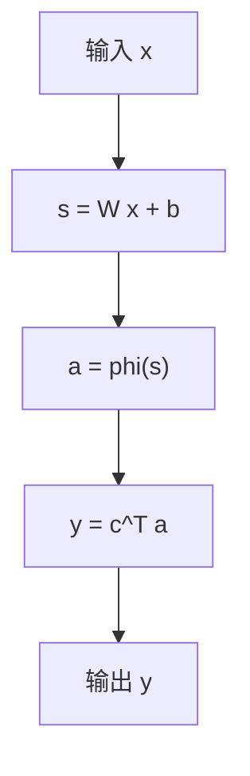
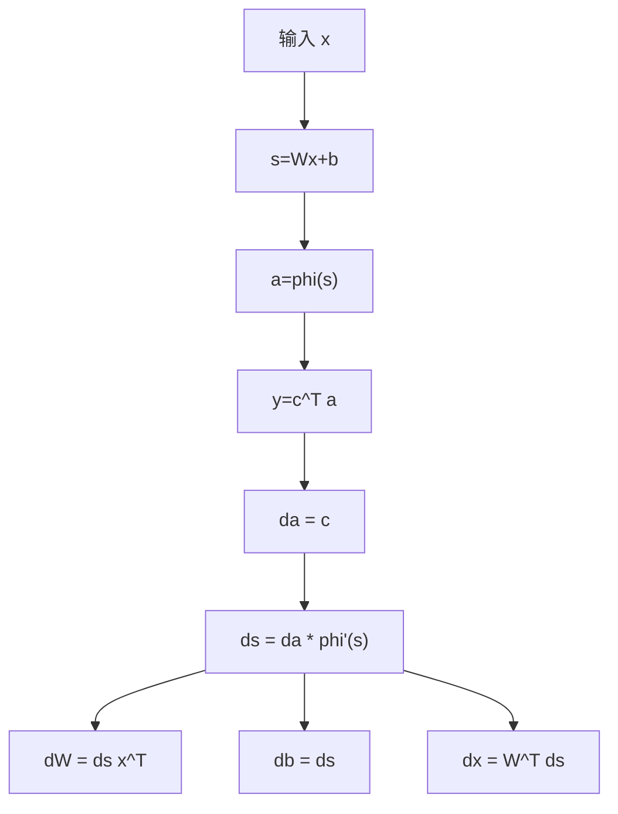
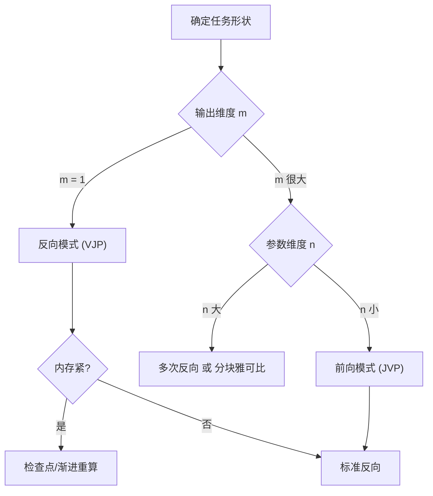

一句话版：\*\*自动微分（AD）\*\*就是让“**链式法则**”变成代码层面的“**可复用算子**”。
* **前向模式**计算 **JVP（Jacobian–Vector Product）**：给参数方向 $v$，算 $J\cdot v$。
* **反向模式**计算 **VJP（Vector–Jacobian Product）**：给输出权重 $u$，算 $u^\top\! \cdot J$（DL 里就是梯度）。
函数 $f:\mathbb{R}^n\!\to\!\mathbb{R}^m$ 时：**n 小 m 大 → 前向**；**n 大 m 小（特别 m=1）→ 反向**。

---

## 1. 自动微分不是数值差分，也不是符号求导

* **数值差分**（finite difference）：
  $\frac{\partial f}{\partial x_i}\approx \frac{f(x+h e_i)-f(x)}{h}$。实现容易，但**不精确（截断+舍入）**、**要算多次前向**。
* **符号求导**：把式子当字符串推导，可能**表达式爆炸**，对复杂控制流/黑盒函数不友好。
* **自动微分（AD）**：沿计算图对**基本算子**（加乘、sin、exp、matmul…）附带“局部求导规则”，再用**链式法则**把局部导数组合起来。**与被微函数同精度**，可支持**动态控制流**。

---

## 2. 计算图与链式法则

任何可微程序都能拆成“结点=操作，边=数据”的**有向无环图（DAG）**。
例如：$x\in\mathbb{R}^d,\ s=W x+b,\ a=\phi(s),\ y=c^\top a$。



* **前向传播**：自左向右，计算各中间变量的值。
* **反向传播（反向模式 AD）**：自右向左，沿边传播**敏感度**（也叫**伴随/adjoint**）：
  $\bar{s}=\frac{\partial y}{\partial s}$，$\bar{W}=\frac{\partial y}{\partial W}$ 等。

---

## 3. 前向模式：JVP（Jacobian 向量积）

### 3.1 思想：双数（dual numbers）

把每个数换成 $x + \dot{x}\,\varepsilon$（$\varepsilon^2=0$），$\dot{x}$ 就是“沿方向 $v$”的导数分量。

* 若输入种子 $\dot{x}=v$，则每个算子都有对偶运算规则（比如 $\sin(x+\dot{x}\varepsilon)=\sin x + (\cos x\cdot\dot{x})\varepsilon$）。
* 一次前向就得到 $f(x)$ 和 $Jv$。

### 3.2 例子：二元函数的 JVP

令 $f(x,y)=x\,\exp(y)+\sin x$，在方向 $v=(v_x,v_y)$ 上的方向导数：

$$
Jv=\frac{\partial f}{\partial x}v_x+\frac{\partial f}{\partial y}v_y
=(e^y+\cos x)\,v_x + (x e^y)\,v_y.
$$

前向模式只需 **一次前向**就得到这个值。

### 3.3 适用场景

* $f:\mathbb{R}^n\to\mathbb{R}^m$ 且 **n 不大 m 较大**（比如灵敏度分析、多输出模型的雅可比列）。
* 在优化里常用 **JVP** 做**海森–向量积**（HVP）近似：$H v = \nabla(\nabla f \cdot v)$。

---

## 4. 反向模式：VJP（向量–Jacobian 积）

### 4.1 思想：Wengert 表/伴随变量

把每个中间量 $z_k$ 的“对最终输出的影响”记作 $\bar{z}_k=\partial y/\partial z_k$。反向时用局部法则把“影响”乘上去。

### 4.2 回到上面的网络：一层 MLP 的反传

$$
\begin{aligned}
&y=c^\top a,\ a=\phi(s),\ s=Wx+b\\
&\bar{a}=\frac{\partial y}{\partial a}=c,\quad
\bar{s}=\bar{a}\odot \phi'(s),\\
&\bar{W}=\bar{s}\,x^\top,\quad
\bar{b}=\bar{s},\quad
\bar{x}=W^\top \bar{s}.
\end{aligned}
$$



*说明：上图在前向图上覆盖了反向的**敏感度传递**。*

### 4.3 适用场景

* $f:\mathbb{R}^n\to\mathbb{R}$（标量输出），**n 很大**：一次反向就出整条梯度（整行 Jacobian）。
* 深度学习训练的“**反向传播**”就是反向模式 AD。

---

## 5. 前向 vs 反向：一张对照表

| 维度   | 前向模式（JVP）        | 反向模式（VJP）                |
| ---- | ---------------- | ------------------------ |
| 计算对象 | $Jv$（雅可比的列组合）    | $u^\top J$（雅可比的行组合）      |
| 复杂度  | 约等于 1 次前向 / 种子向量 | 约等于 1 次前向 + 1 次反向 / 种子向量 |
| 适合形状 | $n$ 小、$m$ 大      | $n$ 大、$m$ 小（特别 $m=1$）    |
| 存储   | 低（不需保存整条中间值）     | 高（需保存反传所需中间量）            |
| 典型用途 | 灵敏度、多输出雅可比、HVP   | 神经网络训练、标量损失梯度            |

**经验法则**：

* 训练：**反向**。
* 算 HVP/二阶方向导：前向–反向**组合**（Pearlmutter 技巧）。
* 要完整雅可比：根据 $n,m$ 决定用 **多次前向**或**多次反向**。

---

## 6. 小推导：JVP 与 VJP 的代数形态

设 $f=g\circ h$，雅可比 $J_f = J_g J_h$。

* **JVP**：$(J_f v) = J_g (J_h v)$ —— **前向**等价于把 $v$ 逐层推进。
* **VJP**：$(u^\top J_f) = (u^\top J_g) J_h$ —— **反向**等价于把 $u$ 逐层拉回。

这就是为什么 AD 只需给每个基本算子注册两类规则：**jvp 规则**和 **vjp 规则**。

---

## 7. 代码视角：最小可用片段

> 以下片段演示“从 logits 直接算交叉熵”的稳定实现，并展示 **autograd** 的用法与 **JVP/VJP** 的调用思路。

### 7.1 PyTorch：梯度（VJP）与 HVP（VJP of JVP）

```python
import torch

def nll_from_logits(logits, target):
    # 稳定的 logsoftmax
    logp = logits - logits.logsumexp(dim=-1, keepdim=True)
    return -logp.gather(-1, target.unsqueeze(-1)).mean()

d = 128
W = torch.randn(d, d, requires_grad=True)
x = torch.randn(32, d)
y = torch.randint(0, d, (32,))

# 前向 + 反向（VJP，求 dLoss/dW）
logits = x @ W
loss = nll_from_logits(logits, y)
loss.backward()
grad_W = W.grad

# HVP: 给定向量 v，计算 (H @ v)
v = torch.randn_like(W)
# 先清理梯度
W.grad = None
loss = nll_from_logits(x @ W, y)
g, = torch.autograd.grad(loss, W, create_graph=True)
Hv, = torch.autograd.grad(g, W, grad_outputs=v)  # Pearlmutter trick
```

### 7.2 JAX（更“显式”的 JVP/VJP）

```python
import jax, jax.numpy as jnp

def f(W, x, y):
    logits = x @ W
    logp = logits - jax.nn.logsumexp(logits, axis=-1, keepdims=True)
    return -jnp.mean(logp[jnp.arange(x.shape[0]), y])

W = jnp.ones((128,128))
x = jnp.ones((32,128))
y = jnp.zeros((32,), dtype=int)

# 梯度（反向）
grad_f = jax.grad(f)
g = grad_f(W, x, y)

# JVP: 给定 v，算 Jv
v = jnp.ones_like(W)
_, jvp = jax.jvp(lambda W: f(W, x, y), (W,), (v,))

# VJP: 给定标量权重 u（这里 u=1），算 u^T J
yval, vjp_fun = jax.vjp(lambda W: f(W, x, y), W)
(vjp_res,) = vjp_fun(1.0)
```

---

## 8. 实战要点：数值稳定、内存与控制流

### 8.1 数值稳定

* 用 **`logsumexp`、`log1p`、`expm1`** 等稳定变体（见 6-1）。
* BCE/SoftmaxCE 用 **with logits** 版本；避免显式 `sigmoid/softmax` 再取对数。
* 避免灾难性消去（如 $\sqrt{1+x}-1$）→ 用等价稳定式。

### 8.2 内存管理

* **反向模式**要**保存中间激活**；深网/大 batch 时可：

  * **检查点**（activation checkpointing / rematerialization）：以额外前向为代价节省显存；
  * **梯度累积**（micro-batch）；
  * 混合精度时**关键归约保 FP32**。

### 8.3 控制流与自定义梯度

* 动态分支/循环：大多数 AD 框架已支持（追踪或算子重载）。
* 有些算子不可微或不想按默认规则反传（如 `stop_gradient`、带采样的离散操作）：

  * **重参数化**（reparameterization trick）或
  * **直通估计器（STE）** / **custom\_vjp** 定义自定义梯度（需小心偏差）。

### 8.4 非光滑点

* ReLU 在 0 处不可导，框架通常返回**次梯度**或 0。只要损失是**几乎处处可导**，AD 仍可用。

---

## 9. 高阶导与二阶方法

* **HVP（海森向量积）**：无需显式 Hessian，成本≈一次反向；用于牛顿-CG、K-FAC、曲率估计。
* **二阶导**：在支持 higher-order 的框架里，**再套一层 grad** 即可，但要注意**内存/数值**；对 RNN/长序列建议首选 HVP。

---

## 10. 选择流程（中文）



---

## 11. 练习（含提示）

1. **手推 + AD 对拍**：对 $f(x,y)=\log(1+\exp(xy))$，手算 $\nabla f$，并用框架比对。
2. **JVP 应用**：实现函数 $f(\theta)=\|g(\theta)\|_2^2$ 的 HVP（用 Pearlmutter），嵌到一次牛顿-CG 迭代中。
3. **自定义梯度**：为 `clamp(x, 0, 1)` 写一个 `custom_vjp`，前向原样，反向在区间内传 1，边界处传 0。
4. **检查点实验**：在一个 50 层 MLP 上比较无检查点 vs 每 5 层检查点的显存占用与时间。
5. **数值稳定**：分别用“显式 softmax+log”和“logsumexp trick”计算交叉熵，测试在大/小 logits 下的差异。

---

## 12. 小结（带走三句话）

1. **AD 的核心就是链式法则的工程化**：把每个算子的局部导数“注册”起来，再按图组合。
2. **前向=JVP，反向=VJP**：根据 $n,m$ 选择；深度学习训练几乎总用**反向**。
3. 想又快又稳：**稳定公式**（logsumexp…）+ **内存技巧**（检查点/混合精度）+ **二阶近似**（HVP）就是黄金三件套。
