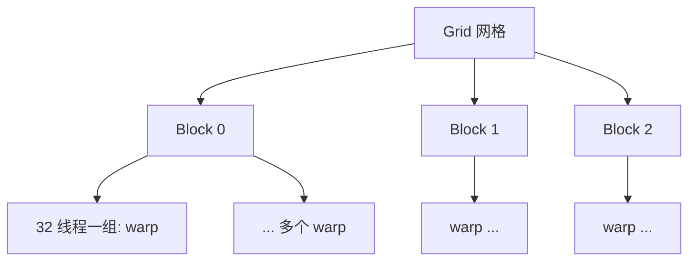
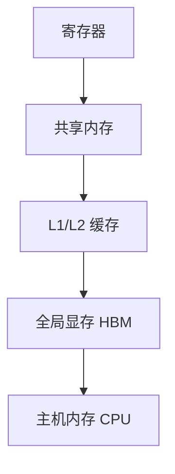
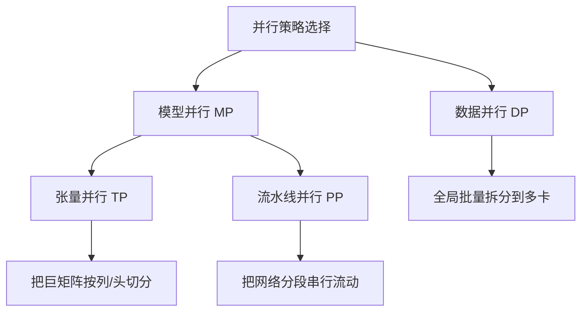
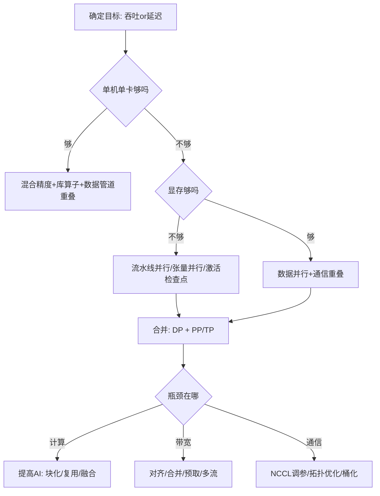

一句话版：**GPU/TPU 擅长“很多小活同时干”**。把你的计算切成成千上万份微任务（线程/PE），让数据排好队（对齐、块化、复用在片上缓存），再用**批量化 + 混合精度 + 通信并行**把吞吐拉满。工程落地关键在三个字：**布局**、**带宽**、**重叠**。

---

## 1. 两类“超并行”引擎：GPU vs TPU

* **GPU（SIMT）**：成百上千个**SM/计算单元**（NVIDIA: SM），每个 SM 同时调度\*\*多条 warp（32 线程）\*\*做同一条指令（单指令多线程，SIMT）。适合通用数值计算：卷积、矩阵乘、归约等。
* **TPU（Systolic Array）**：大规模**脉动阵列**（矩阵乘单元），数据以“流”的方式在阵列中**按节拍传输与累积**。配合 XLA 编译器，把大算子编译成**块化的矩阵乘**，对深度学习友好。

一句话对比：**GPU = 灵活多面手**；**TPU = 矩阵乘“重型机械”**。在大模型上二者都会用到**混合精度 + 批处理 + 并行通信**。

---

## 2. 硬件与程序模型的关键概念

### 2.1 GPU 的线程层级（以 CUDA 为例）

* **线程（thread）**：最小执行单位。
* **线程块（block）**：同一 SM 内共享片上缓存（shared memory），可做块内同步。
* **网格（grid）**：一次 kernel 启动的所有线程块集合。



**说明**：kernel 启动后，每个 block 会被分配到某个 SM，SM 内的 warp 以“换人不换岗”的方式隐藏存储延迟。

### 2.2 存储层次（从快到慢）

**寄存器**（每线程） → **共享内存/片上 SRAM**（每块） → **L1/L2** → **全局显存（HBM）** → **主机内存**。
基本原则：**热点数据尽可能待在更近的层次**；访存要**对齐**、**合并（coalesced）**，避免乱序小步走。



**说明**：箭头代表从近到远的访问路径；离计算单元越远，带宽/延时越差。

### 2.3 TPU 的脉动阵列直觉

* 算 $C = A \times B$ 时，A 的行和 B 的列数据按节拍“流”进阵列；每个 PE（processing element）只做**乘加累积**，并把中间结果沿阵列传递。
* 大矩阵用\*\*分块（tiling）\*\*适配阵列尺寸与 on-chip buffer，避免频繁访问 HBM。

---

## 3. 性能刻画：Roofline 模型与算术强度

**Roofline 核心公式**：

$$
\text{可达性能} \le \min\big(\text{峰值算力},\ \text{算术强度}\times\text{内存带宽}\big).
$$

* **算术强度（AI）**：每读写 1 字节能做多少 FLOPs。高 AI → 更可能**算力受限**；低 AI → 更可能**带宽受限**。
* 要提速的两条路：

  1. 提高 **AI**（复用数据、块化到片上缓存/共享内存、算子融合）；
  2. 提高 **有效带宽**（对齐访问、合并加载、异步预取、并发流）。

**经验**：矩阵乘/卷积 AI 高，通常算力受限；逐元素操作/小张量归约 AI 低，多是带宽受限。

---

## 4. 并行维度：数据 / 模型 / 张量 / 流水线



**简述**：

* **数据并行（DP）**：把 batch 切成若干份，**每卡**算一份，参数梯度用 **AllReduce** 聚合。最简单、扩展性强。
* **张量并行（TP）**：把**单个大算子**的矩阵沿列/行/头拆分（如注意力头并行），每步需要额外通信。
* **流水线并行（PP）**：把网络沿层切成多段，micro-batch 在流水线上移动，需平衡**气泡**（bubble）。
* **混合并行**：DP + TP + PP 组合，用于万亿级参数。

---

## 5. GPU 上的“把带宽喂满”

### 5.1 Kernel 级别技巧

* **网格-跨步循环**（grid-stride loop）：让线程空间覆盖任意大小数据。
* **合并访问（coalescing）**：相邻线程访问相邻地址；对齐到 128B/64B 边界。
* **共享内存**：块内共享，做**平铺（tiling）**减少全局访存；注意**bank 冲突**（行列变换/交错）。
* **分支发散**：同一 warp 内尽量避免 if-else 大量分歧；必要时用掩码/算术替代。
* **占用率（occupancy）**：注册数、共享内存、块大小一起决定可同时驻留的 warp 数；合理选择 blockDim，避免过度用寄存器。

### 5.2 计算与数据搬运重叠（overlap）

* **多流（streams）**：用独立 CUDA stream 把 **H2D/D2H** 与 **kernel** 重叠。
* **页锁定内存（pinned/page-locked）**：更快的 H2D/D2H。
* **通信重叠计算**：AllReduce 与下一 mini-batch 前向同时进行。

### 5.3 混合精度与张量核心

* **FP16/bfloat16** + **FP32 累加**：吞吐倍增且更稳（见 6-1）。
* **张量核心/WMMA**（GPU）或 **脉动阵列**（TPU）：把 GEMM/Conv 变成“原生加速”路径。
* 使用库：**cuBLAS / cuDNN / CUTLASS / XLA** 等，避免手写大算子。

---

## 6. 通信：AllReduce 的两种“形态”

* **Ring AllReduce**：带宽利用高，延迟 $\mathcal{O}(N)$；适合大消息。
* **树形 AllReduce**：延迟 $\mathcal{O}(\log N)$，适合小消息或跨机。
* **拓扑**：**NVLink/NVSwitch**（同机高速）、**InfiniBand/RDMA**（跨机）；库层面常用 **NCCL / Gloo / RCCL**。

---

## 7. TPU 的要点：把一切“编成”矩阵乘

* **XLA 编译**：把高层算子融合/重写为**更大、更规整**的矩阵乘与元素算子；静态形状更友好。
* **脉动阵列尺寸**：对齐/填充（padding/tiling）到阵列维度，避免浪费 PE。
* **输入布局与 sharding**：SPMD 切分张量，让跨芯片通信可预测、可重叠。
* **高效注意力**：把 QKᵀ 和 softmax 拆/块化，让子块尽量在 on-chip 里完成（FlashAttention 思路也适用于 GPU）。

---

## 8. PyTorch 实战骨架（可直接改造）

### 8.1 训练主循环：混合精度 + 数据搬运重叠

```python
import torch, torch.nn as nn, torch.distributed as dist

model = MyNet().to("cuda")
scaler = torch.cuda.amp.GradScaler()
opt = torch.optim.AdamW(model.parameters(), lr=lr)
torch.backends.cudnn.benchmark = True  # 动态选择最快算法

# DataLoader: pin_memory + non_blocking 提升 H2D
loader = torch.utils.data.DataLoader(ds, batch_size=bs, shuffle=True,
                                     num_workers=8, pin_memory=True, prefetch_factor=4)

stream_h2d = torch.cuda.Stream()
stream_comp = torch.cuda.default_stream()

def to_cuda_async(batch):
    with torch.cuda.stream(stream_h2d):
        return {k: v.cuda(non_blocking=True) for k,v in batch.items()}

prefetch = None
for step, batch in enumerate(loader):
    # 预取下一批，H2D 与当前计算重叠
    nxt = to_cuda_async(next(loader)) if step+1 < len(loader) else None
    torch.cuda.current_stream().wait_stream(stream_h2d)

    batch = {k: v.cuda(non_blocking=True) for k, v in batch.items()} if prefetch is None else prefetch
    prefetch = nxt

    opt.zero_grad(set_to_none=True)
    with torch.cuda.amp.autocast():
        logits = model(batch["x"])
        loss = F.cross_entropy(logits, batch["y"])

    scaler.scale(loss).backward()
    # 可选：梯度裁剪，减少溢出/抖动
    scaler.unscale_(opt)
    torch.nn.utils.clip_grad_norm_(model.parameters(), 1.0)

    scaler.step(opt)
    scaler.update()
```

### 8.2 分布式（数据并行 + 通信重叠要点）

```python
# 假定已调用 dist.init_process_group(backend="nccl")
model = torch.nn.parallel.DistributedDataParallel(
    model, device_ids=[local_rank], broadcast_buffers=False, gradient_as_bucket_view=True
)
# gradient_as_bucket_view True 时，NCCL 可以边计算边 AllReduce 梯度桶（通信重叠）
```

---

## 9. 常见“踩坑地图”

| 问题      | 现象                  | 核心原因          | 快速对策                                   |
| ------- | ------------------- | ------------- | -------------------------------------- |
| 带宽受限    | GPU 利用低，算子时间≈内存拷贝时间 | 访存不对齐、复用差     | 批量化、块化到 shared/L2、合并加载、算子融合            |
| 分支发散    | 同一 kernel 内吞吐低      | 同一 warp 走不同分支 | 用掩码算子/重排数据，或拆 kernel                   |
| bank 冲突 | 共享内存吞吐低             | 多线程同访一个 bank  | 调整 stride/交错布局                         |
| 训练不稳    | loss NaN/Inf        | 混合精度下下溢/上溢    | AMP + 动态损失放大 + 梯度裁剪 + 稳定公式             |
| 通信瓶颈    | 多卡扩展性差              | AllReduce 阻塞  | 增大 batch、梯度桶化、通信重叠、优化拓扑                |
| 小算子过多   | kernel launch 开销占比高 | 算子碎片          | **算子融合**、CUDA Graphs、编译器（XLA/Inductor） |

---

## 10. 选择流程



**说明**：先看单卡，然后逐步叠加 DP/TP/PP，并针对主瓶颈做定向优化。

---

## 11. 工程 Checklist（可对照执行）

* [ ] **混合精度**启用：AMP/bfloat16 + FP32 累加；关键归约保持 FP32
* [ ] **库优先**：cuBLAS/cuDNN/CUTLASS/FlashAttention/XLA
* [ ] **数据管道**：`pin_memory=True`、`num_workers` 合理、`prefetch_factor`、H2D 与计算重叠
* [ ] **对齐与融合**：张量内存对齐、合并连续操作、减少小 kernel
* [ ] **块化复用**：shared/L2 中平铺，避免重复从 HBM 取数
* [ ] **分布式**：DP 起步；开启梯度桶化+通信重叠；必要时加 TP/PP
* [ ] **拓扑感知**：NVLink/NVSwitch 分组一致；跨机用 IB + NCCL
* [ ] **调参**：blockDim 合理、occupancy 不要极端；避免过多寄存器
* [ ] **监控与剖析**：Nsight/Profiler，定位算力/带宽/通信瓶颈
* [ ] **稳定性**：梯度裁剪、稳定公式（logsumexp 等）、loss scaling

---

## 12. 练习（含提示）

1. **Roofline 估算**：已知 GPU 峰值 100 TFLOPs、HBM 1 TB/s；你的 kernel 每字节 16 FLOPs。估算上限，并判断算力 vs 带宽受限。（提示：比较 100 vs 16×1=16）
2. **合并访问实验**：实现两个向量加法 kernel：一种随机索引，一种连续访问。用 profiler 比较带宽与时间。
3. **共享内存平铺**：为 $C=A\times B$ 写“平铺版”核与 naive 版对比性能（或用 CUTLASS 配方）。
4. **通信重叠**：在 DDP 中开启 `gradient_as_bucket_view=True`，观察时间线中 AllReduce 是否与反向重叠。
5. **TPU tiling 思考题**：给定脉动阵列大小 $128\times128$，如何把 $4096\times4096$ GEMM 分块以最小化 HBM 往返？
6. **算子融合**：把 `bias + GELU + dropout` 融合为一个 kernel（伪代码即可），说明为什么能提升 AI。

---

## 13. 小结（带走三句话）

1. **并行的本质**：把计算拆细、把数据排好、把访存和计算重叠。
2. **性能三要素**：**算术强度**（复用）、**有效带宽**（对齐/合并/块化）、**通信重叠**（NCCL/XLA）。
3. **策略组合**：单卡先把 **AMP + 库算子 + 数据管道** 拉满；多卡再加 **DP/TP/PP**，并针对瓶颈做**定向优化**。
