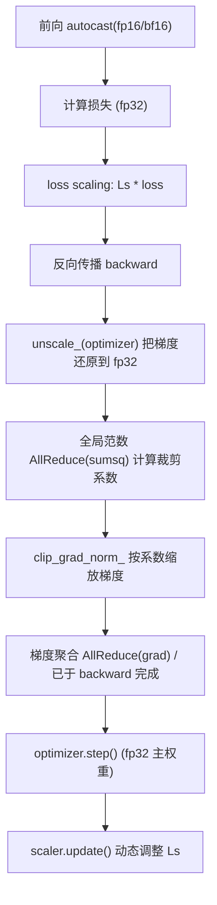

一句话版：分布式训练的数值坑，主要来自**更大的批量、更长的通信链、更低的精度**。想稳：**按顺序做 AMP、Unscale、裁剪、聚合**；在 DP/TP/PP 下正确“对齐”**缩放、平均与裁剪**；用**稳定公式**和**溢出守卫**兜底。

---

## 1. 分布式把哪些数值问题放大了？

* **更大批量** → 梯度方差变小但**峰值更大**（极端样本叠加），易**爆梯度**。
* **更低精度**（fp16/bf16）→ **下溢/上溢**风险增大（见第 6-1 节）。
* **通信与聚合** → “**平均 or 求和**”的语义、缩放时机（loss scaling / grad scaling）稍有偏差，就和单卡不等价。
* **异步/流水线** → 非同步带来“**延迟梯度**”与非确定性，既影响收敛也影响数值监控。
* **稀疏/分片优化器** → 状态、权重的**主精度**与**通信精度**不一致时，容易引入额外舍入误差。

---

## 2. 梯度裁剪（Gradient Clipping）从“为什么”到“怎么做”

### 2.1 直觉与数学

* 把优化过程想成“下山”。**爆梯度**像陡坡上的大步子，容易**跨过谷底**。
* **全局范数裁剪**：令 $g$ 为所有参数梯度拼接而成的向量，给定阈值 $C$，令

$$
\tilde g \;=\; g \cdot \min\!\left(1,\ \frac{C}{\|g\|_2+\varepsilon}\right).
$$

它等价于把步长限制在半径 $C$ 的球里（对 Lipschitz 目标更稳）。

### 2.2 “本地裁剪” vs “全局裁剪”

* **单卡/单机**：直接按上式裁剪即可。
* **数据并行（DP）**：要与“**全局 batch**”等价，**应基于“全局梯度范数”裁剪**。这需要先聚合每卡的 $\|g\|_2^2$。

**推荐做法（数值稳 & 与单机等价）**

1. **Unscale（见 §3）之后**，每卡计算本地平方范数 $s_k=\sum_i \|g_i\|_2^2$。
2. 用 **AllReduce(sum, dtype=fp32/fp64)** 得到 $S=\sum_k s_k$；全局范数 $\|g\|_2=\sqrt{S}$。
3. 计算缩放系数 $c=\min\!\left(1,\ \frac{C}{\sqrt{S}+\varepsilon}\right)$，**每卡**将本地梯度乘以 $c$。
4. 再做（或已经做完）梯度聚合/优化器更新。

> 对比：**先聚合后裁剪**与**先算全局系数再本地缩放**是等价的；**先本地裁剪再聚合**通常**不等价**（会更保守）。

### 2.3 局部裁剪与每样本裁剪

* **按参数组/层裁剪**：适合梯度尺度差异巨大的网络（如嵌入层 vs 注意力层）。
* **每样本裁剪**（per-sample clipping）：在 DP 或 DP-SGD（差分隐私）中常用，代价高但更稳。工程上可用**微批**近似（micro-batch 逐组裁剪再累加）。

### 2.4 与优化器的交互

* **AdamW**：建议**在权重衰减前**裁剪、**在自适应缩放之后**使用更新（框架通常已处理）；
* **梯度累积**（accumulation）：把多步梯度**线性相加**再裁剪一次，或者**逐步裁剪**（两者不等价，前者更接近大 batch 行为）。

---

## 3. 混合精度（AMP）在分布式下的正确次序

> 目标：既要快（低精前向/后向、通信压缩），又要稳（高精归约/检查）。

**推荐流水线（PyTorch 语义）**



**关键点**

* **autocast**：把 matmul/conv 等放到 fp16/bf16，**损失与归约保持 fp32**。
* **loss scaling**：先**放大**损失减少下溢；**unscale\_** 后才能做裁剪/检查。
* **裁剪一定要在 unscale 之后**，否则阈值逻辑失真。
* **聚合精度**：梯度与范数的 AllReduce 建议用 **fp32**（bf16 也可），**不要用 fp16** 聚合以免精度损失。
* **主权重（master weights）**：用 **fp32** 存储与更新，低精权重作为前向副本。

### 3.1 选择 fp16 还是 bf16？

* **bf16**：更大的指数位，**不易溢/下溢**，通常**无需损失放大**；适合大模型、推荐首选（硬件支持时）。
* **fp16**：吞吐高，但更脆；配合**动态损失放大（GradScaler）**与**梯度裁剪**即可稳定。

### 3.2 动态损失放大守卫

* 反向后检查是否出现 **Inf/NaN** 梯度：若有，则**跳过 step**并**降低 scaling**；无则适当提升。
* 在 DP 下，**任一卡**发生溢出都应**全体跳过**（用 AllReduce(or) 汇总标志位）。

---

## 4. “平均还是求和”：缩放语义一定要对齐

* **DDP 梯度聚合**通常默认为**平均**（等价于 sum 后再除以 world\_size）。
* 若你在前向把 loss 取了 **平均**（对样本维度），那么最终等效于对**全局 batch**取平均 —— 这是最常见的设定。
* **学习率线性缩放**：全局 batch 从 $B$ 扩到 $kB$，常把学习率从 $\eta$ 线性放大到 $k\eta$，配上 **warmup**（见 §5-7）。
* **梯度累积**：累计 $K$ 次再 step，相当于把 batch 放大 $K$ 倍；注意只在**最后一次**做 `optimizer.step()`，但**每次都要做 backward/聚合**。

---

## 5. 稳定“护栏”：从检测到恢复

* **logsumexp / BCEWithLogits** 等稳定损失（第 6-1 节）。
* **NaN/Inf 监控**：反向后逐层检查；在 DP 下用 **AllReduce(any)** 汇总是否出现溢出，**不一致则整步作废**。
* **梯度/更新范数监控**：记录 $\|g\|_2$、$\|\Delta\theta\|_2$，检测异常尖峰。
* **通信容错**：NCCL 出错要能**安全重试/重新初始化**；不要静默失败导致参数不同步。
* **确定性（可复现）**：固定 seed、开启 deterministic 算子（会降速），对大型多卡可只要求**统计复现**。

---

## 6. 代码骨架（PyTorch，DP + AMP + 全局裁剪）

```python
import torch, torch.distributed as dist
from torch.nn.utils import clip_grad_norm_

def distributed_global_clip(model, max_norm, eps=1e-8):
    # 1) 本地 sumsq
    local_sq = torch.zeros(1, device="cuda", dtype=torch.float32)
    for p in model.parameters():
        if p.grad is not None:
            local_sq += p.grad.detach().float().pow(2).sum()
    # 2) 全局 AllReduce(sum)
    dist.all_reduce(local_sq, op=dist.ReduceOp.SUM)
    # 3) 全局范数与裁剪系数
    global_norm = local_sq.sqrt()
    coef = (max_norm / (global_norm + eps)).clamp(max=1.0)
    # 4) 本地缩放
    for p in model.parameters():
        if p.grad is not None:
            p.grad.mul_(coef)
    return global_norm.item(), coef.item()

scaler = torch.cuda.amp.GradScaler()

for batch in loader:
    x = batch["x"].cuda(non_blocking=True)
    y = batch["y"].cuda(non_blocking=True)

    optimizer.zero_grad(set_to_none=True)
    with torch.cuda.amp.autocast():         # 低精前向
        logits = model(x)
        loss = torch.nn.functional.cross_entropy(logits, y)  # fp32 计算
    scaler.scale(loss).backward()           # 放大损失，低精反向

    scaler.unscale_(optimizer)              # 还原梯度（到 fp32）
    # 可选：局部检查溢出并 AllReduce(any) 汇总
    global_norm, coef = distributed_global_clip(model, max_norm=1.0)  # 全局裁剪

    scaler.step(optimizer)                  # 若溢出则内部跳过
    scaler.update()
```

> 若使用 `DistributedDataParallel(gradient_as_bucket_view=True)`，梯度在 backward 中已被**平均**，上述裁剪就相当于对**全局平均梯度**裁剪，符合常规语义。

---

## 7. 张量并行 / 流水线并行的额外注意

* **张量并行（TP）**：梯度在维度上被切分，**范数统计要按切分维拼回**。一般用同一维度的 **AllReduce(sum)** 汇总 $s_k$。
* **流水线并行（PP）**：micro-batch 流水会引入**延迟梯度**；确保裁剪/缩放对**每条 micro-batch**一致，或在**聚合后**统一裁剪。
* **ZeRO/分片优化器**：主权重/动量被分片存储，**裁剪与范数统计**要么走框架 API（如 DeepSpeed/FSDP 内置），要么按分片协议做 **Reduce-Scatter/Gather**。

---

## 8. 常见“数值–并行”错位清单

| 现象         | 可能原因                                         | 快速修复                             |
| ---------- | -------------------------------------------- | -------------------------------- |
| 单机稳，多机 NaN | AllReduce 用了 fp16；loss scaling 未 unscale 就裁剪 | 聚合改 fp32/bf16；`unscale_` 后再 clip |
| 多卡结果与单卡不一致 | 本地裁剪导致等价性破坏；loss 求和/平均不一致                    | 用“全局范数裁剪”；统一采用 “全局平均” 语义         |
| 学习率线性放大失效  | 忘了调 warmup；总 batch 与 loss 缩放不匹配              | 增加 warmup；检查 loss 是否按样本平均        |
| 训练忽快忽慢     | 通信与计算未重叠；小 kernel 太多                         | 梯度桶化、通信重叠；算子融合或 CUDA Graphs      |
| bf16 仍溢出   | 归约留在低精；激活/规范化过小                              | 关键归约用 fp32；给归一化分母加 epsilon       |

---

## 9. 练习（带提示）

1. **等价性验证**：在 2 卡 DP 上实现“全局范数裁剪”和“本地裁剪”，比较与单卡基准在同一步的 $\|\nabla\|$。
2. **溢出守卫**：实现分布式 `has_overflow = AllReduce(any(local_has_overflow))`，若 True 则跳过 `step()` 并降低 scaler。
3. **通信精度对比**：将梯度 AllReduce 分别设为 fp16 / bf16 / fp32，记录 loss 曲线与收敛步数。
4. **累积与裁剪**：在梯度累积 $K$ 次的设定下，比较“每次裁剪” vs “累计后裁剪”的收敛与稳定性。
5. **TP 范数统计**：在列并行线性层（权重分列切分）中，实现跨分片的全局 $\|g\|_2$ 统计与裁剪。

---

## 10. 小结（带走三句话）

1. **裁剪要全局、在 unscale 之后**；本地裁剪会破坏与单机的等价性。
2. **AMP 的黄金顺序**：autocast → scale → backward → **unscale → clip →（聚合）** → step → update。
3. **通信与精度**：关键归约用 fp32/bf16，监控溢出与范数尖峰；把**数值稳定公式**与**并行策略**一起“拧紧螺丝”。
