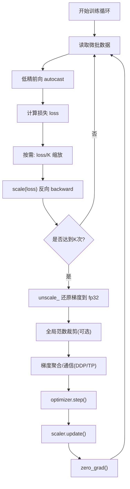

*——以“混合精度”和“梯度累积”为核心的一套稳、准、快实践*

> 一句话版：想把百亿/千亿参数模型训稳训快，先把**混合精度**和**梯度累积**打磨好：
>
> * 前向/反向用低精（fp16/bf16）以提吞吐，**关键归约与主权重保 fp32**，配合**动态损失放大**与**梯度裁剪**兜底。
> * 用**梯度累积**把多个微批次（micro-batches）叠成一个“大 batch”，在不爆显存的同时保持大批量的统计效果与并行效率。

---

## 1. 为什么大模型训练容易“数值翻车”？

* **尺度跨度大**：权重/激活/梯度的数值范围跨越 10⁴～10⁸，低精度更容易**上溢/下溢**。
* **网络深**：长链乘法（如注意力 softmax、规范化、残差）容易累积舍入误差或发生灾难性消去。
* **并行复杂**：数据并行/张量并行/流水线并行下的**聚合语义**、**缩放时机**稍有偏差就与单卡不等价。
* **内存紧**：显存吃紧迫使我们采用**混合精度、激活检查点、梯度累积**，一旦顺序/精度配置不对，就会 NaN/发散。

---

## 2. 混合精度（Mixed Precision，AMP）从原理到落地

### 2.1 两种主流格式

* **fp16**：吞吐高，但动态范围小；一般需要**损失放大（loss scaling）**。
* **bf16**：指数位更多，**范围大**、稳；多数场景可**不显式放大**（更推荐，硬件支持更佳）。

### 2.2 黄金流程（以 PyTorch 语义表达）

1. **autocast**：把 matmul/conv 等算子放到 fp16/bf16；**损失与归约保 fp32**。
2. **loss scaling（可选）**：把 loss 乘以放大系数 `Ls`，减少下溢。
3. **backward**：低精反向得到“放大的梯度”。
4. **unscale\_**：在优化前把梯度除以 `Ls`，恢复到真实尺度（**fp32**）。
5. **梯度裁剪（可选）**：在 **unscale 之后**进行（全局范数）。
6. **梯度聚合**（DP/TP）：建议用 **fp32/bf16** 通信，避免 fp16 聚合。
7. **optimizer.step()**：**主权重（master weights）用 fp32** 存储与更新。
8. **scaler.update()**：动态调整 `Ls`，遇到溢出就降低并跳过本步更新。

**口诀**：`autocast → scale → backward → unscale → clip → (allreduce) → step → update`

### 2.3 稳定小技巧

* **数值稳定公式**：softmax 用 `logsumexp` 版；BCE/CE 用 *with logits*；规范化层加足够大的 `eps`（如 1e-5～1e-6）。
* **关键归约保 fp32**：如均值/方差、梯度范数、损失平均；即使前后是低精，**归约也要高精**。
* **权重初始化与缩放**：配合深网络采用 **RMSNorm / 预归一化**、稳定的残差缩放（如 `residual * α + f(x)`，α<1）能缓解梯度爆炸。
* **动态损失放大守卫**：反向后检测 NaN/Inf（全局 OR 聚合）。如有溢出：**跳过 step**，降低 `Ls` 再继续。

### 2.4 简明示例（伪代码）

```python
scaler = torch.cuda.amp.GradScaler()  # fp16 常用；bf16 可不用
for batch in loader:
    opt.zero_grad(set_to_none=True)
    with torch.cuda.amp.autocast(dtype=torch.bfloat16):  # 或 torch.float16
        logits = model(batch["x"])
        loss = F.cross_entropy(logits, batch["y"])  # 内部 fp32 归约
    scaler.scale(loss).backward()        # 放大反向
    scaler.unscale_(opt)                 # 还原梯度到 fp32
    torch.nn.utils.clip_grad_norm_(model.parameters(), 1.0)  # 可选
    scaler.step(opt)                     # 若溢出会跳过
    scaler.update()                      # 动态调节 Ls
```

---

## 3. 梯度累积（Gradient Accumulation）：把多个“微批”凑成“大批”

### 3.1 概念与等价性

* 设显存只容纳 **微批**大小 `B_micro`，但我们希望模拟更大的 **全局批量** `B_global = K * B_micro * world_size`。
* 方法：**在不执行 `optimizer.step()` 的前提下**，依次对 **K 个微批**做前向+反向，把梯度**累加**到参数的 `.grad`，累积满 K 次后再 `step()` 一次。

**数学等价**：若每次 loss 都对样本维度**取平均**，并且梯度在 DP 下**做全局平均**，则“累积 K 次再更新”≈“一次用 K 倍 batch 更新”。

### 3.2 正确缩放与时序

* 常见做法 A：**不缩放 loss**，把 K 个 `.backward()` 产生的梯度**直接累加**；在第 K 次后 `step()`，再 `zero_grad()`。
* 常见做法 B：每次以 `loss / K` 反传，这样 `.grad` 等价于“大 batch”的平均梯度，**数值更接近一次性大 batch**。

> 两种都可行；**做法 B**在理论上更“等价”。若配合 AMP 的 `scale(loss)`，可写 `scale(loss / K)`。

### 3.3 与 AMP/裁剪/并行的组合

* **AMP 顺序**保持不变；每次微批都 `scale(loss / K).backward()`；**只在第 K 次**进行 `unscale_ → （全局范数）裁剪 → step → update`。
* **数据并行（DP）**：每个微批的梯度会被聚合（或桶化重叠），**累积的也是“全局平均梯度”**；第 K 次统一裁剪/更新。
* **张量并行/流水线并行**：确保“累积计数”和“聚合语义”一致；大多框架提供开关（如 DeepSpeed/FSDP 的 grad\_accumulation\_steps）。

### 3.4 伪代码（AMP + 累积 K 次）

```python
K = 8  # 累积步数
for step, batch in enumerate(loader):
    with autocast():
        loss = criterion(model(batch["x"]), batch["y"])
        loss = loss / K            # 做法 B：每步缩放
    scaler.scale(loss).backward()  # 放大+反传，累积到 .grad

    if (step + 1) % K == 0:
        scaler.unscale_(opt)       # 仅在第 K 次做一次
        torch.nn.utils.clip_grad_norm_(model.parameters(), 1.0)
        scaler.step(opt)
        scaler.update()
        opt.zero_grad(set_to_none=True)
```

---

## 4. “稳态训练”流程图



**图示说明**：上图把“混合精度 + 梯度累积 + 裁剪 + 分布式聚合”的关键时序串起来，确保更新语义与单卡大 batch 等价。

---

## 5. 常见故障与“快速修复”

| 现象          | 根因                                  | 快速修复                                                       |
| ----------- | ----------------------------------- | ---------------------------------------------------------- |
| loss 突然 NaN | 低精上溢/下溢；softmax/exp 不稳；unscale 前就裁剪 | 用 `logsumexp`/with-logits；**unscale 后**再裁剪；提高 `eps`；试 bf16 |
| 多卡与单卡曲线不同   | 局部裁剪；loss 缩放/平均语义不一致                | 用**全局范数裁剪**；统一“对样本平均 + 对世界平均”                              |
| 累积与不累积结果不等价 | 每步未除以 K；或 step 频率错误                 | 按“做法 B”每步 `loss/K`；仅在第 K 次 step                            |
| 通信耗时长       | 梯度桶太小/太碎；未重叠                        | 启用**通信重叠**与**桶化**；调大 bucket size；并发流                       |
| 训练忽快忽慢      | kernel 过碎、带宽受限                      | 算子融合、FlashAttention、Pinned 内存、预取与多流                        |

---

## 6. 进一步的数值“锦囊”

* **梯度裁剪**：与 AMP 联用，**unscale 后按全局范数**裁剪（见 6-6）。
* **激活检查点（checkpointing）**：用算力换显存，减少累积步数对收敛的影响。
* **学习率与 warmup**：大批量常做**线性学习率放大 + warmup**，避免早期数值抖动（见 5-7）。
* **优化器 `eps`**：AdamW 的 `eps` 影响小梯度下的稳定（常用 1e-8 或 1e-6）；`betas` 可降低 2 阶矩估计的漂移。
* **归一化与残差**：RMSNorm/Pre-LN、残差缩放（如 α=1/√2）在超深网络中更稳。
* **海森向量积（HVP）/二阶近似**：用于诊断梯度异常与调参（见 6-4）。

---

## 7. 工程 Checklist（上线前逐项核对）

* [ ] autocast 打开（bf16 优先，关键归约 fp32）
* [ ] 动态损失放大（fp16 时）与溢出检测
* [ ] **unscale → 全局范数裁剪 →（聚合）→ step** 顺序严格
* [ ] 梯度累积：每步 `loss/K`，仅在 K 次后 step & zero\_grad
* [ ] DDP/TP/PP 聚合精度为 **fp32/bf16**，聚合语义与单卡等价
* [ ] softmax/log/sigmoid 等使用稳定实现（logsumexp、with-logits）
* [ ] 学习率与 warmup 与全局 batch 对齐（线性放大）
* [ ] 监控 $\|g\|_2$、更新范数、溢出计数、通信占比
* [ ] 数据管道：Pinned 内存、预取、多流，降低停等

---

## 8. 练习（含提示）

1. **等价性验证**：在单卡上做“直接大 batch” vs “梯度累积 K 次、每步 loss/K”，比较同步更新后的 $\|\nabla\|$ 与参数差距。
2. **溢出守卫**：实现“反向后检测 NaN/Inf→广播标志→跳过 step 并降低 `Ls`”，统计训练前几千步的溢出次数。
3. **裁剪时序实验**：把裁剪放到 unscale 前后两种位置，比较极值 logits 下的稳定性（应当 unscale 后更稳）。
4. **bf16 vs fp16**：在同一模型上对比两者的收敛曲线、溢出次数与吞吐；记录数值稳定差异。
5. **累积与通信重叠**：开启梯度桶化与通信重叠，测量不同 K 对时间线和吞吐的影响。

---

## 9. 小结

1. **混合精度三要点**：低精前后向、**关键归约 fp32**、**unscale 后再裁剪/聚合**。
2. **梯度累积**让你在不加显存的情况下模拟大批量，**每步 loss/K** 更接近一次性大 batch。
3. 把**流程时序**捋顺（图中的顺序），再配上**稳定公式与监控**，大模型训练就能“又快、又稳、又省”。
