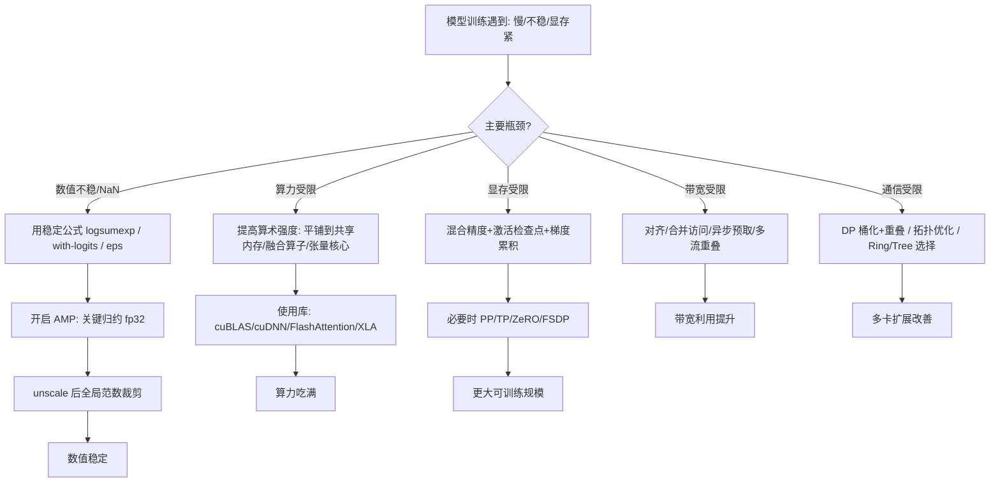

一句话版：**稳**来自正确的数值公式与精度管理，**快**来自数据复用与并行组织。把两件事扎实做好，你的模型常常“又稳又猛”。

---

## 1. 全景回顾：本章 7 个关键点

1. **浮点与稳定性（6-1）**

* 浮点是离散近似：有**舍入**与**范围**限制。
* 避免灾难性消去：用 `logsumexp`、`expm1/log1p`、稳定的方差/标准化公式。
* **混合精度**：低精（fp16/bf16）做算子，高精（fp32）做**归约**与**主权重**。

2. **矩阵运算误差（6-2）**

* 条件数 $\kappa(A)$ 决定解的灵敏度；病态矩阵（大 $\kappa$）易放大误差。
* 数值稳定算法 ≠ 精确数学公式：例如 **QR/SVD** 常优于 **直接求逆**。
* 善用 **预条件**、**重排** 与 **等价变换**。

3. **稀疏与压缩（6-3）**

* 稀疏 = 计算/存储按 **nnz** 计价：COO/CSR/CSC/BSR/ELL/HYB。
* **选择格式看访问模式**：$Ax$ 用 CSR，$A^\top x$ 用 CSC，块结构用 BSR，GPU 规整行宽试 ELL/HYB。
* 迭代法（CG/GMRES）+ 预条件 ≫ 稠密消元。

4. **自动微分（6-4）**

* 前向模式 = **JVP**（$Jv$），反向模式 = **VJP**（$u^\top J$）。
* 训练（标量损失）用 **反向**；二阶方向导用 **HVP（Pearlmutter）**。
* 记住顺序：**链式法则的工程化**就是 AD。

5. **GPU/TPU 并行（6-5）**

* **Roofline**：性能 ≤ min(峰值算力, 算术强度 × 带宽)。
* 提高 **算术强度**（块化/复用/融合），提高 **有效带宽**（对齐/合并/预取/重叠）。
* 并行维度：**数据并行（DP）**、**张量并行（TP）**、**流水线（PP）**，常用**混合并行**。

6. **分布式数值注意（6-6）**

* **AMP 顺序**：autocast → scale → backward → **unscale → clip →（聚合）** → step → update。
* **全局范数裁剪**要在 **unscale 后**并基于 **AllReduce 的全局范数**。
* 聚合精度用 **fp32/bf16**，并监控 NaN/Inf 与范数尖峰。

7. **大模型训练技巧（6-7）**

* **混合精度**优先选 bf16（硬件支持时）。
* **梯度累积**实现大 batch：每步 `loss/K`，第 K 次再 step。
* 与数据/张量/流水线并行协同：保持缩放与聚合语义**与单卡等价**。

---

## 2. 一张图：从“慢与不稳”到“快且稳”的路线

**说明**：先定位瓶颈，再套**对症药方**；注意数值稳定与并行策略要配套。

---

## 3. “万能配方”速查（贴在工位墙上的那张）

* **Softmax（稳定）**：

  $$
  \mathrm{softmax}(z)_i=\frac{e^{z_i-\max(z)}}{\sum_j e^{z_j-\max(z)}}
  $$
* **交叉熵（logits 版本）**：用 `logsumexp`：
  $\text{CE}=-z_{y}+\log\sum_j e^{z_j}$（无须显式 softmax）。
* **方差（两遍更稳）**：先算均值，再算二阶中心矩；或用 Welford 在线算法。
* **梯度裁剪（全局范数）**：
  $\tilde g = g\cdot \min\big(1,\frac{C}{\|g\|_2+\varepsilon}\big)$，$\|g\|_2$ 用 AllReduce(sum of squares) 得到。
* **Roofline**：性能 ≤ min(峰值 FLOPs，AI×带宽)；**提高 AI = 提升数据复用**。
* **别求逆**：解 $Ax=b$ 用 **分解（QR/Cholesky）** 或迭代法（CG），回避 `A^{-1}`。
* **JVP/VJP**：

  * JVP（前向）得 $Jv$，适合 $n$ 小、$m$ 大或算 HVP；
  * VJP（反向）得 $u^\top J$，训练标配。
* **稀疏格式选型**：Ax→CSR，$A^\top x$→CSC，规律块→BSR，GPU规整行宽→ELL/HYB。
* **AMP 顺序**：autocast → scale → backward → **unscale → clip →（聚合）** → step → update。
* **梯度累积**：每步 `loss/K` + 第 `K` 次 `step()`，与“真大 batch”等价性更好。

---

## 4. 工程 Checklist（上线前逐项打钩）

* [ ] 关键损失/归约用 **fp32**；前后向用 **bf16/fp16**（优先 bf16）。
* [ ] AMP 顺序正确；溢出守卫与动态损失放大开启（fp16）。
* [ ] **unscale 后**执行**全局范数裁剪**（AllReduce sumsq → sqrt）。
* [ ] 大 batch：用 **梯度累积**（每步 `loss/K`），仅在第 K 次 `step`。
* [ ] 训练/评估语义一致：loss 对样本**取平均**；分布式梯度**全局平均**。
* [ ] 算子优先调库（cuBLAS/cuDNN/FlashAttention/XLA/CUTLASS）。
* [ ] 性能画像：Profiler 定位**算力/带宽/通信**；针对性做**平铺/融合/重叠**。
* [ ] 数据管道：Pinned 内存、预取、多进程加载、H2D/计算重叠。
* [ ] 稀疏场景：构建用 COO，计算前转 CSR/BSR；检查去重与排序。
* [ ] 日志与报警：监控 `loss`、全局 $\|g\|_2$、更新范数、溢出次数、通信占比。

---

## 5. 常见故障速查表

| 现象             | 常见原因                  | 快速修复                                  |
| -------------- | --------------------- | ------------------------------------- |
| loss 变 NaN/Inf | 低精溢出；不稳公式；unscale 前裁剪 | 用稳定实现；**unscale 后**裁剪；尝试 bf16；降低 LR   |
| 多卡与单卡曲线不同      | 本地裁剪；loss/平均语义不一致     | **全局范数裁剪**；统一“样本平均+全局平均”              |
| 吞吐上不去          | 带宽受限或 kernel 过碎       | 合并访问/块化/算子融合；多流重叠；启用张量核心              |
| 扩展到多机掉速        | AllReduce 阻塞/拓扑不佳     | 桶化+重叠；Ring/Tree 切换；NVLink/NVSwitch 分组 |
| 显存不够           | 激活占用大                 | AMP + 检查点 + 梯度累积；必要时 PP/ZeRO/FSDP     |

---

## 6. 小练习与项目（巩固 + 开箱即用）

1. **稳定性对拍**：实现两版交叉熵（显式 softmax vs `logsumexp`），在极端 logits 下比较数值与梯度差异。
2. **Roofline 估算**：对你模型的前 5 大算子估算 AI，判断算力/带宽受限，提出 1 条可执行的融合或平铺优化。
3. **全局范数裁剪**：在 2～8 卡 DDP 上实现“unscale→全局范数→裁剪”，验证与单卡的一致性。
4. **HVP 调试器**：用 Pearlmutter 技巧实现 `Hv`，定位某步梯度异常是否来自曲率尖峰。
5. **稀疏加速微项目**：将一个稀疏图卷积的邻接从 COO → CSR/BSR，对比 SpMM 吞吐与显存。
6. **累积 K 的选择**：在固定显存下，扫描 K∈{1,2,4,8}，对比吞吐、收敛速率与最终精度，写出“你任务的最佳 K”。

---

## 7. 章节闭环：三句话带走

1. **稳定优先**：正确的数值公式 + 合理精度管理（AMP 次序与全局裁剪）。
2. **复用为王**：算术强度决定上限；平铺、融合与缓存/共享内存让你“喂饱”算力。
3. **系统观**：从算法到硬件（AD→稀疏→并行→通信）一体思考，问题常能迎刃而解。
