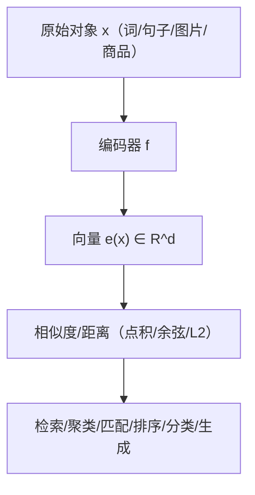

一句话版：**嵌入就是把“对象”变成“向量”，让语义变几何**。
在向量空间里，相似 = 距离近 / 夹角小；加法、缩放、投影等线性操作都能被算法高效利用。

---

## 1. 快速复习：什么是向量空间？

把向量空间想成“**可以任意叠加和缩放的箭头世界**”。对任意向量 $u,v$ 与标量 $\alpha,\beta$，线性组合 $\alpha u+\beta v$ 仍在同一世界里。这带来几个核心概念：

* **线性组合与张成（span）**：一组向量的所有线性组合形成的集合，叫它们张成的子空间。
* **线性无关与基**：不能用其他向量组合出来的那几根“骨干”叫基（basis），基的个数就是**维数**。
* **子空间**：包含零向量且对加法/数乘封闭的集合，如某个线性方程组的解集。

> 直觉类比：基就像描述地图所需的**坐标轴**；同一地点在不同坐标轴下坐标不同，但**物理位置**不变。

---

## 2. 度量与相似：范数、内积、角度

* **范数（norm）**：长度的度量。最常用 $\|x\|_2=\sqrt{\sum_i x_i^2}$、$\|x\|_1=\sum_i |x_i|$。

* **内积（dot / inner product）**：$\langle x,y\rangle = \sum_i x_i y_i$，满足柯西–施瓦茨不等式。

* **夹角与余弦相似度**：

  $$
  \cos\theta=\frac{\langle x,y\rangle}{\|x\|\,\|y\|}\quad\Rightarrow\quad
  \text{cosine}(x,y)=\frac{x^\top y}{\|x\|\|y\|}.
  $$

  余弦相似度只看方向，不看长度；在文本与推荐中很常用。

* **正交投影**：把向量 $x$ 投到子空间（如一条线）上，得到“最接近”的点；这就是最小二乘法的几何本质。

---

## 3. 从“对象”到“向量”：嵌入的定义

\*\*嵌入（embedding）\*\*是一个函数

$$
f:\mathcal{X}\to\mathbb{R}^d,\qquad x\mapsto e(x),
$$

把“离散对象”——词、句子、图片、商品、用户、图节点……映射到 $\mathbb{R}^d$ 的点。理想情况下：

* 语义近 → **几何近**（距离小、角度小）；
* 语义关系 → **几何结构**（方向、平移等）。

**图示说明**：上图展示了从对象到向量、再到“相似度驱动”的各类下游任务的通用流程。

---

## 4. 语言模型里的嵌入：从 Token 到隐空间

在 Transformer/LLM 中，一条输入序列（如 token IDs）会被映射成同维度的嵌入并进入模型：

* **词嵌入矩阵** $E\in\mathbb{R}^{V\times d}$（$V$=词表大小，$d$=隐藏维）：

  $$
  x_t \mapsto E[x_t] \in \mathbb{R}^d.
  $$
* **位置嵌入** $P[t]$：给每个位置加“位置信息”（可为可学习或正余弦位置编码）。
* **段落/类型嵌入**（可选）用于区分句段或模态。

首层输入一般是

$$
h^{(0)}_t = E[x_t] + P[t] \quad (\text{+ segment})
$$

进入多层自注意力与前馈网络。注意力中的 **Q/K/V** 也是通过线性映射 $W_Q,W_K,W_V$ 从这些嵌入得到，**相似度用的就是点积**（缩放后过 softmax）。

**权重共享（tied weights）**：输出层的 softmax 权重常与输入嵌入矩阵 $E$ 共享，这在语言建模中能改进泛化并减少参数。

---

## 5. 嵌入如何训练：几种典型目标

### 5.1 共现与语言模型：Word2Vec / GloVe / MLM

* **Skip-gram + 负采样（Word2Vec）**
  目标让中心词 $w$ 与其上下文 $c$ 的点积大于与随机噪声词 $n$：

  $$
  \log \sigma(e_w^\top e_c) + \sum_{n\sim P_n} \log \sigma(-e_w^\top e_n).
  $$
* **GloVe**：用词–词共现矩阵的加权回归，把共现次数的对数逼近为两个嵌入的内积。
* **掩码语言模型（BERT/LLM）**：预测被遮蔽的 token，嵌入在大规模上下文预测中自监督学到语义。

### 5.2 对比学习（CLIP/SimCSE 等）

* **InfoNCE/对比损失**：把正样本对拉近，把大量负样本推远。以 CLIP 文图为例：

  $$
  \mathcal{L}=-\frac{1}{N}\sum_i
  \log\frac{\exp(\langle e^{\text{text}}_i,e^{\text{img}}_i\rangle/\tau)}
  {\sum_j \exp(\langle e^{\text{text}}_i,e^{\text{img}}_j\rangle/\tau)}.
  $$

  其中 $\tau$ 是温度，常与**向量归一化**（单位球）一起用以对齐尺度。

### 5.3 度量学习（Triplet / N-Pair）

* **三元组损失**：锚 $a$、正样本 $p$、负样本 $n$，要求

  $$
  \|e(a)-e(p)\|_2^2 + \text{margin} < \|e(a)-e(n)\|_2^2.
  $$

  适合人脸识别、商品检索等“类别内聚、类间分离”的任务。

### 5.4 重建/自编码器

* 通过压缩再重建最小化误差（MSE/交叉熵），让低维向量捕捉主要信息（与 PCA/SVD 相关，见线代章节）。

---

## 6. 相似度与检索：从数学到工程

* **距离选择**：

  * **余弦**（常先 L2 归一化），对长度不敏感；
  * **欧氏**：更看重“幅度差异”；
  * **点积/MIPS**：推荐系统常用（用户向量与商品向量点积即“打分”）。
* **近似最近邻（ANN）**：大规模库用 HNSW、IVF-PQ、FAISS/ScaNN 等进行快速向量检索。
* **归一化与温度**：单位化能稳定角度，温度 $\tau$ 控制 softmax 的“锐度”。
* **可视化**：t-SNE/UMAP 把高维嵌入压到 2D，帮助检查聚类与混淆区域（仅作可视化，别当作严格几何）。

---

## 7. 嵌入在大模型与系统中的几种场景

### 7.1 RAG（检索增强生成）

* 预先对文档分块做嵌入，查询语句也嵌入，做向量近邻检索拿到相关片段，再喂给 LLM 生成。
* 重点：**领域专用嵌入模型**、**分块策略**、**去重与摘要**、**索引刷新**。

### 7.2 推荐系统

* 用户/物品各有嵌入，**点积**或 **MLP(e\_user ⊕ e\_item)** 预测点击/转化。
* 训练常用**负采样**、**分片参数服务器**；上线时需要**ANN 检索**与**多塔结构**（双塔/多塔）。

### 7.3 多模态对齐

* 图像嵌入与文本嵌入共享空间（CLIP），实现跨模态检索与标注。
* 对齐策略：对比损失、共享投影头、温度+单位化。

### 7.4 图结构/知识图谱

* Node2Vec/DeepWalk 把随机游走序列当“句子”学节点嵌入；
* GNN 端到端学到的节点/边嵌入用于链路预测、节点分类。

---

## 8. 嵌入的“坑”与矫正

* **各向异性（Anisotropy）**：向量集中在少数方向（“锥形”）。

  * 处理：**中心化/白化**、去掉前几个主成分（“all-but-the-top”）、单位化。
* **Hubness（枢纽效应）**：高维中某些点成为所有点的近邻。

  * 处理：使用 **CSLS** 等校正、降低维度或改度量。
* **领域迁移**：通用嵌入到小众领域会漂移。

  * 处理：**继续预训练/蒸馏/对比微调**，或换成领域模型。
* **OOV/新词**：词表外项。

  * 处理：子词（BPE）、字符级或检索扩展。

---

## 9. 一个端到端的微型配方（RAG/检索示例）

1. 选模型：句向量（中文可选 SimCSE/CoSENT/多语模型）。
2. 预处理：分段（长度/语义边界）、去 HTML、去噪。
3. 向量化：统一 **归一化**；可做 **中心化/去主成分**。
4. 建索引：HNSW（召回快，内存多）或 IVF-PQ（更省内存）；离线评估 recall\@k。
5. 查询时：查询嵌入 → 检索 top-k → 重排序（BM25/交叉编码器）→ 提示词构造 → LLM 生成。
6. 监控：覆盖率、命中率、重复率、漂移（分布漂移时重建索引/微调）。

---

## 10. 练习（带提示）

1. **余弦 vs 欧氏**：生成两组同方向不同长度的向量，比较两种度量的最近邻排序（应余弦更稳）。
2. **对比学习微实验**：用公开小数据（文本配对）实现 InfoNCE，观察温度 $\tau$ 与单位化对验证对齐度的影响。
3. **可视化**：取训练好的词向量，挑 1000 个词，用 t-SNE 可视化，观察同义/反义聚类现象。
4. **RAG 评测**：实现一个小型知识库检索，比较 HNSW 与暴力 kNN 的 latency 与 recall\@10。
5. **各向异性修正**：对嵌入做中心化与“去前 2 个主成分”，比较检索质量提升。

---

## 11. 小结（带走三句话）

1. **嵌入把语义变成几何**：相似就是“近”，关系就是“方向/平移”。
2. **好嵌入=好目标+好度量+好处理**：对比学习/语言建模目标 + 余弦/点积 + 归一化/温度/去主成分。
3. **工程上三板斧**：**ANN 检索**、**归一化与稳定化**、**面向场景的微调**——落地才是硬道理。
