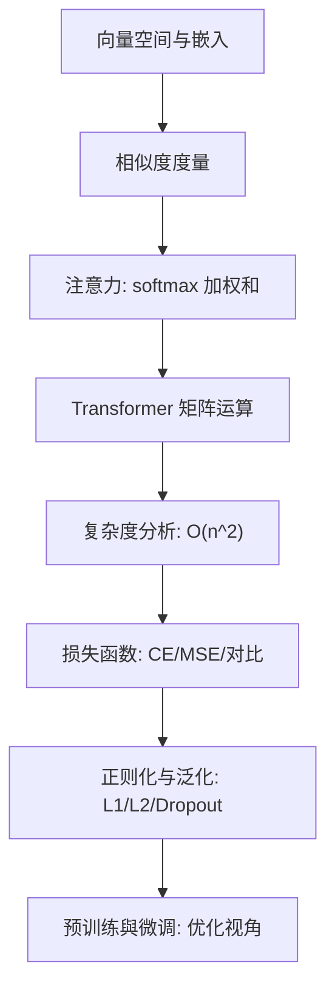
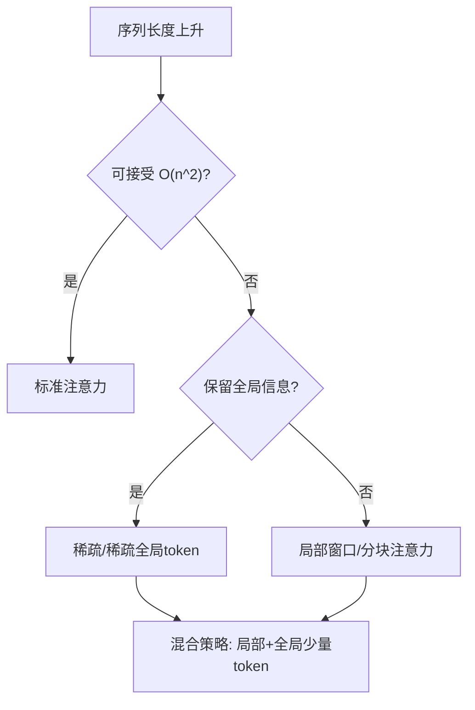
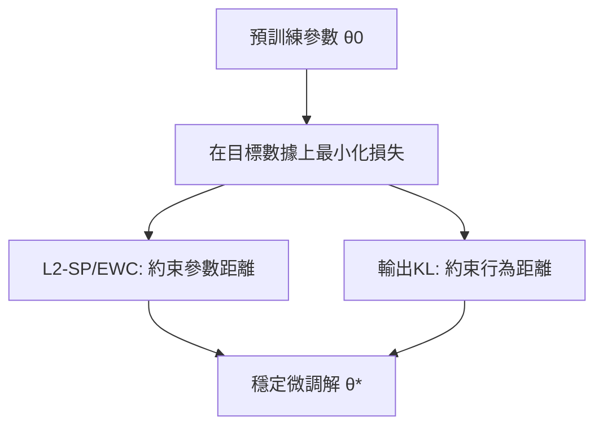

本章围绕“**表示—相似—注意力—Transformer—优化与泛化**”这条主线，把大模型背后的关键数学连成一条链。下面先给出一张“地图”，再逐点回顾、给出工程抉择、常见坑位与练习。

---

## 1) 一图总览：从表示到优化

**说明**：嵌入定义几何，几何决定相似度；相似度进入注意力；注意力堆叠成 Transformer；在算子与复杂度约束下，用合适的损失训练，并通过正则化与微调策略让模型既稳又强。

---

## 2) 关键结论速记（配最小公式）

### 2.1 嵌入与向量空间

* 嵌入是映射 $x \mapsto \mathbb{R}^d$。单位化（$L_2$ 归一）后，**点积 = 余弦相似**：

  $$
  \text{cos}(u,v)=\frac{u^\top v}{\|u\|\|v\|},\quad \text{若}\ \|u\|=\|v\|=1,\ \ \ u^\top v=\text{cos}(u,v).
  $$
* **几何直觉**：同类“挤在一起”，异类“分开角度”。

### 2.2 相似度度量（余弦 / 点积 / 欧氏）

* **余弦**看角度、**点积**看角度+长度、**欧氏**看直线距离。单位化后三者关系更紧。
* 检索中常用**单位化 + 余弦/点积**，便于近似最近邻（ANN）。

### 2.3 注意力（softmax 加权和）

* 单头注意力：

  $$
  \mathrm{Attn}(Q,K,V)=\mathrm{softmax}\!\left(\frac{QK^\top}{\sqrt{d_k}}\right)V .
  $$
* **温度/缩放** $(1/\sqrt{d_k})$ 稳定梯度；softmax 使权重非负且和为 1，解释为“分布上的加权平均”。

### 2.4 Transformer 的矩阵运算

* 线性投影：$Q=XW_Q,\ K=XW_K,\ V=XW_V$。
* 多头并行，拼接后再做一次线性变换。**形状与维度**匹配是代码正确性的关键。
* **复杂度**：标准注意力 $\mathcal{O}(n^2 d)$；长序列需稀疏/局部/低秩/近似策略。

### 2.5 损失函数（CE / MSE / 对比）

* **交叉熵（CE）** = 负对数似然，梯度简洁：$\partial \ell/\partial z = \hat p - y$。
* **MSE** 对应高斯噪声假设，估计条件期望，易受离群点影响。
* **对比损失（InfoNCE）**：把表征学习转成“正对分类、负对排斥”。

### 2.6 正则化与泛化

* **L2/权重衰减**：均匀收缩；**L1**：促稀疏与特征选择；**Dropout**：噪声注入近似集成。
* 大模型常用 **AdamW+权重衰减**，小数据微调可加 **Dropout** 与 **早停**。

### 2.7 预训练与微调（优化视角）

* 预训练：$\min_\theta \mathbb{E}_{D_{pre}}[\ell]$，得 $\theta_0$。
* 微调：$\min_\theta \mathbb{E}_{D_{tgt}}[\ell]+\lambda R(\theta;\theta_0)$。

  * $R$ 可取 **L2-SP**、**EWC（Fisher）**、或**输出 KL**（约束行为不跑远）。
  * **参数高效**：LoRA/Adapter/Prompt，限制更新在低秩或小子空间。

---

## 3) 工程抉择速查（把数学落到键盘上）

* **检索/相似**

  * 若关心“方向”：向量单位化 + 余弦 / 点积；配 ANN（FAISS 等）。
  * 长度差异很重要：考虑欧氏或不做单位化。
* **注意力与复杂度**

  * 中等序列：标准注意力；
  * 超长序列：局部窗口、稀疏模式、分块、低秩核、缓存 KV。
* **损失选择**

  * 分类/语言建模：CE（可加标签平滑、温度、类不均衡用 Focal 或加权 CE）；
  * 回归/打分：MSE（有离群点用 Huber/MAE）；
  * 表征/检索：InfoNCE（单位化+温度、扩大负样本池）。
* **正则化**

  * 预训练：AdamW + 适中 weight decay；
  * 小数据微调：更强正则（L2-SP/输出 KL）+ Dropout + 早停。
* **微调策略**

  * 数据少/显存紧：LoRA/Adapter/Prefix/Linear Probe；
  * 分布差大：先改输入（检索增强/指令重写），再调优化与正则。

---

## 4) 常见坑位与排错清单

* **Softmax 溢出**：logits 先减最大值，或用 `logsumexp`。
* **多标签误用 CE**：应使用 **Sigmoid+BCE**，非 Softmax-CE。
* **对比学习崩塌**：忘归一化/温度，负例过少或出现大量 false negatives。
* **权重衰减用法错误**：AdamW 才是“解耦权重衰减”；不要给偏置/Norm 参数施加 decay。
* **长序列显存爆**：注意力 $n^2$；用分块注意力、梯度检查点、混合精度与 KV Cache。
* **微调遗忘**：缺少 L2-SP/EWC/输出 KL，或学习率过大导致“跑远”。

---

## 5) 两张小图：复杂度与微调信任域

### 5.1 注意力复杂度取舍

**说明**：在显存和速度的约束下，用局部、稀疏或混合注意力换取近似的表达力。

### 5.2 微调的“信任域”思维

**说明**：通过在参数或输出层面加“緩衝帶”，讓微調不至於破壞通用能力。

---

## 6) 迷你练习（含提示）

1. **余弦 vs 欧氏**：证明当 $\|u\|=\|v\|=1$ 时，最小化欧氏距离等价于最大化余弦相似。
2. **注意力缩放**：推导为什么 $1/\sqrt{d_k}$ 能缓解 softmax 饱和（提示：方差与梯度）。
3. **InfoNCE 梯度**：写出正对与负对上的梯度方向，解释批量大小对学习的影响。
4. **标签平滑**：比较是否平滑时的校准误差（ECE）与 Top-k 指标。
5. **L2-SP vs Ridge**：在线性回归上推导二者的闭式解差异，并在小样本下对比。
6. **输出 KL 微调**：在分类任务上扫 $\beta$（KL 系数），观察稳定性–可塑性权衡。
7. **稀疏注意力**：实现窗口注意力并在长序列上对比显存与速度。
8. **对比学习假负例**：在类内多样性高的数据上，尝试同类屏蔽策略，观察检索 Recall\@K 变化。

---

## 7) 一页“随身卡”（Cheat Sheet）

* **Attn**：$\text{softmax}(QK^\top/\sqrt{d})V$；多头并行，注意形状。
* **CE**：$\partial \ell/\partial z = \hat p - y$；长尾用加权或 Focal；蒸馏用温度。
* **MSE**：高斯噪声假设；离群点用 Huber。
* **InfoNCE**：单位化 + 温度；增大负例池。
* **正则**：AdamW 的 weight decay；需要稀疏用 L1/组稀疏；小数据可加 Dropout/早停。
* **微调**：数据少/分布差大 → L2-SP/EWC/输出 KL + LoRA/Adapter/Probe。

---

## 8) 结语

大模型的“魔法”并不神秘：它是**几何（嵌入与相似）**、**统计（似然与损失）**、**线性代数（矩阵与注意力）**与**优化（正则与微调）**的合奏。
带着这张地图，你可以在不同任务与资源约束下，做出**有根据的工程抉择**。
