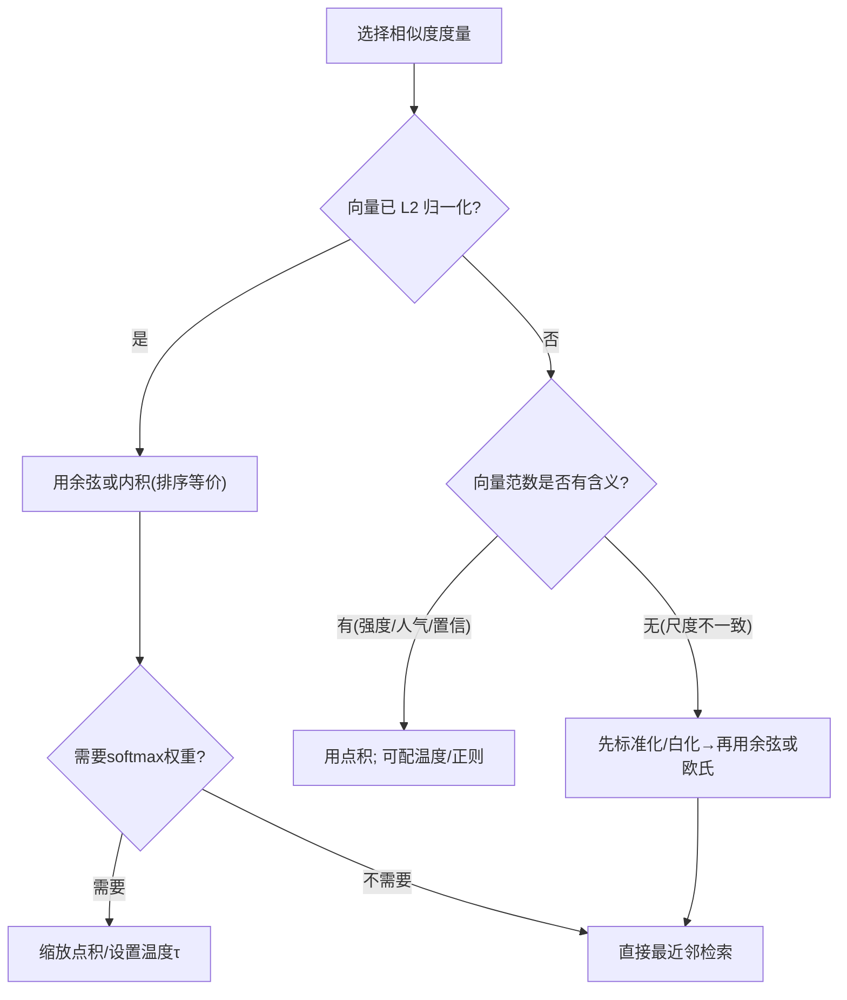
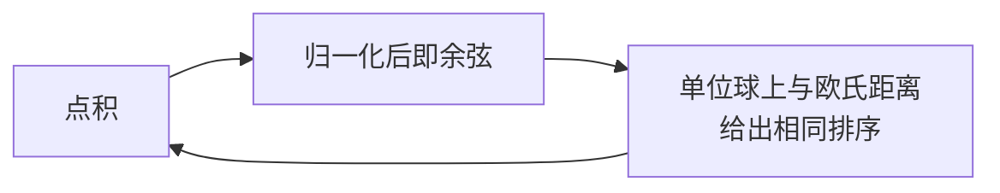

一句话版：**余弦看“方向”，点积看“方向 × 长度”，欧氏看“几何距离”**。当向量**先做 L2 归一化**时，三者在排序上几乎等价；否则就要根据业务决定“长度（范数）是否也应该影响相似度”。

---

## 1. 为什么“相似”必须量化？

把对象（词、句子、图片、商品、用户…）嵌入到 $\mathbb{R}^d$ 的向量后，很多任务都变成“**在向量空间里找最相近的点**”：

* 检索增强（RAG）：用查询向量在文档向量库里找最近邻；
* 推荐/召回：用户向量和商品向量打分；
* 聚类：把“靠得近”的向量归为一类；
* 注意力：Query 与 Key 的“相似”决定注意力权重。

但“近”到底怎么定义？常用三种：**余弦相似度、点积、欧氏距离**。

---

## 2. 三种度量的定义与直觉

### 2.1 余弦相似度（Cosine Similarity）

$$
\text{cos}(x,y)=\frac{x^\top y}{\|x\|\,\|y\|}\in[-1,1]
$$

* 直觉：**只看方向，不看长度**，像比较两支箭的夹角。
* 特性：对整体缩放不敏感（把 $x$ 放大 10 倍，余弦不变）。
* 用处：文本/多模态对比学习常把向量单位化到**单位球**上，再用余弦（或等价的点积）。

### 2.2 点积（Inner Product / Dot)

$$
\text{dot}(x,y)=x^\top y
$$

* 直觉：方向对齐时，加上“**长度越大分越高**”。
* 特性：对缩放敏感（$\alpha x\cdot y=\alpha (x\cdot y)$）。
* 用处：推荐系统打分、注意力（Scaled Dot-Product Attention）、大规模检索的 MIPS（最大内积搜索）。

### 2.3 欧氏距离（Euclidean）

$$
d(x,y)=\|x-y\|_2,\quad
d^2(x,y)=\|x\|^2+\|y\|^2-2x^\top y
$$

* 直觉：**几何上的直线距离**。
* 特性：既受方向也受长度影响；受**各维度量纲**影响（特征尺度不一会误导距离）。
* 用处：聚类/最近邻（KNN）、几何度量学习；配合**标准化/白化**效果更好。

---

## 3. 它们之间有什么关系？

三个公式彼此“勾连”：

1. **余弦 = 归一化后的点积**

$$
\text{cos}(x,y)=(\tfrac{x}{\|x\|})^\top (\tfrac{y}{\|y\|})
$$

2. **欧氏距离与点积**

$$
\|x-y\|^2=\|x\|^2+\|y\|^2-2x^\top y
$$

3. **当 $\|x\|=\|y\|=1$**（即都 L2 归一化）时：

$$
\|x-y\|^2=2(1-x^\top y)=2(1-\text{cos}(x,y))
$$

> 结论：**在单位球上，最大点积 = 最大余弦 = 最小欧氏距离**（排序等价）。

---

## 4. 一个“篮子–箭头”的生活类比

* **余弦**：两支箭是否**指向**相似方向，不管箭多长（“爱好相似度”）。
* **点积**：方向相似 + 箭越长越加分（“既兴趣相同、还活跃度高”）。
* **欧氏**：考虑“位置”的绝对差异（“人住得近不近”），单位与尺度很重要。

---

## 5. 在大模型/深度学习中的典型用法

### 5.1 注意力（Transformer）

* 相似度用**点积**，再做缩放与 softmax：

$$
\text{Attn}(Q,K,V)=\text{softmax}\!\left(\frac{QK^\top}{\sqrt{d}}\right)V
$$

* **除以 $\sqrt d$** 稳定数值（防止点积方差随维度增大而过大，使 softmax 过于尖锐）。
* 也有**余弦注意力**变体：先单位化 $Q,K$，再用温度 $\tau$ 控制锐度。

### 5.2 对比学习（SimCLR/CLIP/SimCSE）

* 常把向量**单位化**到单位球，用

$$
\exp(\langle x,y\rangle/\tau)
$$

做 InfoNCE。此时**点积与余弦等价**，$\tau$ 是“温度”调节相似度的对比度。

### 5.3 推荐/召回

* 用**点积**当打分：用户向量与商品向量点积越大，越可能点击/购买。
* 如果想减少“热门偏置”（范数大的商品被偏爱），可以：

  1. 先**单位化**再用余弦；
  2. 或在点积上加**范数正则/温度**，或者引入偏置项分离“人气”和“匹配”。

### 5.4 检索（ANN）

* **大规模向量库**：HNSW、IVF-PQ（FAISS/ScaNN 等）支持**余弦/内积/L2**检索。
* 工程常见做法：**离线单位化**嵌入 → 在线用**内积**等价实现余弦，速度更快、实现更简单。

---

## 6. 如何选择相似度？（实用决策图）

**图示说明**：先看是否归一化；若范数**不该影响**相似度，就先做**标准化/单位化**；需要 softmax 时要加**缩放/温度**稳数值。

---

## 7. 数学小练：缩放敏感性

令 $x=[1,1],\; y=[2,0]$。

* 点积：$x^\top y = 1\cdot 2 + 1\cdot 0 = 2$。
* 余弦：

$$
\frac{2}{\sqrt{2}\cdot 2}=\frac{2}{2\sqrt{2}}=\frac{1}{\sqrt{2}}\approx 0.707
$$

* 欧氏距离：

$$
\|x-y\|=\sqrt{(1-2)^2+(1-0)^2}=\sqrt{2}\approx 1.414
$$

把 $x$ 放大到 $x' = 10x=[10,10]$：

* 点积变为 $x'^\top y = 20$（**变大**）；
* 余弦仍是 $\frac{1}{\sqrt{2}}$（**不变**）；
* 欧氏变为 $\|x'-y\|=\sqrt{(8)^2+(10)^2}$（**变大**）。

> 提醒：\*\*是否希望“强度/人气/置信度”影响相似度？\*\*想要就用点积；不想要就单位化或用余弦。

---

## 8. 欧氏距离的“量纲问题”与 Mahalanobis

* 如果特征维度量纲不同（比如身高中米、体重公斤），直接用欧氏会“偏心”。
* 通常先**标准化**（零均值、单位方差）或做**白化**（用协方差的逆平方根变换），等价于在欧氏距离前加一个“度量矩阵”。
* **Mahalanobis 距离**：

$$
d_M(x,y)=\sqrt{(x-y)^\top \Sigma^{-1}(x-y)}
$$

可看作“欧氏 + 相关性矫正”，在度量学习里会**学习**这个矩阵。

---

## 9. 大规模检索的工程提示

* **单位化 + 内积**：把库向量提前 L2 归一化，在线检索直接用内积（等价余弦，快）。
* **温度/阈值校准**：对打分做温度或校准（Platt scaling 等）让阈值/概率更稳定。
* **Hubness / 各向异性**：高维易出现“枢纽”点、方向集中。可尝试**中心化**、**去前几主成分**（“all-but-the-top”）、或使用 CSLS 做校正。
* **索引选择**：

  * 延迟敏感：HNSW（内存换速度）；
  * 大库省内存：IVF-PQ（量化）；
  * 混合：IVF + HNSW 量化的组合。

---

## 10. 小结：一句话怎么选？

* **先单位化就完事**：如果不希望“长度”掺和相似度，**L2 归一化 + 余弦（或内积）**。
* **想让强度也加分**：用**点积**（必要时加温度/正则，避免“热门偏置”）。
* **几何意义与聚类**：用**欧氏**；但请先**标准化/白化**，或升级到 **Mahalanobis**。

---

## 11. 练习（带提示）

1. **等价性验证**：随机生成一批向量，分别用（a）原向量的点积、（b）单位化后的点积（余弦）、（c）单位化后的欧氏距离，比较最近邻排序的一致性。
2. **温度影响**：在对比学习损失中，扫描 $\tau\in\{0.03,0.07,0.1,0.2\}$，观察验证集 Top-k 命中率变化。
3. **量纲问题**：构造两维数据（$x_1$ 标准差 100，$x_2$ 标准差 1），对比标准化前后 KNN 分类的精度差异。
4. **热门偏置**：在点积检索上人为放大库向量的范数，观察被检索 Top-k 中“范数大”的占比；设计一个“单位化或温度校正”消除偏置。
5. **Mahalanobis 度量学习**：实现一个线性投影 $W$（等价 $M=W^\top W$），用三元组损失学习 $W$，比较与欧氏在验证集的区分度。

---

## 12. 附：关系小图（记忆卡）

**图示说明**：把向量先做 L2 归一化，**点积=余弦**；在单位球上，**最小欧氏距离 = 最大点积 = 最大余弦**（排序一致）。
