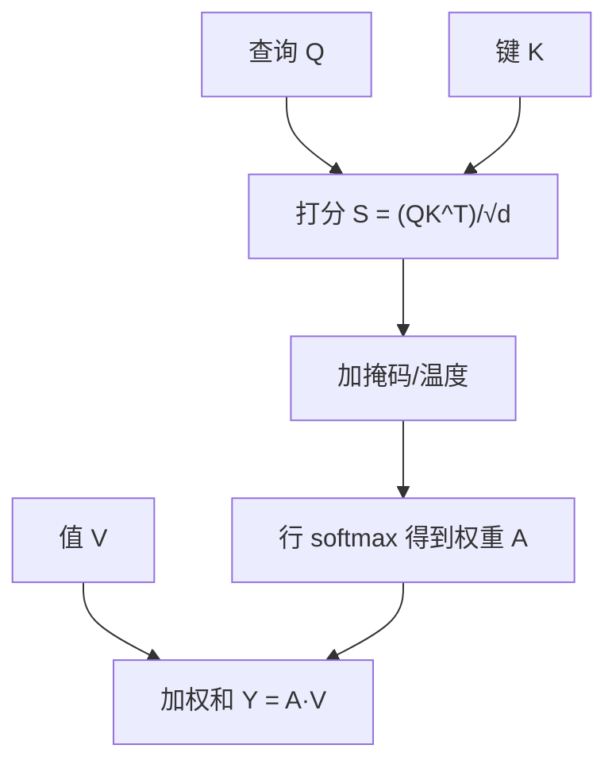
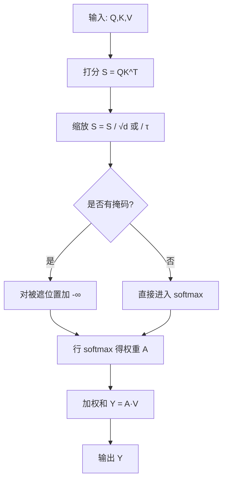

一句话版：**注意力 = 用相似度算“权重”（softmax），再做一次“加权求和”**。
Query 像“提问”，Key 像“目录索引”，Value 像“答案内容”；离你问题越相关，权重越大。

---

## 1. 从生活走进公式：聚光灯类比

想象黑暗舞台上有多位演员（Value），而你手里有一束聚光灯（Query）。
你先用“相似度”去衡量**谁与剧情最相关**（把 Query 与每位演员的 Key 比一比），再用 **softmax** 把这些相似度变成**非负且和为 1 的权重**，最后将所有演员的表现做一遍**加权求和**，得到舞台上此刻的“摘要”（输出）。

---

## 2. 点积注意力（Scaled Dot-Product Attention）

### 2.1 单个查询的标量表达

给定查询 $q\in\mathbb{R}^{d}$，一组键值对 $\{(k_i, v_i)\}_{i=1}^m$，定义

$$
s_i \;=\; \frac{q^\top k_i}{\sqrt{d}},\qquad
\alpha_i \;=\; \frac{e^{s_i}}{\sum_{j=1}^m e^{s_j}},\qquad
\mathrm{Attn}(q) \;=\; \sum_{i=1}^m \alpha_i\, v_i.
$$

* $s_i$：相似度打分（点积，除以 $\sqrt d$ 做数值缩放）。
* $\alpha_i$：softmax 权重，非负且 $\sum_i \alpha_i=1$。
* 输出是对 Value 的**加权平均**，可视为“概率期望”。

> **为什么除以 $\sqrt d$**：若 $q,k_i$ 的分量方差为 1，点积的方差 $\propto d$。维度大时 $s_i$ 会过大，使 softmax 过于尖锐、梯度消失；除以 $\sqrt d$ 能把方差拉回到常数数量级。

### 2.2 矩阵形式（整批/整句）

把所有查询堆成 $Q\in\mathbb{R}^{n\times d}$、所有键/值堆成 $K\in\mathbb{R}^{m\times d},\ V\in\mathbb{R}^{m\times d_v}$：

$$
S \;=\; \frac{QK^\top}{\sqrt d}\in\mathbb{R}^{n\times m},\qquad
A \;=\; \mathrm{softmax}_{\text{row}}(S)\in\mathbb{R}^{n\times m},\qquad
Y \;=\; AV\in\mathbb{R}^{n\times d_v}.
$$

softmax 在**行**上做（每个查询一行），保证每行权重和为 1。



**图示说明**：注意力的流水线——点积打分 →（可选掩码/温度）→ softmax → 权重加权的 Value 求和。

---

## 3. softmax：把“分数”变成“概率”

### 3.1 性质

* **非负**与**和为 1**：给加权和以“概率”含义。
* **平移不变性**：$\mathrm{softmax}(s+c\mathbf{1})=\mathrm{softmax}(s)$。
* **温度 $\tau$**：$\mathrm{softmax}(s/\tau)$；$\tau\!\downarrow$ 更尖锐、$\tau\!\uparrow$ 更平滑。
* **梯度**（一行）：$\displaystyle \frac{\partial \alpha_i}{\partial s_j}= \alpha_i(\delta_{ij}-\alpha_j)$。

### 3.2 数值稳定（log-sum-exp）

计算 $ \alpha_i=\exp(s_i-\max s)/\sum_j \exp(s_j-\max s)$ 避免上溢；实现中会先**减去行最大值**再做 exp。

---

## 4. 一个 3 键 1 查询的小算例

设 $d=2$，$\sqrt d=\sqrt2\approx 1.414$。
取 $q=\frac{1}{\sqrt2}[1,1]$，$k_1=[1,0]$、$k_2=[0,1]$、$k_3=\frac{1}{\sqrt2}[1,1]$。
点积与缩放：

$$
q^\top k_1=q^\top k_2=\tfrac{1}{\sqrt2}\approx 0.707\Rightarrow s_1=s_2\approx 0.5,\quad
q^\top k_3=1\Rightarrow s_3\approx 0.707.
$$

softmax（约）：

$$
\alpha \approx \frac{(e^{0.5},e^{0.5},e^{0.707})}{e^{0.5}+e^{0.5}+e^{0.707}}
\approx (0.309,\,0.309,\,0.381).
$$

若 $v_1=[1,0], v_2=[0,1], v_3=\frac{1}{\sqrt2}[1,1]$，则

$$
y \approx 0.309[1,0]+0.309[0,1]+0.381\tfrac{1}{\sqrt2}[1,1],
$$

得到一个**朝向对角线**的向量——与 Query 的语义方向一致。

---

## 5. 掩码（Mask）：两种常见用法

* **Padding Mask**：把补齐 token 对应的 $s_i$ 加上 $-\infty$（或一个大负数），使其 softmax 权重为 0。
* **因果 Mask**（自回归）：强制只能看“过去”，对未来位置加 $-\infty$，保证不泄露信息。

---

## 6. 从概率与核回归视角理解注意力

把 $\alpha_i$ 视为对位置 $i$ 的**后验权重**（一组分布），输出

$$
y=\sum_i \alpha_i v_i
$$

是以这组分布为权重的**期望值**。
如果把相似度看作核函数 $k(q,k_i)=\exp(q^\top k_i/\tau)$，注意力就是一种**自适应的核回归（Nadaraya–Watson）**：距离（相似度）越近，权重越大。

---

## 7. 多头注意力（Multi-Head）

多头就是**在不同的线性子空间里并行做一次注意力**，再把结果拼接：

$$
\mathrm{head}_h = \mathrm{Attn}(QW^Q_h,\ KW^K_h,\ VW^V_h),\quad
\mathrm{MHA}(Q,K,V)=\mathrm{Concat}(\mathrm{head}_1,\dots,\mathrm{head}_H)W^O.
$$

好处：不同头可专注不同关系（语法、长距依赖、位置模式等）。

---

## 8. 工程实现要点（PyTorch 伪代码）

```python
def scaled_dot_product_attention(Q, K, V, mask=None, tau=None):
    # Q: [B, n, d], K,V: [B, m, d/dv]
    d = Q.size(-1)
    scale = (d ** 0.5) if tau is None else (1.0 * tau)  # τ 控制“温度”
    # 打分并缩放
    S = Q @ K.transpose(-2, -1) / scale               # [B, n, m]
    # 掩码：加上一个很大的负数
    if mask is not None:
        S = S.masked_fill(mask==0, float('-inf'))
    # 稳定 softmax：多数库内部会做减最大值
    A = torch.softmax(S, dim=-1)                      # [B, n, m]
    A = torch.dropout(A, p=dropout_p, train=self.training)  # 可选
    Y = A @ V                                         # [B, n, dv]
    return Y, A
```

> 要点：**先打分→加掩码→softmax→（可选 dropout）→加权和**。
> 数值上：更高的稳定性来自\*\*缩放、掩码、稳定 softmax（logsumexp）\*\*与合适的 dtype（bf16/fp32 归约）。

---

## 9. 复杂度与改良一瞥

* **计算/显存复杂度**：自注意力对长度 $n$ 是 $O(n^2)$（存 $n\times n$ 的权重矩阵）。
* **常见优化**：

  * **局部/稀疏注意力**（滑窗/块稀疏），把复杂度降到 $O(n\log n)$ 或 $O(n)$；
  * **核化/线性注意力**（把 softmax 近似为可分解核），使复杂度接近 $O(n)$；
  * **FlashAttention**：重排计算次序与块化，减少中间张量、提升数值稳定与速度。

---

## 10. 反向传播的关键结构

* softmax 的雅可比：$\nabla_s \alpha = \mathrm{diag}(\alpha)-\alpha\alpha^\top$。
* 注意力对 $V$ 的梯度最直接：$\nabla_V \mathcal{L} = A^\top \nabla_Y \mathcal{L}$。
* 对 $Q,K$ 的梯度经由 $S=QK^\top/\sqrt d$ 反传，并穿过 softmax 的雅可比；因此**缩放与稳定 softmax**对梯度质量至关重要。

---

## 11. 注意力计算（含掩码与温度）



**图示说明**：流程从 Q/K 的点积打分开始，经过缩放、掩码与 softmax 得到权重，再与 V 做加权和得到输出。

---

## 12. 易错点与避坑清单

* **忘了缩放** $/\sqrt d$ → softmax 过尖锐、梯度不稳。
* **掩码位置**不对 → 要在 softmax **前**加 $-\infty$。
* **fp16 数值溢出** → 使用 **bf16** 或者在归约阶段保 **fp32**。
* **维度/广播**错位 → 确保 `Q @ K^T` 的最后两维对齐，掩码形状可广播到 $[B,n,m]$。
* **把注意力当求和**而不是**加权平均** → 记住 softmax 的“和为 1”。

---

## 13. 练习（带提示）

1. **温度扫描**：固定 $Q,K$ 随机矩阵，令 $\tau\in\{0.5,1,2\}$，画出权重分布的熵随 $\tau$ 变化（$\tau\!\downarrow$ 熵降低）。
2. **稳定 softmax 实验**：构造极大/极小打分，比较“直接 softmax”与“减最大值再 softmax”的数值差异与梯度是否为 NaN。
3. **核回归视角**：用 $\alpha_i\propto \exp(-\|q-k_i\|^2/\tau)$ 代替点积，观察对噪声与局部性的影响。
4. **因果掩码**：实现自回归 mask，验证在训练时不会“偷看”未来 token。
5. **多头可视化**：训练一个小 Transformer，在不同头上可视化 $A$ 的热力图，观察它们关注的模式差异。

---

## 14. 小结（带走三句话）

1. **注意力 = softmax(相似度) → 加权和(Value)**，本质是**概率加权的期望**。
2. **缩放与稳定**是工程生命线：$/\sqrt d$、掩码位置、log-sum-exp、合适 dtype。
3. **多头让模型在不同子空间看世界**；理解 softmax 的形状与温度，等于抓住了注意力的“音量旋钮”。
