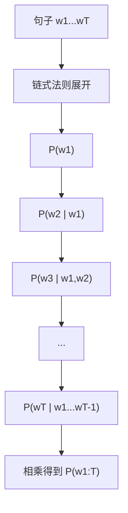
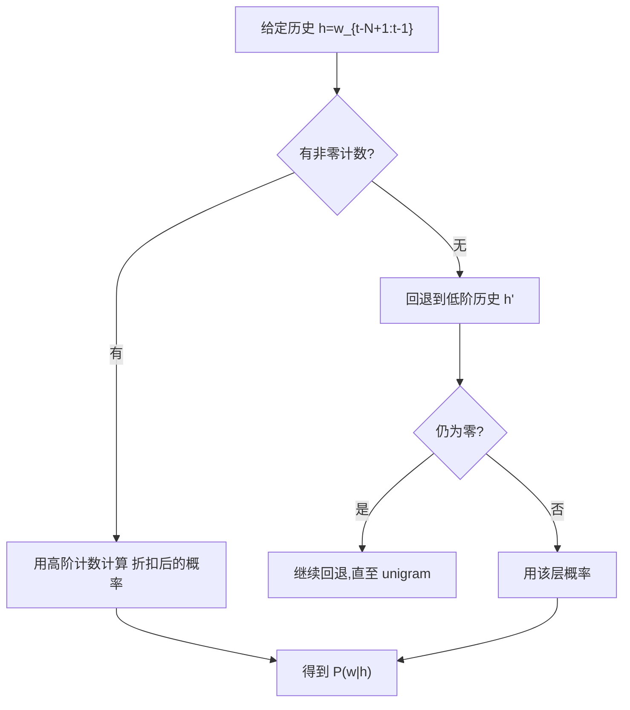

*——从链式法则到 N-gram，再到现代大模型的“前世今生”*

> 一句话版：**语言模型的核心是对序列的概率建模**。用**条件概率的链式法则**把长句拆成一串“下一个词”的条件概率；**N-gram**用“只看最近 $N-1$ 个词”的马尔可夫近似来估计它们，并用**平滑**解决稀疏。

---

## 1. 为什么要给句子一个“概率”？

把一句话当作一个随机序列 $w_{1:T}=(w_1,w_2,\dots,w_T)$。一个\*\*语言模型（LM）\*\*要做的就是给出

$$
P(w_{1:T}) \quad\text{或}\quad P(w_T\mid w_{1:T-1})
$$

这在自动补全、纠错、翻译、对话、RAG 重排序等任务里都是“底层评分器”。

类比：超市收银台排队。下一个来的人（下一个词）多半**由前面的人决定**（上下文），而不是整个城市的人口（全词表）。

---

## 2. 链式法则：把“大概率”拆成“小条件”

**条件概率链式法则**把整句概率拆为“逐词生成”的乘积：

$$
P(w_{1:T})=\prod_{t=1}^T P\!\left(w_t \mid w_{1:t-1}\right).
$$

这既是**自回归语言模型**（GPT 类）的数学骨架，也是训练时“逐词预测”的依据。

**图示说明**：链式法则把整句概率拆成一串条件概率，适合“逐词”建模与解码。

---

## 3. N-gram：马尔可夫近似的老而弥坚

### 3.1 核心假设（阶数 $N$）

**马尔可夫近似**：只看最近 $N-1$ 个词作为“历史”（history）

$$
P(w_t\mid w_{1:t-1}) \approx P(w_t\mid w_{t-N+1:t-1}).
$$

* **Unigram** ($N=1$)：完全不看上下文。
* **Bigram/Trigram**：只看前 1/2 个词。
* **N 越大**，记忆更长，但**数据更稀疏**、存储更大。

### 3.2 频数最大似然（MLE）

给定语料，记 $c(\cdot)$ 为计数：

$$
\hat P_{\text{MLE}}(w_t\mid h) = \frac{c(h, w_t)}{c(h)}, \quad h=w_{t-N+1:t-1}.
$$

**问题**：未见过的 $n$-gram 使分母非零而分子为零 → 概率为 0，真实生成中却不可能“绝对不出现”。

### 3.3 用对数求和更稳

训练/解码时常用**对数概率**：

$$
\log P(w_{1:T})=\sum_{t=1}^T \log P(w_t\mid h_t),
$$

避免下溢，并便于与交叉熵/困惑度关联。

---

## 4. 平滑：把“看不见的样本”分一点概率

### 4.1 最简单：加法平滑（Add-$\alpha$）

$$
P_{\text{add-}\alpha}(w\mid h)=\frac{c(h,w)+\alpha}{c(h)+\alpha\,|V|}
$$

* $\alpha=1$ 是 **Laplace**；$\alpha\in(0,1)$ 更常见。
* 优点：简单；缺点：会把概率“抹平”过度。

### 4.2 绝对折扣（Absolute Discounting）

$$
P(w\mid h)=\frac{\max(c(h,w)-D,0)}{c(h)} + \lambda(h)\,P_{\text{back}}(w\mid h')
$$

* 从非零计数里**统一扣掉 $D$**，把总扣除质量回流给“回退分布” $P_{\text{back}}$（通常是更低阶 $n$-gram）。
* $\lambda(h)=\dfrac{D\cdot N_+(h,*)}{c(h)}$，其中 $N_+(h,*)$ = 以 $h$ 开头的不同后续词的个数。

### 4.3 Kneser–Ney（KN）与改进 KN（Interpolated KN）

Kneser–Ney 的关键是**回退分布不是普通的低阶 MLE**，而是\*\*“继续概率”（continuation probability）\*\*：

$$
P_{\text{cont}}(w)=\frac{\text{出现过 }(\ast,w)\text{ 的不同历史数}}{\text{所有不同 bigram 类型数}}.
$$

直觉：一个词若在**很多不同上下文**里当过“续词”，它作为续词的**基本概率**更高。
**插值版 KN（最常用）**（以 trigram 为例）：

$$
P_{\text{iKN}}(w_t\mid w_{t-2},w_{t-1})
=\frac{\max(c- D,0)}{c(w_{t-2},w_{t-1})}
+\lambda(w_{t-2},w_{t-1})\,P_{\text{iKN}}(w_t\mid w_{t-1}),
$$

bigram 层再插值到 unigram 的 **$P_{\text{cont}}$**。
优点：对**低频与未见组合**更鲁棒，是经典 SOTA 的 $n$-gram 平滑。

### 4.4 其他平滑

* **Katz 回退**、**Witten–Bell**、**Good–Turing**…思路皆在“**从见过的地方抠概率，分给没见过的**”。

---

## 5. 回退 vs 插值（一个小流程）

**图示说明**：**回退**是“用更短的历史来估计”，**插值**是在每一层**同时混入低阶分布**（而不是只有零计数时才回退）。

---

## 6. 一个玩具算例（Trigram + 简单平滑）

语料（极小，仅演示）：
“**我 爱 北 京**”、“**我 爱 上 海**”、“**你 爱 上 海**”。

* 统计 trigram：

  * $c(\text{我,爱,北})=1$，$c(\text{我,爱,上})=1$
  * $c(\text{你,爱,上})=1$ …
* 若用 MLE，估计：

  $$
  P(\text{北}\mid \text{我,爱})=\frac{1}{2},\quad
  P(\text{上}\mid \text{我,爱})=\frac{1}{2},\quad
  P(\text{京}\mid \text{爱,北})=\frac{1}{1}=1.
  $$
* 但 $P(\text{京}\mid \text{我,爱})=0$（没见过），真实语义并非不可能。
* 加绝对折扣或 KN 后，$P(\text{京}\mid \text{我,爱})$ 会得到**非零**，因为“**京**”在 bigram“**北,京**”里高频，且“京”作续词的**上下文多样性**也可能较大。

---

## 7. 评价指标：交叉熵与困惑度（Perplexity）

对测试集 $w_{1:T}$，**平均负对数似然**（交叉熵）：

$$
\mathcal{H}=-\frac{1}{T}\sum_{t=1}^T \log P(w_t\mid h_t).
$$

**困惑度（PP）**：

$$
\mathrm{PP}=\exp(\mathcal{H}) \quad(\text{自然底});\quad \mathrm{PP}=2^{\mathcal{H}_2} \ (\text{以 2 为底}).
$$

直觉：模型“平均有多少个等可能选择”。PP 越低越好。
注意：PP 对**分词方式/词表**敏感（BPE、WordPiece 会改变尺度），比较时要统一切分。

---

## 8. 训练与解码：从 N-gram 到神经 LM

### 8.1 训练目标（最大似然）

无论 N-gram 还是神经 LM，训练都是**最大化 $\sum_t \log P(w_t\mid h_t)$**（也就是最小化交叉熵/PP）。

### 8.2 解码（生成）

* **贪心**：每步取 $\arg\max P(w_t\mid h_t)$。
* **采样**：按分布采样（Top-k、核采样 Top-p）。
* **Beam Search**：保留若干前缀的累积对数概率，搜索更全。
  N-gram 的打分直接查表；神经 LM 则通过网络计算 $P(w_t\mid h_t)$。

---

## 9. 神经语言模型如何“延展”链式法则

* **同一骨架**：神经 LM（RNN/LSTM/Transformer）也用链式法则，只是用神经网络来近似 $P(w_t\mid w_{1:t-1})$。
* **自注意力**代替固定阶马尔可夫：注意力能选择性“关注”远距离上下文，突破 $n$-gram 的窗口限制。
* **平滑的角色**由**参数化分布**承担：网络能给**未见过的组合**赋予合理概率。
* **子词/BPE** 缓解 OOV（未知词）问题，PP 与评测更稳定。

> 连接点：**Kneser–Ney 的“续词多样性”**与**注意力的上下文选择**在“给不可见组合合理概率”上目标一致，只是手段不同：统计 vs 表征学习。

---

## 10. 实战 Checklist

* [ ] 语料规范化：大小写、标点、数字、空白、繁简。
* [ ] 词表与切分：WordPiece/BPE；对 N-gram 可设 UNK 以降维。
* [ ] 计数与剪枝：剪去极低频 $n$-gram，控制内存。
* [ ] 平滑选择：优先 **插值 Kneser–Ney**；小数据可试 Witten–Bell。
* [ ] 评测：训练/验证/测试切分；报告 PP 与覆盖率。
* [ ] 工程：使用 log 概率；注意并行计数（MapReduce/大表），磁盘布局（Trie/DAWG）。
* [ ] 融合：统计 LM 可与神经 LM **插值**（logit 融合或浅层融合）提升稳健性。

---

## 11. 练习（带提示）

1. **自己实现 Bigram**：对一份小中文语料做分词、计数，写出加-$\alpha$ 与绝对折扣的实现，比较 PP。
2. **Kneser–Ney 手算**：构造 5～10 句迷你语料，手算 bigram KN 的 $P_{\text{cont}}(w)$ 与 $\lambda(h)$。
3. **插值 vs 回退**：在同一语料上实现 Katz 回退与插值 KN，对照零计数上下文的预测差异。
4. **链式法则可视化**：给定一句话，画出每个词的 $-\log P(w_t\mid h_t)$ 柱状图，观察是哪些位置“最难预测”。
5. **与神经 LM 融合**：训练一个小型 LSTM LM，和 trigram KN 进行对数线性插值，观察 PP 与生成质量的变化。

---

## 12. 小结（带走三句话）

1. **链式法则**把序列概率拆成“逐词条件概率”，是一切语言模型的共同底层。
2. **N-gram**用**局部马尔可夫** + **平滑**解决稀疏，**Kneser–Ney**是经典强 baseline。
3. **神经 LM**承袭同一分解，用表征学习与注意力替代手工计数与平滑，能跨越更长、更多样的上下文。
