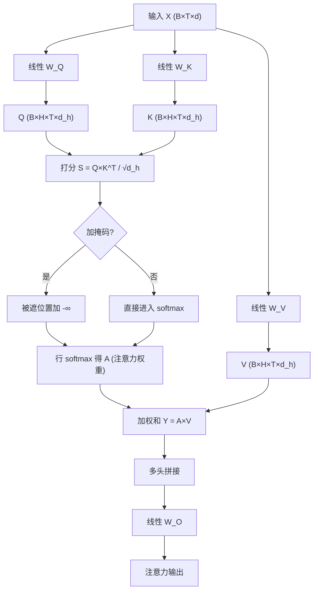

*——把“注意力+前馈”拆成几块清晰的矩阵乘法*

> 一句话版：**Transformer** 的一层基本就是三件事：
> （1）把输入 $X$ 线性变换成 $Q,K,V$；（2）用 $QK^\top$ 做**打分**，softmax 后当**权重**去加权 $V$；（3）对每个位置做一套**两层线性+非线性**的前馈网络（FFN）。这三件事统统都能写成干净的**矩阵乘法**。

---

## 0. 记号与形状（Shapes 一目了然）

* 批大小：$B$，序列长度：$T$，隐藏维：$d$
* 头数：$H$，每头维：$d_h=d/H$
* 输入层（或上一层输出）：$X\in\mathbb{R}^{B\times T\times d}$

> 小贴士：只要你能把**每一步的张量形状**说清楚，Transformer 的实现就基本稳了。

---

## 1. 自注意力（Self-Attention）的矩阵表达

### 1.1 从 $X$ 到 $Q,K,V$

对每个位置的向量做仨线性变换（共享权重）：

$$
Q=XW_Q,\quad K=XW_K,\quad V=XW_V,
$$

其中 $W_Q,W_K,W_V\in\mathbb{R}^{d\times d}$。
按多头实现时常用**一次线性**得到 $\mathbb{R}^{d\to H\cdot d_h}$，再 reshape 成 $(B,H,T,d_h)$。

### 1.2 打分、缩放、softmax、加权和

对单头（先把 batch/head 折叠不写）：

$$
S=\frac{QK^\top}{\sqrt{d_h}}\in\mathbb{R}^{T\times T},\quad
A=\mathrm{softmax}_{\text{row}}(S),\quad
Y=A\,V\in\mathbb{R}^{T\times d_h}.
$$

* **缩放 $/\sqrt{d_h}$**：防止维度大时分数过大、softmax 过尖。
* **掩码**：在 softmax 前对无效位置把 $S$ 加 $-\infty$。

### 1.3 多头 + 输出投影

多头就是并行做上面流程，再拼接：

$$
Y_{\text{all}}=\mathrm{Concat}(Y^{(1)},\dots,Y^{(H)})\in\mathbb{R}^{T\times(Hd_h)}=\mathbb{R}^{T\times d},
$$

$$
\text{AttnOut}=Y_{\text{all}}W_O,\quad W_O\in\mathbb{R}^{d\times d}.
$$

**图示说明**：从 $X$ 线性得到 $Q,K,V$，做点积打分→掩码→softmax→对 $V$ 加权求和，多头并行后再线性投影。

---

## 2. 残差与层归一（Pre-LN 更稳）

现代实现多为 **Pre-LN**（在子层前做 LayerNorm）：

$$
\begin{aligned}
U&=X+\mathrm{MHA}(\mathrm{LN}(X)),\\
Y&=U+\mathrm{FFN}(\mathrm{LN}(U)).
\end{aligned}
$$

* **LN 位置**（Pre-LN vs Post-LN）影响梯度传递稳定性；Pre-LN 训练更容易、深层更稳。
* **残差**让网络学“增量”，优化景观更好。

---

## 3. 前馈网络（FFN）：按位置独立的两层 MLP

对每个 token 单独做同一套线性+非线性：

$$
\mathrm{FFN}(x)=\sigma(xW_1+b_1)\,W_2+b_2,
$$

$W_1\in\mathbb{R}^{d\times d_{\mathrm{ff}}}$（通常 $d_{\mathrm{ff}}\approx 4d$）、
$W_2\in\mathbb{R}^{d_{\mathrm{ff}}\times d}$，$\sigma$ 常用 **GELU**/ReLU/SiLU。

* 本质上是**对每行做同构的两次矩阵乘法**（等价 1×1 卷积）。
* 可用 **门控**（Gated-MLP/GEGLU/SwishGLU）提升表达。

---

## 4. 位置与相对位置信息的矩阵化

* **绝对位置**：位置嵌入 $P[t]$ 与词嵌入相加，属于输入加法，不改变矩阵形状。
* **相对位置偏置/ALiBi**：在打分矩阵 $S$ 上**直接相加一个偏置矩阵** $B$（按 $i-j$ 或窗口构造），数学上就是 $S\leftarrow S+B$。
* **RoPE（旋转位置编码）**：把 $Q,K$ 的每对坐标做二维旋转，相当于乘以位置相关的**正交块对角矩阵**，仍是线性变换。

---

## 5. 复杂度与显存：为什么要 FlashAttention

* 单头注意力：

  * 计算量 $\approx O(T^2d_h)$，存储量 $\approx O(T^2)$（权重矩阵）。
* 多头与批次：$\approx O(B\,H\,T^2\,d_h)$。
* **FlashAttention** 思路：**分块**重算，避免显式 materialize $A$，在数值安全的范式下（块内减最大值）把 softmax 归一化也分块完成 → **更省显存且更快**，数学不变，执行顺序优化。

---

## 6. 一个 3 位置、2 维的小算例（单头）

令 $T=3, d_h=2$，

$$
Q=\begin{bmatrix}1&0\\ 1&1\\ 0&1\end{bmatrix},\quad
K=\begin{bmatrix}1&0\\ 0&1\\ 1&1\end{bmatrix},\quad
V=\begin{bmatrix}1&0\\ 2&1\\ 0&1\end{bmatrix}.
$$

打分（未缩放，便于心算）：

$$
S=QK^\top=
\begin{bmatrix}
1&0&1\\
1&1&2\\
0&1&1
\end{bmatrix}.
$$

对每行做 softmax（行最大值相减以稳定）：

* 第 1 行：$\mathrm{softmax}[1,0,1]=[0.422,\,0.155,\,0.422]$
* 第 2 行：$\mathrm{softmax}[1,1,2]=[0.211,\,0.211,\,0.578]$
* 第 3 行：$\mathrm{softmax}[0,1,1]=[0.155,\,0.422,\,0.422]$

输出 $Y=A V$：以第 2 行为例，

$$
y_2=0.211[1,0]+0.211[2,1]+0.578[0,1]\approx[0.633,\,0.789].
$$

直观：第二个位置**最关注第三个键值**（分数 2 最大），输出更像 $v_3$ 的方向。

---

## 7. Einsum 视角（把代码和数学对上号）

* $Q=XW_Q$：`einsum('btd,df->btf', X, Wq)`
* $S=\tfrac{QK^\top}{\sqrt{d_h}}$：`einsum('bhid,bhjd->bhij', Q, K) / sqrt(dh)`
* $Y=A V$：`einsum('bhij,bhjd->bhid', A, V)`
* 多头拼接：reshape/permute；输出投影：`einsum('btd,df->btf', Ycat, Wo)`。

> 一行代码背后就是一个清晰的矩阵乘法；确认 **维度标签**是否写对，是排错第一步。

---

## 8. 从“矩阵形态”看几种常见变体

* **相对位置偏置**：$S\leftarrow S+B$，其中 $B_{ij}=g(i-j)$ 或查表。
* **ALiBi**：$B_{ij}=-m\cdot (j-i)$（只惩罚远处），保持外推能力。
* **线性注意力**：把 $\mathrm{softmax}(QK^\top)$ 近似为 $\phi(Q)\phi(K)^\top$，从而先做 $KV$ 聚合再乘 $Q$，复杂度近似 $O(T)$。
* **门控注意力**：在 $A$ 或 $V$ 前后加逐元素门控矩阵（本质还是逐元素或线性算子）。

---

## 9. 工程避坑清单

* [ ] **softmax 前掩码**：在 $S$ 上加 $-\infty$，别在 $A$ 上乘 0。
* [ ] **缩放维度**：用 $d_h$ 而不是 $d$。
* [ ] **数值精度**：归约（如 softmax 的归一化、注意力权重求和）用 fp32 更稳。
* [ ] **维度拍平**：多头的 `view/reshape/permute` 顺序对齐，避免 head 与序列维混淆。
* [ ] **残差顺序**：注意 Pre-LN/ Post-LN 的不同；多数现代实现是 Pre-LN。
* [ ] **不要显式求逆**：任何地方遇到“解线性系统”，优先用分解（与数值计算章节呼应）。

---

## 10. 练习（带提示）

1. **手算注意力**：自己造一个 $T=4,d_h=2$ 的 $Q,K,V$，计算 $A$ 与 $Y$，对比把某一列 mask 之后的变化。
2. **相对位置偏置**：实现 $B_{ij}=-|i-j|/r$，观察长距离抑制对注意力热力图的影响。
3. **多头 vs 单头**：固定参数量，从 $H=1$ 到 $H=8$ 训练一层自注意力做小任务（如复制/配对），比较收敛速度。
4. **Flash 思路**：不 materialize $A$，写一个“分块 softmax”的前向，验证与标准实现数值一致。
5. **RoPE 的线性实现**：把二维旋转写成固定的块对角矩阵，验证等价于常见实现。

---

## 11. 小结

1. **注意力 = softmax($QK^\top/\sqrt{d_h}$) 对 $V$ 的加权和**，本质全是**矩阵乘法**。
2. **多头=并行子空间**，FFN 是**按位置独立的两层线性**；残差+Pre-LN 保证可训练性。
3. 变体大多是对 $S$（加偏置/旋转/核化）的改造，**形状不变、语义更强或更快**。
