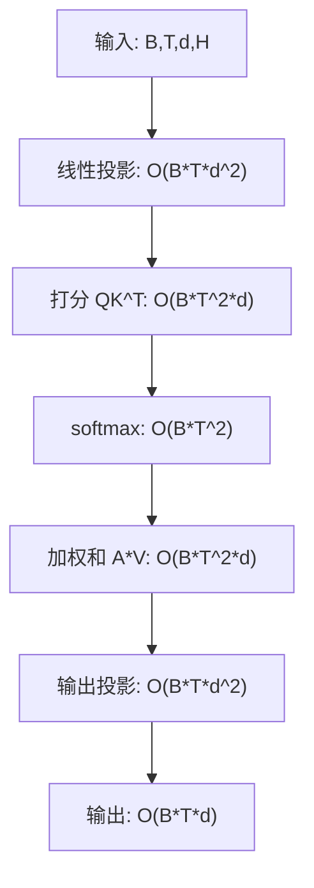
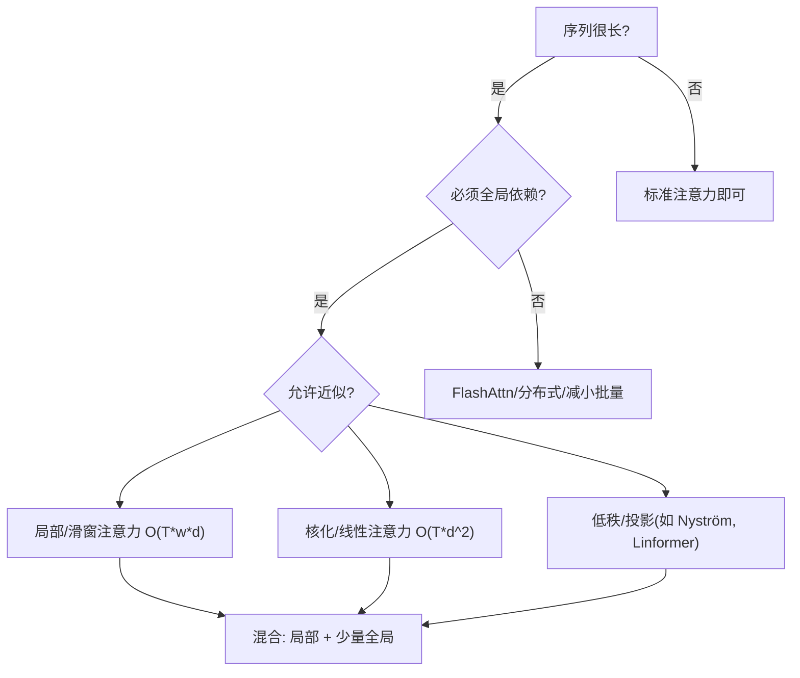

*——为什么“长序列很贵”，以及我们能做些什么*

> 一句话版：标准自注意力的**时间/显存复杂度都随序列长度 $T$ 呈二次增长**（$\sim O(T^2)$）。训练时，显存常被 $T\times T$ 的注意力矩阵与中间激活占满；推理时，虽然可用 **KV Cache** 把时间复杂度降到**线性按步增长**，但**显存仍随历史长度线性增长**。解决之道要么**减少二次项**（稀疏/低秩/核化），要么**减少 I/O**（FlashAttention、重算、检查点等）。

---

## 1. 先把“账”算清楚：每一步都要花什么钱？

设批大小 $B$，长度 $T$，隐藏维 $d$，头数 $H$，每头维 $d_h=d/H$。

### 1.1 自注意力（单层，训练前向）的主要开销

* $Q,K,V$ 线性变换：

  $$
  X\in\mathbb{R}^{B\times T\times d}\ \to\ (Q,K,V)\in\mathbb{R}^{B\times T\times d}
  $$

  FLOPs $\approx 3\cdot B\cdot T\cdot d\cdot d$（三次 $d\!\to\! d$ 线性）。

* 打分与权重（对所有头汇总后）：

  $$
  S=\frac{QK^\top}{\sqrt{d_h}} \quad\Rightarrow\quad O(B\cdot H\cdot T^2\cdot d_h)=O(B\cdot T^2\cdot d)
  $$

  $$
  A=\mathrm{softmax}(S)\quad\Rightarrow\quad O(B\cdot T^2)
  $$

* 加权求和：

  $$
  Y=A\,V \quad\Rightarrow\quad O(B\cdot H\cdot T^2\cdot d_h)=O(B\cdot T^2\cdot d)
  $$

* 多头拼接 + 输出投影 $W_O$：
  $\approx B\cdot T\cdot d\cdot d$。

**合计主项**（忽略常数）：

$$
\boxed{\text{Attn FLOPs}\ \sim\ O(B\,T^2\,d)\ +\ O(B\,T\,d^2)}
$$

其中 $O(B\,T^2\,d)$ 来自 $QK^\top$ 与 $A V$，$O(B\,T\,d^2)$ 来自线性投影。

> **因果 Mask** 只把 $T^2$ 前的常数减半（上三角/下三角），**级别仍是 $O(T^2)$**。

### 1.2 前馈网络（FFN）

两层按位置独立的 MLP，设 $d_{\text{ff}}\approx 4d$：

$$
\text{FFN FLOPs}\ \approx 2\cdot B\cdot T\cdot d\cdot d_{\text{ff}}\ \approx\ 8\cdot B\cdot T\cdot d^2.
$$

### 1.3 谁在“主宰”算力：注意力 vs FFN？

比较阶数：

* 注意力主项：$\sim 2\,B\,T^2\,d$
* FFN 主项：$\sim 8\,B\,T\,d^2$

二者相当的**拐点**在

$$
2\,T^2\,d \approx 8\,T\,d^2\quad\Rightarrow\quad \boxed{T \approx 4d}.
$$

* 当 $T \ll 4d$：**FFN 更占 FLOPs**（小序列/大维度）。
* 当 $T \gg 4d$：**注意力成为瓶颈**（长序列场景）。

> 例：$d=1024$ 时拐点在 $T\approx 4096$。当 $T=2\text{k}$ 时，多数算力花在 FFN；当 $T=8\text{k}$ 时，注意力成为主导。

---

## 2. 显存（内存）复杂度：是谁在吃内存？

训练时需要存下**激活**以便反传：

* 注意力权重 $A$：尺寸 $B\times H\times T\times T$，**显存 $\sim O(B\,H\,T^2)$**。
* $Q,K,V,Y$：尺寸 $B\times H\times T\times d_h$，合计 $\sim O(B\,T\,d)$。
* FFN 中间激活（如 GELU 前后）：$\sim O(B\,T\,d_{\text{ff}})$。

> 粗略记忆：**二次项**只有注意力矩阵 $A$（或等价中间张量），其余基本是线性。

### 2.1 一个具体算例（只看注意力矩阵）

* $B=1,\ H=16,\ T=4096$。
* $A$ 的元素数：$16\times 4096^2 = 268{,}435{,}456$。
* 若 FP16（2 字节），仅 $A$ 就占 $\approx 512\,\text{MiB}$。

> 这还没算 $Q,K,V$ 与 FFN 激活，多层叠加后你就知道**为什么 24GB 显存不经用**。

### 2.2 训练期的“省内存”手段

* **激活检查点**（checkpointing）：丢弃一部分中间激活，反向时**重算**，以**时间换空间**。
* **FlashAttention**：分块计算 $QK^\top$ / softmax / $A V$，**避免显式存 $A$**，将显存从 $O(T^2)$ 降到接近 $O(T\,d)$，同时**减少 HBM 读写**（I/O 成本）。
* 混合精度（bf16/fp16）+ **归约用 fp32** 保精度。

---

## 3. 推理复杂度：KV Cache 的“线性按步增长”

自回归生成第 $t$ 个 token 时：

* 计算当前 $q_t$：$O(d^2)$（线性层）。
* 与历史 $K_{1:t}$ 做点积：每头 $O(t\cdot d_h)$，合计 $O(t\cdot d)$。
* 读出 $V_{1:t}$ 做加权和：同阶 $O(t\cdot d)$。
* **KV Cache 显存**：每步存 $(k_t,v_t)$，总计 $\sim O(H\cdot T\cdot d_h)=O(T\cdot d)$。

$$
\boxed{\text{Per-token Time}\ \sim\ O(d^2) + O(t\,d),\quad \text{KV 显存}\ \sim\ O(T\,d)}
$$

> 当 $t$ 很大时（长上下文），**带宽与缓存大小**成为瓶颈，吞吐随 $t$ 下降。

### 3.1 降低推理显存/带宽的工程方案

* **MQA/GQA**（Multi-Query / Grouped-Query）：多个头**共享 K/V**（或按组共享），将缓存从 $O(H\,T\,d_h)$ 降到 $O(T\,d_h)$ 或 $O(\frac{H}{g}\,T\,d_h)$。
* **KV 压缩/量化**：8-bit/4-bit KV；或**滑窗/裁剪**远端缓存。
* **分块解码**：把点积与加权和做成**流式分块**，降低一次性带宽峰值。

---

## 4. 交叉注意力与复杂度形状

在编码器-解码器结构中，交叉注意力打分矩阵尺寸是 $T_{\text{dec}}\times T_{\text{enc}}$，
复杂度 $\sim O(B\cdot T_{\text{dec}} \cdot T_{\text{enc}} \cdot d)$。
当源序列很长（例如多段文档检索）时，**交叉注意力也会成为瓶颈**。

---

## 5. 一个“数量级感觉”的 FLOPs 例子

取 $B=1,\ T=4096,\ d=1024$。

* 注意力主项：
  $2\cdot T^2\cdot d \approx 2\cdot 16{,}777{,}216\cdot 1024 \approx \mathbf{3.44\times 10^{10}}$ 次乘加（$\sim 34$ GFLOPs）。
* FFN 主项（$d_{\text{ff}}=4096$）：
  $2\cdot T\cdot d\cdot d_{\text{ff}} \approx 2\cdot 4096\cdot 1024\cdot 4096 \approx \mathbf{3.44\times 10^{10}}$（巧合相当，因为 $T\approx 4d$ 正在拐点）。

> 这只是**一层**，多层相乘即可得到粗算总 FLOPs。真实实现里还有常数项、I/O 与 kernel 启动开销。

---

## 6. 用 Mermaid 看“复杂度分解”与“选择指南”

### 6.1 复杂度分解小图

**说明**：二次项集中在 **QK^T** 与 **A\*V**，其余为线性或 $d^2$ 项。

### 6.2 长序列“怎么选”决策图

**说明**：

* **必须全局精确**：优先 **FlashAttention**、分布式训练、减小 batch 或层数。
* **允许近似**：选择**局部/稀疏**、**低秩**、或**核化**路线，视任务而定。

---

## 7. 降复杂与提效的几条路线图

### 7.1 稀疏/局部模式（保留 $O(T\,w)$）

* **滑窗/块稀疏**（Longformer/Sliding Window）：每个 token 只看邻域 $w$。
  复杂度 $\sim O(B\,T\,w\,d)$，若 $w\ll T$ 则远小于 $T^2$。
* **混合全局**（BigBird 等）：局部 + 随机 + 若干全局 token，保持理论可表达性。

### 7.2 低秩/投影近似

* **Linformer**：把 $K,V$ 的长度维用投影压到 $r\ll T$，复杂度 $\sim O(B\,T\,r\,d)$。
* **Nyströmformer**：用 $r$ 个“地标”近似注意力核，同阶 $\sim O(B\,T\,r\,d)$。

### 7.3 核化/线性注意力

* 令 $\mathrm{softmax}(QK^\top)\approx \phi(Q)\phi(K)^\top$，则

  $$
  \phi(K)^\top V \in O(B\,T\,d\cdot d_\phi),\quad \phi(Q)\cdot(\cdot) \in O(B\,T\,d\cdot d_\phi)
  $$

  总体 $\sim O(B\,T\,d\cdot d_\phi)$，**线性于 $T$**。
* 代表：Performer、Linear Transformers 等。**注意**：近似误差与 $\phi$ 的选择有关。

### 7.4 IO-aware：把“搬数据”的代价降下来

* **FlashAttention**：分块计算，**不显式存 $A$**，降低 HBM 往返；**复杂度级别不变**（仍是 $T^2$），但**速度/可训练长度**大幅改观。
* **融合 kernel**：scale + mask + softmax + dropout + matmul 融合，少 kernel 启动。
* **序列并行/张量并行**：跨设备分摊 $T$ 或 $d$，减单卡峰值显存。

---

## 8. 工程实战清单（训练 & 推理）

**训练侧**

* [ ] 长序列先上 **FlashAttention** + **bf16** + **归约 fp32**。
* [ ] **激活检查点**配合 **重算**；必要时关掉注意力 dropout 稳数值。
* [ ] **clip grad-norm**，防止长序列引发梯度爆炸。
* [ ] 善用 **梯度累积** 替代超大 batch。
* [ ] 若任务允许，用**局部/稀疏注意力**或**低秩投影**尝试把 $T^2$ 打碎。

**推理侧**

* [ ] **KV Cache** 预分配；优先 **MQA/GQA** 降内存与带宽。
* [ ] **Paged KV** / 滑窗裁剪远端上下文。
* [ ] **分块点积**（blockwise）避免一次性读取过长 KV。
* [ ] 合理的 **prefill\:decode** 比例与批内并行（例如把多条请求对齐 prefill）。

---

## 9. 小练习（带提示）

1. **门槛判断**：给定 $d=1536$，估计注意力与 FFN FLOPs 的拐点 $T$；试计算 $T=8\text{k}$ 时两者的比值。
2. **显存估算**：$B=2,H=8,T=8192$ 时，FP16 下注意力矩阵 $A$ 占用多大？如果用 FlashAttention，会省掉多少显存级别的张量？
3. **窗口选择**：在一个长文分类任务上，尝试 $w\in\{128,256,512\}$ 的滑窗注意力，比较准确率与吞吐。
4. **核化近似误差**：实现一个随机特征 $\phi$ 的线性注意力，与标准 softmax 注意力在相同 $Q,K,V$ 上比较输出误差随 $d_\phi$ 的变化。
5. **KV 策略**：把 16 头多查询注意力（MHA）替换为 MQA 与 GQA，比较相同上下文长度下的显存与 tokens/s。

---

## 10. 小结（带走三句话）

1. **标准自注意力的瓶颈是 $T^2$**：时间 $O(B\,T^2\,d)$，训练显存 $O(B\,H\,T^2)$。
2. **短序列时 FFN 更贵，长序列时注意力更贵**；拐点约在 $T\approx 4d$。
3. **应对策略两类**：**改算法形状**（稀疏/低秩/核化，降到 $O(T)$ 或 $O(Tw)$）与**改执行方式**（FlashAttention/融合/并行/KV 策略，降 I/O 与常数因子）。
