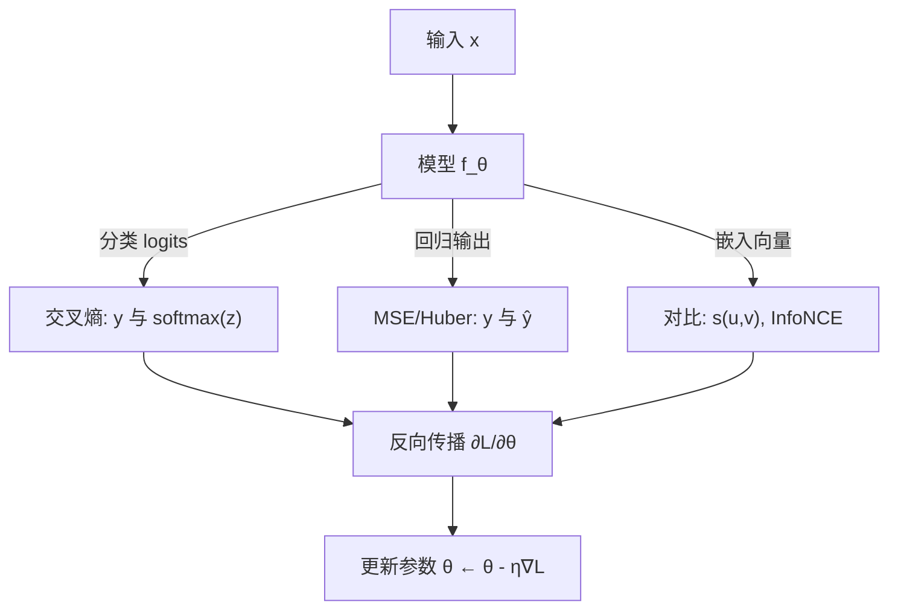

一句话版：**损失函数 = 模型世界观**。
* **交叉熵**：把分类看成“最大似然”，等价在**对数几率空间**做优化。
* **MSE**：把回归看成“高斯噪声下估计均值”。
* **对比学习损失**：把表征学习变成“把正例拉近、把负例拉远”的**分布判别**。

---

## 0. ERM 视角：为什么是它们？

经验风险最小化（ERM）里，我们最小化

$$
\min_\theta \ \frac{1}{n}\sum_{i=1}^n \ell\big(f_\theta(x_i),\,y_i\big).
$$

选哪个 $\ell$ 就是在假设**数据的噪声模型**与**任务目标**：

* 分类 → **交叉熵**（伯努利/类别多项式的负对数似然）。
* 回归 → **均方误差**（高斯噪声下的负对数似然）。
* 表征/检索 → **对比损失**（把“谁和谁应当相似”转成分类或距离约束）。

---

## 1. 交叉熵（Cross-Entropy）

### 1.1 定义与概率解释

* **二分类（BCE）**：目标 $y\in\{0,1\}$，模型输出 $\hat p=\sigma(z)$

  $$
  \ell_{\text{BCE}}(z,y)= -\big[y\log\hat p+(1-y)\log(1-\hat p)\big].
  $$
* **多分类（Softmax-CE）**：目标是 one-hot $y\in\Delta^{K-1}$，logits $z\in\mathbb{R}^K$，

  $$
  \hat p_k=\frac{e^{z_k}}{\sum_j e^{z_j}},\qquad
  \ell_{\text{CE}}(z,y)=-\sum_{k=1}^K y_k\log \hat p_k.
  $$

**最大似然**：这正是类别分布（伯努利/多项式）的负对数似然（NLL）。

### 1.2 梯度为什么“好用”

* **Softmax + CE** 的梯度极简：

  $$
  \frac{\partial \ell}{\partial z_k} = \hat p_k - y_k.
  $$

  这意味着**误差直接在概率空间**里传播，数值稳定、实现简洁。

### 1.3 LLM 训练里的交叉熵

自回归 LM 用链式法则：$\sum_t -\log P_\theta(w_t\mid w_{<t})$。
困惑度 $\text{PP}=\exp\big(\frac{1}{T}\sum_t -\log P_\theta\big)$ 与 CE 一一对应。

### 1.4 变体与工程实践

* **标签平滑**（Label Smoothing）：$y\leftarrow (1-\varepsilon)\,y+\varepsilon/K$。
  降低过度自信、提升校准与泛化；梯度变为 $\hat p-(1-\varepsilon)y-\varepsilon/K$。
* **类别不均衡**：加权 CE 或 **Focal Loss**

  $$
  \ell_{\text{focal}} = -\alpha\,(1-\hat p)^\gamma \log \hat p
  $$

  关注难样本（$\gamma>0$）。
* **温度缩放**（logits/$\tau$）：$\hat p=\mathrm{softmax}(z/\tau)$。$\tau\uparrow$ 分布更平、$\tau\downarrow$ 更尖锐，用于蒸馏与校准。
* **多标签**任务：对每一类做**独立的 sigmoid + BCE**（而非 softmax-CE）。
* **数值稳定**：用 `logsumexp`，先减去 `max(z)` 再 softmax；忽略 PAD token 的损失。

---

## 2. 均方误差（MSE）

### 2.1 定义与概率解释

$$
\ell_{\text{MSE}}(\hat y,y)=\frac{1}{2}\|\hat y-y\|_2^2.
$$

相当于**高斯噪声** $y=\mu(x)+\varepsilon,\ \varepsilon\sim\mathcal N(0,\sigma^2 I)$ 的**负对数似然**（忽略常数）。
**最优解**：在该假设下，$\hat y(x)=\mathbb{E}[Y\mid X=x]$（估计条件期望）。

### 2.2 梯度与偏好

$$
\frac{\partial \ell}{\partial \hat y}=\hat y-y.
$$

* 对**离群点不鲁棒**（平方惩罚），容易被大误差牵着走 → 预测“平均脸”。
* **MAE/Huber**：若噪声更像拉普拉斯或存在 outlier，考虑

  $$
  \ell_{\text{Huber}}(r)=
  \begin{cases}
  \tfrac{1}{2}r^2,& |r|\le \delta\\
  \delta(|r|-\tfrac{1}{2}\delta),& |r|>\delta
  \end{cases},\quad r=\hat y-y.
  $$

### 2.3 工程与大模型中的位置

* **扩散模型（Diffusion）**：常用 **MSE 预测噪声** 或 v-pred（也是带权 MSE）。
* **回归头 / 价值头**：强化学习或打分模型经常用 MSE。
* **异方差回归**：同时预测 $\mu,\sigma$，优化

  $$
  \ell=\frac{\|y-\mu\|^2}{2\sigma^2}+\frac{1}{2}\log\sigma^2
  $$

  （让不确定度也被学习）。

---

## 3. 对比学习损失（Contrastive Loss）

核心思想：在嵌入空间里，**正样本对**（同类/同实例不同视角）**靠近**，**负样本对**（不同实例）**远离**。

### 3.1 相似度与归一化

常用**余弦相似度**：$s(u,v)=\frac{u^\top v}{\|u\|\,\|v\|}$。
实践中常做 $L_2$ 归一化，等价把学习目标放到单位球面上。

### 3.2 InfoNCE / NT-Xent（批内对一切为负）

给定一批增强后的成对样本 $\{(u_i,v_i)\}_{i=1}^N$，温度 $\tau>0$：

$$
\ell_i^{(u\to v)}=-\log \frac{\exp(s(u_i,v_i)/\tau)}{\sum_{j=1}^N \exp(s(u_i,v_j)/\tau)}.
$$

通常**对称求和**（$u\to v$ 与 $v\to u$），CLIP/SimCLR 皆此逻辑。

* $\tau$ 越小，分布越尖锐，鼓励更强区分；过小易过拟合/不稳定。
* **梯度直觉**：像 softmax-CE，对正例提升分数、对所有负例按权重降低分数（推远）。

### 3.3 Triplet / Margin Loss（距离几何）

锚 $a$、正 $p$、负 $n$，

$$
\ell=\max\big(0,\ m + d(a,p) - d(a,n)\big),
$$

用欧氏距离或 $1-$余弦。需要**挖 hard negative**；margin $m$ 决定安全间隔。

### 3.4 NCE 视角与互信息

InfoNCE 是对互信息的一个下界（在一定假设下），把“**判断正配对 vs 噪声**”转成**多类分类**。
这解释了为什么**大批量**或\*\*记忆库/队列（MoCo）\*\*有用：负样本越多，下界越紧。

### 3.5 工程要点

* **归一化 & 温度**：`normalize → scale(1/τ)` 是稳定三件套。
* **False Negatives**：同类样本被当成负例会伤害学习；可做聚类去噪或同类屏蔽。
* **跨设备负样本**：分布式训练需 `all_gather` 扩展负例池。
* **投影头（MLP head）**：在表示上加一个投影（如 SimCLR），提升对比效果，**下游用前层表示**。

---

## 4. 三者如何选？（任务到损失的映射）

* **分类 / 语言建模**：Softmax-CE（多标签：Sigmoid-BCE）。

  * 类不均衡 → 加权 CE / Focal；过度自信 → 标签平滑 / 温度校准。
* **回归 / 评分**：MSE（对 outlier 用 Huber/MAE；不确定性 → 异方差 NLL）。
* **检索 / 表征 / 多模态对齐**：InfoNCE / NT-Xent（或 Triplet）。

  * 小 batch → 记忆库；跨模态 → 对称对比（CLIP 风格）。

---

## 5. 三类损失在训练管线中的位置



**图示说明**：同一个前向网络，针对不同任务分岔成三种损失，最后统一回到**梯度更新**。

---

## 6. 常见坑位与排错清单

* **CE 的数值溢出**：未做 `logsumexp` 或未减去 `max(logits)`。
* **忽略 PAD**：语言建模要对 PAD/特殊符号做 `ignore_index`。
* **多标签却用了 softmax-CE**：应改为 **Sigmoid-BCE**。
* **MSE 过度平滑**：图像/语音等可考虑 **感知损失**、**对抗损失**、或 **Huber**。
* **对比学习崩塌**：忘了归一化/温度/数据增强；负例过少或全是 false negatives。
* **类别不均衡**：仅调学习率不够，需**损失层面**修正（加权/Focal）。

---

## 7. 迷你代码片段（PyTorch 伪代码）

```python
# 交叉熵（多分类）
loss_ce = F.cross_entropy(logits, y_long)  # y_long: [B], 类索引; 内部做了 logsumexp

# MSE / Huber
loss_mse = F.mse_loss(y_hat, y_float)
loss_huber = F.smooth_l1_loss(y_hat, y_float, beta=1.0)  # Huber

# InfoNCE（对称、批内为负）
z1 = F.normalize(encoder(view1), dim=-1)
z2 = F.normalize(encoder(view2), dim=-1)
logits12 = z1 @ z2.t() / tau           # [B,B]
labels = torch.arange(B)
loss = (F.cross_entropy(logits12, labels) + 
        F.cross_entropy(logits12.t(), labels)) / 2
```

---

## 8. 练习（带提示）

1. **CE 梯度推导**：从 $\hat p=\mathrm{softmax}(z)$ 出发，推得 $\partial \ell/\partial z = \hat p - y$。
2. **Huber 的鲁棒性**：在含 5% 大噪声的数据上对比 MSE/MAE/Huber 的 MAE 指标。
3. **温度扫描**：在对比学习里扫 $\tau\in\{0.05,0.1,0.2,0.5\}$，观察检索 Recall\@K。
4. **标签平滑与校准**：比较是否平滑时的 ECE（Expected Calibration Error）。
5. **异方差回归**：实现同时预测 $\mu,\log\sigma^2$ 的回归，验证不确定样本的损失权重变小。

---

## 9. 小结

1. **交叉熵 = 负对数似然**，Softmax-CE 的梯度简洁稳定，是分类与 LM 的首选。
2. **MSE = 高斯假设下估计条件均值**，在含 outlier 时考虑 Huber/MAE 与异方差建模。
3. **对比损失把表征学习转成分类问题**（InfoNCE）或几何约束（Triplet）；**归一化 + 温度 + 充足负例**是成败关键。
