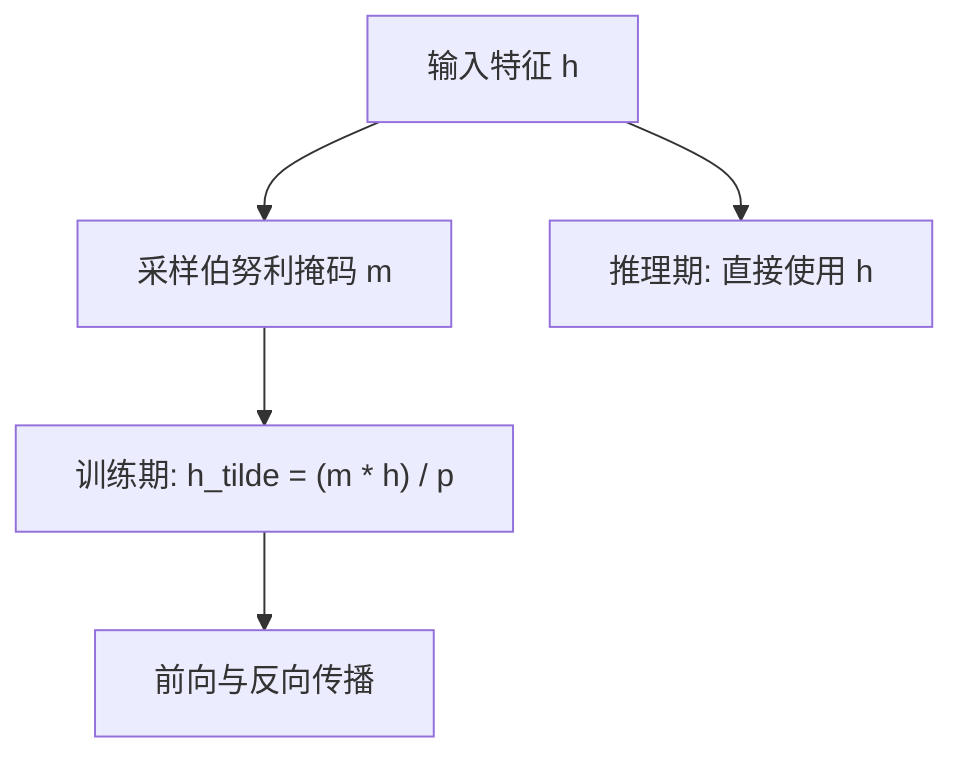
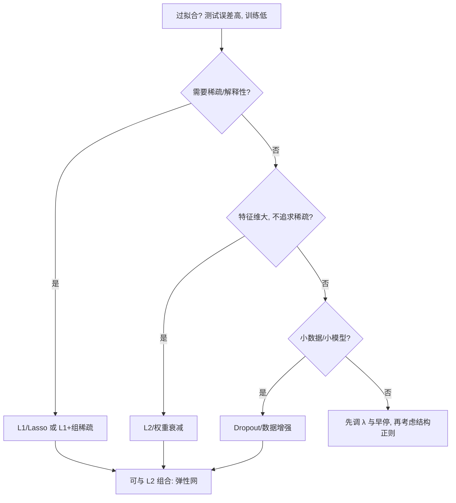

*——为什么“学得太好”反而会考砸，以及 L1/L2 与 Dropout 到底在做什么*

> 一句话版：**正则化的目标是让模型学到“够用的复杂度”**。
>
> * **L2（权重衰减 / Ridge）**：把参数往 0 拉，**均匀缩小**。
> * **L1（Lasso）**：很多参数被“推”到**正好为 0**，得到稀疏。
> * **Dropout**：训练时随机“关掉”一部分神经元，像在做**模型集成的贝叶斯近似**，降低特征“串通”。

---

## 0. 泛化为何会差？（先定个“病名”）

我们最小化经验风险

$$
\min_\theta\ \frac{1}{n}\sum_{i=1}^n \ell\big(f_\theta(x_i),y_i\big),
$$

但若模型容量太大、训练太久、数据有噪声，就会**记住训练集的偶然性**（overfitting），测试集上掉分。
**正则化（regularization）**就是在目标里**加入约束或惩罚**，让“太复杂”的解不划算，从而提升泛化。

直观类比：做 PPT 汇报——**说满分细节**（训练集），不等于**让所有听众都懂**（测试集）。正则化就是强迫你**语言更简练**。

---

## 1. 惩罚视角：在目标里加“刹车”

在经验风险后面加一项

$$
\min_\theta\ \underbrace{\frac{1}{n}\sum_i \ell(f_\theta(x_i),y_i)}_{\text{拟合}}+\underbrace{\lambda\,\Omega(\theta)}_{\text{复杂度惩罚}}.
$$

* $\Omega(\theta)=\|\theta\|_2^2$ → **L2**；$\Omega(\theta)=\|\theta\|_1$ → **L1**。
* $\lambda>0$ 控制“收紧”的力度：$\lambda$ 大 → 更保守；小 → 更冒险。

### 1.1 MAP 解释（把惩罚看作先验）

* **L2** 等价在参数上放 **零均值高斯先验**：$\theta\sim\mathcal N(0,\sigma^2I)$。
  最大后验（MAP）推到的目标恰是**负对数似然 + $\lambda\|\theta\|_2^2$**。
* **L1** 对应**拉普拉斯（尖峰厚尾）先验**：$\theta\sim \text{Laplace}(0,b)$，更偏爱**稀疏**。

> 记忆法：**高斯 → 平滑缩小（L2）**，**拉普拉斯 → 压到 0（L1）**。

---

## 2. L2（Ridge / 权重衰减）：均匀“瘦身”

### 2.1 数学与几何

在线性回归里

$$
\min_w \ \|y-Xw\|_2^2 + \lambda\|w\|_2^2
\quad\Rightarrow\quad
\hat w=(X^\top X+\lambda I)^{-1}X^\top y.
$$

几何上，L2 惩罚是个**圆（球）**，它会把最小二乘解“往原点拉”，但通常**不置零**。

### 2.2 梯度与实现

$$
\nabla_w \big(\lambda\|w\|_2^2\big)=2\lambda w\quad\text{（实现里常吸收常数）}.
$$

工程上常写成**权重衰减（weight decay）**：每步更新时给 $w$ 乘上 $1-\eta\lambda$。

> **AdamW 与 L2 的差异**：
>
> * 传统把 L2 惩罚直接加到损失，经过 Adam 的自适应缩放后，效果**不是**纯“乘上某个常数”。
> * **AdamW** 把**权重衰减与梯度更新解耦**（在更新后单独对权重做缩放），更接近真正的“L2 几何”，是现代默认。

### 2.3 什么时候更适合 L2？

* 特征很多但你不确定哪些该留；
* 不追求解释性，只想**稳**；
* 深度网络里几乎总会开一个**适度的权重衰减**（尤其没用 BatchNorm/LN 的地方）。

---

## 3. L1（Lasso）：自动“断舍离”（稀疏）

### 3.1 数学与几何

$$
\min_w \ \|y-Xw\|_2^2 + \lambda\|w\|_1.
$$

几何上，L1 的等值集是**菱形（L1 球）**，它的尖角容易和等高线相切，导致很多坐标**恰好落在 0**。

### 3.2 梯度与求解

$$
\partial |w_j|=\begin{cases}
\{\operatorname{sign}(w_j)\}, & w_j\neq 0\\
[-1,1],& w_j=0
\end{cases}
$$

常用**坐标下降**或\*\*软阈值（soft-thresholding）\*\*闭式更新：

$$
w_j \gets \operatorname{sign}(z_j)\cdot\max\{|z_j|-\lambda,0\}.
$$

直觉：**小权重被直接“砍”到 0**；大权重减去 $\lambda$（收缩）。

### 3.3 什么时候更适合 L1？

* 你希望**特征选择**，得到**可解释的稀疏模型**；
* 线性/广义线性模型、注意力前的投影层想做剪枝；
* 小模型蒸馏时，鼓励“少而精”的通道/头。

---

## 4. Dropout：用“掷硬币”的方式做集成

### 4.1 训练时发生了什么？

对中间激活做**伯努利遮罩**（inverted dropout 习惯写法）：

$$
\tilde h = \frac{m\odot h}{p},\quad m_j\sim\text{Bernoulli}(p),
$$

其中 $p$ 是**保留概率**（keep prob）。因为除以 $p$，训练期的**期望**与测试期保持一致，**推理时无需缩放**。

### 4.2 为什么有用？（三种解读）

1. **随机集成**：每个 mini-batch 看到的是一个“被删掉部分神经元”的子网络；所有子网络共享权重 → 近似**对很多网络求平均**。
2. **抑制共适应（co-adaptation）**：防止某些特征总是“绑在一起”，强迫每个特征**独立有用**。
3. **噪声注入 ≈ 正则化**：把乘法噪声传播到损失的二阶近似，得到一种**类似 L2 的惩罚**，惩罚强度与输入方差相关。

### 4.3 在 Transformer / LLM 里的位置

* 预训练大模型里常**把 Dropout 设得很小甚至 0**，靠**大数据 + 权重衰减 + LayerNorm**稳住泛化；
* 但在**小数据微调**、**小模型**、**特征塔**中，Dropout 仍然很有用；
* 注意与 **Attention Dropout**（对注意力权重做 dropout）是两回事，可以并用。

### 4.4 一个小流程图



**说明**：训练期对隐藏表示做伯努利掩码并按 $1/p$ 进行缩放（保持期望不变）；推理期不做丢弃，直接用 $h$。


---

## 5. 正则化选择指南（含非必考项）



**补充常见“非惩罚类”正则**（可与 L1/L2/Dropout 叠加）：

* **早停（Early Stopping）**：监控验证集，过拟合前刹车。
* **数据增强 / Mixup / CutMix**：从数据层面“扩容 + 平滑决策边界”。
* **标签平滑**：缓解过度自信，改进校准。
* **结构约束**：低秩、剪枝、蒸馏、谱范数约束、梯度裁剪等。

---

## 6. 对比：L1 vs L2 vs Dropout（一句话感受）

* **L2**：**均匀缩小**全部权重，曲面更平滑，优化友好；不擅长特征选择。
* **L1**：**稀疏**，能“自动甄别”无用特征；优化有非光滑点，需要合适的求解器。
* **Dropout**：**对表示层加噪声**，像“多人轮休打比赛”，降低共适应，带来**集成效应**。

---

## 7. 代码速查（PyTorch）

```python
# 1) L2：建议用 AdamW 的 weight_decay（解耦权重衰减）
optimizer = torch.optim.AdamW(model.parameters(), lr=lr, weight_decay=1e-2)

# 若用 Adam + 人工 L2 到损失里（不推荐）：
l2_term = sum((p**2).sum() for p in model.parameters() if p.requires_grad)
loss = task_loss + lam * l2_term

# 2) L1：将 L1 惩罚显式加到损失
l1_term = sum(p.abs().sum() for p in model.parameters() if p.requires_grad)
loss = task_loss + lam * l1_term

# 3) Dropout：训练期自动生效；推理期 model.eval() 会关闭
class MLP(nn.Module):
    def __init__(self, d_in, d_hid, p=0.2):
        super().__init__()
        self.net = nn.Sequential(
            nn.Linear(d_in, d_hid),
            nn.ReLU(),
            nn.Dropout(p),   # inverted dropout
            nn.Linear(d_hid, 1)
        )
    def forward(self, x):
        return self.net(x)
```

> 小贴士：**不要**对全部参数都施加 weight decay——常见做法是**跳过**偏置、LayerNorm/BatchNorm 的缩放参数。

---

## 8. 与大模型训练的“正确姿势”

* 预训练：**AdamW + 适中 weight decay**（如 $10^{-2}\sim10^{-1}$ 量级，随任务而异），**少用或关闭 Dropout**；
* 微调小数据：减小 weight decay，**适当加 Dropout**（0.1～0.3），配合**早停/数据增强**；
* 结构稀疏需求：在特定层（如投影、FFN）加 **L1 或组 Lasso**，再配合**剪枝**与**蒸馏**稳精度；
* 监控：同时看**训练/验证损失曲线**与**校准（ECE）**，避免“看准确率错过过拟合”。

---

## 9. 小练习（带提示）

1. **软阈值**：推导 Lasso 的一维闭式解 $w^*=\operatorname{sign}(z)\max(|z|-\lambda,0)$，并验证在合成数据上的稀疏性。
2. **Adam vs AdamW**：在同一模型上对比加入 L2 到损失里 vs 用 weight decay 的学习曲线差异。
3. **Dropout 温度**：在小型 MLP 上扫 $p\in\{0,0.1,0.3,0.5\}$，观察训练/验证 gap 与校准误差的变化。
4. **弹性网（Elastic Net）**：实现 $\lambda_1\|w\|_1+\lambda_2\|w\|_2^2$，并在相关特征上对比仅 L1 的稳定性。
5. **可视化**：画出 L1 球与 L2 球与等高线相切的示意，理解“为什么 L1 促稀疏”。

---

## 10. 小结

1. **正则化是把“更简单的解释”变得更划算**：在目标里对复杂度收税。
2. **L2→缩小，L1→置零，Dropout→加噪做集成**，分别抑制不同形式的过拟合。
3. 在大模型训练里，**AdamW 的权重衰减是地基**；**Dropout/早停/数据增强**是灵活工具；**有稀疏需求再加 L1/结构化正则**。
