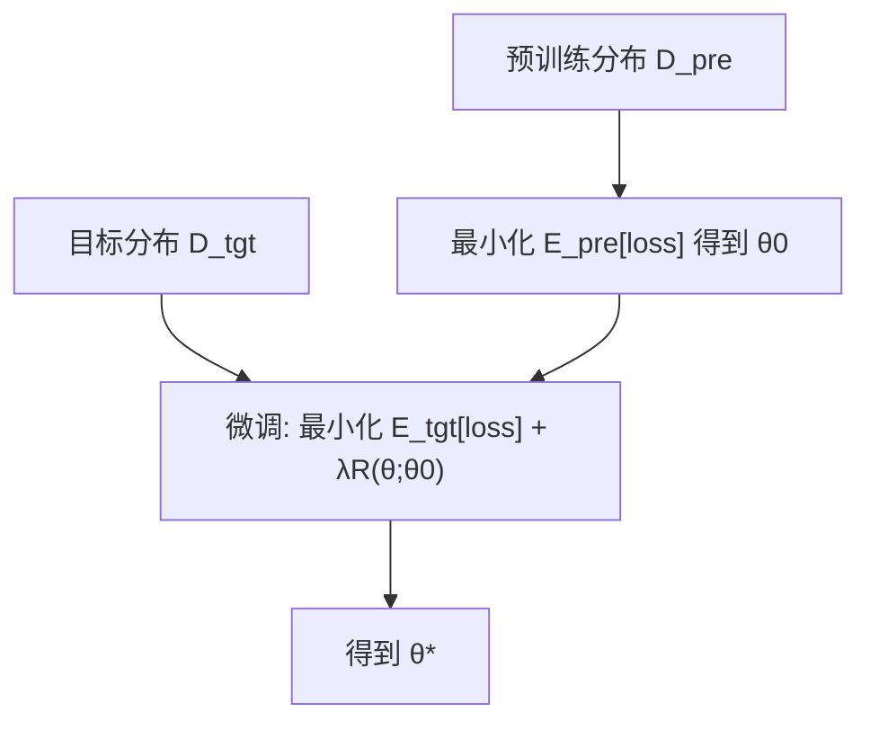
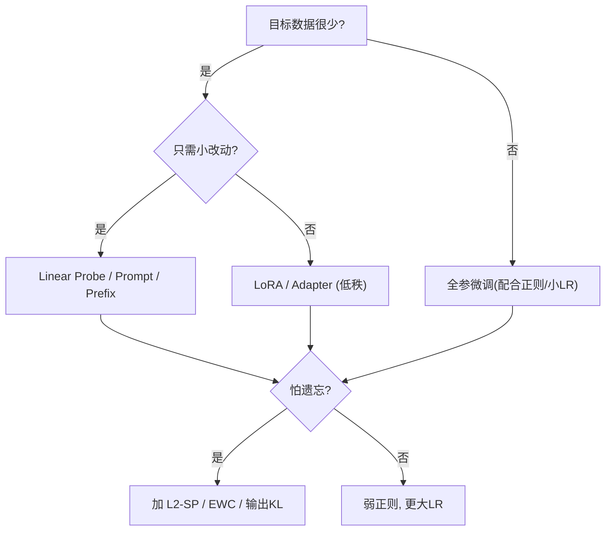

*——从“先学通用技能，再学岗位技能”的最优化故事*

> 核心结论（先剧透）：
>
> 1. **预训练**是在分布 $D_{\text{pre}}$ 上最小化期望损失（语言建模常是 NLL），得到参数 $\theta_0$。
> 2. **微调**是在目标分布 $D_{\text{tgt}}$ 上最小化损失，但通常会**约束参数不要偏离 $\theta_0$**，或**约束输出分布变化**，以平衡“稳定–可塑”。
> 3. 这些约束可以写成**正则化/近端项/信任域**：L2-SP、EWC（Fisher 加权）、输出 KL、或结构化低秩更新（LoRA）。

---

## 1. 预训练：在“通用世界”里学会预测

把自监督预训练看成一个大规模 ERM：

$$
\boxed{J_{\text{pre}}(\theta)=\mathbb{E}_{x\sim D_{\text{pre}}}\left[\,\ell\big(f_\theta,x\big)\right]}\quad
\text{(例如 }\ell=-\log p_\theta(x)\text{)}
$$

* **语言建模**：$\ell=-\sum_t \log p_\theta(w_t\mid w_{<t})$（交叉熵）。
* **图像预训练（MAE/SimCLR）**：掩码重建/对比损失。
* **优化器隐式偏置**：SGD/Adam 倾向到**平坦极小值**，对分布外泛化更友好。

**类比**：你先在“互联网大学”学全科（通用知识 + 语言/视觉常识），不针对某个职位。

---

## 2. 微调：在“岗位场景”里稳准狠

目标是让模型在 $D_{\text{tgt}}$ 上表现好，但又不把预训练的“通用力”忘掉。一般形式：

$$
\boxed{
J_{\text{ft}}(\theta)=\mathbb{E}_{(x,y)\sim D_{\text{tgt}}}\!\left[\ell(f_\theta(x),y)\right]
\ +\ \lambda\,R(\theta;\theta_0)
}
$$

* $\theta_0$：预训练得到的初始化。
* $R$：**约束项**（“别离家太远”）。常见选择：

  * **L2-SP**：$R=\|\theta-\theta_0\|_2^2$（以预训练点为“原点”）。
  * **EWC**：$R=\sum_i F_i(\theta_i-\theta_{0,i})^2$，$F$ 是 Fisher 信息对角近似，**重要参数动得更小**。
  * **输出 KL**：$R=\mathbb{E}_{x}\big[\,\mathrm{KL}(p_{\theta_0}(\cdot|x)\,\|\,p_\theta(\cdot|x))\big]$，控制**行为**改变的幅度。
  * **TRPO/PPO 风格**：限制策略/分布的 KL，不直接限制权重。
  * **结构约束**：如 **LoRA** 只在低秩子空间更新。

**一阶近似视角**（凸问题直观）：
用泰勒展开并忽略高阶项，解
$\nabla_\theta \ell + \lambda(\theta-\theta_0)=0\Rightarrow \theta^\star\approx \theta_0 - \tfrac{1}{\lambda}\nabla_\theta \ell$。
意味着：**在 $\theta_0$ 附近做“受限”梯度步**，步长由 $\lambda$ 控制。

---

## 3. 分布迁移：从 $D_{\text{pre}}$ 到 $D_{\text{tgt}}$

预训练最小化的是 $\mathbb{E}_{x\sim D_{\text{pre}}}$，微调需要 $\mathbb{E}_{x\sim D_{\text{tgt}}}$。若两者差异大：

* **重要性加权**：$\mathbb{E}_{D_{\text{tgt}}}[f]=\mathbb{E}_{D_{\text{pre}}}\!\left[\frac{p_{\text{tgt}}(x)}{p_{\text{pre}}(x)}f(x)\right]$（实际难精确估）。
* **提示学习/检索增强**：改变**条件分布**（给更多上下文/知识），等价在减小分布差。
* **小样本设置**：强正则（大 $\lambda$）、少量参数更新（如 LoRA）、或仅线性探测（Linear Probe）。

---

## 4. 几种微调范式的优化等价

### 4.1 全参数微调（Full FT）

$$
\min_\theta \mathbb{E}_{D_{\text{tgt}}}[\ell]+\lambda\|\theta-\theta_0\|^2
$$

* 表达力最强，但**显存/存储成本高**，**遗忘风险**大（$\lambda$ 太小会“跑远”）。

### 4.2 线性探测（Linear Probe）

冻结主干，仅学习顶层线性分类器 $W$：

$$
\min_W \ \mathbb{E}_{D_{\text{tgt}}}\!\left[\ell(W\,\phi_{\theta_0}(x),y)\right] + \lambda\|W\|^2
$$

* 把问题降到凸（如线性 + CE），**快速稳定**；若基座特征足够通用，性能很强。

### 4.3 Adapter / Prefix / Prompt Tuning

在各层插入小模块 $g_\alpha$ 或在注意力前加可学习提示 $\pi_\alpha$，优化 $\alpha$：

$$
\min_\alpha \ \mathbb{E}_{D_{\text{tgt}}}\big[\ell(f_{\theta_0,\alpha}(x),y)\big] + \lambda\|\alpha\|^2
$$

* **参数/存储友好**（多任务共用 $\theta_0$，只切换 $\alpha$）。

### 4.4 LoRA：低秩更新

把某些权重层写作 $W=W_0+\Delta W$，并限制 $\mathrm{rank}(\Delta W)\le r$，实现为 $\Delta W=A B^\top$（$A\in\mathbb{R}^{d\times r}, B\in\mathbb{R}^{k\times r}$）：

$$
\min_{A,B}\ \mathbb{E}_{D_{\text{tgt}}}\big[\ell(f_{\theta_0,A,B}(x),y)\big] + \lambda(\|A\|^2+\|B\|^2)
$$

* **优化在低维流形上进行**，减少搜索空间与过拟合风险；易与 **8/4-bit** 量化合用。

---

## 5. “稳定–可塑”与遗忘：几种正则的几何直觉

* **L2-SP**：约束 $\|\theta-\theta_0\|^2$ 小，相当于把“原点”移动到 $\theta_0$。
* **EWC**：在二次近似里把 Hessian 用 Fisher 近似 $F$，于是“球”变成**拉伸的椭球**，重要方向上更难动。
* **输出 KL**：不是约束权重，而是约束**函数值**（分布），等价把优化限制在(**函数空间**的信任域）里。

一个**简化的小图**：



**说明**：在新分布上优化，但受 $R$ 约束，防止“忘掉”通用能力。

---

## 6. 预训练与微调的计算配方

### 6.1 梯度与噪声：信噪比 SNR

* 预训练批次大、数据杂，**梯度方差较大**，适合 AdamW、学习率 warmup、余弦退火。
* 微调数据小，**梯度方差更大**，建议**更小学习率**、更强正则、梯度裁剪。

### 6.2 学习率与近端项的协同

* **有近端项**（如 L2-SP / KL），可用**稍大 LR**而不“跑远”；
* **无近端项**，就把 LR 降低或逐层分层 LR（靠近输入层更小）。

### 6.3 “输出 KL”型微调（偏函数空间）

最小化

$$
\mathbb{E}_{(x,y)\sim D_{\text{tgt}}}\big[\ell(f_\theta(x),y)\big]
\ +\ \beta\,\mathbb{E}_{x\sim D_{\text{tgt}}}\big[\mathrm{KL}(p_{\theta_0}(\cdot|x)\,\|\,p_\theta(\cdot|x))\big].
$$

* $\beta$ 大：**稳定、保守**；$\beta$ 小：**更可塑**。
* 这与 RLHF/PPO 控制策略漂移的思路一致（只是任务不同）。

---

## 7. 一个具体的“数学小推演”

以**线性回归 + MSE + L2-SP** 为例（易解析）：

$$
\min_w \ \|y - Xw\|^2 + \lambda\|w-w_0\|^2
\Rightarrow
\hat w=(X^\top X+\lambda I)^{-1}(X^\top y+\lambda w_0).
$$

* **对比 Ridge**：Ridge 把先验“原点”设在 0；L2-SP 把原点设在 **预训练解 $w_0$**。
* 当样本少（$X^\top X$ 小）时，$\hat w$ 更靠近 $w_0$；样本多时，$\hat w$ 更靠近数据最优。

---

## 8. 方法选择速查（小决策图）



---

## 9. 工程清单（预训练→微调）

* **优化器**：AdamW，微调期常用更小 LR（如预训练 3e-4，微调 1e-5～5e-5）。
* **正则**：权重衰减 +（可选）L2-SP / 输出 KL；小数据强一点。
* **梯度**：clip-norm（如 1.0）、梯度累积；混合精度保持稳定。
* **参数高效**：LoRA(rank=4\~16)、Adapter；多任务共享底座，只存小增量。
* **早停**：监控验证集；防止“跑远”。
* **数据**：若分布差异大，考虑检索增强/指令重写/数据清洗，先让输入更像目标任务。
* **评估**：同时看**主指标**与**校准/困惑度**，避免“准确率升了但语言退化”。

---

## 10. 迷你代码（PyTorch 伪代码）

### 10.1 L2-SP 微调（参数靠近 θ0）

```python
theta0 = {n: p.detach().clone() for n, p in model.named_parameters()}
optimizer = torch.optim.AdamW(model.parameters(), lr=5e-5, weight_decay=0.01)
lam = 1e-2

for x, y in loader_tgt:
    logits = model(x)
    loss_task = F.cross_entropy(logits, y)
    l2sp = 0.0
    for (n, p) in model.named_parameters():
        l2sp = l2sp + ((p - theta0[n])**2).sum()
    loss = loss_task + lam * l2sp
    optimizer.zero_grad()
    loss.backward()
    torch.nn.utils.clip_grad_norm_(model.parameters(), 1.0)
    optimizer.step()
```

### 10.2 输出 KL 约束（行为不跑远）

```python
beta = 0.5
with torch.no_grad():
    logits_ref = model_ref(x)              # 冻结的 θ0
p_ref = F.log_softmax(logits_ref / 1.0, dim=-1)  # 可加温度
p_cur = F.log_softmax(logits_cur / 1.0, dim=-1)
kl = torch.sum(torch.exp(p_ref) * (p_ref - p_cur), dim=-1).mean()
loss = loss_task + beta * kl
```

### 10.3 LoRA 思想（示意）

```python
# 线性层: y = (W0 + A @ B.T) x
# 只训练 A, B；W0 冻结。rank r << d
class LoRALinear(nn.Module):
    def __init__(self, in_f, out_f, r=8, alpha=16):
        super().__init__()
        self.W0 = nn.Linear(in_f, out_f, bias=False)
        self.A = nn.Parameter(torch.zeros(out_f, r))
        self.B = nn.Parameter(torch.zeros(in_f, r))
        self.scaling = alpha / r
        nn.init.kaiming_uniform_(self.B)
        nn.init.zeros_(self.A)
        for p in self.W0.parameters(): p.requires_grad = False
    def forward(self, x):
        delta = (x @ self.B) @ self.A.t() * self.scaling
        return self.W0(x) + delta
```

---

## 11. 练习（带提示）

1. **L2-SP 闭式解**：对线性模型推导 $\hat w$ 与 Ridge 的差别，并做数值实验验证“小样本更靠近 $w_0$”。
2. **EWC 近似**：用目标数据上 CE 的对数似然 Hessian 的对角近似作为 Fisher，对比有/无 EWC 的遗忘程度。
3. **输出 KL**：在分类微调上扫 $\beta\in\{0,0.1,0.5,1.0\}$，比较稳定–可塑权衡（主指标 + 老任务验证）。
4. **LoRA 秩选择**：固定学习率与数据，扫 $r\in\{2,4,8,16\}$，观察效果与速度/显存。
5. **分布偏移**：构造一个词表偏移的小数据集，比较 Linear Probe vs 全参微调 vs LoRA 的样本效率。

---

## 12. 小结

1. **预训练**在大分布上学通用能力，$\theta_0$ 既是**好初始化**也是**强先验**。
2. **微调**就是在新分布上优化 + 施加“别跑太远”的约束（参数或输出层面），以缓解遗忘、提升样本效率。
3. **方法选择**遵循：数据少→强正则/小更新空间（LoRA/Adapter/Probe）；分布差→先改输入（检索/提示），再调优化与正则。
