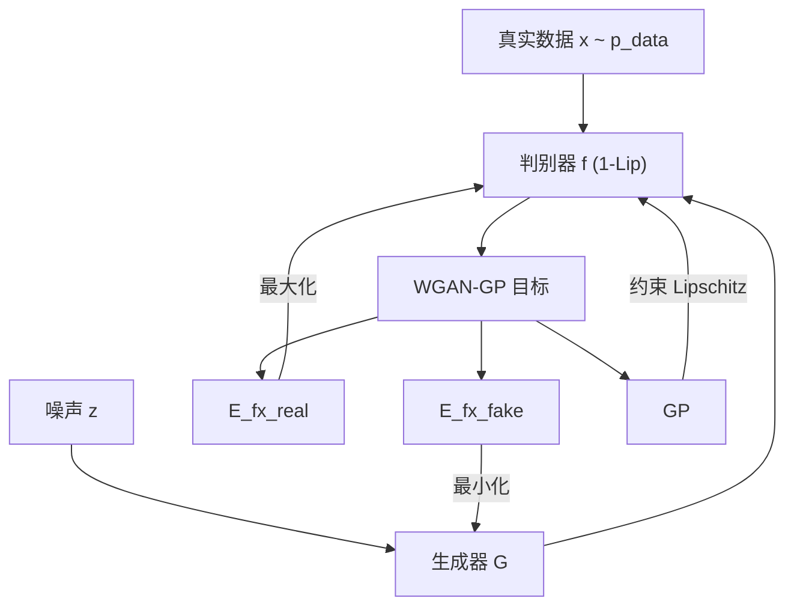
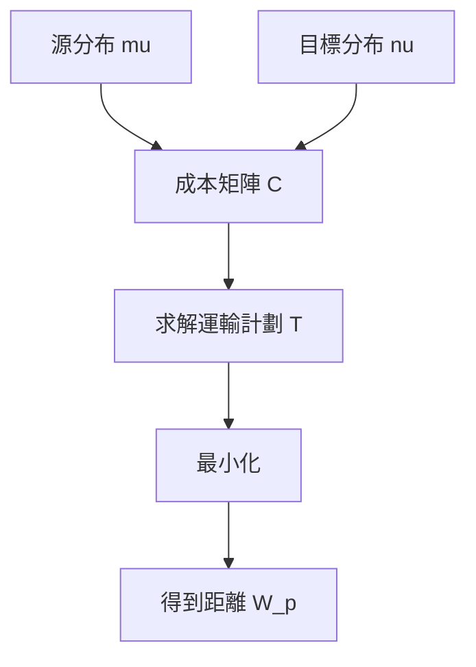

最优传输理论与生成模型（Wasserstein 距离）

*——把“搬土”问题变成生成模型的度量与优化器*

> 一句话版：**最优传输（OT）**是在给定“搬运成本”的前提下，找出把**源分布**搬到**目标分布**的**最省力**方式；由此定义的**Wasserstein 距离**对生成模型训练尤其稳健，支撑了 **WGAN / WGAN-GP**、**Sinkhorn** 等方法。

---

## 0. 直观类比：搬苹果的卡车调度

想象两个水果摊：左边一堆苹果（源分布），右边摊位的需求（目标分布）。**每辆卡车把某些苹果运到某个需求点产生成本**（距离 × 数量）。最优传输就是：**挑选每辆车的发货量和目的地，使得总成本最小**。
这比“只看两堆苹果是否重叠”要强，因为**它考虑了“多远”与“搬多少”**。

---

## 1. 最优传输（OT）基础

### 1.1 Monge 与 Kantorovich 两种表述

* **Monge（映射）**：找一个映射 $T:\mathcal X\!\to\!\mathcal Y$，把 $\mu$（源分布）搬成 $\nu$，最小化 $\int c(x,T(x))\,\mathrm d\mu(x)$。
  难点：**质量不可分**，有时不可行。
* **Kantorovich（耦合）**：允许把一个点的质量**拆分**给多个目标点。找一个耦合 $\gamma\in\Pi(\mu,\nu)$（边缘为 $\mu,\nu$ 的联合分布），

  $$
  \min_{\gamma\in\Pi(\mu,\nu)}\ \int c(x,y)\,\mathrm d\gamma(x,y).
  $$

  这就是经典的**运输计划**。

### 1.2 离散情形（线性规划）

若 $\mu=\sum_i a_i\delta_{x_i}$、$\nu=\sum_j b_j\delta_{y_j}$，设成本矩阵 $C_{ij}=c(x_i,y_j)$，运输计划是矩阵 $T\ge 0$：

$$
\min_{T\ge 0}\ \langle T,C\rangle\quad
\text{s.t.}\ T\mathbf 1=b,\ T^\top\mathbf 1=a .
$$

这就是**Earth Mover’s Distance（EMD）**。

---

## 2. Wasserstein 距离（又名 Kantorovich–Rubinstein 距离）

给定度量空间 $(\mathcal X,d)$ 与 $p\ge 1$，**$p$-Wasserstein 距离**定义为

$$
W_p(\mu,\nu)=\Big(\min_{\gamma\in\Pi(\mu,\nu)}\int d(x,y)^p\,\mathrm d\gamma(x,y)\Big)^{1/p}.
$$

* 常用：$W_1$（EMD）与 $W_2$（二次成本）。
* **优点**：当两分布**支撑集不重叠**时（GAN 常见），JS/TV 等会**梯度消失**，而 $W_p$ 仍感知到“多远”、梯度可用。

### 2.1 $W_1$ 的对偶（关键！）

**Kantorovich–Rubinstein 对偶**：

$$
W_1(\mu,\nu)=\sup_{\|f\|_{\text{Lip}}\le 1}\ \mathbb E_{x\sim\mu}[f(x)]-\mathbb E_{y\sim\nu}[f(y)].
$$

* 右侧的 $f$ 被称为**1-Lipschitz 判别器/critic**。
* 这条式子直接催生了 **WGAN**：把原 GAN 的判别器替换为**Lipschitz 约束的 critic**，最大化上式；生成器最小化它。

---

## 3. 从 GAN 到 WGAN / WGAN-GP

### 3.1 原始 GAN 的问题

两分布支撑不重叠时，**JS 散度恒为 $\log 2$**，判别器梯度在生成器处趋近 0 → 训练不稳、模式崩塌。

### 3.2 WGAN：用 $W_1$ 取代 JS

* 目标：$\max_{\|f\|_{\text{Lip}}\le 1}\mathbb E[f(x)]-\mathbb E[f(G(z))]$。
* 实现 1-Lipschitz 的**简单法**：权重裁剪（容易欠拟合/容量受限）。

### 3.3 WGAN-GP：梯度惩罚更优雅

* 思路：在插值点 $\hat x=\epsilon x+(1-\epsilon)\tilde x$ 上惩罚 $\|\nabla_{\hat x}f(\hat x)\|_2$ 偏离 1：

$$
\mathcal L_{\text{GP}}=\lambda\ \mathbb E_{\hat x}\Big(\|\nabla_{\hat x} f(\hat x)\|_2-1\Big)^2 .
$$

* 优点：更稳定、收敛性更好；实际中常搭配 **Adam**/**AdamW**。




**说明**：

- 真实数据与生成样本同时输入判别器 $f$。
- 目标节点 $O$ 表示 WGAN-GP 的对偶目标（含梯度惩罚 GP）。
- 对该目标，**判别器最大化**，**生成器最小化**。
- 避免了自环与带引号/算符的边标签，Mermaid 解析更稳定。

---

## 4. 计算 OT 的“快刀”：熵正则与 Sinkhorn

### 4.1 熵正则 OT（Sinkhorn 距离）

在线性规划上加入熵正则 $\varepsilon \sum_{ij} T_{ij}(\log T_{ij}-1)$，得到光滑目标：

$$
\min_{T\ge 0}\ \langle T,C\rangle+\varepsilon \sum_{ij} T_{ij}(\log T_{ij}-1)
\ \ \text{s.t.}\ T\mathbf 1=b,\ T^\top\mathbf 1=a .
$$

解具有 **Gibbs 形式**：$T^*=\mathrm{diag}(u)\,K\,\mathrm{diag}(v)$，
其中 $K=\exp(-C/\varepsilon)$。通过交替缩放 $u,v$ 使边缘约束成立——这就是 **Sinkhorn 迭代**：

$$
u \leftarrow a/(Kv),\quad v \leftarrow b/(K^\top u).
$$

* **优点**：GPU 友好、可微、速度快；$\varepsilon$ 控制平滑/偏差。
* **注意**：$\varepsilon$ 太小数值不稳定；用 log-domain 实现更稳（log-sum-exp）。

### 4.2 PyTorch 迷你示意（log 域）

```python
def sinkhorn(a, b, C, eps=0.05, iters=100):
    # a: (n,), b: (m,), C: (n,m) cost; all positive + sum to 1
    K = torch.exp(-C / eps)                 # (n,m)
    u = torch.ones_like(a) / a.size(0)
    v = torch.ones_like(b) / b.size(0)
    for _ in range(iters):
        u = a / (K @ v + 1e-9)
        v = b / (K.t() @ u + 1e-9)
    T = torch.diag(u) @ K @ torch.diag(v)
    cost = (T * C).sum()
    return cost, T
```

---

## 5. 生成模型中的 OT 家族

* **WGAN / WGAN-GP / SN-GAN**：用 $W_1$ 的对偶做目标，重点在**Lipschitz 约束**（梯度惩罚 / 谱归一化）。
* **Sinkhorn / OT-GAN / Sliced-Wasserstein**：直接或近似最小化 OT 距离，常配**熵正则**或**切片**（在许多随机方向上做一维 OT，快且稳定）。
* **Brenier 映射与 Normalizing Flows**（$W_2$ 与 $c=\|x-y\|^2$）：在理论上最优映射是**凸函数的梯度**，启发了基于势能/凸性的可逆变换设计。
* **OT Barycenter**：多个域的“加权平均”分布，做**风格迁移/域泛化**很自然。
* **图像/视频的配色与去混合**：离散 OT 直接对像素直方图做“搬运”，效果直观。

---

## 6. 为什么 Wasserstein 在高维生成中“更靠谱”

* **几何敏感**：即便支撑不重叠也能提供方向感（多远、多往哪搬）。
* **对抗更稳**：对偶问题是**线性**的（在经验分布上），没 JS 那种梯度崩坏。
* **但要注意**：**样本复杂度**对 $W_p$ 不友好，经验估计在高维收敛慢（直觉：要填满高维空间）。
  解决思路：**切片 Wasserstein**、**潜空间 OT**、或改用 **MMD**（核方法）在样本量很小的场景。

---

## 7. WGAN-GP 训练小样例（伪代码）

```python
# critic step
for _ in range(n_critic):
    x_real = next(real_loader)               # (B, ...)
    z = torch.randn(B, d)
    x_fake = G(z).detach()
    # critic loss
    loss_c = -(f(x_real).mean() - f(x_fake).mean())
    # gradient penalty
    eps = torch.rand(B, 1, 1, 1, device=x_real.device)
    x_hat = eps * x_real + (1 - eps) * x_fake
    x_hat.requires_grad_(True)
    fh = f(x_hat).sum()
    grad = torch.autograd.grad(fh, x_hat, create_graph=True)[0]
    gp = ((grad.view(B, -1).norm(2, dim=1) - 1) ** 2).mean()
    loss = loss_c + lambda_gp * gp
    opt_f.zero_grad(); loss.backward(); opt_f.step()

# generator step
z = torch.randn(B, d)
loss_g = -f(G(z)).mean()
opt_g.zero_grad(); loss_g.backward(); opt_g.step()
```

---

## 8. 何时用哪种距离/算法（工程备忘）

* **训练 GAN 不稳定、判别器太强** → 换 **WGAN-GP / SN-GAN**，关注 Lipschitz。
* **要直接度量两小批分布差** → **Sinkhorn（熵正则 OT）**；需可微可回传时尤其合适。
* **超高维、样本少** → 尝试 **Sliced-Wasserstein** 或 **潜空间 OT**；或用 **MMD**（核选择很关键）。
* **多域统一表征/融合** → **OT barycenter**。
* **图像颜色/风格迁移** → 直方图 OT + Sinkhorn。

---

## 9. OT 的“搬运计划”



**图示说明**：用成本矩阵度量“搬一单位质量的代价”，在边缘约束下选择运输计划 $T$，总成本最小即 Wasserstein 距离（或其正则版本）。

---

## 10. 常见坑 & 小贴士

* **权重裁剪太紧** → critic 表达力差；优先用 **梯度惩罚**或**谱归一化**。
* **Sinkhorn 数值爆** → 在 **log 域**实现；$\varepsilon$ 不宜太小。
* **批次估计偏差** → 以批代分布时，OT 度量方差大；可做**多批平均**或**大批**。
* **高维估计困难** → 切片/随机投影、潜空间 OT、配合对比损失。
* **成本选择** → 通常用 $c(x,y)=\|x-y\|^p$；在语义空间可用**感知距离**（特征空间欧氏）。

---

## 11. 练习（带提示）

1. **KR 对偶**：证明当 $\|f\|_{\text{Lip}}\le 1$ 时，$\sup_f \mathbb E_\mu f-\mathbb E_\nu f=W_1(\mu,\nu)$（提示：从线性规划对偶出发）。
2. **WGAN-GP 推导**：说明为什么在直线插值点约束梯度范数接近 1 能近似 1-Lipschitz。
3. **Sinkhorn 收敛**：推导 $T^*=\text{diag}(u)K\text{diag}(v)$ 的形式（提示：KKT 条件+熵正则）。
4. **切片 Wasserstein**：实现随机方向投影到 $\mathbb R$ 的一维 OT，再对方向求平均。
5. **颜色迁移**：把两幅图的颜色直方图做 Sinkhorn 匹配，实现快速的“风格搬运”。

---

## 12. 小结

* **OT 给了分布之间“带几何感的距离”**；
* **Wasserstein 对偶把它变成了可优化的判别器目标**，从而稳定了生成训练（WGAN 系列）；
* **熵正则 + Sinkhorn** 让 OT 快速、可微、工程可落地。
  把“搬土”的直觉放进你的生成模型里，你会得到**更稳的训练**与**更有意义的度量**。
