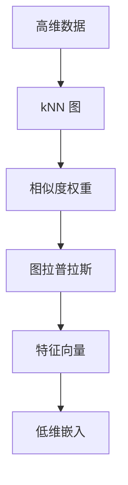
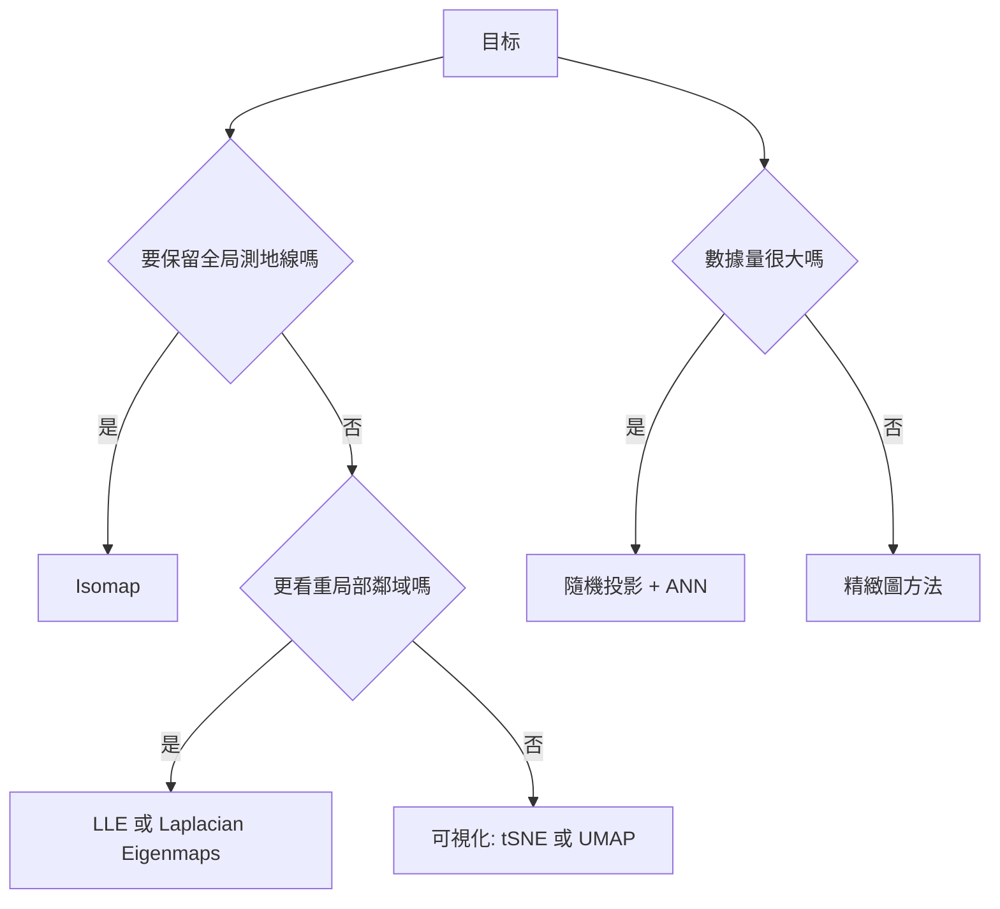

高维几何与流形学习

*——当数据住在“高维城市”，我们如何找到它真实的街区*

> 一句话先透底：现实世界的数据常**不满布在高维空间**，而是黏在一张\*\*低维弯曲的“流形”\*\*上。理解高维几何的“直觉陷阱”，并用图方法近似流形几何，是很多表示学习、可视化与检索系统的基础。

---

## 1. 为啥高维会“反直觉”？

### 1.1 维度灾难：体积都跑到“壳”上了

直观比喻：在 2D，披萨边缘只占一点；在很高维，几乎所有体积都堆在“外壳”附近。
数学上，单位 $d$ 维球体积

$$
V_d=\frac{\pi^{d/2}}{\Gamma\!\big(\tfrac{d}{2}+1\big)},
$$

与边长 2 的超立方体体积 $2^d$ 的比值 $V_d/2^d\to 0$（$d\to\infty$）。
**启示**：在高维，随机点彼此都“差不多远”，密邻难找。

### 1.2 距离集中与 Hubness

随机两点的欧氏距离在维度升高时**集中在一个窄区间**；kNN 容易出现“枢纽点”（某些点被很多样本选为最近邻）。
**后果**：

* kNN 分类/检索鲁棒性变差；
* 相似度最好单位化（余弦）或做**降维**再找邻居。

---

## 2. 流形假设：高维中的低维结构

**流形假设**：数据 $x\in\mathbb R^D$ 近似落在一张维数 $m\ll D$ 的光滑子空间 $\mathcal M$ 上。

* **局部线性**：在小邻域里，$\mathcal M$ 近似一个 $m$ 维平面（切空间）。
* **全局弯曲**：整体可能像“瑞士卷”，直线距离失真，但**沿面走**的“测地线距离”才是语义上的“近”。

日常类比：自拍图像在像素空间（百万维）里，真正自由度只有**姿态、光照、表情**等几十个——这就是低维流形。

---

## 3. 流形学习三板斧：邻域图、权重、谱分解

最常见的一条 pipeline 如下：

**说明**：

1. 建 k 近邻图；2) 用热核等给边赋权；3) 构造图拉普拉斯 $L$；4) 取若干最小特征向量作为新坐标（或做下游优化）。

### 3.1 权重与图拉普拉斯

* **权重** $w_{ij}=\exp(-\|x_i-x_j\|^2/t)$ 或 0-1 权重。
* **拉普拉斯** $L=D-W$（或对称归一化 $I-D^{-1/2}WD^{-1/2}$）。
* 最小化

$$
\sum_{i,j} w_{ij}\,\|y_i-y_j\|^2
$$

在约束下得到的解，是 $L$ 的**底部特征向量**（Laplacian Eigenmaps）。
直觉：**相邻点在低维里仍要近**。

### 3.2 三个经典算法（各擅胜场）

* **Isomap**：先用 kNN 图上**最短路近似测地线距离**，再在这些距离上做 **MDS**。适合“近似等距嵌入”的流形（如瑞士卷）。
* **LLE**：先学局部线性重构权重 $W$，再找低维 $Y$ 使 $\sum_i\|y_i-\sum_j w_{ij}y_j\|^2$ 最小。强调**局部线性结构**。
* **Laplacian Eigenmaps**（及谱聚类）：最小化图上平滑能量，擅长**保局部相邻**与**聚类**。

> 可视化类（**t-SNE**、**UMAP**）也走“邻域图 + 概率或模糊集合 + 优化”路线，目标更偏向**局部邻接可信度**，用于 2D/3D 展示非常直观，但**不保证全局距离保真**。

---

## 4. 低维嵌入的几何与工具箱

### 4.1 测地线 vs 直线

* **直线距离**在弯曲流形上可能“穿越空气”，失真。
* **测地线距离**沿流形最短路径，反映**语义接近**。Isomap 正是用图最短路近似之。

### 4.2 JL 引理：随机投影也很香

**Johnson–Lindenstrauss 引理**：对 $n$ 个点，存在线性映射到 $\mathcal O(\log n/\varepsilon^2)$ 维，使两两距离在 $1\pm\varepsilon$ 内保持。
工程意义：**随机特征映射**、**ANN 检索**前的快速降维，常常“够用且快”。

### 4.3 切空间与局部 PCA

在点 $x$ 的小邻域上做 **PCA**，其主成分近似切空间方向；

* 可用于**流形正则化**、**Manifold Mixup**（沿切向插值增强），让模型更习惯“顺着面”变化。

---

## 5. 与大模型开发的“连接点”

* **表征几何**：词向量、句向量、图像嵌入在单位球面上的低维**曲面**上分布。

  * **余弦相似** ≈ 球面测地线的单调函数；单位化后更稳。
* **低秩与内在维度**：LoRA 只在低秩子空间动参数，暗合“**好解的流形很薄**”的经验事实。
* **线性探测**：冻结底座，仅训练线性头，相当于在学到的**流形坐标**上做线性判别。
* **模式连通性**：不同好的解 $\theta_a,\theta_b$ 常能被一条低损曲线连接，提示**损失地形**上也存在低维结构。
* **检索与 RAG**：先用随机投影或 PCA 降维，再做 ANN（FAISS 等），能减轻 hubness 与内存压力。

---

## 6. 方法选择小抉择

**说明**：

* 近似等距、曲率不大 → Isomap；
* 在意局部结构与聚类 → LLE/LE；
* 主要是人眼看图 → t-SNE/UMAP；
* 海量数据先**随机投影**再**近邻检索**，效率优先。

---

## 7. 实战建议与坑位

* **距离度量先统一**：建议标准化、单位化，避免某些特征主导距离。
* **k 的选择**：过小图不连通，过大破坏流形局部性。经验：调到**最大连通分量**覆盖率高且**局部重构误差**低。
* **权重温度 t**：太小噪声敏感，太大又模糊。可用中位距离的倍数做起始。
* **谱法空解**：记得加约束（去掉平移自由度），或用归一化拉普拉斯。
* **可视化幻觉**：t-SNE/UMAP 不保全局尺度，远近不可过度解读。
* **Hubness**：改用余弦、PCA 降维、或做去枢纽校正（如反频权重）。

---

## 8. 迷你推导两则

### 8.1 图拉普拉斯的能量最小化

$\sum_{ij} w_{ij}\|y_i-y_j\|^2 = 2\,\mathrm{tr}(Y^\top L Y)$。
在约束 $Y^\top D Y=I$ 下最小化，等价取 $L$ 的最小非零特征向量（谱聚类同理）。

### 8.2 LLE 的局部重构

先解 $\min_W\sum_i\|x_i-\sum_{j\in \mathcal N(i)}w_{ij}x_j\|^2$（行和为 1），再解
$\min_Y\sum_i\|y_i-\sum_j w_{ij}y_j\|^2$，约束去除退化解。
直觉：**保留“谁由谁线性拼出来”的关系**。

---

## 9. 小练习（含提示）

1. **距离集中**：推导 $X,Y\sim\mathrm{Unif}[0,1]^D$ 时 $\mathbb E\|X-Y\|^2=D/6$，并数值实验其标准差随 $D$ 的变化。
2. **瑞士卷**：用 Isomap 和 PCA 比较重建误差，观察测地线保真的差异。
3. **图参数网格**：在同一数据上扫 $k$ 与 $t$，用 Trustworthiness 与 Continuity 指标评估嵌入质量。
4. **局部 PCA**：实现每点的切空间估计，并在切向方向做 Manifold Mixup 进行数据增强。
5. **随机投影**：验证 JL 引理的经验版：随着投影维度增加，两两距离失真率如何下降。

---

## 10. 小结

* 高维世界里，**距离会失灵**、体积挤到“壳”，但**数据的真实自由度往往很低**。
* **流形学习**用图和谱工具，尽力在低维里保留“沿面邻近”的几何。
* 对大模型而言，理解与利用这种几何（单位化、降维、低秩更新、图结构）能带来**更稳的训练**、**更快的检索**、和**更好的可视化与泛化**。
