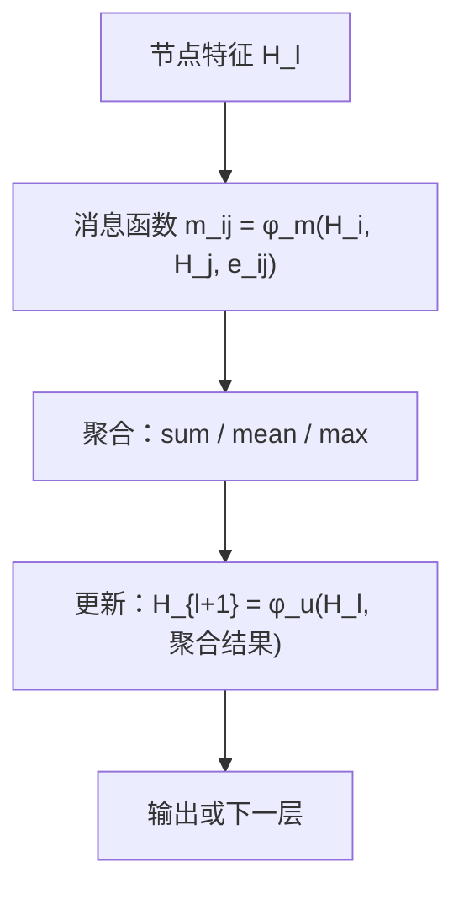
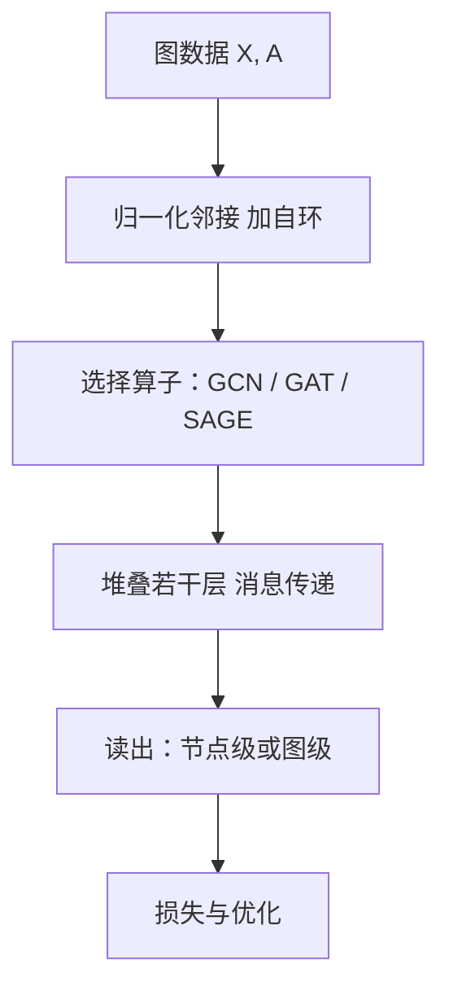
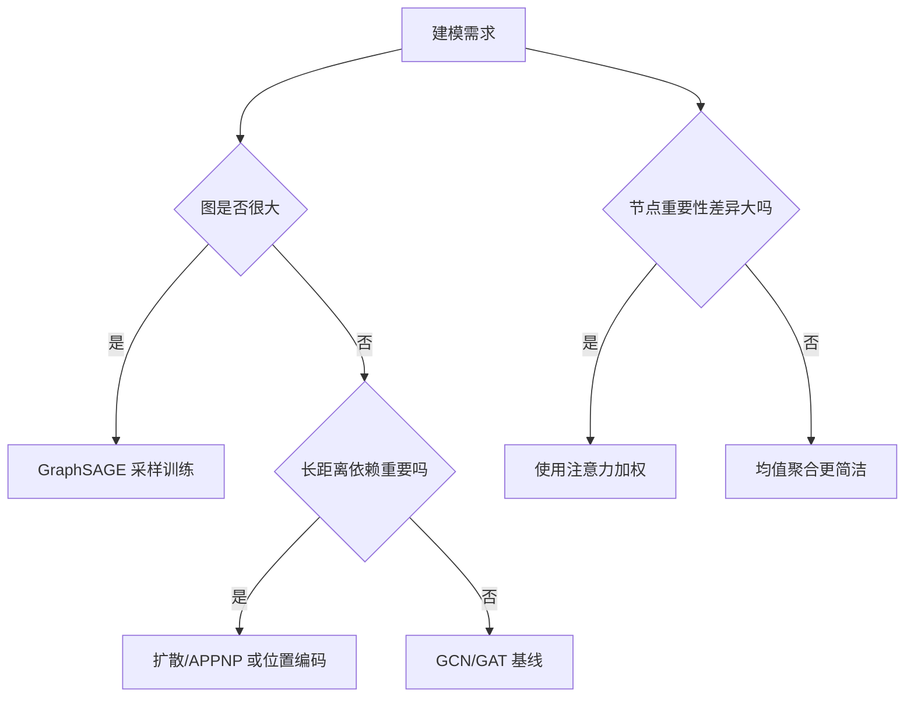

图神经网络的数学基础（图论、谱图理论）

*——把“关系”写进模型，把“几何”装进特征*

> 直觉先行：在图上做学习，好比在“人脉网”里传消息。**图论**告诉我们谁和谁相连；**谱图理论**告诉我们如何在图上做“频域分析”和“卷积”。两者合在一起，就是图神经网络（GNN）的数学底盘。

------

## 1. 图的基本概念：从邻接到拉普拉斯

- **图** $G=(V,E,W)$：节点集 $V=\{1,\dots,n\}$，边集 $E\subseteq V\times V$，权重矩阵 $W=[w_{ij}]$。

- **邻接矩阵** $A=[a_{ij}]$：有边则 $a_{ij}=w_{ij}$，否则 0。

- **度矩阵** $D=\mathrm{diag}(d_1,\dots,d_n)$，其中 $d_i=\sum_j a_{ij}$。

- **图拉普拉斯**

  L=D−A,Lsym=I−D−1/2AD−1/2,Lrw=I−D−1A.L=D-A,\quad L_{\mathrm{sym}}=I-D^{-1/2}AD^{-1/2},\quad L_{\mathrm{rw}}=I-D^{-1}A.

  它度量“相邻节点取值差异”的惩罚，是图上平滑与扩散的核心算子。

**随机游走**：一步转移 $P=D^{-1}A$。很多传播、PageRank 与扩散模型都基于它。

------

## 2. 图信号与 Dirichlet 能量：为什么“同邻相似”

把每个节点上的特征看作**图信号** $f:V\to\mathbb R$。图上的“平滑度”可用 **Dirichlet 能量**：

$\mathcal E(f)=\tfrac12\sum_{i,j} a_{ij}(f_i-f_j)^2 = f^\top L f.$

- 相邻值差大 → $\mathcal E$ 大；
- 最小化 $\mathcal E$ → **同邻相似**（半监督标签传播、图正则、GCN 都在用这个直觉）。

------

## 3. 谱图理论：图上的“傅里叶分析”与卷积

### 3.1 谱分解与图傅里叶

对称拉普拉斯 $L=U\Lambda U^\top$（$U$：特征向量，$\Lambda$：特征值）。
 **图傅里叶变换**：$\hat f=U^\top f$，逆变换 $f=U\hat f$。特征值越大，频率越高（变化越快）。

### 3.2 谱卷积定义与多项式近似

把卷积定义为频域乘法：

$g_\theta * f = U\,g_\theta(\Lambda)\,U^\top f.$

直接做代价高且不局部。用 **Chebyshev 多项式**近似：

$g_\theta(\Lambda)\approx \sum_{k=0}^{K}\theta_k T_k(\tilde\Lambda)\ \Rightarrow\ g_\theta * f \approx \sum_{k=0}^{K}\theta_k\,T_k(\tilde L)\,f,$

变成了反复乘 $L$ 的**局部 K 跳**运算（稀疏高效）。

------

## 4. 从 ChebNet 到 GCN：最常用的一行式

当 $K=1$ 并做“重归一化”简化（Kipf & Welling, 2017），得到 **GCN**：

$\tilde A=A+I,\ \tilde D=\mathrm{diag}(\sum_j \tilde a_{ij}),\  \hat A=\tilde D^{-1/2}\tilde A\,\tilde D^{-1/2},$$H^{(\ell+1)}=\sigma\!\big(\hat A\,H^{(\ell)}\,W^{(\ell)}\big),$

先**归一化聚合邻居（含自己）**，再**线性变换 + 非线性**。

------

## 5. 消息传递（MPNN）：GNN 的统一语法



**说明**：

- 消息函数利用边特征 $e_{ij}$（若有）。
- 聚合需**置换不变**（邻居无序）。
- 更新常用 MLP 或门控单元。GCN、GraphSAGE、GAT 都是它的特例。

------

## 6. 常见模型族与公式

### 6.1 GraphSAGE（采样友好）

$h_i^{(\ell+1)}=\sigma\!\Big(W^{(\ell)}\cdot \mathrm{CONCAT}\big(h_i^{(\ell)},\ \mathrm{AGG}(\{h_j^{(\ell)}: j\in\mathcal N(i)\})\big)\Big).$

支持随机邻居采样，适合大图小批量训练。

### 6.2 GAT（注意力加权邻居）

$\alpha_{ij}=\mathrm{softmax}_{j\in\mathcal N(i)}\!\big(\mathrm{LeakyReLU}(a^\top [W h_i \Vert W h_j])\big),\quad h_i'=\sigma\!\Big(\sum_{j}\alpha_{ij} W h_j\Big).$

重要邻居权更大，多头注意力更稳。

### 6.3 APPNP / 扩散

$H^{(\ell+1)}=\alpha X + (1-\alpha)\,\tilde P\,H^{(\ell)},$

把“多跳传播”写成**扩散核**，$\alpha$ 控制回跳到输入特征的概率，深而不糊。

------

## 7. 两个谱方法应用：聚类与位置编码

- **谱聚类**：取 $L_{\mathrm{sym}}$ 的前 $k$ 个最小特征向量做嵌入，再 $k$-means。
- **拉普拉斯位置编码（LPE）**：把底部特征向量拼到节点特征里，相当于给 GNN 注入“图中位置”的坐标，常用于图 Transformer、长距离依赖任务。

------

## 8. 表达力与两大难题

- **表达力上限**：多数 MPNN 的区分力不超过 **1-WL**。改进：GIN、子图增强、位置编码、结构计数等。
- **过平滑**：层数深了表征趋同。解法：残差、归一化、跳连（JK）、保留高频的正则、APPNP。
- **过压缩**：远距离依赖被“挤在”少量消息通道里传不过来。解法：长跳边/可学习重连、注意力、位置编码。

------

## 9. 工程实践清单

- **归一化与自环**：$\hat A=\tilde D^{-1/2}\tilde A\tilde D^{-1/2}$ 且 $\tilde A=A+I$。
- **稀疏计算**：一次邻接乘法 $O(|E|d)$。用 CSR/COO、融合核。
- **大图训练**：邻居采样（GraphSAGE）、子图采样（GraphSAINT）、簇分解（Cluster-GCN）。
- **正则化**：DropEdge、特征 Dropout、权重衰减；GAT 多头平均。
- **深度选择**：2–4 层常见；更深需残差、Norm、APPNP 或可逆层。
- **任务接口**：节点分类、链路预测（内积/MLP 打分）、图分类（池化/读出）。

------

## 10. 与大模型结合的几个切点

- **结构化 RAG**：把文档或段落建图，用 GNN 做结构重排序。
- **图 Transformer**：LPE 作为位置编码；注意力受图边或距离约束。
- **分子与材料**：原子为点、键为边，GNN 产出结构感知向量供大模型下游使用。
- **知识图谱**：关系当边类型，R-GCN / GAT 做实体与关系预测。

------

## 11. 小练习（带提示）

1. 证明 $\sum_{i,j}a_{ij}(f_i-f_j)^2 = 2 f^\top L f$。
2. 证明 $L$ 的零特征值重数等于连通分量数。
3. 在两团强内连弱外连的随机块模型上做谱聚类，观察第二特征向量的分群性。
4. 实现 $K=3$ 的 Chebyshev 滤波并验证 3 跳感受野。
5. 对比不加自环 vs 加自环的 GCN 训练稳定性。
6. 用 GraphSAGE 观察不同采样扇出的显存/精度权衡。
7. 在长尾度分布的图上比较 GAT 与均值聚合的差异。
8. 给 GNN 加 LPE，评估长距离依赖任务的提升。

------

## 12. 迷你代码（PyTorch 风格示意）

```python
# GCN 层（稀疏友好）
class GCNLayer(nn.Module):
    def __init__(self, in_dim, out_dim, bias=True):
        super().__init__()
        self.lin = nn.Linear(in_dim, out_dim, bias=bias)
    def forward(self, x, A_hat):  # A_hat = D^{-1/2}(A+I)D^{-1/2}, 稀疏
        x = self.lin(x)
        return torch.spmm(A_hat, x)

# 单头 GAT
class GATHead(nn.Module):
    def __init__(self, in_dim, out_dim):
        super().__init__()
        self.W = nn.Linear(in_dim, out_dim, bias=False)
        self.a = nn.Parameter(torch.randn(2*out_dim))
    def forward(self, x, edge_index):  # COO 边 [2, E]
        h = self.W(x)
        i, j = edge_index
        e_ij = F.leaky_relu((torch.cat([h[i], h[j]], dim=-1) * self.a).sum(-1))
        alpha = softmax(e_ij, i)  # 以目标 i 归一化
        out = torch.zeros_like(h)
        out.index_add_(0, i, alpha.unsqueeze(-1) * h[j])
        return F.elu(out)
```

------

## 13. 两张流程图（简体中文）



**图示说明**：标准训练管线——结构预处理 → 选算子 → 堆叠与读出 → 优化。



**图示说明**：根据规模、依赖跨度、异质性来选合适的 GNN 家族。

------

## 14. 小结

- **图论**提供结构，**谱图理论**提供“频域”与正则，**消息传递**把两者落成可训练的层。
- GCN 做“归一化平均 + 线性”，GraphSAGE/GAT 在空间域自适应聚合，APPNP 用扩散稳住深层。
- 工程落地要**稀疏化、采样化、归一化、残差化**；数学上注意**表达力上限、过平滑、过压缩**。
   把这些“传播与几何”的直觉写进模型，图结构任务就有了既可解释又可扩展的基石。
