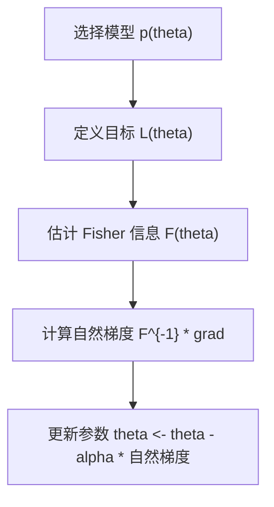
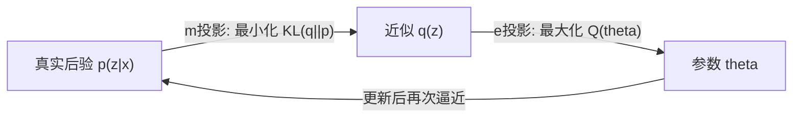
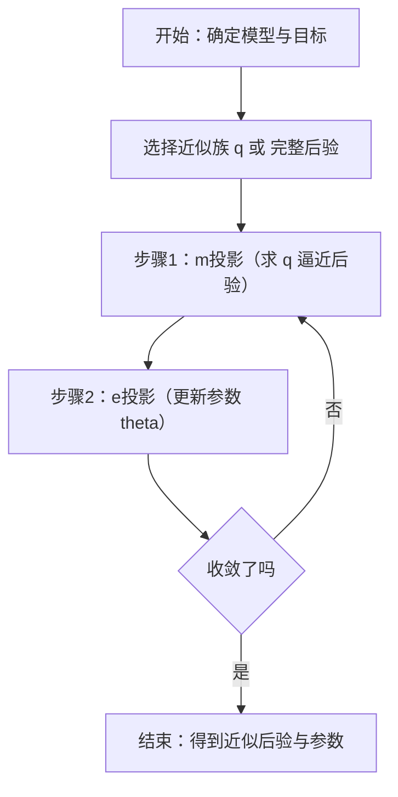

信息几何与概率分布空间

*——把“几率”的世界当作一张可度量、可微分的几何地图*

> 直觉先行：在普通机器学习里，我们把参数当作坐标、把损失当作地形。**信息几何**更进一步——把**概率分布本身**当作几何空间里的点，用**Fisher 信息度量**做尺子，用**KL 散度**做角度/距离的替代品。这样，我们能更“顺坡就下”地优化（自然梯度）、更“正交”地投影（EM / VI 的几何解释），也能更清晰地看懂指数族、Bregman 散度等熟面孔背后的统一结构。

---

## 1. 为什么需要“信息几何”？

* **普通欧式视角**：参数 $\theta\in\mathbb{R}^d$ 只是坐标，梯度下降用同一把尺子（欧式度量）走步子。
* **概率的内禀几何**：不同参数点代表**不同分布** $p_\theta(x)$。某些方向上一丝移动会让分布巨变，另一些方向动很大也几乎没影响——显然，不同方向“单位长度”的意义应当不同。
* **解决痛点**：

  * 梯度在不同参数尺度下“忽大忽小” → **自然梯度**自动按统计敏感度调整步长；
  * EM/VI 的“交替优化”→ 是在 KL 几何中做两种**正交投影**；
  * 指数族、熵、Bregman 散度 → **同一套几何语法**下的不同语句。

---

## 2. 概率分布流形与 Fisher 信息度量

把可微的分布族 $\mathcal{P}=\{p_\theta: \theta\in\Theta\}$ 看作一张**流形**。在 $\theta$ 处，**Fisher 信息矩阵**定义“切空间”的内积（尺子）：

$$
F(\theta)\;=\;\mathbb{E}_{x\sim p_\theta}\!\left[\nabla_\theta\log p_\theta(x)\,\nabla_\theta\log p_\theta(x)^\top\right].
$$

它衡量“在 $\theta$ 附近，参数微调对分布的可辨识程度”。

* **几何直觉**：$\mathrm{d}s^2=\mathrm{d}\theta^\top F(\theta)\,\mathrm{d}\theta$ 是微小位移的“**信息长度**”。
* **不变性**：Fisher 度量对可逆重参数化不变；这点是“自然”的由来。

### 小例子：一维高斯均值已知、方差已知

$p_\mu(x)=\mathcal{N}(x;\mu,\sigma^2)$；

$$
\frac{\partial}{\partial \mu}\log p_\mu(x)=\frac{x-\mu}{\sigma^2},\quad
F(\mu)=\mathbb{E}\left[\frac{(x-\mu)^2}{\sigma^4}\right]=\frac{1}{\sigma^2}.
$$

**含义**：方差越小（分布越尖），同样的 $\Delta\mu$ 对分布的改变越大，Fisher 越大，步骤应更谨慎。

---

## 3. 自然梯度：沿“最短的信息路径”下降

普通梯度下降：$\theta_{t+1}=\theta_t-\alpha\nabla_\theta L(\theta_t)$。
**自然梯度**用 Fisher 度量来决定“最短步”：

$$
\tilde\nabla_\theta L \;=\; F(\theta)^{-1}\nabla_\theta L(\theta),\qquad
\theta_{t+1}=\theta_t-\alpha\,\tilde\nabla_\theta L.
$$

* **解读**：在“信息长度”约束 $\mathrm{d}\theta^\top F\,\mathrm{d}\theta=\varepsilon^2$ 下，使损失下降最快的方向；
* **数值好处**：等价于一种**自适应预条件**，减少病态尺度的影响。
* **实践**：深度学习中用 **K-FAC**、对角近似、低秩近似来估计 $F^{-1}$。

**图示说明**：用 Fisher 度量“定尺”，自然梯度“定向”，一步到位走“信息上最陡的坡”。

---

## 4. 指数族、对偶坐标与 KL = Bregman

很多常用分布属于**指数族**：

$$
p_\theta(x)=\exp\!\big(\theta^\top T(x)-A(\theta)+h(x)\big),
$$

其中 $A(\theta)$ 是对数配分函数，$\eta=\nabla_\theta A(\theta)=\mathbb{E}[T(x)]$ 称为**期望坐标**。于是我们得到两套“对偶坐标”：

* **自然坐标** $\theta$（参数空间是**e-平直**、即指数平直）；
* **期望坐标** $\eta$（期望空间是**m-平直**、即混合平直）。

**关键信息**：对指数族，**KL 散度就是 $A$ 的 Bregman 散度**（交换两类坐标使用互为 Legendre 对偶的势函数）：

$$
\mathrm{KL}(p_{\theta_1}\,\|\,p_{\theta_2})
=A(\theta_2)-A(\theta_1)-\nabla A(\theta_1)^\top(\theta_2-\theta_1)
=\mathcal{D}_A(\theta_2\,\|\,\theta_1).
$$

这条等价关系把“**最优化**（Bregman）”与“**统计距离**（KL）”连到了一起。

---

## 5. EM 算法与两种正交投影（e-投影 / m-投影）

带隐变量 $z$ 的极大似然：

$$
\max_\theta\ \log p_\theta(x)=\max_\theta\ \log\!\int p_\theta(x,z)\,\mathrm{d}z.
$$

EM 的两步可以几何地解读为在两类平直结构之间交替**正交投影**：

* **E 步**（m-投影）：求 $q(z)\approx p_\theta(z|x)$，使 $\mathrm{KL}(q\|p_\theta(z|x))$ 最小；
* **M 步**（e-投影）：求 $\theta$，使 $\mathrm{KL}(q(z)p_\theta(x|z)\,\|\,p_\theta(x,z))$ 最小（等价最大化 $Q(\theta)$）。

**图示说明**：E 步在“混合平直”空间（$\eta$）找最近；M 步在“指数平直”空间（$\theta$）找最近。两步交替，单调提升对数似然。

---

## 6. 变分推断（VI）与镜像下降

VI 在一族近似 $q_\phi(z)$ 中最小化 $\mathrm{KL}(q_\phi(z)\,\|\,p(z|x))$。在指数族/对偶坐标下，这等价于用 KL（Bregman）作**镜像函数**做**镜像下降（Mirror Descent）**：

$$
\phi_{t+1}=\arg\min_\phi\ \langle\nabla_\phi L(\phi_t),\phi-\phi_t\rangle + \frac{1}{\alpha_t}\,\mathrm{KL}(q_\phi\|q_{\phi_t}).
$$

**连线**：欧式梯度下降 ←→ 镜像下降（Bregman 度量） ←→ 自然梯度（Fisher 度量）。

---

## 7. 信息几何的“勾股定理”（Pythagorean）

在 Bregman/KL 几何里也有勾股定理：若 $\mathcal{M}$ 是**m-平直**集合，点 $p$ 沿 m-投影到 $\hat p\in\mathcal{M}$，则对任意 $q\in\mathcal{M}$：

$$
\mathrm{KL}(p\|q)=\mathrm{KL}(p\|\hat p)+\mathrm{KL}(\hat p\|q).
$$

**意义**：分解误差，“先到最近点，再到目标点”，这就是很多**投影类算法收敛性**的几何基础。

---

## 8. 与深度学习/大模型的连接点

* **自然梯度与预条件**：在分类/语言建模里，Fisher 近似为输出分布的协方差（如 softmax 的 Fisher）；K-FAC 把 Fisher 近似成分层 Kronecker 分块，**训练更稳**。
* **BN/层归一化的几何味道**：在内部把尺度标准化，某种意义上减轻了“坐标尺度”的不良影响，接近“选择好度量”。
* **对比学习与 Bregman**：很多损失（如交叉熵/softmax 对比损失）与 KL/负对数似然之间有天然的 Bregman 联系。
* **EM/VI 在生成模型**：混合模型、潜变量文本/图像模型（VAE）里，E 步≈推断、M 步≈更新生成器；现代作法把二者打包成端到端（ELBO 优化）。
* **LoRA/低秩适配**：在“合适的度量”下做小步更新，常能更快找到“信息上有效”的方向；这与自然梯度“按信息敏感度走路”的精神一致。

---

## 9. 练习与思考

1. **Fisher 计算**：推导二维高斯 $p_{\mu,\sigma^2}$ 的 Fisher 矩阵（参数为 $\mu,\log\sigma$ 更方便），并验证其正定性。
2. **自然梯度 = Mirror Descent**：在指数族上证明自然梯度一步等价于以 $A(\theta)$ 的 Bregman 散度做镜像步（小步长极限）。
3. **Bernoulli-Logistic**：推导逻辑回归的 Fisher：$F=X^\top W X$，其中 $W=\mathrm{diag}(p_i(1-p_i))$。与牛顿/广义线性模型的海森矩阵对比。
4. **EM 的 Pythagorean**：写出高斯混合模型中 E/M 步的 m/e 投影解释，并画出 KL 勾股分解。
5. **VAE 的几何**：把 ELBO 写成 KL + 期望项，解释为什么“后验坍缩”可视为投影失败（先验过强/解码器过强）导致的几何偏斜。

---

## 10. 常见坑与实践建议

* **Fisher 估计困难**：全量 $F$ 维度巨大。用**对角/Kronecker/低秩**近似，或“自然梯度的近亲”如 AdaGrad/Adam（从一阶统计近似 Fisher）。
* **重参数化敏感**：欧式梯度对参数化方式敏感，自然梯度更稳健；若仍采用普通优化，优先选**良好参数化**（如 $\log\sigma$ 而不是 $\sigma$）。
* **KL 方向别写反**：VI 里 $\mathrm{KL}(q\|p)$ 与 $\mathrm{KL}(p\|q)$ 偏好不同（前者“零覆盖”倾向，后者“平均覆盖”），选择决定解的风格。
* **指数族假设**：很多优雅结论依赖指数族结构；非指数族需更一般的 α-连接与更复杂的几何工具。

---

## 11. 迷你推导：自然梯度是“最陡下降”的信息版

考虑小步 $\delta\theta$，一方面希望损失下降最大：$-\nabla L^\top\delta\theta$ 最大；另一方面约束信息长度不超过 $\varepsilon$：$\delta\theta^\top F\delta\theta\le \varepsilon^2$。
拉格朗日：

$$
\max_{\delta\theta}\ -\nabla L^\top\delta\theta \quad
\text{s.t.}\ \delta\theta^\top F\delta\theta\le \varepsilon^2
\Rightarrow \delta\theta \propto -F^{-1}\nabla L.
$$

这就是自然梯度方向。

---

## 12. 一个更形象的小流程（VI / EM）

**图示说明**：用“m/e 投影”视角看 EM / VI，理解收敛单调性的几何原因。

---

## 13. 小结

* **Fisher 信息度量**把“统计可辨性”当尺子，得到**自然梯度**这种“几何友好”的优化步。
* **指数族与对偶坐标**让 **KL ↔ Bregman** 成立，EM/VI 变成在两类平直结构间做**正交投影**。
* 在大模型时代，**选择合适的度量/预条件**、**理解 KL 的方向性**、**用对偶坐标看优化**，常能带来更稳定的训练、更可解释的推断与更优雅的算法设计。

> 记住这句话：\*\*别把“概率的国度”当成平地去跑步。\*\*用对的尺子、沿对的方向走，才是信息世界里的“最短路径”。
