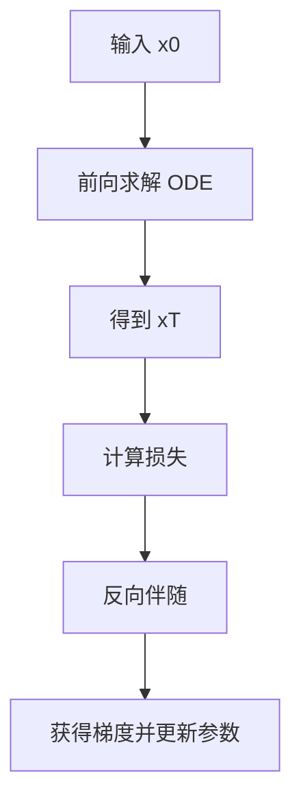
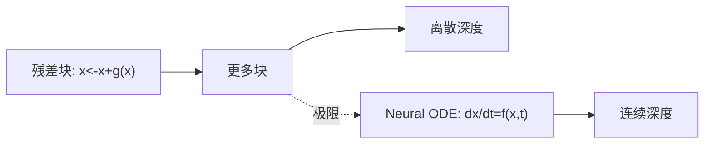

微分方程与神经微分方程（Neural ODEs）

*——把“层数”变成“时间”，让网络在连续深度里流动*

> 直觉版：把神经网络看成在“时间”里演化的系统。普通残差网络像是**每走一步就改一点**（离散步），而 Neural ODE 是**把步长变成无穷小**，让表征像水流一样连续演化。这样做能天然适配**不规则时间采样**、提供**可逆流**（密度估计）、并借助**数值分析工具**控制稳定性与误差。

---

## 1. 常微分方程一分钟复习

* **初值问题（IVP）**
  给定向量场 $f(t,x)$ 与初值 $x(t_0)=x_0$，求满足

  $$
  \frac{dx(t)}{dt}=f(t,x(t)),\quad x(t_0)=x_0
  $$

  的轨迹 $x(t)$。
* **存在唯一性（Picard–Lindelöf）**：若 $f$ 在附近利普希茨，则解存在且唯一。
* **流与半群**：把“解到时间 $t$”看成算子 $\Phi_t(x_0)$，满足 $\Phi_{t+s}=\Phi_t\circ\Phi_s$。

生活类比：在坡上滚下来的球，受力 $f(t,x)$ 决定速度方向；初值决定起点；流就是“滚了多久到哪”。

---

## 2. 数值解的基本套路（为后面铺路）

* **欧拉法（显式一阶）**：
  $x_{k+1}=x_k+h\,f(t_k,x_k)$。快，但误差大、稳定性差。
* **Runge–Kutta（例如 RK4）**：
  用 4 次中间斜率合成一步，精度高于欧拉。
* **自适应步长**：根据误差估计自动调整 $h$。
* **刚性问题**：系统含快慢时间尺度，显式法易发散；需隐式法（如 BDF）或特殊稳定技巧。

这些名字马上就会变成“神经网络前向传播的可选算法”。

---

## 3. Neural ODE 的核心定义

把网络层的离散更新

$$
x_{k+1}=x_k+g_\theta(x_k)
$$

看成欧拉离散化的近似：

$$
\frac{dx}{dt}=f_\theta(t,x),\quad x(t_0)=x_0,\quad x(t_1)=\mathrm{ODESolve}(f_\theta, x_0, t_0\!\to\! t_1).
$$

* $f_\theta$ 是**神经网络参数化**的向量场（MLP、卷积、注意力都行）。
* 训练时把 **ODE 求解器** 当作可微模块：前向“积分”，反向“求梯度”。
* 输出可来自终点 $x(t_1)$，或对轨迹做积分/采样。

### 残差网络的连续极限

残差块 $x_{k+1}=x_k+\Delta t\,f_\theta(x_k)$ 当 $\Delta t\to 0$，得到连续深度模型 —— **Neural ODE 是 ResNet 的极限形式**。



**图示**：Neural ODE 的训练管线：前向积分 → 计算损失 → 伴随法反传 → 更新参数。

---

## 4. 伴随灵敏度（Adjoint）法：怎么高效反传

直接对求解过程做反传会占用大量内存（要存每一步状态）。**伴随法**通过解一条“逆向 ODE”来拿梯度，内存友好。

令损失 $L(x(t_1))$，定义伴随变量

$$
a(t)=\frac{\partial L}{\partial x(t)}.
$$

则有**伴随方程**（从 $t_1$ 往 $t_0$ 解）：

$$
\frac{da(t)}{dt}=-a(t)^\top \frac{\partial f_\theta(t,x(t))}{\partial x},\quad a(t_1)=\frac{\partial L}{\partial x(t_1)}.
$$

参数梯度为

$$
\frac{dL}{d\theta}=\int_{t_1}^{t_0} a(t)^\top \frac{\partial f_\theta(t,x(t))}{\partial \theta}\,dt.
$$

> 要点：再做一次“反向积分”，就能拿到所有梯度；无需保存整段轨迹（也可做检查点折中）。

---

## 5. 连续正态化流（CNF）：可逆与密度估计

普通正态化流需要 $\log\lvert\det \partial x/\partial z\rvert$，代价 $O(d^3)$。在 ODE 里，密度的变化满足

$$
\frac{d}{dt}\log p(x(t)) = -\mathrm{div}\,f_\theta(t,x(t))
= -\mathrm{tr}\Big(\frac{\partial f_\theta}{\partial x}\Big).
$$

因此

$$
\log p(x(t_1))=\log p(x(t_0))-\int_{t_0}^{t_1}\mathrm{tr}\big(\partial f_\theta/\partial x\big)\,dt.
$$

* 计算迹可用 **Hutchinson 随机迹估计**，近似成本 $O(d)$。
* 得到**可逆、连续时间**的流模型（CNF），常用于密度估计与采样。

---

## 6. 应用：为什么值得上 ODE

1. **不规则时间序列**：医疗监测、传感器间隔不均。用 ODE 在任意时间点查询状态，天然适配补齐与外推。
2. **密度建模与生成**：CNF 作为可逆生成模型，训练与采样一致且可控。
3. **连续深度感知**：把“网络深度”变为超参数“积分终点”，可按需调解推理开销（早停/晚停）。
4. **物理先验与约束**：把守恒、对称性写进 $f_\theta$；或用 **PINNs**（物理信息神经网络）把 PDE 残差当正则。
5. **控制视角**：把输入当控制信号 $u(t)$，$\dot x=f_\theta(x,t,u)$，可做轨迹优化与模仿学习。

---

## 7. 稳定性与数值性：工程落地的关键

* **选择求解器**

  * 非刚性：`RK4`、Dormand–Prince（自适应 Runge–Kutta）。
  * 刚性：`BDF`、`Rosenbrock`（隐式法更稳，但单步更贵）。
* **误差容忍度**：绝对/相对容差决定步长与计算量；训练中需与批大小、学习率共同调节。
* **向量场正则**

  * 控 Lipschitz（谱范数约束、权重标准化），减缓爆炸/过度平滑；
  * **稳定残差**（如加负散度惩罚）使轨迹可控。
* **离散 vs 连续差异**：Neural ODE 不一定严格优于深残差；在数据量、算力、任务结构上权衡。
* **可逆性与梯度质量**：伴随法在强刚性或不连续处可能不稳定；可启用**检查点**混合反传或提高容差。

---

## 8. 与残差网络的对应图



**图示**：残差块的层层相加，收敛到“连续变化”的 Neural ODE。

---

## 9. 迷你代码（PyTorch 风格伪码）

> 思路演示（依赖通用 ODE 求解器接口），展示前向和伴随求梯度的结构。

```python
# 向量场 f_theta(t, x)
class ODEVField(nn.Module):
    def __init__(self, dim):
        super().__init__()
        self.net = nn.Sequential(
            nn.Linear(dim, 64), nn.Tanh(),
            nn.Linear(64, 64), nn.Tanh(),
            nn.Linear(64, dim)
        )
    def forward(self, t, x):
        return self.net(x)

# 前向：把 x0 积分到 t1
def forward(model, x0, t0=0.0, t1=1.0, solver="dopri5", rtol=1e-5, atol=1e-6):
    t_span = torch.tensor([t0, t1])
    xT = ode_solve(model, x0, t_span, solver=solver, rtol=rtol, atol=atol)  # 返回 x(t1)
    return xT

# 训练迭代
model = ODEVField(dim)
opt = torch.optim.Adam(model.parameters(), lr=1e-3)
for x0, y in loader:
    xT = forward(model, x0)
    loss = criterion(head(xT), y)
    opt.zero_grad()
    loss.backward()  # 内部采用伴随法或检查点反传
    opt.step()
```

**实践贴士**：把“容差”当超参调；若梯度噪声大，可加权重衰减、谱约束；遇到刚性显著时换隐式或半隐式求解器。

---

## 10. 神经微分方程的扩展

* **Neural SDE**：$\mathrm{d}x=f_\theta dt+g_\theta \mathrm{d}W_t$，噪声项建模随机动态（金融、扩散模型）。
* **神经控制微分方程（Neural CDE）**：$\mathrm{d}x=f_\theta(x)\,\mathrm{d}U_t$，用控制信号轨迹 $U_t$ 驱动（适配不规则序列）。
* **PDE + 神经网络**：PINNs、Fourier Neural Operator，把偏微分方程当软约束或直接学习算子。

---

## 11. 小练习（带思考方向）

1. **等价性**：证明残差块 $x_{k+1}=x_k+\Delta t\,f(x_k)$ 在 $\Delta t\to 0$ 下收敛到 ODE。
2. **伴随推导**：从 $L(x(t_1))$ 出发，用变分法推导伴随方程与参数梯度。
3. **稳定性实验**：对比欧拉、RK4、BDF 在一个刚性示例上的收敛与耗时。
4. **CNF 小实验**：实现 Hutchinson 迹估计，验证维度升高时的效率变化。
5. **不规则时间序列**：在缺测时间戳的医疗数据上，用 Neural ODE 做插值与分类并与 GRU-$\Delta t$ 对比。

---

## 12. 小结

* Neural ODE 把“离散层”升级为“连续时间”，用数值求解器负责前向，用伴随法负责反向。
* 它在**不规则时间、可逆流密度估计、注入物理先验**等场景具有独特优势。
* 工程上要重视**求解器选择、容差、稳定性正则**，并与经典深残差方法做实际对比。

> 牢记一句话：**选择好的向量场 + 选择合适的积分器 = 可控、可解释的连续深度网络。**
