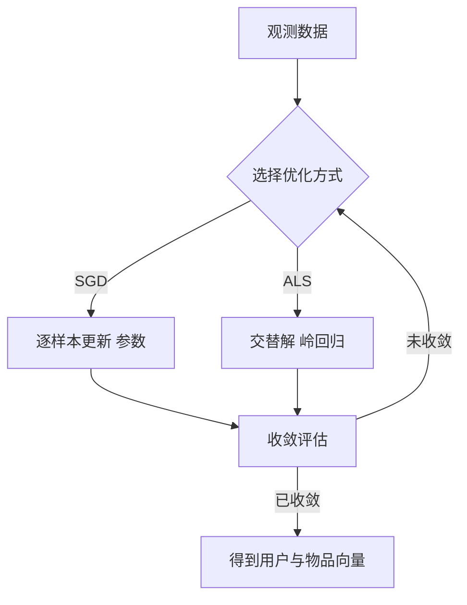
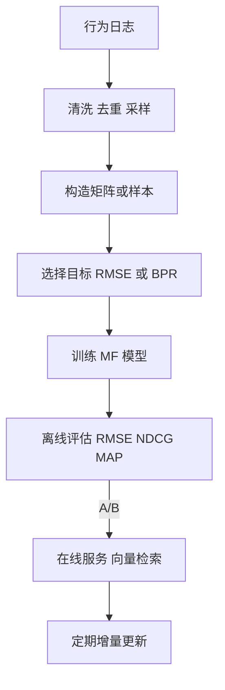
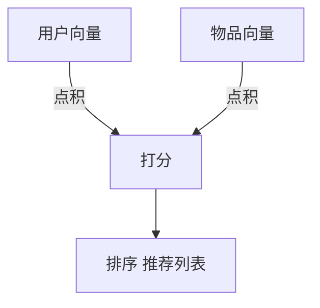
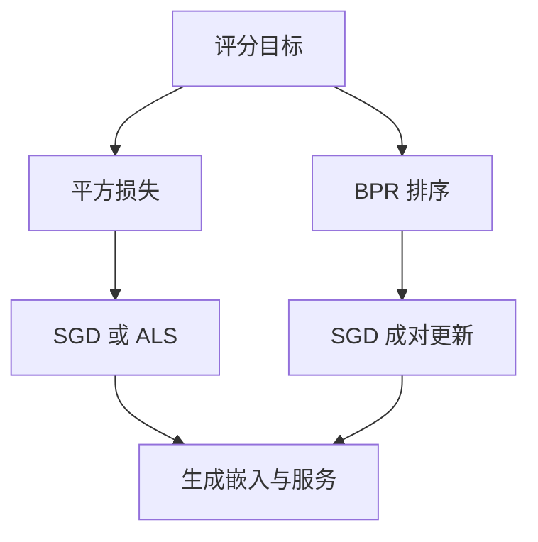

8-6 矩阵分解与低秩近似在推荐系统中的应用

*——把“人 × 物”的大表格，压缩进几个有含义的隐藏维度*

> 直觉先行：把用户–物品评分表看成一张巨大的“照片”。低秩近似就像**用少量主色**来复原这张照片——虽然省下了大量像素，但仍抓住了最重要的结构。推荐系统中的矩阵分解，就是把用户和物品都嵌入到一个低维空间里：**相似用户靠近，相似物品靠近，匹配就有高分**。

---

## 1. 从“评分表”到“低秩”的故事

* **数据模型**：有 $m$ 个用户、$n$ 个物品，构造评分矩阵 $R\in\mathbb{R}^{m\times n}$。绝大多数条目是**未知**（未互动），只观测到集合 $\Omega\subseteq\{(u,i)\}$。
* **低秩假设**：用户兴趣与物品属性都可用少量隐向量解释。于是，

  $$
  R \approx P Q^\top,\quad P\in\mathbb{R}^{m\times k},\ Q\in\mathbb{R}^{n\times k},\ k\ll \min(m,n),
  $$

  其中 $p_u$ 是用户 $u$ 的 $k$ 维向量，$q_i$ 是物品 $i$ 的 $k$ 维向量，预测 $\hat r_{ui}=p_u^\top q_i$。

生活类比：给每个用户和电影贴“口味标签”（动作、爱情、冷门、经典…），标签向量点积越大，就越可能喜欢。

---

## 2. SVD 与最佳低秩近似（全观测理想形态）

若 $R$ **没有缺失**，SVD 给出最优秩 $k$ 近似（Eckart–Young 定理）：

$$
R = U\Sigma V^\top,\quad R_k = U_k \Sigma_k V_k^\top = \arg\min_{\mathrm{rank}(X)\le k}\|R-X\|_F.
$$

现实推荐是**缺失极多**，无法直接做 SVD，于是我们转向**只在已观测处拟合**的矩阵分解训练目标。

---

## 3. 显式反馈矩阵分解（带偏置）

### 3.1 目标函数

$$
\min_{P,Q,b}\;\sum_{(u,i)\in\Omega}\big(r_{ui}-\mu-b_u-b_i-p_u^\top q_i\big)^2
+\lambda\!\left(\sum_u(\|p_u\|^2+b_u^2)+\sum_i(\|q_i\|^2+b_i^2)\right),
$$

其中 $\mu$ 是全局均值，$b_u,b_i$ 是用户/物品偏置（有人打分普遍更高或某电影普遍更受欢迎）。

### 3.2 两类常用优化

* **SGD（逐条样本）**
  设误差 $e_{ui}=r_{ui}-\hat r_{ui}$，学习率 $\eta$：

  $$
  \begin{aligned}
  p_u &\leftarrow p_u + \eta\,(e_{ui} q_i-\lambda p_u),\quad
  q_i \leftarrow q_i + \eta\,(e_{ui} p_u-\lambda q_i),\\
  b_u &\leftarrow b_u + \eta\,(e_{ui}-\lambda b_u),\quad
  b_i \leftarrow b_i + \eta\,(e_{ui}-\lambda b_i).
  \end{aligned}
  $$
* **ALS（交替最小二乘）**
  交替固定 $Q$ 解 $P$，再固定 $P$ 解 $Q$；每一步都是带 $|\mathcal{N}(u)|$ 或 $|\mathcal{N}(i)|$ 个样本的小型岭回归，**并行友好**、适合离线大规模训练。



**图示**：显式反馈矩阵分解的两种常用求解路径。

---

## 4. 隐式反馈：点击、浏览、购买的建模

评分常缺失，但**点击/浏览/停留时长**等隐式信号丰富。常用**加权回归**建模（权重代表置信度）：

* 定义偏好 $p_{ui}\in\{0,1\}$：有过互动记为 1，无互动为 0。
* 置信度 $c_{ui}=1+\alpha r_{ui}$（或按次数/时长构造）。
* 目标：

  $$
  \min_{P,Q}\;\sum_{u,i} c_{ui}\,(p_{ui}-p_u^\top q_i)^2
  + \lambda\left(\sum_u\|p_u\|^2+\sum_i\|q_i\|^2\right).
  $$

权重让模型**更重视“确实喜欢”的样本**，同时不把所有未互动都当“强烈不喜欢”。

---

## 5. 排序优先：BPR 的成对学习

做 Top-K 推荐时，优化 RMSE 不如直接优化排序。\*\*BPR（Bayesian Personalized Ranking）\*\*用成对样本 $(u,i,j)$（用户看过 $i$ 没看过 $j$）最大化：

$$
\max\ \sum_{(u,i,j)} \log \sigma\big( p_u^\top q_i - p_u^\top q_j \big) - \lambda(\|p_u\|^2+\|q_i\|^2+\|q_j\|^2).
$$

SGD 更新把“正样本得分”拉高、“负样本得分”拉低，更贴近召回/排序任务。

---

## 6. 约束与可解释：NMF、正则与先验

* **NMF（非负矩阵分解）**：要求 $P,Q\ge 0$，分解变成“加法部件”，可解释性更强（例如“类型强度”）。
* **正则化**：$\ell_2$ 常用，$\ell_1$ 稀疏化可让维度更“干净”；也可用**Dropout/DropEdge** 思想做样本或维度的随机屏蔽。
* **侧信息融合**：把用户/物品属性（年龄、品类、文本 embedding）拼到向量里，或通过**Factorization Machines**、**多任务**约束共享。

---

## 7. 从“低秩”到“嵌入”：与深度模型的衔接

* 矩阵分解的 $p_u,q_i$ 本质是**嵌入向量**。
* **Neural MF**：用 MLP 替代简单点积，学习更复杂的匹配函数；
* **二阶段推荐**：第一阶段（召回）用 MF/图召回快速筛子，第二阶段（排序）用深模型（DIN、Transformer）细排；
* **图建模**：用户–物品二分图上跑 GNN，隐式实现“聚合邻居”的低秩近似。

---

## 8. 训练与上线：一条实用流水线



**图示**：从日志到上线的主流程；“向量检索”可用 ANN（如 HNSW/IVF）加速在线 Top-K。

---

## 9. 一个手搓的小例子

假设 3 个用户 × 4 个电影（未评分记为“?”）：

$$
R=
\begin{bmatrix}
5 & 4 & ? & 1\\
4 & ? & 2 & 1\\
? & 2 & 4 & ?
\end{bmatrix},\quad k=2.
$$

* 初始化 $P,Q$ 随机；只对已观测条目做 SGD。
* 若采用偏置项，先减去全局均值再学 $b_u,b_i$。
* 训练若干轮后，得到 $p_u,q_i$。预测“？”处：$\hat r_{ui}=p_u^\top q_i + \mu + b_u + b_i$。
* Top-K 推荐：对用户 $u$ 按 $\hat r_{ui}$ 排序，取未看过的前 $K$。

> 观察：两个用户的向量夹角小，口味相似；两个电影的向量相近，可能属于同一风格。

---

## 10. 代码骨架（SGD 版，显式反馈）

```python
import numpy as np

def train_mf_sgd(triples, m, n, k=64, lr=0.01, reg=1e-3, iters=10):
    # triples: list of (u, i, r), u in [0,m), i in [0,n)
    rng = np.random.default_rng(0)
    P = 0.1 * rng.standard_normal((m, k))
    Q = 0.1 * rng.standard_normal((n, k))
    bu = np.zeros(m)
    bi = np.zeros(n)
    mu = np.mean([r for _,_,r in triples])
    for _ in range(iters):
        rng.shuffle(triples)
        for u, i, r in triples:
            pred = mu + bu[u] + bi[i] + P[u] @ Q[i]
            e = r - pred
            bu[u] += lr * (e - reg * bu[u])
            bi[i] += lr * (e - reg * bi[i])
            Pu = P[u].copy()
            P[u] += lr * (e * Q[i] - reg * P[u])
            Q[i] += lr * (e * Pu    - reg * Q[i])
    return P, Q, bu, bi, mu
```

> 实战提示：用小批量会更稳；隐式反馈或 BPR 需要改造样本生成与损失；工业场景常用 **ALS** 或分布式实现。

---

## 11. 评估指标与注意事项

* **回归型**：RMSE/MAE（适合评分预测）。
* **排序型**：HitRate\@K、Precision\@K、Recall\@K、MAP、NDCG（更贴近首页推荐）。
* **采样偏置**：日志数据是**被系统和用户选择过**的（MNAR），离线评估要谨慎；可引入**反事实评估**（IPS/DR）。
* **冷启动**：新用户/新物品向量难学，结合内容特征（文本、图像、标签）或使用预训练嵌入初始化。
* **规模化**：稀疏存储、批量负采样、参数分片、ANN 检索；在线需**延时与新鲜度**权衡。

---

## 12. 常见变体与拓展

* **时间漂移**：加入时间偏置或时间衰减，适配趋势变化。
* **上下文感知**：在 $p_u,q_i$ 基础上引入上下文向量（位置、设备、节日），做 **Context-Aware MF**。
* **多目标**：把“点击”“加购”“购买”多任务联合训练，共享底层嵌入。
* **与大模型结合**：物品标题/图片经大模型编码成向量，作为 $q_i$ 的先验或初始化；召回后用 LLM/多模态模型二次重排。

---

## 13. 小结

* **低秩近似**是“压缩结构”的数学语言；矩阵分解把用户与物品映射到同一向量空间，点积就是匹配分。
* **显式反馈**用带偏置的平方损失，**隐式反馈**用置信度加权，**BPR**强调排序；ALS 与 SGD 是两条好用的优化路线。
* 在工业里，矩阵分解常作为**召回主力**：快、稳、可解释；与深度排序、图模型、LLM 重排配合，形成高性能推荐系统。

---

## 14. 练习

1. 推导 ALS 中用户向量 $p_u$ 的闭式更新：当固定 $Q,b$ 时，$(A+\lambda I)p_u = b$ 的具体形式。
2. 在隐式反馈目标中，证明当 $c_{ui}$ 足够大时，模型会强制 $p_u^\top q_i$ 逼近 1。
3. 实现 BPR-SGD，比较与回归损失在 NDCG\@10 上的差异。
4. 用带文本嵌入的 $q_i$ 初始化与随机初始化对比，观察冷启动物品的提升。
5. 设计一次 A/B：MF 召回 + ANN 检索 vs 仅用热门规则，记录 CTR、CVR、留存的变化。

---

### 附：两张小图



**说明**：用户与物品在同一向量空间点积，得到分数后排序。



**说明**：不同目标与优化路径，均以生成嵌入并服务为终点。
