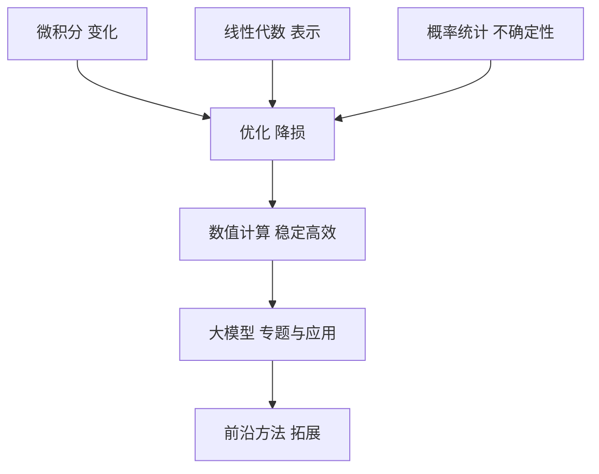
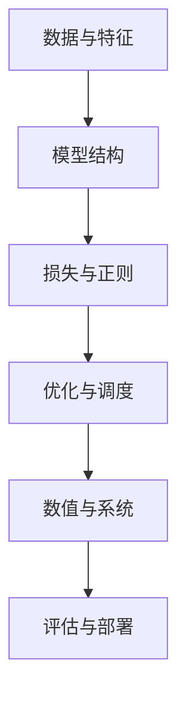
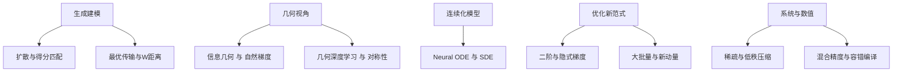

本书总结与展望

*——把数学变成你的工程“底盘”与决策仪表盘*

> 读完本书，你应该能把一个看似杂乱的建模问题，拆成**表示—不确定性—优化—数值—系统**五块，再用恰当的数学“扳手”逐一拧紧。本章回顾主线、提炼要点、给出落地清单与未来方向。

---

## 一、全书知识地图（从地基到整机）

* **微积分（第 1–2 章）**：用导数、梯度、方向导数与 Hessian 描述“变化与弯曲”，让我们能**评估一步走多大**、**会不会震荡**。
* **线性代数（第 3 章）**：向量、矩阵、张量是高维世界的“坐标系”；SVD、特征分解、PCA、低秩近似是**压缩与解释**的利器。
* **概率与统计（第 4 章）**：把不确定性变成可计算对象：分布、期望、熵、KL、MLE/MAP、贝叶斯、蒙特卡洛、偏差-方差。
* **优化方法（第 5 章）**：从一阶（GD、SGD、动量）到二阶（牛顿、拟牛顿）、约束与 KKT、自适应优化与学习率调度，保证**能下山且不迷路**。
* **数值与算力（第 6 章）**：浮点与稳定性、矩阵误差、自动微分、GPU/TPU 与分布式、混合精度与梯度裁剪，保证**又快又稳**。
* **大模型专题（第 7 章）**：嵌入、相似度、注意力与 Transformer、复杂度分析、损失与正则、预训练与微调，把前面所有部件**组装成整机**。
* **前沿拓展（第 8 章 1–6 节）**：最优传输、流形、图谱、信息几何、Neural ODE、低秩推荐，给出**更强更稳的替代与补充**。

**说明**：五大基础层层支撑，最终落到可用、可扩展的大模型系统。

---

## 二、工程闭环：从数据到上线，数学怎么“卡位”

* **数据与特征**：用 PCA/SVD 做降维与去噪；用张量与爱因斯坦求和写清高维操作。
* **模型结构**：用谱理论与注意力矩阵的分解理解计算/显存瓶颈；用低秩/稀疏近似提速。
* **损失与正则**：交叉熵=最小化 NLL；KL=分布“距离”；L2≈高斯先验、L1≈拉普拉斯先验；Dropout 的概率解释。
* **优化与调度**：SGD+动量/Adam 搭配 warmup、余弦或 OneCycle；约束问题配合 KKT 与投影。
* **数值与系统**：log-sum-exp、稳定 softmax、混合精度 + loss scale、梯度裁剪；分布式通信与检查点。
* **评估与部署**：Bootstrap 给置信区间；偏差-方差分解校准期望；A/B 验证离线—在线一致性。

---

## 三、12 个“抄在小纸条上的”式子与结论

1. 一阶泰勒：$f(x+\Delta)\approx f(x)+\nabla f(x)^\top\Delta$
2. 二阶泰勒：$f(x+\Delta)\approx f(x)+\nabla f^\top\Delta+\tfrac12\Delta^\top H\Delta$
3. 方向导数：$D_{\!u}f(x)=\nabla f(x)^\top u$
4. 链式法则（向量到向量）：$J_{y\leftarrow x}=J_{y\leftarrow z}\,J_{z\leftarrow x}$
5. 最优低秩：SVD 给出 $\arg\min_{\mathrm{rank}\le k}\|R-X\|_F$
6. Ridge 闭式解：$\hat\beta=(X^\top X+\lambda I)^{-1}X^\top y$
7. 交叉熵与 KL：$\mathrm{CE}(p,q)=-\sum p\log q$, $\mathrm{KL}(p\|q)=\sum p\log\frac{p}{q}$
8. Softmax 稳定实现：$\mathrm{softmax}(z)_i=\frac{e^{z_i-z_{\max}}}{\sum_j e^{z_j-z_{\max}}}$
9. Adam 核心更新：$\theta\leftarrow\theta-\alpha\frac{\hat m}{\sqrt{\hat v}+\epsilon}$
10. KKT 一阶条件：$\nabla f+\sum\lambda_i\nabla g_i+\sum\mu_j\nabla h_j=0$ 且互补松弛
11. 偏差-方差：$\mathbb E[(\hat f-f)^2]=\mathrm{Bias}^2+\mathrm{Var}+\sigma^2$
12. 注意力复杂度：标准自注意力 $O(n^2d)$，低秩/稀疏/核化可至近线性

---

## 四、常见“坑点”与排障顺序

1. **先看学习率**：过大会震荡，过小看不到下降；配合 warmup。
2. **看量纲与归一**：输入/目标的尺度不一致最易引起梯度不稳。
3. **看数值稳定**：log-likelihood 用 log-sum-exp，softmax 前减最大值；混合精度下用 loss scaling。
4. **看曲率**：用小批量近似 Trace(H) 或对角，评估步长上限。
5. **看正则与数据**：是否欠/过拟合？增广、权衰减、标签平滑能否改善。
6. **看复杂度**：注意力长度、batch、通信占比；采用低秩/稀疏或缓存 KV。

---

## 五、两张小抄：能力清单与落地清单

**能力清单**

* 能把任意损失写成**期望或信息量**；
* 能把任何高维算子**改写成张量与爱因斯坦求和**；
* 能从梯度与曲率的角度**解释收敛现象**；
* 能给出**稳定实现**与**复杂度估算**；
* 能将**正则化↔先验**对上号。

**落地清单**

* 训练脚本里固定：归一化、梯度裁剪、混合精度与稳定 softmax。
* 每次实验固定：学习率搜索 + 调度，报告方差与置信区间。
* 长序列或大图：优先考虑低秩/稀疏注意力或块化策略。
* 微调大模型：优先 LoRA/低秩适配 + 合理权衰减与分层 LR。

---

## 六、展望：五条值得“多投一点时间”的路线

* **生成建模**：Wasserstein 距离与扩散目标的数值稳定连接。
* **信息几何**：在参数空间用“更合身”的度量（自然梯度）走路。
* **Neural ODE/SDE**：不规则时间、物理先验、控制问题的一致框架。
* **近二阶与隐式梯度**：更快收敛、更稳微调。
* **稀疏与低秩**：把“大模型不可训练”变成“工程可控”。

---

## 七、一个 4 周强化学习计划（可直接照做）

* **第 1 周（表示）**：复现 PCA/SVD、LoRA 低秩微调；写出复杂度与内存估算。
* **第 2 周（优化）**：同一任务对比 SGD+动量 / AdamW + 三种调度，画学习曲线与方差区间。
* **第 3 周（不确定性）**：实现对比学习与校准（温度缩放），报告 NLL、ECE。
* **第 4 周（数值与系统）**：把模型切到混合精度 + 梯度裁剪 + 检查点，记录吞吐与稳定性变化。

---

## 八、练习与项目

1. 任选你常用的损失函数，给出**信息论解释**与**数值稳定实现**（含伪代码）。
2. 在一个语序列任务上，比较**标准注意力 vs 低秩近似**的速度-精度曲线。
3. 选一个约束优化实例（如稀疏回归），写出 KKT 条件并实现投影或拉格朗日法。
4. 用 Bootstrap 给线上 A/B 的核心指标做**置信区间**，并讨论决策差异。
5. 做一次**分层学习率**的微调试验（如词嵌入层小、输出层大），解释梯度流动差异。

---

## 九、结语

> 数学不是锦上添花，而是**把系统做对、做稳、做大的唯一通路**。
> 当你能在评审会上用“梯度—曲率—复杂度—不确定性—稳定性”讲清一次迭代，你就已经把这套工具真正装进了工程腰带。
> 祝你在接下来的模型与系统里，**又快又稳、既强且省**。
